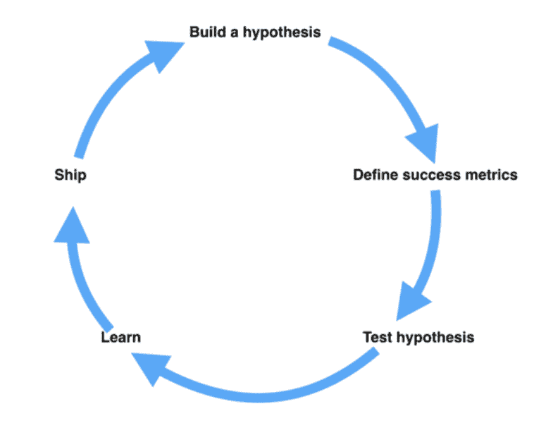

# Twitter 产品实验的内容和原因

> 原文：<https://blog.twitter.com/2015/the-what-and-why-of-product-experimentation-at-twitter-0?utm_source=wanqu.co&utm_campaign=Wanqu+Daily&utm_medium=website>

实验是 Twitter 产品开发周期的核心。这种实验文化是可能的，因为 Twitter 在工具、研究和培训方面投入了大量资金，以确保功能团队能够无缝、严格地测试和验证他们的想法。

Twitter 实验的规模在数量和种类上都是巨大的——从微妙的用户界面/UX 变化，到新功能，到机器学习模型的改进。我们喜欢将实验视为一个无止境的学习循环:

[T2】](https://g.twimg.com/blog/blog/image/experimentationloop_0.png)

*   **建立一个假设:**想出一个新功能或现有功能改进的想法。
*   **定义成功指标:**估计“机会大小”——将受变更影响的用户数量。为你的实验正式定义成功和失败的标准；考虑什么样的权衡是可以接受的。
*   **测试假设:**实施提议的变更，记录适当的日志，并执行健全性检查以确保实验设置正确。
*   **学习:**检查实验中收集的数据，看看我们能从中学到什么，并与其他 Twitter 团队分享。
*   **船**:收集数据后，确定实验是否验证了假设，并做出有船或无船的决定。
*   **建立另一个假设:**为更多的改进产生更多的假设，结合来自实验的新想法。

**A/B 测试、决策和创新**

Twitter 的产品仪表和实验(PIE)团队思考了很多实验哲学。A/B 测试可以提供很多好处，但是它有众所周知的、容易被击中的 [陷阱](http://www.exp-platform.com/Pages/ExPpitfalls.aspx) 。其结果往往是 [出乎意料和](http://www.exp-platform.com/Documents/2010-12%20ExPUnexpectedSIGKDD.pdf) 反直觉。我们如何避免陷阱？我们应该在什么时候建议运行 A/B 测试来测试一个特性或提议的更改？我们如何在决策过程中保持敏捷和承担大风险，同时又保持严谨？

**测试的好处，以及一点关于渐进主义的知识**

关于 A/B 测试特性变化的文化的一个大问题是，它会导致小的增量增益，并且大多数实验只会移动一个位数的百分比，甚至是一个百分比的几分之一。所以，论点是，这有什么意义？为什么不做一些更有影响力和革命性的东西呢？

这是真的:到目前为止，大多数实验以最小的方式移动度量，如果有的话；对于大部分用户来说，将核心指标移动几个百分点的实验被认为是非常成功的。

这并不是因为 A/B 测试的一些基本原理。这是因为一个成熟的产品很难以大幅度移动度量的方式进行改变。许多人们认为是本垒打的想法根本不会移动指针:人类在预测什么会起作用方面被证明是相当糟糕的(关于这一点的更多信息，参见“[网站实验者的七条经验法则](http://www.exp-platform.com/Documents/2014%20experimentersRulesOfThumb.pdf)”)。很多时候，糟糕的 A/B 测试结果可以让我们及早发现，一个听起来不错的想法可能行不通。我们宁愿得到坏消息，并回到绘图板，越早越好；所以我们进行实验。

A/B 测试是一种确保好想法不会夭折，并得到充分发展的机会的方法。当我们真的相信一个想法，而最初的实验结果没有达到我们的期望时，我们可以对产品做进一步的改变，并继续改进，直到它们准备好被运送给数亿人。另一种选择是，你创造了一些感觉不错的东西，你发布了它，继续一些新的想法，一年后，有人意识到没有人在使用这个功能，它就悄悄地日落了。

快速迭代和测量所提议的变更的效果，让我们的团队能够在早期将隐含的用户反馈整合到产品中，就像我们处理各种原型一样。我们能够发布一个变化，看看什么是有效的，什么是无效的，创建一个假设，进一步的变化将改善产品，发布这些变化，并继续下去，直到我们有了可以广泛发布的东西。

有些人可能认为增量变化是不够的。当然，发布一个“大创意”听起来要比一个小改进好得多。然而，请考虑一下，微小的变化累积起来会产生复合效应。回避实质上改进产品的增量变化不是一个好的策略。一个好的金融投资组合平衡了一些安全的赌注和一些高风险、高回报的赌注，前者的回报可以预测，尽管还不到天文数字。产品组合管理在这方面没有太大的不同。

也就是说，有很多东西我们不能或者不应该测试。一些更改旨在产生用户分桶 A/B 测试无法捕捉的网络影响(尽管确实存在量化此类影响的其他技术)。当只给随机比例的人使用时，有些功能就不起作用了。例如， [Group DMs](https://blog.twitter.com/2015/now-on-twitter-group-direct-messages-and-mobile-video-capture) 不是在普通 A/B 测试中使用的功能，因为获得该功能的幸运儿可能会想要向没有获得该功能的人发送消息，这使得该功能基本上毫无用处。其他的可能完全是正交的——例如，推出像 Periscope 这样的新应用程序不是 Twitter 应用程序的实验。但是一旦它出来了，A/B 测试就成了在应用中驱动可测量的增量和非增量变化的重要方式。

另一类变化是主要的新功能，这些新功能在内部版本和通过用户研究进行测试，但出于战略原因，在某个特定市场中突然向所有客户发布。作为一个组织，当我们认为这对产品和客户来说是正确的事情时，就会做出这样的决定。我们相信，从一个大版本中获得的收益比从增量变化中获得的收益更大，增量变化可能会导致一个更好的初始版本，可能会让更多的客户尝试和使用它。这是产品领导层选择做出的权衡。在新功能发布后，我们是否会对其进行 A/B 测试？你打赌！随着想法的成熟，我们使用成熟的科学原理来指导它们的发展——而实验是这个过程的关键部分。

**负责任地做实验**

既然我们已经提出了运行实验的理由，那么让我们来讨论如何避免这些陷阱。实验设置和分析很复杂。正常的人类行为非常容易导致对结果的偏差和曲解。有几种方法可以降低风险。

**需要一个假设**

实验工具通常会暴露大量的数据，并且经常允许实验者设计他们自己的定制指标来测量他们的变化的效果。这可能导致 A/B 测试中最阴险的陷阱之一:“挑选”和“”——从许多数据点中选择支持你的假设的指标，或者在查看数据后调整你的假设，使其与实验结果相匹配。在 Twitter，一个实验收集数百个指标是很常见的，这些指标可以通过大量维度(用户属性、设备类型、国家等)进行细分。)，产生成千上万的观察结果——如果你正在寻找适合任何故事的数据，有足够的选择。

我们引导实验者远离挑剔的一个方法是要求他们明确指定他们期望在设置阶段移动的度量标准。实验者可以跟踪尽可能多的指标，但是只有少数指标可以用这种方式明确标记。然后，该工具会在结果页面中突出显示这些指标。一个实验者可以自由地探索所有其他收集到的数据并做出新的假设，但是最初的主张是确定的，并且可以很容易地被检验。

**流程**

不管工具有多好，一个设计糟糕的实验仍然会产生糟糕的结果。在 Twitter，我们投资创建了一个实验过程，提高了一个人进行成功、正确实验的机会。这个过程中的大多数步骤都是可选的——但我们发现，让它们可用并明确记录下来，可以大大减少重新运行实验以收集更多数据、等待 app store 发布周期等所浪费的时间。

所有的实验者都被要求记录他们的实验。你在改变什么？你期望结果会是什么？预期的“受众规模”(将会看到该功能的人群比例)是多少？收集这些数据不仅可以确保实验者考虑了这些问题，还可以让我们建立一个机构学习的语料库——正式记录已经尝试了什么，以及结果是什么，包括负面结果。我们可以用这个来通知未来的实验。

实验者也可以利用实验牧羊人。实验牧羊人是经验丰富的工程师和数据科学家，他们审查实验假设并提出衡量标准，以尽量减少实验出错的机会。这是可选的，建议没有约束力。该计划从参与者那里获得了巨大的反馈，因为他们更加相信他们的实验设置是正确的，他们正在跟踪正确的指标，并且他们将能够正确地分析他们的实验结果。

一些团队也有每周的发布会，在会上他们回顾实验结果以决定什么应该和不应该向更广泛的受众发布。这有助于解决诸如挑选樱桃和误解统计意义的问题。值得注意的是，这不是一个“给我一个说不的理由”的会议——我们肯定有“红色”实验船，而“绿色”实验船没有。这里重要的是要诚实和明确我们正在引入的变革的期望和结果，而不是容忍停滞和奖励短期收益。引入这些评审极大地提高了我们发布的变更的整体质量。这也是一次有趣的会议，因为我们可以看到团队中发生的所有工作，以及人们对产品的看法。

我们经常采用的另一个实践是在可能的情况下使用“保留”——向 99%(或其他更高的百分比)的用户推出一个特性，并观察关键指标如何偏离随时间推移而被保留的 1%。这允许我们快速迭代和发布，同时关注实验的长期影响。这也是一个很好的方法来验证从实验中预期的收益实际上实现了。

**教育**

确保实验者警惕陷阱的最有效方法之一就是教他们。Twitter 数据科学家教授几门关于实验和统计直觉的课程，其中一门课程是所有新工程师在公司最初几周要上的课程之一。目标是让工程师、项目经理、环境管理人员和其他角色熟悉实验过程、注意事项、陷阱和最佳实践。提高对实验的力量和陷阱的认识有助于我们避免在可预防的错误和误解上浪费时间，让人们更快地获得洞察力，提高节奏和质量。

**即将推出**

在接下来的文章中，我们将描述我们的实验工具 DDG 是如何工作的；然后，我们将直接进入我们遇到的几个有趣的统计问题——检测有偏差的存储桶，使用(或不使用)第二个控制作为健全性检查，自动确定正确的存储桶大小，基于会话的指标，以及处理异常值。

**致谢**

感谢 [Lucile Lu](http://twitter.com/lucliemouse) 、 [Robert Chang](http://twitter.com/_rchang) 、 [Nodira Khoussainova](http://twitter.com/nodira) 和 [Joshua Lande](http://twitter.com/joshualande) 对本文的反馈。许多人为 Twitter 实验背后的理念和工具做出了贡献。我们要特别感谢[凯莱·托吉森](http://twitter.com/cayley)、[刘闯](http://twitter.com/chuangl4)、[马杜·穆图库马尔](http://twitter.com/justmadhu)、[帕拉格·阿格拉瓦尔](http://twitter.com/paraga)和[乌特卡什·斯里瓦斯塔瓦](http://twitter.com/utkarsh)。