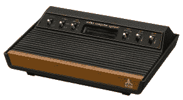
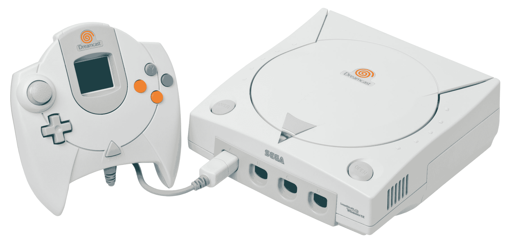
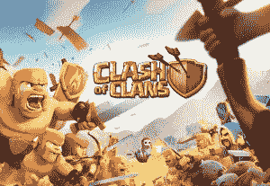

# 游戏的历史:不断发展的社区 TechCrunch

> 原文：<http://techcrunch.com/2015/10/31/the-history-of-gaming-an-evolving-community/?utm_source=wanqu.co&utm_campaign=Wanqu+Daily&utm_medium=website>

里亚德·奇哈尼撰稿人

里亚德·奇哈尼是游戏社交网络的联合创始人兼首席执行官

[Gamurs](https://gamurs.com/)

。

自从 20 世纪 50 年代作为科技博览会上的一个科技奇物而诞生以来，游戏已经发展成为[世界上最赚钱的娱乐产业之一。](http://www.fastcompany.com/3021008/why-video-games-succeed-where-the-movie-and-music-industries-fail)

近年来的移动技术热潮彻底改变了这个行业，并为新一代游戏玩家打开了大门。事实上，游戏已经与现代流行文化融为一体，现在连祖母都知道什么是愤怒的小鸟，超过 42%的美国人是游戏玩家，五分之四的美国家庭拥有游戏机。

## 早年

1940 年，爱德华·乌勒·康登博士在纽约世界博览会上展示了第一台公认的游戏机。这款游戏基于古老的数学游戏 [Nim](http://www.archimedes-lab.org/game_nim/nim.html) ，在展出的六个月中，约有 5 万人参与，据报道，电脑赢得了 90%以上的游戏。

然而，第一个为商业家庭使用而设计的游戏系统直到近三十年后才出现，Ralph Baer 和他的团队在 1967 年发布了他的原型“棕色盒子”。

“棕色盒子”是一种真空管电路，可以连接到电视机上，允许两个用户控制在屏幕上追逐的立方体。“棕色盒子”可以被编程来玩各种游戏，包括乒乓球、跳棋和四种体育游戏。这次使用了先进的技术，增加的配件包括用于打靶游戏的[光枪](http://americanhistory.si.edu/collections/search/object/nmah_1302000)，以及用于高尔夫推杆游戏的特殊附件。

根据美国国家博物馆历史 的记载，贝尔回忆道:“我们打乒乓球的那一刻，我们就知道我们有了一个产品。在此之前，我们不太确定。”

 “棕色盒子”被授权给 Magnavox，后者于 1972 年发布了该系统，名为 [Magnavox Odyssey](http://americanhistory.si.edu/collections/search/object/nmah_1302004) 。它比雅达利早了几个月，雅达利经常被误认为是第一台游戏机。

在 1972 年 8 月至 1975 年 Magnavox 停产期间，大约售出了 30 万台游戏机。销售不佳被归咎于店内营销活动管理不善，以及当时家庭游戏对普通美国人来说是一个相对陌生的概念。

不管管理得多么糟糕，这就是我们今天所知的数字游戏的诞生。

## 前进到雅达利和街机游戏

世嘉和台东是第一家激起公众对街机游戏兴趣的公司，他们在 1966 年和 1967 年发布了电子机械游戏潜望镜和皇冠特种足球。1972 年，雅达利(由博彩教父诺兰·布什内尔创立)成为第一家真正为大型博彩 社区树立标杆的博彩公司。

> 游戏的性质引发了玩家之间的竞争，他们可以记录他们的高分…并决心将他们的空间标记在列表的顶部。

雅达利不仅在内部开发他们的游戏，他们还围绕“街机”创造了一个全新的产业。1973 年，以 1095 美元的零售价，雅达利开始销售第一款真正的电子视频游戏 Pong，街机开始出现在世界各地的酒吧、保龄球馆和购物中心。技术头脑意识到他们正在做一件大事；在 [1972 年至 1985 年期间，](http://www.wired.com/2014/05/arcade-history/)超过 15 家公司开始为不断扩大的市场开发视频游戏。

## 众所周知，多人游戏的起源

20 世纪 70 年代末，美国许多连锁餐馆开始安装视频游戏，以利用这一新的热潮。游戏的性质引发了玩家之间的竞争，他们可以用自己的首字母记录他们的高分，并决心将他们的空间标记在列表的顶部。在这一点上，多人游戏被限制在玩家在同一个屏幕上竞争。

玩家在不同屏幕上竞争的第一个例子出现在 1973 年的《帝国》(Empire)——一款最多可容纳八名玩家的战略回合制游戏——它是为[柏拉图网络系统](http://www.platohistory.org/blog/2013/08/plato-notes-released-40-years-ago-today.html)开发的。PLATO(自动教学操作的编程逻辑)是第一个基于计算机的通用教学系统，最初由伊利诺伊大学建立，后来由控制数据公司(CDC)接管，该公司建立了系统运行的机器。

根据柏拉图系统的使用日志，在 1978 年到 1985 年间，用户花了大约 30 万小时玩帝国。1973 年，Jim Bowery 为 PLATO 发布了 Spasim 一款 32 人太空射击游戏——这被视为 3D 多人游戏的第一个例子。虽然访问 PLATO 仅限于大型组织，如大学和 Atari，他们能够负担加入网络所需的计算机和连接，但 PLATO 代表了通往互联网和我们今天所知的在线多人游戏的技术道路上的第一步。

此时，游戏在年轻一代中很受欢迎，并且是一项共享活动，人们在街机上争夺高分。然而，大多数人不会认为每五个美国家庭中有四个拥有游戏系统是可能的现实。

## 首页游戏成为现实

除了游戏控制台在美国的商业中心和连锁餐厅变得流行之外，20 世纪 70 年代初，个人电脑和大规模生产的游戏控制台也成为现实。技术进步，如英特尔发明了世界上第一个微处理器，导致了 1975 年枪战等游戏的诞生，这是多人对战射击游戏的第一个例子。

虽然远离使命召唤，枪战是一件大事，当它第一次打街机。它带来了一种新的游戏风格，使用一个操纵杆控制移动，另一个操纵杆控制拍摄方向——这是以前从未见过的。

> 随着家庭游戏和街机游戏的蓬勃发展，游戏社区的发展也是如此。

1977 年，雅达利发布了雅达利 VCS(后来被称为雅达利 2600)，但发现销售缓慢，第一年仅售出 25 万台，1978 年售出 55 万台——远低于预期数字。销量低被归咎于这样一个事实，即美国人仍然习惯于在家中使用彩色电视，游戏机价格昂贵，人们越来越厌倦雅达利最受欢迎的游戏 Pong。

雅达利 VCS 发售时，只设计了 10 款简单的挑战游戏，如 Pong、Outlaw 和 Tank。然而，控制台包括一个外部 ROM 插槽，游戏卡带可以插入其中；世界各地的程序员很快发现了这种潜力，他们创作的游戏远远超过了游戏机最初的设计。

微处理器的集成也导致了[1980 年雅达利 VCS](http://www.ign.com/articles/2008/08/26/top-10-best-selling-atari-2600-games)发布《太空入侵者》，标志着游戏— 和销售的新时代:雅达利 2600 的销量在 1980 年飙升至 200 万台。

随着家庭和街机游戏业的蓬勃发展，T2 游戏业和 T4 社区的发展也是如此。20 世纪 70 年代末和 80 年代初，业余爱好者杂志如《创造性计算》( 1974 年)、《计算机和视频游戏》( 1981 年)和《计算机游戏世界》( 1981 年)相继发行。这些杂志创造了一种社区感，并提供了一个玩家可以参与的渠道。

## 个人电脑:设计游戏并向更广泛的社区开放

由太空入侵者引起的视频游戏热潮见证了大量新公司和游戏机的涌现，导致了一段时间的市场饱和。太多的游戏控制台，以及太少有趣、吸引人的新游戏，最终导致了 1983 年北美视频游戏市场的崩溃，导致了巨大的损失，一卡车又一卡车不受欢迎、质量低劣的游戏[被埋在沙漠里](http://www.ign.com/articles/2011/09/21/ten-facts-about-the-great-video-game-crash-of-83)只是为了摆脱它们。T2 的游戏产业需要改变。

差不多在游戏机开始受到负面报道的同时，像 Commodore Vic-20、Commodore 64 和 Apple II 这样的家用电脑开始流行起来。这些新的家用电脑系统是普通美国人买得起的，20 世纪 80 年代初的零售价约为 300 美元(相当于今天的 860 美元)，并被宣传为整个家庭的“明智”选择。

这些家用电脑拥有比上一代游戏机更强大的处理器；这为更复杂、线性度更低的游戏的新水平打开了大门。他们还为游戏玩家提供了用基本代码创建自己游戏所需的技术。就连比尔·盖茨也设计了一款游戏，名为《驴子》(一款简单的游戏，涉及驾驶跑车在高速公路上躲避驴子)。有趣的是，这款游戏在 2012 年作为 [iOS 应用起死回生。](http://www.dailymail.co.uk/sciencetech/article-2099311/Worlds-PC-game-written-Bill-Gates-goes-sale-iPhone.html)

虽然这款游戏当时被苹果的竞争对手描述为“粗糙和尴尬”，但盖茨加入了这款游戏，以激励用户使用集成的基本代码程序开发自己的游戏和程序。

像《计算机和视频游戏》和《游戏世界》这样的杂志为游戏和实用程序提供了基本的源代码，这些程序可以被输入早期的个人电脑。游戏、程序和读者提交的代码被接受和共享。

除了为更多人提供使用代码创建自己游戏的方法，早期计算机还为多人游戏铺平了道路，这是游戏 社区发展的一个关键里程碑。

早在 20 世纪 80 年代末，Macintosh 等早期电脑和 Atari ST 等游戏机就允许用户将他们的设备与其他播放器相连。1987 年， [MidiMaze 在 Atari ST 上发布](http://www.atariprotos.com/8bit/software/midimaze/midimaze.htm),其中包括一项功能，通过将一台计算机的 MIDI-OUT 端口连接到下一台计算机的 MIDI-IN 端口，可以连接多达 16 台游戏机。

虽然许多用户报告说，一次有四个以上的玩家会大大降低游戏速度并使其不稳定，但这是走向死亡竞赛想法的第一步，死亡竞赛随着 1993 年《末日》的发布而大受欢迎，是当今最受欢迎的游戏类型之一。

> 当局域网和后来的互联网开启了多人游戏时，游戏的真正革命就来了。

随着 1993 年《黑暗之路》的发布，网络多人游戏真正开始流行起来，[“兰党”也诞生了。1994 年，随着 Macintosh 上的《马拉松》的发布，尤其是 1996 年第一人称多人射击游戏《雷神之锤》上市后，游戏变得更加流行。至此，](http://yourlan.blogspot.com.co/2008/09/history-of-lan-party.html) [Windows 95 和平价以太网卡](http://yourlan.blogspot.com.co/2008/09/history-of-lan-party.html)的发布为 Windows PC 带来了网络，进一步扩大了多人局域网游戏的受欢迎程度。

当局域网，以及后来的互联网，开启了多人游戏的时候，游戏的真正革命到来了。多人游戏将游戏 社区带到了一个新的高度，因为它允许粉丝从不同的电脑上进行竞争和互动，这改善了游戏的社交方面。这一关键步骤为现代游戏玩家目前喜欢的大型互动游戏奠定了基础。1993 年 4 月 30 日，欧洲核子研究中心将万维网软件置于公共领域，但要让互联网强大到足以容纳我们今天所知的游戏，还需要几年时间。

 <small>形象:T2】维基媒体公共/Evan-Amos</small>

## 转移到游戏机上的在线游戏

早在游戏巨头世嘉和任天堂进入在线游戏领域之前，许多工程师试图利用电话线的力量在游戏机之间传输信息。

威廉·冯·梅斯特[在 1982 年拉斯维加斯消费电子展(CES)上为雅达利 2600 展示了开创性的调制解调器传输技术](http://www.digitalspy.co.uk/gaming/news/a296482/the-history-of-online-console-gaming.html#~pqrm03b2707nRr)。这款名为 CVC GameLine 的新设备使用户能够使用固定电话连接和一个可以插入雅达利游戏机的卡带下载软件和游戏。

该设备允许用户从世界各地的程序员那里“下载”多种游戏，最多可以免费玩八次；它还允许用户在生日那天下载免费游戏。不幸的是，该设备未能获得当时领先游戏制造商的支持，并受到了 1983 年崩盘的致命打击。

直到 20 世纪 90 年代初第四代 16 位游戏机的发布，在线游戏的真正进步才会发生，因为我们知道互联网在 1993 年成为公共领域的一部分。1995 年，任天堂发布了[卫星视图](http://www.digitalspy.co.uk/gaming/news/a296482/the-history-of-online-console-gaming.html#~pqrm03b2707nRr)，这是一款用于任天堂超级家庭游戏机的卫星调制解调器外设。这项技术允许用户使用卫星直接下载游戏、新闻和作弊提示到他们的控制台。广播一直持续到 2000 年，但这项技术从未走出日本走向全球市场。

> 在世纪之交，接入互联网是很昂贵的。

在 1993 年到 1996 年间，世嘉、任天堂和雅达利通过有线电视提供商尝试了[多次](http://www.digitalspy.co.uk/gaming/news/a296482/the-history-of-online-console-gaming.html#~pqrm03b2707nRr)打入“在线”游戏，但是由于网速慢和有线电视提供商的问题，没有一次成功。正如我们今天所知，直到 2000 年世界上第一台联网游戏机世嘉 Dreamcast 的发布，在线游戏才取得了真正的进步。Dreamcast 配备了一个嵌入式 56 Kbps 调制解调器和一个最新的 PlanetWeb 浏览器，使基于互联网的游戏成为其设置的核心部分，而不仅仅是少数用户使用的一个古怪的附加功能。

Dreamcast 是一个真正革命性的系统，也是第一个广受欢迎的网络中心设备。然而，这也是一个巨大的失败，这有效地结束了世嘉的控制台遗产。在世纪之交，接入互联网是昂贵的，世嘉最终为全球用户使用其 PlanetWeb 浏览器支付了巨额账单。

专家将这款游戏机的失败归因于领先于时代的以互联网为中心的技术，以及 21 世纪初个人电脑技术的快速发展——这导致人们怀疑专为游戏设计的游戏机的用途。不管失败与否，Dreamcast 为 Xbox 等下一代游戏机铺平了道路。在 2000 年代中期发布的新游戏机制造商借鉴并改进了 Dreamcast 以网络为中心的重点，使在线功能成为游戏行业不可或缺的一部分。

2001 年 Runescape 的发布改变了游戏规则。MMORPG(大型多人在线角色扮演游戏)允许全球数百万玩家在同一个平台上与同道中人进行游戏、互动和竞争。游戏还包括聊天功能，允许玩家与游戏中遇到的其他玩家互动和交流。这些游戏现在看起来可能过时了，但它们在专门的游戏 社区中仍然非常受欢迎。

## 游戏的现代

自 2000 年代初以来，互联网功能爆炸式增长，计算机处理器技术进步如此之快，以至于每一批新的游戏、图形和游戏机似乎都将前代产品打得落花流水。技术、服务器和互联网的成本已经下降到如此程度，以至于现在可以以闪电般的速度访问互联网，而且全球有 32 亿人可以访问互联网。根据[ESA 2015](http://www.theesa.com/wp-content/uploads/2015/04/ESA-Essential-Facts-2015.pdf)电脑和视频游戏行业报告，至少有 15 亿上网的人玩视频游戏。

Xbox Live Marketplace 和 Wii Shop Channel 等在线商店彻底改变了人们购买游戏、更新软件以及与其他游戏玩家交流和互动的方式，索尼 PSN 等网络服务帮助在线多人游戏达到了令人难以置信的新高度。

> 每一批新的游戏、图形和主机似乎都将前代产品打得落花流水。

科技让世界上数百万人可以将游戏作为一种共享活动来享受。最近的 [ESA 游戏报告](http://www.theesa.com/wp-content/uploads/2015/04/ESA-Essential-Facts-2015.pdf)显示，54%的经常玩游戏的人认为他们的爱好有助于他们与朋友联系，45%的人将游戏作为与家人共度时光的一种方式。

到 Xbox 360 发布的时候，在线多人游戏已经成为体验中不可或缺的一部分(尤其是“死亡竞赛”游戏，与世界各地数百万的玩家一起玩，比如《使命召唤:现代战争》)。如今，许多游戏都有一个在线组件，极大地改善了游戏体验和交互性，通常取代了玩家离线游戏目标的重要性。

“我被告知的普遍预期是，90%开始你的游戏的玩家永远不会看到它的结束……”动视的长期制作承包商[基思·富勒](http://edition.cnn.com/2011/TECH/gaming.gadgets/08/17/finishing.videogames.snow/)说。

随着在线第一人称射击游戏越来越受欢迎，游戏“部落”开始在世界各地出现。氏族、公会或派系是有组织的视频游戏玩家团体，他们定期在多人游戏中一起玩。这些游戏从几个朋友的团体到 4，000 人的组织，具有广泛的结构、目标和成员。[存在多个在线平台](http://www.top100clans.com/)，在这里，部落之间相互评定等级，并且可以在线组织战斗和会面。

## 向移动方向发展

自 2007 年智能手机和应用商店上市以来，游戏经历了又一次快速演变，不仅改变了人们玩游戏的方式，还以前所未有的方式将游戏带入了主流流行文化。过去十年移动技术的快速发展创造了移动游戏的爆炸式增长，预计[将在 2015 年](http://fortune.com/2015/01/15/mobile-console-game-revenues-2015/)超过基于主机的游戏的收入。

这种游戏行业向移动、[尤其是东南亚、](http://venturebeat.com/2015/06/23/southeast-asia-mobile-game-revenues-to-hit-7b-by-2019/)的巨大转变不仅扩大了游戏的人口统计，也将游戏推到了媒体关注的最前沿。就像早期的游戏爱好者加入利基论坛一样，今天的用户已经聚集在移动游戏周围，互联网、杂志和社交媒体充满了新游戏的评论和行业八卦。与往常一样，游戏玩家的博客和论坛充满了新的游戏技巧，Macworld、Ars Technica 和 TouchArcade 等网站推出了来自不太知名的独立开发商以及传统游戏公司的游戏。

游戏行业以前被少数公司垄断，但近年来，苹果和谷歌等公司凭借其应用商店的游戏销售收入，在排名中偷偷摸摸地上升。手机游戏消磨时间的特性吸引了很多人，像《愤怒的小鸟》这样的基础游戏仅在 2012 年就让 Rovio [赚了 2 亿美元，并在 2014 年突破了 20 亿次下载。](http://www.businessinsider.com/angry-birds-made-200-million-in-2012-2013-4)

更复杂的大型多人手机游戏，如《部落冲突》,每年都带来巨额收入，通过移动设备或 PC 上的《英雄联盟》,将全球数百万玩家联系在一起。

## 未来

向移动技术的转移已经定义了最近的游戏篇章，但是虽然移动中的游戏非常适合千禧一代的忙碌生活，但是在移动设备上的游戏也有其局限性。手机屏幕很小(至少在 iPhone 6s 问世之前是这样)，大多数手机的处理器速度和内存限制了游戏的可能性。根据 VentureBeat 最近的一篇文章，移动游戏已经见证了它的第一次衰退。在过去几年中，收入增长放缓，经营成本和分销成本大幅上升。

虽然[移动游戏已经导致了手持游戏设备](http://www.extremetech.com/gaming/215103-sony-to-skip-playstation-vita-2-blames-mobile-gaming-for-handhelds-decline)的死亡，但是主机仍然在蓬勃发展，每一代新的主机都迎来了技术和功能的新时代。虚拟现实和人工智能技术这两个行业很可能在游戏的未来扮演关键角色。

> 游戏的下一章还不清楚，但无论发生什么，它肯定是娱乐性的。

虚拟现实(VR)公司 Oculus 于 2014 年被脸书收购，并将于 2016 年发布其 Rift 耳机。[这款耳机似乎非常适合在视频游戏行业使用](http://fortune.com/2015/10/07/virtual-reality-mainstream/)，有可能让游戏玩家“生活”在一个互动的、身临其境的 3D 世界中。为 MMORPG 创造完全互动的动态“世界”的机会可能触手可及，在这个世界中，玩家可以四处移动，与其他玩家互动，并以全新的角度体验数字景观。

在过去的几年里，语言处理人工智能领域取得了很多进步。2014 年，[谷歌收购 Deep Mind](https://beta.techcrunch.com/2014/01/26/google-deepmind/)；今年， [IBM 收购了深度学习技术领先提供商【AlchemyAPI2015 年 10 月，](http://www.techtimes.com/articles/37216/20150305/ibm-acquires-alchemyapi-to-boost-deep-learning-capabilities-of-watson.htm)[苹果在不到一周的时间里进行了两起人工智能收购](http://www.businessinsider.com/apple-acquired-two-artificial-intelligence-companies-2015-10)。正在开发的两个领域是语音识别技术的准确性和与计算机的开放式对话。

这些进步可能意味着游戏的惊人新篇章——特别是如果与虚拟现实相结合，因为它们可以让游戏与游戏中的角色互动，这些角色将能够以智能和看似自然的反应来回应问题和命令。在第一人称射击游戏、体育游戏和策略游戏的世界中，玩家可以有效地命令计算机完成游戏中的任务，因为由于语音识别准确性的进步，计算机将能够通过耳机理解命令。

如果说过去一个世纪发生的变化值得借鉴的话，那么 2025 年的游戏似乎将与今天的游戏不可同日而语。尽管《愤怒的小鸟》自 2011 年发布以来已经家喻户晓，但它不太可能像《太空入侵者》或《Pong》那样被人们亲切地记住。在整个发展过程中，游戏经历了多种趋势的兴衰，然后被另一种技术完全取代。《T4》游戏的下一章还不清楚，但不管发生什么，它肯定会很有趣。