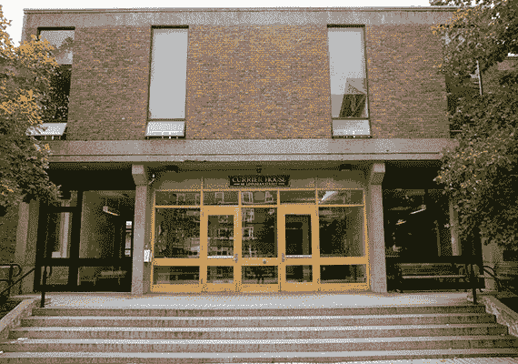

# 革命的黎明——哈佛公报

> 原文：<http://news.harvard.edu/gazette/story/2013/09/dawn-of-a-revolution/?utm_source=wanqu.co&utm_campaign=Wanqu+Daily&utm_medium=website>

曾就读于哈佛的微软创始人比尔·盖茨本周末将重返校园，参加一场问答会，作为哈佛竞选活动的一部分。下面，作家沃尔特·伊萨克森正在写一本关于数字时代伟大发明家的书，他回忆了盖茨在哈佛的成长岁月。

这可能是哈佛广场城外报摊上有史以来最重大的一次杂志购买。1974 年 12 月的一个下雪天，西雅图的退学生保罗·艾伦走进杂乱的报亭，看到新一期的《流行电子》杂志上有一款面向业余爱好者的家用电脑，名为“牵牛星”，刚刚上市。他既兴奋又沮丧。尽管为“个人”电脑的时代似乎已经到来而激动不已，但他担心自己会错过这个聚会。他甩下 75 美分，抓起这期杂志，踏着泥泞来到比尔·盖茨的宿舍。比尔·盖茨是哈佛大学二年级学生，也是西雅图湖畔中学的计算机狂热者，他曾说服艾伦从大学退学，搬到剑桥。“嘿，这件事没有我们也能发生，”艾伦宣称。盖茨开始前后摇晃，就像他在紧张的时候经常做的那样。当他完成这篇文章时，他意识到艾伦是对的。在接下来的八周里，他们两人开始了疯狂的代码编写，这将改变计算机行业的本质。

盖茨和艾伦在 1974 年的圣诞假期和接下来的一月阅读期间开始着手做的事情是为个人电脑开发软件，那时盖茨应该在为考试而学习。“当保罗给我看那本杂志时，根本没有软件产业这回事，”盖茨回忆道。“我们认为你可以创造一个。我们做到了。”几年后，反思他的创新，他说，“这是我有过的最重要的想法。”

高中时，盖茨组建了湖畔编程小组，为太平洋西北部的公司编写计算机代码赚钱。大四时，他只申请了三所大学——哈佛、耶鲁和普林斯顿——并且对每所大学都采取了不同的方法。“我生来就是为了申请大学，”他说，充分意识到自己在精英管理过程中的能力。在耶鲁，他把自己塑造成一个有抱负的政治人物，并强调他作为国会听差在华盛顿度过的一个月。在普林斯顿，他只专注于成为一名计算机工程师的愿望。对于哈佛，他说他的激情是数学。他也考虑过麻省理工学院，但在最后一刻放弃了面试去玩弹球。他被这三所大学录取，并选择了哈佛。“哈佛会有比你更聪明的人，”艾伦警告他。盖茨回答，“‘没门儿！“没门！”"

当他被要求描述他喜欢的室友类型时，盖茨问了一个非洲裔美国人和一个国际学生。他被分配到 Wigglesworth Hall，与萨姆·茨奈默(一个来自蒙特利尔一个贫穷犹太难民家庭的科学怪人)和吉姆詹金斯(一个来自田纳西州查塔努加的黑人学生)在一起。茨奈默以前从来不知道有特权的黄蜂，他发现盖茨很友好，但却奇怪地迷人。当盖茨花了几个晚上为他的高中编程公司填写各种联邦和州税收表格时，他感到惊讶，并对他的学习时间表的紧张程度感到震惊。“他的习惯是一口气做 36 个小时或更多，虚脱 10 个小时，然后出去，买个比萨饼，然后继续做，”他回忆道。"如果这意味着他会在凌晨 3 点重新开始，那就这样吧."努力工作时，盖茨会前后摇晃。然后他会抓着 Znaimer 在宿舍休息室疯狂地玩 Pong，Atari 视频游戏，或者 Spacewar！这是一款传奇游戏，由麻省理工学院发明，在哈佛大学计算机实验室的一台主机上运行。

After their freshman year, Bill Gates and Andy Braiterman, who was better at math than Gates, decided to room together. They were assigned to Currier House, which Gates loved. Jon Chase/Harvard Staff Photographer

该实验室以哈佛大学计算机科学先驱霍华德·艾肯的名字命名，他发明了一台名为 Mark I 的机电计算机，现在放在科学中心的大厅里。艾肯实验室里有一台盖茨最喜欢的机器:一台来自数字设备公司的 PDP-10。它本来是要在越南使用的，但被重新分配给哈佛大学，以协助那里由军方资助的研究。为了避免引发反战抗议，它在 1969 年的一个星期天早上被偷偷带进了实验室。还有很多 PDP-1 电脑可以玩太空战！在他的大一计算机项目中，盖茨将 PDP-10 和 PDP-1 连接起来，创建了一个视频棒球游戏。“逻辑在 PDP-10 上，但我把它发送到 PDP-1，因为我使用了与 Spacewar 相同的显示器！，一种你再也看不到的线条画显示器，”盖茨说。

艾伦警告盖茨，他不会永远是班上最聪明的孩子，结果证明是真的。在威格斯沃思，住在他楼上的一个新生数学更好，他叫安迪·布莱特曼，来自巴尔的摩。他们会整晚在布莱特曼的房间里，吃着披萨，与数学 55 习题集搏斗。“比尔对数学和扑克都很感兴趣，”布莱特曼回忆道。他也是“一个优秀的辩论者”盖茨特别强调，很快每个人都将拥有一台家用电脑，可以用来查阅书籍和其他信息。他和布莱特曼决定住在一起，他们被分配到了盖茨喜欢的宿舍楼。

盖茨决定主修应用数学，而不是纯数学。“我在数学系遇到几个人，他们的数学比我好很多，”他说。"这改变了我想从事数学的想法。"他能够在应用数学领域小有成就。在计算机科学家哈里·刘易斯教授的一堂课上，他遇到了一个经典问题:

我们那里的厨师很马虎，当他准备一叠煎饼时，它们的大小都不一样。因此，当我把它们交给顾客时，在去餐桌的路上，我会重新排列它们(以此类推，最小的放在最上面，最大的放在最下面)，从最上面抓起几个，翻过来，根据需要重复多次(改变我翻过来的数字)。如果有 n 个煎饼，我将不得不使用翻转的最大次数(作为 n 的函数 f(n ))来重新排列它们？

答案需要有一个好的算法，就像任何计算机程序一样。“我在课堂上摆了个姿势，然后继续，”刘易斯回忆道。“一两天后，这个聪明的大二学生来到我的办公室，解释说他有一个三分之五 N 算法。”换句话说，盖茨已经想出了一种方法，每叠煎饼翻三分之五。刘易斯回忆说:“这涉及到一个复杂的案例分析，分析最上面的几个煎饼到底是什么样的。”“这很聪明。”班上的助教 Christos Papadimitriou 后来在一篇与盖茨合著的学术论文中公布了解决方案。

盖茨形成了一种叛逆的学术模式:他不会去听他注册的任何课程的讲座，但他会旁听他没有参加的课程。他小心翼翼地遵循这条规则。“到大二的时候，我在旁听和我实际上课同时进行的课程，只是为了确保我永远不会出错，”他回忆道。"所以我是一个彻底的拒绝者."

他还疯狂地玩起了扑克。游戏会在 Currier House 的一个公共房间里持续一整夜，这个房间后来被称为扑克室。他选择的游戏是七张牌梭哈，高低牌。每晚可能赢或输 1000 美元或更多。盖茨更擅长评估纸牌，而不是解读其他玩家的想法。“比尔有偏执狂的品质，”布莱特曼说。“他会专注于某件事，并真正坚持下去。”有一次，他给了保罗·艾伦他的支票簿，试图阻止自己浪费更多的钱，但他很快要求归还。“他从虚张声势中得到了一些代价高昂的教训，”艾伦说。“他某天晚上赢了 300 美元，第二天晚上输了 600 美元。那年秋天，比尔掉了几千块，他一直告诉我，“我正在好转。”"

在迈克尔·斯宾塞教授的 2010 级研究生经济学课上，盖茨遇到了一个住在他宿舍楼下的学生。史蒂夫·鲍尔默与盖茨在表面上截然不同。他身材高大，爱热闹，喜欢社交，是那种似乎加入或领导每个组织的校园狂热分子。他是仓促布丁俱乐部的成员，是足球队的经理，《倡导者》的发行人，也是《深红色》的广告经理。将两人联系在一起的是他们共同的超强度。他们会一起高音量地交谈、争论和学习，每个人都前后摇摆。然后他们会一起去看电影。盖茨说:“我们去看了《在雨中歌唱》和《发条橙》，这两部电影只有通过一首共同的歌曲才能联系在一起。然后我们成了超级好朋友。"

这就是盖茨在哈佛的生活，在他大二的时候，艾伦带着他新买的《流行电子产品》来到他的宿舍，封面上画着牛郎星，这突然改变了他的生活。艾伦的战斗口号——“嘿，这件事没有我们也会发生”——激励盖茨行动起来。

盖茨和艾伦着手编写一些软件，让业余爱好者可以在 Altair 上创建自己的程序。具体来说，他们决定为 BASIC 编程语言编写一个解释器，在 Altair 的 Intel 8080 微处理器上运行。它将成为第一种用于微处理器的商用本地高级编程语言。换句话说，它将启动个人电脑软件产业。

他们给 MITS 写了一封信，声称他们已经创建了一个可以在 8080 上运行的 BASIC 语言解释器。"我们有兴趣通过你向爱好者出售这个软件的拷贝."事实上，他们还没有任何软件。但他们知道，如果 MITS 表示有兴趣，他们可以打乱顺序来写。

当他们没有回音时，他们决定打电话。盖茨建议艾伦打电话，因为他年纪较大。“不，你应该这样做；你更擅长这种事情，”艾伦争辩道。他们想出了一个折中的办法:盖茨会打电话，掩饰他吱吱的声音，但他会用保罗·艾伦这个名字，因为他们知道如果运气好的话，飞往阿尔伯克基的会是艾伦。“我留着胡子，至少看起来像个成年人，而比尔仍然看起来像个高中二年级学生，”艾伦回忆道。

当 MITS 的创始人埃德·罗伯茨(Ed Roberts)接电话时，盖茨换上低沉的声音说道:“我是波士顿的保罗·艾伦。我们已经为牵牛星做了一个基本的，就要完成了，我们想出来给你看看。”罗伯茨回答说，他接到过很多这样的电话。在阿尔伯克基，第一个带着基本工作卡走进他家大门的人会得到合同。盖茨转向艾伦，欣喜若狂地说:“上帝啊，我们得开始了！"

因为他们没有牵牛星，艾伦不得不在艾肯实验室的 PDP-10 主机上模拟一个。所以他们买了一本 8080 微处理器的手册，几周内艾伦就准备好了模拟器和其他开发工具。

与此同时，盖茨正在黄色的笔记本上疯狂地写着基本的翻译代码。艾伦回忆道:“我仍然能看到他在黄色的拍纸簿上写字之前，时而踱步，时而摇摆，他的手指被五颜六色的毡尖笔弄得污迹斑斑。”。“当我的模拟器就位，他能够使用 PDP-10 时，比尔走到一个终端前，一边摇晃一边盯着他的法律记事本。然后他会用他那些奇怪的手的姿势输入一连串的代码，然后重复。他可以连续几个小时都这样。”

一天晚上，他们在 Currier House 吃饭，与其他数学极客坐在一起，他们开始抱怨面临编写浮点数学例程的乏味任务，这将使程序能够处理科学记数法中非常小和非常大的数字。一个来自密尔沃基名叫蒙特·大卫杜夫的卷发小孩尖声说道，“我已经写了那些类型的程序。”这就是在哈佛的好处。盖茨和艾伦开始追问他处理浮点代码的能力。很满意他们知道他在说什么，他们把他带到盖茨的房间，并为他的工作谈了 400 美元的费用。他成为了团队中的第三名成员，并最终赚得更多。

盖茨忽略了他应该做的考试临时抱佛脚，甚至停止了玩扑克。八个星期以来，他、艾伦和大卫杜夫日夜躲在艾肯实验室创造历史。偶尔，他们会停下来在哈佛比萨屋或阿库阿库吃晚餐，阿库阿库是一家仿波利尼西亚餐馆。凌晨时分，盖茨有时会在终端睡着。艾伦说:“他会在一行代码的中间逐渐前倾，直到他的鼻子碰到键盘。”"在打盹一两个小时后，他会睁开眼睛，眯着眼看屏幕，眨两下眼睛，然后准确地从他停下的地方继续——这是一个注意力集中的惊人壮举。"

他们会在笔记本上乱涂乱画，比赛看谁能用最少的行数执行子程序。“我能在九分钟内完成，”一个人会喊道。另一个人会反驳说，“好吧，我可以在五分钟内完成！”正如 Allen 所指出的，“我们知道每节省一个字节，就会给用户留下更多的空间来添加到他们的应用程序中。”我们的目标是让这个程序的内存小于增强型 Altair 的 4K，这样就有一点空间留给消费者使用。(16GB 智能手机的内存是这个数字的 400 万倍。)到了晚上，他们会把打印出来的东西扇出到地板上，想办法让它更优雅、更紧凑。到 1975 年 2 月下旬，经过 8 周的紧张编码，他们出色地将它压缩到了 3.2K。“这不是我是否能写这个程序的问题，而是我是否能把它塞进 4K 的麾下，让它超快运行的问题，”盖茨说。"这是我写过的最酷的程序."盖茨最后一次检查了它的错误，然后命令艾肯实验室的 PDP-10 吐出它的穿孔带，以便艾伦可以把它带到阿尔伯克基。

当艾伦到达 MITS 时，他打开了 Altair 上的开关，然后等了 10 分钟，等待磁带阅读器加载代码。埃德·罗伯茨和他的同事们交换了一下有趣的眼神，已经开始怀疑这场表演会是一场惨败。但随后电传打字机咔嗒一声活了。“内存大小？”它问道。“咦，它打了什么东西！”一名 MITS 队员喊道。艾伦高兴得目瞪口呆。他输入了答案:7168。牛郎星回应:“好的。”艾伦打进去:“打印 2+2”。这是所有问题中最简单的一个，但是它不仅测试了盖茨的编码，也测试了大卫杜夫的浮点数学程序。牛郎星回应:“4。”

在那之前，罗伯茨一直在静静地观察。他疯狂地猜测他能制造出一台家庭爱好者能用得起的电脑，这让他的失败公司陷入了更深的债务。现在他正看着历史被创造。这是第一次，一个软件程序可以在商业上可行的家用电脑上运行。“哦，我的上帝，”他喊道。“上面印着‘4’！”

罗杰斯邀请艾伦到他的办公室，并同意许可所有 Altair 机器上包含 BASIC 解释程序。“我笑得停不下来，”艾伦回忆道。艾伦一回到旅馆，就给哈佛的盖茨打电话。他们正式开始营业了。当艾伦回到剑桥，带着一台可以工作的牛郎星安装在盖茨的居里夫人房间时，他们出去庆祝。盖茨点了他的老一套秀兰·邓波儿:姜汁汽水加黑樱桃汁。

一个月后，罗伯茨给艾伦提供了一份在 MITS 的全职工作，担任软件总监。盖茨决定留在哈佛，至少暂时如此。在那里，他忍受了已经成为许多哈佛最成功的学生的成人礼，只有在回想起来才觉得有趣:被拖到可怕的、当时保密的行政委员会面前接受纪律处分，即所谓的“Ad Boarded”。当国防部的审计人员决定检查哈佛大学艾肯实验室资助的 PDP-10 的使用情况时，盖茨的案子就出现了。他们发现一名大二学生——w . h .盖茨——大部分时间都在使用。经过一番折腾之后，盖茨准备了一篇论文为自己辩护，并描述了他如何使用 PDP-10 作为模拟器创建了一个 BASIC 版本。他最终被免除了使用这台机器的责任，但他却因为允许一个非学生艾伦用他的密码登录而受到了“警告”。他接受了这一小小的谴责，并同意将他的 BASIC 解释器的早期版本(但不是他和艾伦当时正在开发的改进版本)公开。

那时，盖茨更关注他与艾伦的软件合作，而不是他在哈佛的课程。1975 年春天，他完成了大二的学业，但随后飞到阿尔伯克基度夏，并决定留在那里，而不是在那年秋天回到大三的第一学期。1976 年的春天和秋天，他又回到哈佛呆了两个学期，但在毕业前两个学期，他永远离开了哈佛。2007 年 6 月，当他回到哈佛大学获得荣誉学位时，他在演讲开始时向听众中的父亲发表了评论。“我等这句话已经等了 30 多年了:爸爸，我总是告诉你，我会回来拿到我的学位。”

沃尔特·伊萨克森为史蒂夫·乔布斯、阿尔伯特·爱因斯坦和本杰明·富兰克林写过传记。他是哈佛的监工。