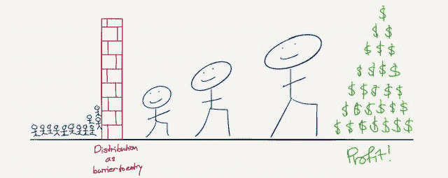

# 销售情感——本·汤普森的策略

> 原文：<https://stratechery.com/2015/selling-feelings/?utm_source=wanqu.co&utm_campaign=Wanqu+Daily&utm_medium=website>

其中一个比较著名的营销框架是[营销组合](https://en.wikipedia.org/wiki/Marketing_mix#McCarthy.27s_four_Ps)，也被称为“四个 P”根据该框架，营销计划有四个关键组成部分:

*   产品(实际销售的产品)
*   大米(该产品的售价)
*   促销(顾客如何发现产品)
*   **P** 花边(可以找到产品的地方)

在这四个因素中，最困难和最昂贵的因素——也是最大的进入壁垒(即最大的护城河)——是地点。实际上，把你的产品送到顾客面前需要与批发商和零售商的关系，更不用说在物流方面的大量投资了。事实上，控制分销的公司往往是所有公司中利润最高的。

以媒体行业为例:广播网络拥有电波传播权，有线电视网络需要获得运输权(运输权本身是由私营公司提供的，为它们赚取了巨额利润)，报纸拥有印刷机和送货卡车，音乐公司印刷专辑并将其运进商店，出版商对书籍也是如此。从商业模式的角度来看，所有这些公司都是相似的:通过控制分销，他们收取实际分销的租金。

然而，这不仅仅是媒体。销售任何东西——衣服、鞋子、锅碗瓢盆——都依赖于你的产品实际上架，这意味着与批发商、零售商、运输商等打交道。所有人都割下了自己的肉。典型的制造商能拿到一件商品零售价格的 40%就已经很幸运了，而且往往更低——前提是该制造商能在商店里买到他们的商品。

#### 过去的美好时光

简而言之，在任何行业开创一项新业务都是非常非常困难的:简单地迈出第一步不仅需要一个伟大的产品，还需要在客户面前推出该产品的巨大投资，我们甚至还没有得到推广(更不用说支付所有费用的价格)。

这最终使最大的参与者受益:例如，宝洁公司可以利用其与已经销售汰渍洗衣粉和帮宝适尿布的零售商的关系，为新的产品线获得货架空间。大型百货连锁店可以要求新服装的独家经营权，或者压低价格。媒体公司可以挑选谁来出演，并以他们的方式。真正启动一项业务的回报是，一旦你成功了，事情就会变得容易得多:

[T2】](https://i0.wp.com/stratechery.com/wp-content/uploads/2015/11/FullSizeRender-3.jpg?ssl=1)

这就是“过去的好时光”的样子:先前存在的企业至多与一批已知的同行公司竞争，或者像通常情况那样，主导单个市场，唯一的限制是它们的规模扩张能力。当然，对于那些无法获得分销的人来说，情况并不那么好:他们最多可以把自己的产品扔过墙去，并希望因为他们的麻烦而被扔回来的任何碎屑，而客户不得不满足于往往服务于最低公分母的产品。

#### 价格和地点之间的联系

这种背景就是为什么我倾向于翻白眼，比如对 app stores 收取 30%佣金的抱怨。过去，发布一个软件只是部分地关于创建所述软件:同样重要的是，如果不是更多的话，将所述软件放在货架上，顾客可以实际上拿起它们，并且出版商幸运地为特权保留零售成本的 30%。

应用商店改变了一切:现在任何一个拥有开发者账户的人都可以像其他人一样发布应用程序；苹果和谷歌有能力做到这一点，因为互联网让货架空间实际上变得无限。墙不见了！

[T2】](https://i0.wp.com/stratechery.com/wp-content/uploads/2015/11/FullSizeRender-2.jpg?ssl=1)

正如应用程序商店开发者越来越意识到的那样，问题在于旧的分发墙的存在与另一边的利润存在直接相关:当任何人都可以销售软件时——当这个地方对所有人开放时——没有人可以盈利，因为价格变为零。

#### 销售应用程序的问题是

长期以来，我一直批评苹果的应用商店，最近一次是在《从产品到平台》中。具体来说，我认为 App Store 拒绝支持试用使得优势产品很难差异化从而收取更高的价格，而升级定价和客户数据的缺失使得很难从一个开发者现有的用户群中获得更多的钱。

尽管如此，我很早就意识到，即使苹果公司改变政策，开发商也将是众所周知的搬起石头砸自己的脚。回到 2013 年，我在[开源应用](https://stratechery.com/2013/open-source-apps/)中提到:

> 从经济学角度来看，软件市场之所以如此迷人，是因为软件的边际成本是 0 美元。毕竟，软件只是驱动器上的一点点，眨眼之间就可以复制。同样，创建所述软件需要多少努力并不重要；这是沉没成本。重要的是多复制一份要花多少钱:0 美元。
> 
> 这对应用程序的影响是显而易见的:任何无差别的软件产品，比如你的花园综艺应用程序，将不可避免地是免费的。这就是为什么付费应用市场已经基本消失。随着时间的推移，替代品以越来越低的价格进入市场，最终达到边际生产成本:0 美元。

尽管如此，这并不意味着不可能赚钱。

#### 差异化游戏

注意这里的关键形容词:“无差别的。”被分化是什么意思？毫无疑问，这与第一个“P”产品有关。与众不同的产品在某些方面“更好”,但往往很难准确指出哪种产品更好。它只是“感觉”更好，或者换个说法，它是关于它给你的感觉。我已经写了大量关于用户体验的重要性的文章，这一点是相同的:交付一个体验与其说是关于功能，不如说是关于体验的整体，包括可接近性、可用性，甚至是像状态或适应这样的事情。

想想在 App Store 上继续大获成功的一个应用类别:像《糖果粉碎》或《部落冲突》这样的免费游戏。批评者抱怨说，他们是操纵者，从有罪的玩家那里榨取金钱，以换取一种毫无价值的数字商品，这种商品给买家带来的只是成就感——基本上是一针多巴胺。但是，如果我可以戴上反向投资的帽子，那又怎么样呢？所说的注射多巴胺与通过许多其他方式获得的有什么不同吗？许多其他方式都要花钱。如果差异化更多的是关于某样东西给你的感觉，而不是特性，那么为什么仅仅因为某个特定的东西碰巧是由软件创建的，就有特殊的偏见呢？我要补充的是，数字多巴胺为开发者带来了更加公平的商业模式:用户玩得越多，开发者赚得越多。

一个更极端的例子是在 PC 上越来越流行的免费赢游戏(没错，还是个东西！).Chris Dixon 写了一篇必读的文章，名为[PC 视频游戏行业的教训](https://medium.com/@cdixon/lessons-from-the-pc-video-game-industry-3350bb7713de)，描述了这种商业模式:

> PC 游戏世界将免费增值模式发挥到了极致。与《糖果粉碎》等“免费玩”的智能手机游戏相反，《Dota 2》等电脑游戏是“免费赢”的。你不能花钱在游戏中变得更好——那会被视为破坏公平竞争的精神。(像《南方公园》这样的电脑游戏玩家通常认为智能手机游戏的商业模式是愤世嫉俗和操纵的)。你能买到的东西大多是化妆品，比如你的角色的新衣服或者新的背景音乐。[英雄联盟](https://en.wikipedia.org/wiki/League_of_Legends)(不在 Steam 上的最受欢迎的 PC 游戏)估计去年通过销售这些化妆品使[赚了超过$1B](http://www.pcgamer.com/league-of-legends-has-made-almost-1-billion-in-microtransactions/) 。

我知道你们中的许多人都在翻白眼——为一个数字化身出售数字服装，价值高达十亿美元？你一定很傻吧？那么，你有多傻，带着一个价值 5000 美元的手提包，功能却远不如另一个价格的几分之一，或者戴着一个价值 10000 美元的手表或 200 美元的领带？坐头等舱或者住五星级酒店怎么样——这两样你都不能带走！完全不理智。

或者说，只看特征是不理智的。关键是这些购买如何让你产生感觉，而正是这种感觉，无论是对工艺、地位的欣赏，还是仅仅是被宠爱，提供了使所有这些产品都有利可图的差异化。有人可能会说，坚持将价值计算限制在永久的、有形的、容易在电子表格上列出的项目上，才是真正的不合理。

#### 打造你的市场

在这些 PC 游戏的例子中，开发者所做的事情实际上是非常令人印象深刻的，并且应该成为各种业务的典范。由于互联网引发的竞争，付费 PC 游戏市场几乎不可能赚钱，开发者没有试图在这个市场赚钱，而是有效地创造了一个全新的市场——一个充满了通过免费访问和高质量游戏吸引来的人的虚拟世界——然后利用他们对该市场的所有权来满足专注时尚的企业一直在满足的同类需求。需要看起来很酷，或者需要脱颖而出。需要给你的朋友留下深刻印象，或者仅仅是喜欢你的外表。

顺便说一句，数字化并不重要:任何一个人的现实最终都是他们选择关注和花费时间的地方，这使得像《英雄联盟》这样的游戏对他们的居民来说比巴黎的时装精品店更真实，也更具排他性。毕竟卖家只有一个。

[T2】](https://i0.wp.com/stratechery.com/wp-content/uploads/2015/11/FullSizeRender.jpg?ssl=1)

此外，正如免费游戏的情况一样，经济学都是一致的:创造市场是一项固定成本，这意味着它对多一个玩家的边际成本没有影响。为什么不增加玩家的最大数量(通过使其免费)，然后开发一个不同的收入流，玩家玩游戏的时间越长，收入就越多，确保开发者在价值实现时获得价值？当然，所说的价值可能只能从某些人那里获得，而且增量相对较小，但请记住，我们是在和互联网打交道:你可以在数量上弥补。

此外，我认为该模型具有广泛的适用性。两周前，我写了一篇关于出版业的未来将不再是单纯的文字赚钱，而是利用文字来获得粉丝，这些粉丝可以通过其他难以发现的媒体赚钱。时间和注意力仍然是宝贵的商品，在一个领域赢得信任会让你有权利在另一个领域从中赚钱。同样，正如我[上周](https://stratechery.com/2015/tensorflow-and-monetizing-intellectual-property/)所写的，软件通常应该被视为解决方案的杠杆，这些解决方案对客户来说更有意义，也更难复制。毕竟，如上所述，软件是无限可复制的:利用这一点比将你的商业模式建立在对抗地心引力的基础上更好。T5 1T7】

更广泛地说，事实仍然是做生意很难——在互联网出现之前很难，现在也很难——但困难的性质已经改变了。分销曾经是最困难的事情，但现在分销是免费的，节省下来的时间和金钱必须转而投资于更接近客户，更准确地了解他们为什么在你身上花钱。任何种类的软件——或写作、或音乐、或视频、或服装、或其他——从来不是因为其内在价值而被购买，而是因为它为购买者做了什么——它让他们感觉如何(见多识广、快乐、放松等)。).创造条件，让需求显现出来，然后满足需求，你的企业不仅会成功，而且很有可能会比“过去美好时光”中物理条件有限的最小公分母赢家取得更大的成功

### *相关*