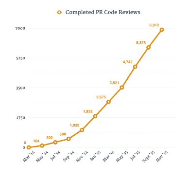

# 新 WordPress.com 背后的故事|开发者资源

> 原文：<https://developer.wordpress.com/2015/11/23/the-story-behind-the-new-wordpress-com/?utm_source=wanqu.co&utm_campaign=Wanqu+Daily&utm_medium=website>

大约一年半以前，我们对使用 WordPress 构建的技术和开发流程进行了戏剧性的反思。

我们现有的代码库和工作流为我们提供了很好的服务，但十年的遗留问题开始严重阻碍我们构建用户期望的现代、快速和移动友好的体验。看起来开发者和设计者之间的合作并没有全面展开。所以我们问自己这个问题:

> "如果我们今天开始建设，WordPress.com 会是什么样子？"

### 新的开始:原型和迭代

我们以前问过自己这个问题，也有过很多没有带来有用改变的计划。回顾过去，我们能够指出我们最大的错误:我们从一个模糊的愿景开始，并试图解决一个定义不清的问题。这些见解确实帮助我们改变了方法。

一个原始的 Calypso 原型屏幕，列出了你所有的 WordPress 站点。

Calypso，这个新的 WordPress 管理界面项目的代号，以不同的方式开始。为了呈现一个清晰的愿景，我们基于明确定义的产品目标构建了一个令人向往的 HTML/CSS 设计原型，让我们可以想象新 WordPress.com 完成后的样子。我们知道，随着我们向用户推出零件，它会随着时间的推移而改变，但这一愿景为 Automattic 的所有人提供了目标和兴奋。

一旦 Calypso 原型处于一个好的位置，早期的开发都是关于做出艰难的决定，例如使用哪种语言，是否使用框架，以及我们如何扩展我们的 API。Automattic 刚刚收购了 Cloudup ，这是一款基于 API 的文件共享工具，使用 JavaScript 构建。Cloudup 团队向我们展示了一条坚实的、可维护的、可扩展的道路，让 WordPress.com 完全基于 JavaScript 和 API。

由于 WordPress 是一个 PHP 驱动的应用程序，我们公司范围内的开发技能一直以来都是 PHP 占主导地位，只使用少量的高级 JavaScript。这使得 Calypso 在开发的前六个月的大部分时间里对公司的其他工程师和设计师构成了威胁——我们正在开发一些很少有人能参与的东西。

甚至核心的 Calypso 项目团队成员也不得不克服我们的威胁。我们都不是优秀的 JavaScript 开发人员。但是随着每一天我们经验的积累，我们犯错误，我们回顾错误，我们修正错误，我们学习。一旦我们启动了项目，我们就为其他工程师树立了更好的榜样，并在整个公司分享我们的知识。

构建早期设计原型带来了一个巨大的变化:使用 GitHub 改善了协作。Calypso 原型是由 GitHub 的一些设计师合作完成的；尽管我们中的许多人已经在个人项目中使用 GitHub 很长时间了，但对于内部项目来说，GitHub 还是一个相对较新的东西，过去大多数项目管理和 bug 跟踪都使用 Trac。使用 GitHub 帮助我们看到了内部协作可以变得多么容易，以及如何允许对正在完成的个人工作进行更多的反馈。

同行代码评审没有显示出放缓的迹象，现在已经被广泛接受。

由于 GitHub 在原型开发阶段工作得非常好，我们转向了所有的 Calypso 开发，允许我们利用 pull request (PR)系统进行同行代码评审，并构建我们自己的基于 GitHub 的定制工作流。代码审查对许多开发人员来说是新的——传统上，在 Automattic，除了 VIP 团队对客户站点的日常代码审查之外，我们没有系统的同行代码审查系统。代码审查，虽然它最初增加了开始使用 Calypso 的威胁，但极大地提高了我们代码库的质量，并帮助每个人提高了他们的 JavaScript 技能。

最初，一个 7 人的团队在 Calypso 上工作，很快扩展到 10 个团队，然后是 14 个，然后是 20 个积极参与 Calypso 代码库工作的自动化人员。在 WordPress.com 上发布第一个 Calypso 驱动的功能两个月后，我们有 40 名贡献者在五个不同的团队中为 Calypso 工作。在接下来的一年里，我们以“尽早发布，经常发布”的自动思维方式进行迭代，在 WordPress.com 上推出了 40 个由 Calypso 驱动的独特功能，有超过 100 名个人贡献者。

到 2015 年中期，Calypso 代码库已经足够好，可以在网络浏览器之外使用。因为 Calypso 完全是 JavaScript、HTML 和 CSS，所以它可以在一个具有轻量级 node.js 服务器设置的设备上本地运行。使用一种叫做 Electron 的技术，我们构建了本地桌面客户端，运行捆绑在应用程序中的相同代码。我们首先开始开发原生 Mac 桌面应用程序[，现在已经可以使用了](http://desktop.wordpress.com)，并继续开发即将推出的 Windows 和 Linux 应用程序。看到这些应用聚集在一起，并在内部使用它们，我们开始证明我们为构建 Calypso 代码库所付出的努力是值得的。

### 开源 Calypso，WordPress.com 背后的力量

我们的一个 Calypso 开发者聚会正在进行中，在十月份的全公司大会上，团队 IO 构建了 Calypso 编辑器。

在过去的一年半时间里，Calypso 已经从一个想法变成了一个令人向往的原型，再变成了一个功能齐全的产品，被反复构建、发布，并被数百万 WordPress.com 用户使用。从内部来看，这是一个巨大变化和成长的时期。我们已经通过 GitHub 接受了跨团队协作，通过 PR review 系统接受了同行代码评审，从几个伟大的 JavaScript 开发人员变成了一个全是他们的公司，并且每天都能看到设计师和开发人员之间令人难以置信的协作。

一张显示新旧 WordPress.com 差异的简便图表。( [pdf](https://developer.files.wordpress.com/2015/11/whats-new-wpcom2.pdf) ， [img](https://developer.files.wordpress.com/2015/11/whats-new-wpcom2x2.png) )

[我们很自豪能够开源](https://developer.wordpress.com/calypso/)我们投入的所有努力，并继续以开放的方式构建产品。你可以在我们的首席执行官马特·莫楞威格的网站上阅读更多关于[开放 Calypso 开发的信息。](http://ma.tt/2015/11/dance-to-calypso/)

在接下来的几个月里，我们将发布更多深入的帖子，探索 Calypso 背后的技术和工作流:我们如何管理自己独特的 GitHub 流，我们如何使用其他流行的开源库，如 React 和 Flux 等概念，以及我们捆绑和启动原生应用客户端的经验。请关注这个博客(在右下方)，同时，[查看当前的 Calypso 代码库](https://github.com/Automattic/wp-calypso)，我们将继续对其进行迭代。

 **安迪·皮特林**
卡里普索项目负责人

### 像这样:

像 装...

### *相关*