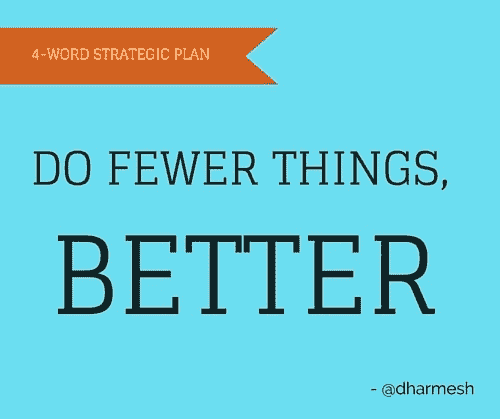

# 做得更少，更好

> 原文：<http://onstartups.com/do-fewer-things-better?utm_source=wanqu.co&utm_campaign=Wanqu+Daily&utm_medium=website>

 我要告诉你一个秘密。我有一个非常简单的四个字的战略计划(几年前设计的)。

它在这里...

**做的事情越少越好。**

这大大改善了我的生活和工作。

以下是我如何执行我的战略计划:

1.决定什么是最重要的。

2.对其他一切说不。

3.当有东西落在灰色区域时，重读#2。

当然，说起来容易做起来难。我总是失败——但我正在变得越来越好。以下是从多年实践中总结的一些技巧:

**1。当你列出清单时，s** **从低层次的抽象开始。**抵制诱惑，让自己的单子真正“高级”。举个极端的例子，你优先考虑的事情之一不应该是“成功”。这是如此的宽泛，以至于你可以合理解释世界上几乎所有的活动。尽量做到足够具体，让“适合”的东西的数量是一个可管理的数量。如果你发现自己承担了太多(你很可能会这样)，精炼你的过滤器，并转移到一个较低层次的抽象。我写了一篇关于这个的文章，你可能会觉得有用:“[专注的力量和近视的危险](http://onstartups.com/tabid/3339/bid/85680/The-Power-of-Focus-And-The-Peril-Of-Myopia.aspx)”。

**2。原谅自己不得不对那些不在你“少做的事情”清单上的事情说“不”。**几年前，我写了一篇请求公众原谅的博文，你可以在 http://MustSayNo.com[这里看到。在我写过的所有文章中，那篇对我的生活产生了最积极的影响。](http://MustSayNo.com)

3.记住，每当你对你可能会对 T2 说“是”的事情说“不”的时候，你就能腾出时间来关注重要的事情。你在重要的事情上花的时间越多，你就能越好地完成 *。让我给你举个例子:假设你对某个项目/请求/想法说“不”,而这个项目/请求/想法一个月“只”花了几个小时，因为它不在“重要的事情”列表中。让我们说，对你来说重要的事情之一是能够更好地向世界传达你的信息——通过公开演讲。你“节省”的几个小时可以用来传递你的信息。更多的演讲演出，更多的人受到影响。但是等等！还没完呢！你不仅可以做更多的公开演讲，因为你会在上面花更多的时间，你会做得更好。而且，因为你越来越擅长，你会得到更多的演讲邀请。拥有更多的观众。一旦你站在舞台上就有更大的影响力。通过在重要的事情上越来越好，你正在建立*杠杆*。而且，一旦你决定只在几件事情上做得更好，你会变得更好，这是令人惊讶的。*

顺便说一下，反过来也是如此:每次你对某件事说“是”，你就在对另一件事说“不”。通常，你会对更重要的事情说“不”。

**4。对抗 FOMO(害怕错过)情绪。**简直是杀手。我们在不同程度上都有。这种担心是，如果我们不对某事说“是”，我们将会错过一些大的机会、小的快乐或新的联系。是的，有时你会错过，但没关系。生活还要继续。一般来说，你跳过一些事情会更好，而不是试图做太多。

> 更多的人是因为贪吃好活动而失败，而不是因为缺乏好活动而失败。

**5。** **对反复出现的承诺要格外小心。**如果你*打算*偶尔对那些不在你“最重要的事情”清单上的事情说“是”，那就要格外小心，不要让它们成为经常性的承诺。一次 4 小时的承诺比一个月一小时的承诺要危险得多。我是这样想的:当我对一个重复的承诺说“是”时，我实际上是多次说“是”(只要我认为我会在那个承诺中)。这让我想到了下一点...

**6。** **尽管很痛苦，还是要删除你之前的承诺**。如果你和我一样(抱歉，如果你是)，你已经答应了一些现在有点后悔的事情。把你自己脱下来。尊重他人，理解他人，保持公平——但是要自律，忠于自己。仅仅因为你去年承诺了没有真正“截止日期”的事情，并不意味着你必须永远做下去。事情变了。与此相关的一点是:对于没有截止日期的东西，记住，以后修剪起来会和现在一样痛苦，为什么不早点给自己一些时间呢？

**7。** **努力解决结果，而不是活动。**弄清楚你*希望*发生什么(无论是商业利益还是慈善利益)，并弄清楚如何最好地创造影响。通常，最佳结果并不是通过对一堆“好”的活动说“是”来实现的(无论多么善意)。

关于慈善事业，你可能想知道:**“做好事，回馈社会怎么样？”**

警告:我在这里的观点可能会引起一些人的争议，并让其他人感到羞愧和自私。抱歉。

首先，如果你有能力回馈社会，你应该这样做。毫无疑问。但问题是，你如何优化结果？

我用个人的例子来解释一下。我是一名企业家。在我职业生涯的大部分时间里。我喜欢创业。他们给我带来了巨大的快乐。我是 HubSpot(纽约证券交易所代码:HUBS)的联合创始人之一。我也是波士顿的忠实粉丝，希望看到波士顿创业生态系统的成长和繁荣。

但是几年前，我决定大幅限制我花在直接帮助企业家和波士顿生态系统的时间。

我为什么要这么做？那不是自私吗？是的，我想是的。

我非常非常相信*杠杆和规模*。我喜欢以能产生最大影响和最佳结果的方式消耗卡路里。实际上，我对这个想法很反感。

我做出这个决定的原因是，我觉得对我来说，帮助创业生态系统的最好方式是利用我的时间帮助 HubSpot 成为一家超级成功的公司。那次成功的*副产品*将比我直接帮助少数初创公司所获得的要多得多。

到目前为止，HubSpot 取得了一定的成功。我们现在是上市公司，有 1000 多名员工在公司工作。我们有许多人已经从 HubSpot“毕业”,并开始创办自己的公司或加入其他团队。我们还为一些人赚了钱(其中一些人通过天使投资的方式将部分资金投入到生态系统中)。我们提升了波士顿的“品牌”,使其成为一个仍然可以建立大型科技公司的地方(这有助于吸引更多资本、人才和兴趣)。总之，我想说我们是净阳性。

但是，事实仍然是，我没有成为一个导师/顾问/门客，而是在我花时间的地方成了一个笨蛋。我的钱是另一回事——我已经进行了 60 多次天使投资。但是，我一直在极力保护我的时间，对几乎所有的事情都说“不”。记住，我喜欢创业。我喜欢帮助他们。我喜欢刺激、快乐和满足感。但是，我还是拒绝了。而且，我在这里可能是合理化的——但我认为，如果我只是去参加更多的活动，试图挑选一些初创公司作为顾问/导师等，我可能会为生态系统做更多的事情。

这部分比我计划的要长得多。我有另外一篇草稿文章，标题是“施粥场的外科医生”。我给你这篇文章的节略信息:

**不要偏爱*觉得*最好的东西。喜欢什么*做*最好。**

谢天谢地，写博客是一项高杠杆的活动。而且，因为我用 HubSpot 来写/推广/跟踪这篇文章，它也帮助了 HubSpot。所以，我可以把这个合理化到我的“更少的事情”列表中。

为你的“少物”干杯，并致以良好的祝愿。