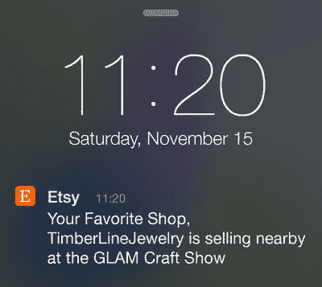
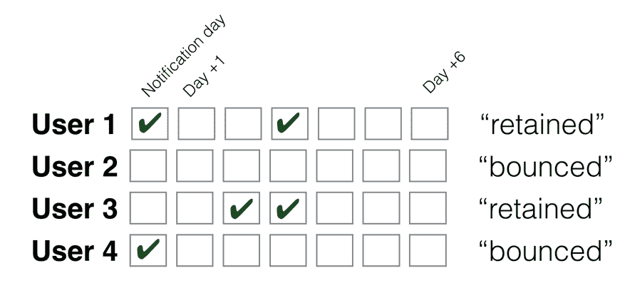

# 丹·麦金利:我的推送通知会赶走用户吗？

> 原文：<http://mcfunley.com/are-my-push-notifications-driving-users-away?utm_source=wanqu.co&utm_campaign=Wanqu+Daily&utm_medium=website>

<main>

为了回应[凯兰的](https://twitter.com/kellan)关于 twitter 上推送通知的思考，[亚当·麦库埃](http://twitter.com/mccue)提出了一个有趣的问题:

我很快意识到在推特上找到答案是没有希望的，所以我尝试用长格式来回答。

##### 我们该怎么做？

让我们想出一个非常简单的方法来解决单个恼人的通知的情况。这是有限的，但所描述的过程对于任何拥有网络移动应用的人来说应该是可能的。我们需要:

1.  一种将用户分为两组的方法:一组是能看到广告通知的治疗组，另一组是看不到广告通知的对照组。
2.  一种判断用户是否消失的方法。

为了使统计尽可能简单，我们需要(1)是随机的，我们需要(2)是一个[二项式度量](http://homepages.wmich.edu/~bwagner/StatReview/Binomial/binomial%20probabilities.htm)(即“是或否”、“真或假”、“正面或反面”等)。

为了做有效(简单)的统计，我们也希望我们的试验相互独立。如果我们一遍又一遍地给相同的用户发送通知，我们就不能认为每一次都是独立的试验。很容易凭直觉理解为什么会这样:在你第五次骚扰我之后，我更有可能卸载你的应用。所以我们需要在实验的每一天考虑不相交的用户集合。

Does this hurt us or help us? [Let's try science.](http://store-xkcd-com.myshopify.com/products/try-science)

如何随机选择用户在这些条件下接受治疗由您决定，但一个简单的方法应该是广泛适用的，就是散列用户 ID。假设我们需要 100 组用户:治疗组和对照组各 50 天。我们可以将所有用户 ID 的空间散列到 100 个桶。

那么我们如何判断用户是否消失了呢？大多数移动应用程序都会向某个地方的服务器发出 http 请求。比方说，如果用户在某个时间间隔内没有再次向我们发出请求，我们将认为他们被“退回”了。

有些人可能会看到我们发送的通知(导致一两个请求)，但会感到恼火，并随后卸载。我们不想把这样的用户算作快乐的。因此，假设我们将查找通知后一天到通知后六天之间的使用情况。在此期间向我们发送请求的用户将被视为“保留”

Some examples of our binomial model. We'll call a user retained if they request data from us on any of days two through seven counting from the time of the notification. User 4 in this example is not retained because (s)he only requests data on the day the notification was sent.

为了正确地进行实验，你需要知道要进行多长时间。这在很大程度上取决于你的个人信息:有多少人使用你的应用程序，他们使用它的频率，广告通知的价值，以及对你来说卸载有多严重。为了便于讨论，我们假设:

*   我们可以发现，在很长一段时间内，每天都有 10，000 个用户向我们发出请求。
*   (如前所述)我们将把其中的 50%放入治疗组。
*   目前，在某一天活跃的人中有 60%会在之后的一至六天内活跃。
*   我们希望有 80%的把握，如果我们把这个数字上下移动 1%，我们就会知道。
*   我们希望 95%地确定，如果我们测量正负 1%的偏差，这是真实的。

如果你将所有这些输入实验计算器，它会告诉你需要 21 天的数据来满足这些条件。但是由于我们在测量中使用了拖尾时间间隔，我们需要等待 28 天。

##### 一个示例结果

好的，假设我们已经进行了这个实验，并且得到了一些结果。假设它们看起来像这样:

| 组 | 用户 | 保留用户 | 退回的用户 |
| --- | --- | --- | --- |
| 处理 | Two hundred and ten thousand | One hundred and ten thousand one hundred and forty-four | Ninety-nine thousand eight hundred and fifty-six |
| 控制 | Two hundred and ten thousand | One hundred and twenty-six thousand and thirty-three | Eighty-three thousand nine hundred and sixty-seven |

使用这些数字，我们可以看到我们的保留率明显下降了 12.6%，并且比例测试证实了这一差异具有统计学意义。哎呀！

##### 我已经做了实验，现在怎么办？

你很可能已经创建了广告通知，因为你心中有一些积极的目标。也许目的是让人们买些东西。如果是这样的话，那么你应该做一个额外的计算，看看你在积极参与中得到的是否超过你在用户中失去的。

##### 我认为我没有足够的数据。

你可能没有 420，000 个用户可以玩，但这并不意味着这个实验一定是没有意义的。在我们的例子中，我们试图检测*正负百分之一的变化。*你可以在更小的用户群中发现更大的行为变化。祝你好运！

##### 我正在向非活动用户发送重新激活通知。我还能测量卸载吗？

在我们的思维实验中，我们假设用户很可能会使用你的应用。然后，我们考虑了推送通知对该行为的影响。但是你可能考虑发送通知的一个原因是他们没有使用通知，而你试图重新激活他们。

如果是这种情况，您可能希望只测量重新激活。毕竟，一个安装了你的应用程序但从不打开它的用户和一个卸载了你的应用程序的用户之间的区别主要是哲学上的。但是您也可以设计一个实验来检测卸载。如果很少很少使用你的应用程序仍然有价值，这可能是明智的。

这里可能适合您的一个过程是发送两个通知。然后，您可以使用二级通知的传递失败作为卸载的代理指标。

##### 我想了解更多这方面的知识。

碰巧的是，我和 O'Reilly 录制了一段视频，更详细地讲述了这类事情。你可能还会喜欢[埃文·米勒的博客](http://www.evanmiller.org/)和[罗恩·科哈维的出版物](http://ai.stanford.edu/~ronnyk/ronnyk-bib.html)。

* * *

</main>