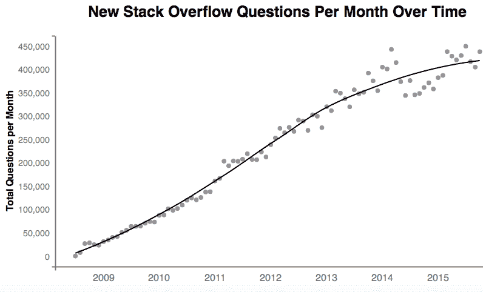
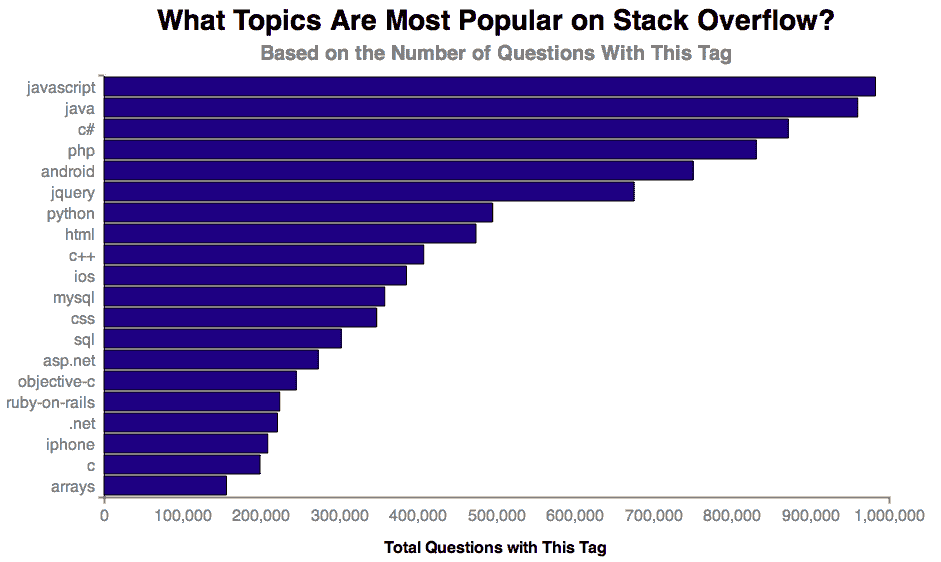
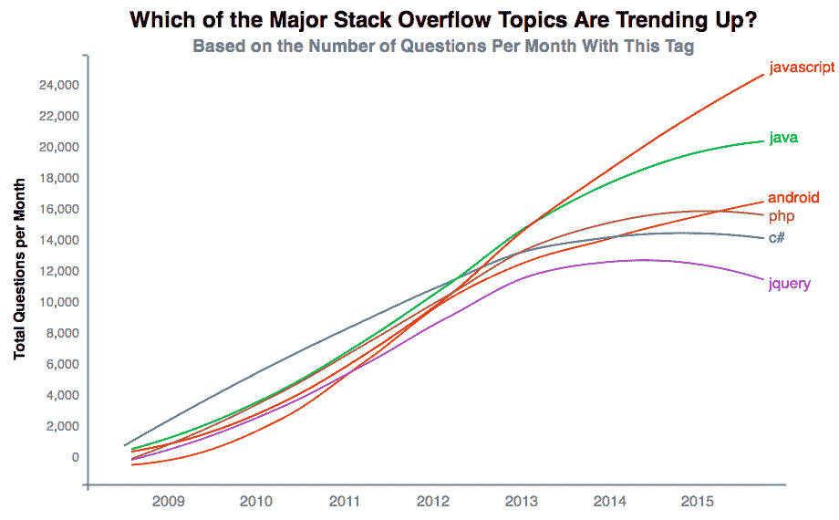
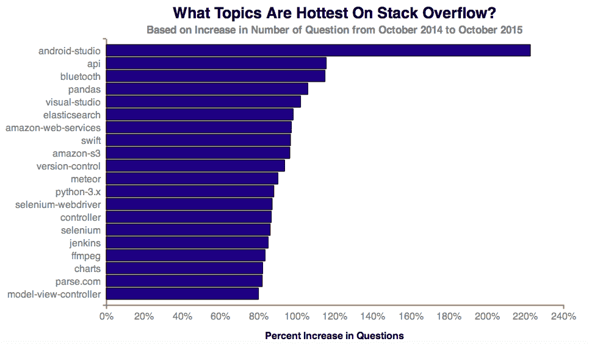
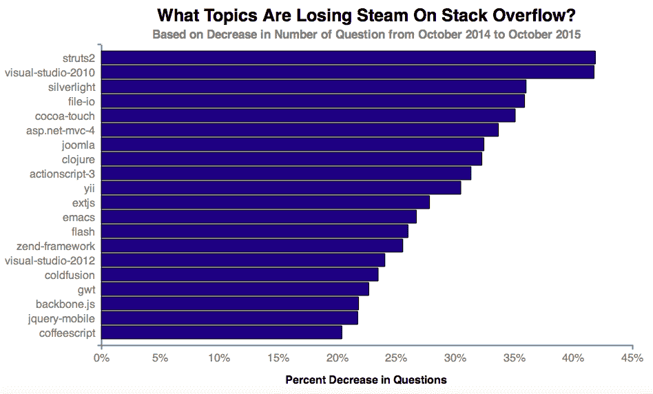
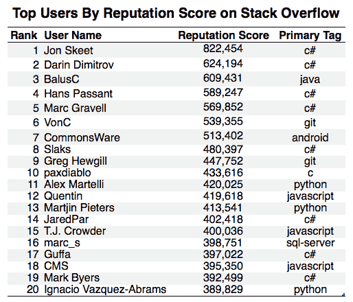

# 堆栈溢出和计算机编程的时代精神

> 原文：<http://priceonomics.com/stack-overflow-and-the-zeitgeist-of-computer/?utm_source=wanqu.co&utm_campaign=Wanqu+Daily&utm_medium=website>

## 堆栈溢出和计算机编程的时代精神

[

<noscript></noscript>](http://some.ly/1aLTUcg) 

讽刺新闻网站 The Allium 最近报道称，“计算机编程学科”将被正式更名为“谷歌栈溢出”像最好的讽刺作品一样，这个笑话的妙处来自于它的真实性。

面向程序员的问答网站 Stack Overflow 每天有 760 万访客，是互联网上访问量最大的网站的第 57 位——仅领先于 Craigslist、ESPN 和 PornHub。它是新手和专家程序员的主要资源，是编程迷的避难所。不确定如何解决问题？放在 Stack Overflow 上，一般半小时 内解决 [(不需要你花钱)。但是如果你不想被](http://data.stackexchange.com/stackoverflow/query/9449) [套](https://medium.com/@johnslegers/the-decline-of-stack-overflow-7cb69faa575d) 的话记得把问题写清楚。

Stack Overflow 由知名编程博客作者 Jeff Atwood 和 Joel Spolsky 于 2008 年创立，很快成为程序员提出问题和帮助兄弟的卓越网站。今天，堆栈溢出不仅是学习编码的人的资源，而且对理解编程世界正在发生的事情也很有用。这个世界越来越重要，但对于局外人来说，似乎难以理解。

出于对堆栈溢出数据的好奇，我们分析了网站上超过 1100 万个问题的主题。我们使用这些数据来检查编程中讨论最多的主题，并发现哪些主题正在上升，哪些主题正在下降。

***

在最初，杰夫·阿特伍德 [将](http://blog.codinghorror.com/introducing-stackoverflow-com/) 栈溢出描述为一个问答网站“遇见维基百科遇见编程 reddit”该网站与众不同之处在于，它在知识共享许可下注册所有问题和答案，并且没有会员费(竞争对手 Experts-Exchange 的 [会员每月支付](http://www.experts-exchange.com/plansAndPricing.jsp) )。“堆栈溢出”这个名称是编程中的一个术语，指的是当一个程序试图使用比内存中可用空间更多的空间时所导致的错误，它是由 Atwood 的博客 上的一项投票选出的。

超过[1100 万个问题](http://stackexchange.com/sites#traffic) 自 2008 年以来，在 Stack Overflow 上被问及[1700 万个答案](http://stackexchange.com/sites#traffic) (只有 27%的问题没有得到回答；同一个问题可以给出多个答案)。下图显示了自 Stack Overflow 创建以来每月提出的问题数量。目前，每月大约有 40 万个问题。我们从 Stack Overflow "[data explorer](http://data.stackexchange.com/stackoverflow/query/59301/questions-per-month-top-10-tags-compared)(原始查询由用户 [sam.saffron](http://stackoverflow.com/users/17174/sam-saffron) 编写)中收集了以下所有图表的数据。

<noscript></noscript> 

> *丹·科普夫，价格经济学；数据:* [*栈溢出*](https://data.stackexchange.com/stackoverflow/queries)

这些问题的本质告诉我们编程的状态是什么？

每当一个问题被发布到堆栈溢出时，用户必须用“一个关键字或标签”来“标记” [问题](http://stackoverflow.com/tags?page=1&tab=popular) 来对问题进行分类。这些标签帮助其他程序员找到他们可能会帮助解决的问题。精通 Java 的用户寻找带有标签“ *java* ”的问题用户回答问题既是出于他们内心的善良，也是为了增加他们的 [声望](http://stackoverflow.com/help/whats-reputation) 分数的荣耀(后面会有更多)。

Stack Overflow 上有 400 多个标签，有 10000 多个问题。标签 *javascript* ， *java* ， *c#* ， *php* ， *android* 和 *jquery* 自成一派，都有超过 67.5 万个问题。排在第七位的编程语言 Python 的标签接近 50 万。

<noscript></noscript> 

> *丹·科普夫，价格经济学；数据:* [*栈溢出*](https://data.stackexchange.com/stackoverflow/queries)

上图显示了自堆栈溢出开始以来每个标签的问题总数，但编程世界正在快速发展。堆栈溢出标记允许我们跟踪这些变化。

下图显示了“六大”标签每月的问题数量。

<noscript></noscript> 

> *丹·科普夫，价格经济学；数据:* [*栈溢出*](https://data.stackexchange.com/stackoverflow/queries)

虽然每月关于客户端 web 开发语言 javascript 的问题数量几乎呈线性增长，但 javascript 模块 jquery 的问题数量却在下降。这些变化可能反映了这些工具的流行，但也可能只是堆栈溢出的用户构成变化的结果。

我们很好奇是否可以利用带有某个标签的问题的数量来了解编程界的“热门”话题。我们确定了从 2014 年 10 月到 2015 年 10 月，五百个有史以来最受欢迎的标签中哪个标签的每月问题增长最多。

<noscript></noscript> 

> *丹·科普夫，价格经济学；数据:* [*栈溢出*](https://data.stackexchange.com/stackoverflow/queries)

安卓工作室是去年增长最快的主要品牌。[*Android-studio*](http://stackoverflow.com/questions/tagged/android-studio)是一个在 Android 平台上进行开发的集成开发环境。2014 年 10 月只有 383 个关于 android-studio 的问题，但 2015 年 10 月有 1236 个。

许多其他增长最快的标签包括网络/云开发( *api* 和*亚马逊网络服务*)和数据分析(*熊猫*和*图表*)。当然，这是时代的标志。

哪些标签似乎正在失去活力？一般来说，同比下降最多的标签是平台的过时版本，如 *ios7* 和 *windows-8* 。如果我们只包括那些在 2012-2015 年有 100 个问题的人，我们会得到一个更有趣的列表。

<noscript></noscript> 

> *丹·科普夫，价格经济学；数据:* [*栈溢出*](https://data.stackexchange.com/stackoverflow/queries)

虽然上图中的一些标签主题已经过时(例如 flash、silverlight，或许还有 emacs)，但需要注意的是，标签因堆栈溢出而失去吸引力并不一定意味着人们失去了兴趣。可能只是关于较小主题领域的问题变得饱和，没有更多的问题需要被询问。

***

Stack Overflow 的成功归功于它的 [百万](http://stackexchange.com/leagues/1/)用户。2013 年的一项研究发现，只有 8%的用户回答了五个以上的问题(用户的定义是拥有栈溢出账户的近五百万人。许多没有注册的人使用该网站)。事实上，我们发现在一天的时间里， [25%的答案](http://data.stackexchange.com/stackoverflow/query/edit/394691) 来自 Stack Overflow 的数百万用户中的 1000 人。

Stack Overflow 的特色之一是用户可以通过回答和提问获得“”积分。用户报告说感觉 [沉迷于](http://meta.stackexchange.com/questions/12468/top-users-on-stack-overflow-slackers-or-superstars) 积累点数并获得那些点数附带的 [徽章](http://stackoverflow.com/help/badges) 。

回答问题最多的用户，像 [乔恩·斯基特](http://codeblog.jonskeet.uk/) 和 [T.J .克劳德](http://stackoverflow.com/users/157247/t-j-crowder) ，都成了编程明星。增加的声誉允许在站点上有更大的特权(例如编辑问题和投票关闭问题的能力)，并且还可以帮助用户获得 [咨询工作](http://programmers.stackexchange.com/questions/20407/will-high-reputation-in-stack-overflow-help-to-get-a-good-job) 。

下表显示了有史以来声誉得分最高的个人，以及他们回答问题的主要标签。

<noscript></noscript> 

***

虽然很少有人会认为堆栈溢出不是一种不可思议的资源，但一些程序员还是有所顾虑。首先，许多用户对社区文化的发展表示失望。他们认为社区已经变成了 [过度关注](http://pinoniq.svbtle.com/stackoverflow-is-dead) 的信誉点，成为了新用户被 [嘲笑](https://medium.com/@johnslegers/the-decline-of-stack-overflow-7cb69faa575d) 的地方。开发者 John Slegers 在 Medium 上写道，一些高声誉用户已经成为“ [特权过高的巨魔](https://medium.com/@johnslegers/the-decline-of-stack-overflow-7cb69faa575d) ”

其他人担心堆栈溢出如何影响编程基础。一些批评者认为，开发人员现在可以让堆栈溢出用户为他们解决问题，而不是真正地与问题作斗争。提问者可能会收到并使用他们并不真正理解的答案代码；他们只知道这解决了他们的问题。从长远来看，当需要调整时，这可能会导致问题。自称为“开发者福音传道者”的 Christian Heilmann 称这些剪切粘贴的程序员为“ [全栈流开发者](https://www.christianheilmann.com/2015/07/17/the-full-stackoverflow-developer/) ”(对于门外汉来说，这是“ [全栈开发者](http://www.laurencegellert.com/2012/08/what-is-a-full-stack-developer/) ”的双关语)。

尽管如此，该网站仍然是许多编程社区的中心资源。程序员杰森·萨克斯 [对 Stack Overflow 发展的某些方面表达了他的苦恼](http://www.embeddedrelated.com/showarticle/741.php) ，但他仍然相信该网站庞大的用户社区、优秀的用户界面和快速的回答使它成为一个你可以经常得到“奇妙帮助”的地方

即使是这篇文章，也多次提到了堆栈溢出。在 [收集数据](https://data.stackexchange.com/stackoverflow/queries)[制作图表](http://stackoverflow.com/questions/31062750/ggvis-barchart-using-dates-as-x-axis) 和了解 [社区的文化和走向](http://meta.stackexchange.com/questions/12468/top-users-on-stack-overflow-slackers-or-superstars) 的过程中，栈溢出问答线程是必不可少的。

我们的下一篇文章将调查当你使用尿壶时，有多少尿液溅到你身上。当我们发布→*[***加入我们的邮件列表***](https://priceonomics.us4.list-manage.com/subscribe?u=f66f07e4e312263b2c3c8405d&id=6c081361d7) *。*T19】*

 **本帖由* [***丹科普夫***](https://twitter.com/dkopf) *撰写；跟着他上* [***这里推特***](https://twitter.com/dkopf) *。*

* * *

* * **