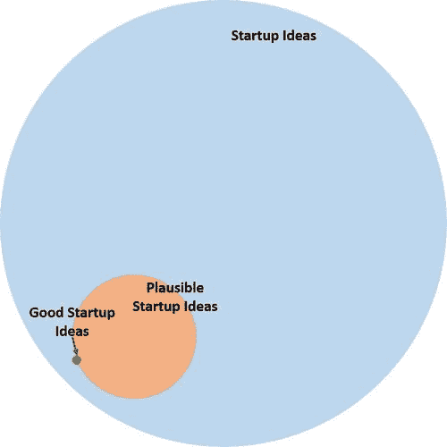

# 如何从一个看起来不错的糟糕的创业想法中拯救自己

> 原文：<http://jitha.me/how-to-save-yourself-from-bad-startup-idea-that-looks-good/?utm_source=wanqu.co&utm_campaign=Wanqu+Daily&utm_medium=website>

 [<noscript></noscript>

](https://jitha.me/wp-content/uploads/2015/11/Blog00002.jpg)

启动错误已经咬了你。你想创业，发展几年，卖掉公司，然后轻松度过余生。一个伟大的梦想。但这是最简单的部分。困难的部分是建立业务。这个漫长而艰难的旅程始于第一步——有一个伟大的想法。

你是如何想出创业点子的？首先，你可以阅读 Y-Combinator 的保罗·格拉厄姆的这篇文章。这是发人深省的，即使以保罗的崇高标准来看。保罗说了很多伟大思想的特征。**但他也谈到了一个看起来相似但对立的概念——“情景喜剧”创业理念。**

什么是情景喜剧创业创意？这听起来像是真的，但实际上是不好的。

这不仅仅是个坏主意。我们有很多这样的东西，它们很容易识别。即使我们对这个想法的所有权使我们看不到它幼稚的愚蠢，我们的朋友也会警告我们。他们会告诉我们这是他们听过的最愚蠢的事情。我们可以放下骄傲，继续下一个想法。

不，情景喜剧的创业想法同样不错。这是一个听起来合理的想法。如此似是而非，以至于当你去问客户是否会使用它时，他们不会说不。

这就是危险所在。你可以阅读《精益创业》,尽职尽责地向客户“验证”你的想法，然后构建它。却发现实际上没有市场。

### **宠物社交网络**

保罗用一个“宠物社交网络”的例子来说明这一点。如果你有宠物，这听起来是个好主意。当然，你可以想象把你的宠物鹦鹉的照片贴在 petlife.com 上，其他人都在屏息等待“喜欢”它们。或者，更阴险的是，你可以想象你周围的人喜欢这项服务。

实际上，我在 IIM 特里希的演讲中尝试过这个方法，人们很喜欢这个想法。但它在两个层面上是不好的:

1.  认为如果人们说他们喜欢一种产品，他们就会使用它是错误的。我可能喜欢 30 个不同的网站，但这并不意味着我会每天都查看所有的网站。鉴于我有限的注意力，我唯一每天使用的社交网络是脸书。
2.  如果你和 100 个人交谈，他们都说他们“知道有人会用这个”，那么你就找到了一个由 100 个几乎用户组成的社区。或者准确的说，是零用户。

那么，你如何区分情景喜剧创业创意和真正有前途的创意呢？你怎么知道你是在做一件大事，还是只是一个幻影？

 [<noscript></noscript>

](https://jitha.me/wp-content/uploads/2015/11/Blog00003.jpg)

简单(也很难)的答案是——无论如何你都要尝试。你[建立一个 MVP](https://jitha.me/your-minimum-viable-product-can-be-more-minimum-than-you-think/) 并检查市场是否有吸引力。如果有，恭喜你，成功了。如果没有，那么你知道你刚刚有了一个“情景喜剧”的想法。

但是有一种更简单的方法。我想出了一些模式来识别什么可能是一个坏主意，尽管它听起来似乎有道理。

* * *

在我们开始之前，有一个警告。我不知道是否有任何听起来合理的想法实际上是坏的。但我知道的是，可信想法的世界比好想法的世界要大得多。所以，一个看似合理的想法可能是不好的。

 [<noscript></noscript>

](https://jitha.me/wp-content/uploads/2015/11/Blog00004.jpg)

就像我知道一只敲键盘的猴子不会创作出《罗密欧与朱丽叶》(有可能，但概率微乎其微)，如果我对一个创业想法所知道的只是它看似合理，那它很可能是糟糕的。当然，你偶尔会有一条推特。一个看似随意的产品，却能突然火起来。但是这样的例子少之又少，你可以忽略它们。

完成后，让我们深入到模式中:

## **1。宽而浅，窄而深**

保罗在他的文章中的一个论点是，你应该解决至少几个人的深层需求。如果你正在解决的需求是肤浅的，那么这不是一个好的创业想法。即使这会影响到很多客户。

这肯定是个大问题——一个小问题或一次性问题解决不了问题。

> 你必须创造一个至少有少数人需要的产品，而不是很多人想要的产品。

一个“广泛而浅薄”的情景喜剧可以遵循几种模式。

### **一种“维生素”，不是“止痛药”**

宠物社交网络就属于这一类。这是一种很好的东西，就像维生素胶囊一样。没有人*需要*它，就像没有止痛药就会昏过去的牙根管病人。如果人们只是“想要”你正在建造的东西，但并不“需要”它，那就要小心行事了。你可能会想到一个听起来不错的坏主意。

> 不要把注意力放在人们可以使用的酷的东西上，试着解决一个真正的问题。

### **没有解决顶级问题**

但是仅仅解决一个问题是不够的。一定很重要。简而言之，如果您正在解决的问题不是客户的三大问题之一，那么它就不重要。现在就放弃吧，否则就太晚了。

我曾经想过开发一个软件工具来帮助风投管理交易流程。它将有一个可视化的漏斗，告诉风险投资有多少交易，他们已经看到在过去 3 个月，以及每个交易的讨论阶段。并且他们可以通过任何过滤器(例如，SaaS 与消费者、位置、商业阶段等)来划分它。)查看他们的交易渠道。

一个好主意，我想。唯一的问题是，这不是一个足够重要的问题。获得强劲的交易流远比跟踪它重要得多。许多风投很乐意使用 Excel 来跟踪他们的渠道。他们甚至没有尝试像 Salesforce 这样的通用漏斗管理系统。他们为什么要费心使用一个为风投量身定制的呢？

> 如果您正在解决的问题不是客户的三大问题之一，那么它就不重要。

### **“解决人们不知道的问题”**

这是上面两种模式的近亲。虽然本质上不是一个“维生素”解决方案，但它解决了一个人们不知道自己有问题的问题。这就引出了一个问题—*你怎么知道他们有这个问题？*

几年前，我通过一个针对小型商业网站的即插即用忠诚度计划尝试过这样做。用户每天回到网站、阅读文章、分享到社交网络等都会得到积分。

对于试图增加客户保持率的大型稳定企业来说，这可能是一个好主意。但是一个小企业找到它的脚？这些家伙甚至不考虑游戏化或忠诚度。他们还有其他问题。他们需要先建立一个用户群，然后再尝试一些小技巧来提高忠诚度。

我试着卖了 6 个月。它不起作用。说服人们购买你的产品已经够难的了。为什么要加上说服他们需要的负担？

如果你想避免建造没人要的东西，那就解决已知的问题。

### **“这个产品解决了所有人的问题”或者“微软 Office”产品**

我喜欢微软办公软件。它是如此灵活，如此包罗万象。不管你在处理什么类型的问题，你可以打赌 Excel 和 PowerPoint 会非常有用。或者想想谷歌——无论你的查询是什么，你都能找到答案。

这些都是优秀的产品。但是，旨在一次性解决所有人的问题可能会给创业公司敲响丧钟。为什么？再次以我的游戏化系统为例:

1.  不太可能已经有大量的人迫切需要你的产品。如果你在为每个人解决一个问题，那可能是一个广泛而浅薄的问题，而不是一个深刻的问题。我的系统是一个很好的选择，而不是解决他们三大问题的答案。
2.  在大多数情况下，灵活的产品需要客户有一个学习曲线。新闻快讯–您的客户太忙，没有时间学习如何使用另一种产品。除非你正在解决的问题和 Office 和 Google 解决的问题一样重要，否则祝你好运。更明智的做法是专注于一类客户，比其他任何人都更好地解决他们的问题。
3.  同时解决每个人的问题需要一个复杂的后端。为什么不先进行强有力的市场验证就要建立呢？你要么以构建一个有缺陷的产品而告终，要么更糟，构建一个没人想要的伟大产品。在我们的产品中，技术挑战被证明是棘手的。试图将我们的系统与几种网站技术相结合意味着它不能很好地工作。

> 试图为每个人解决一个问题往往意味着你最终没有为任何人解决这个问题。

### **“我打造的超酷产品”**

你从工程师那里学到了很多(我也是一名工程师)。我们专注于产品，因为我们觉得产品本身就足够好。“我的新应用程序很酷，可以让你一口气把照片分享给你所有的 Whatsapp 群”。很好，但是如果你的用户不希望这样呢？

在这个一百万个应用程序都在争夺人们眼球的世界里，“做好了，他们就会来”是行不通的。参见本文中的图表，了解标准有多高。你需要确定你正在解决一个问题，而且是一个顶级的问题。否则，你可能只是一个“寻找问题的解决方案”。

首先展示需求。否则，你复杂的产品可能只是另一个精心构建的白日梦。

## **2。模板化的商业模式**

### **《X 的优步》**

[如“自行车的优步:满足你骑行乐趣的按需自行车”或“汽车的 AirBnb:在别人不用的时候租他们的车”]

 [<noscript></noscript>

](https://jitha.me/wp-content/uploads/2015/11/Blog00001.jpg)

"你此刻想要一辆自行车吗？"

这个模板和互联网一样古老。把在一个部门有效的东西放到另一个部门。它在 90 年代是“X 的网站”,在 21 世纪初是“Y 的社交网络”。但这是一个危险的策略。为什么？

当然，优步在出租车市场非常成功。但这并不意味着按需服务可以适用于所有其他行业。除非这个想法是从一个问题有机发展而来的，否则你必须假设它是坏的。你必须假设创始人已经把优步模板应用到了他能想到的第一个领域。

你面临这种情况的另一个线索是，当创始人在他们正在建设的领域没有真正的专业知识。那他们怎么知道问题是真的呢？他们没有。他们所知道的是，对另一个行业来说，这个解决方案是真实的。

### **“X 代表印度”**

这是一个更加普遍和臭名昭著的模板。除非这种模式有某种地理限制(例如按需出租车)，否则没有什么能阻止一家成功的美国企业向印度扩张。

此外，如果模型涉及网络效应，那么你会期望在一个地方生长的东西也能在其他地方迅速获得份额。

正如马赫什·穆尔蒂常说的，印度的脸书就是脸书。印度的火绒是火绒，而不是羊毛。

这个模板还有一个问题——有些模型不能跨地域扩展。按需自行车在斯堪的纳维亚或台湾可能是个好主意。但在炎热、闷热、嘈杂、拥挤的孟买就是不行(天哪，为什么我还住在这里？).

## **3。增量商业模式**

这是我们经常看到的另一种商业理念。它通常只涉及对市场上现有解决方案的轻微调整。同样，这可能有两种类型:

### **克隆现有球员，但稍有改进**

想想“有无线网络的优步”。当然，优步现在已经开始这样做了。但即使没有，这对创业公司来说也是一个可怕的想法。Wi-fi 不是差异化。这是一个装饰性的修饰，旨在帮助你从新手投资者那里筹集资金。

这在两个层面上都是错误的:

1.  它假设在你推出改进的产品时，现任者会无所事事。如果您带来的只是一个增量改进(即 1 倍，而不是 10 倍)，您可以打赌，如果现任者发现它是一个有用的附加功能，他们也会将它包含在下一个版本中。不要认为自己愚蠢。
2.  通常，你的进步与你正在解决的核心问题无关。如果说“优步可以用，但人们讨厌它没有 wi-fi”是不是很傻？

### **克隆一个现有的竞争者，但是在邻近的市场**

当 Bookmyshow(印度的一个电影票务网站)刚刚成立几年的时候，一个朋友告诉我他想建立一个“Bookmyshow for Plays”。这也是个坏主意。Bookmyshow 已经解决了更难的获得顾客的问题。因此，与新玩家重新开始相比，Bookmyshow 在其平台上加入游戏要容易得多。的确，几个月后，戏剧出现在了“我的书展”上。

这种情景喜剧想法的一个例子是“今天的解决方案是令人满意的”这种形式的陈述。但是我的好多了”。为了让你的想法变得绝对好，今天的解决方案不可能令人满意！至少对一部分观众来说。否则，你的想法就像我为风投提供的交易流程管理解决方案一样。这是一个不错的选择，但还不足以改变现有的流程。

然而，什么是足够好，以改变一个人现有的行为？**10 倍的改进——无论是易用性、耗时还是效率。**

## **4。【无竞争】T1**

你经常听到创始人说他们是第一个做 X 的团队，没有竞争对手。或者他们可能会说大家都是竞争对手(这是“没有竞争对手”的另一种说法)。如果你听到这个，尽快往相反的方向跑。

为什么？为什么缺乏竞争令人担忧？有两个原因:

1.  如果真的没有竞争，也许市场本身就没有吸引力。今天，很难碰到一个根本没人见过的问题。当解决雄心勃勃的问题和解决雄心勃勃的问题一样困难时，你为什么想要解决没有雄心的问题呢？
2.  创始人可能没有做彻底的分析，或者可能被他们的竞争护城河比实际更大的神话所迷惑。你会支持这样的创始人吗？

等等，我是说竞争很重要吗？是的-许多试图解决问题的玩家表现出强烈的需求。但是要成功，你还是需要差异化。用创业公司的话说，你需要拥有“不公平优势”。无论是行业经验，关键的合作伙伴关系等。–**你的成功秘诀中一定有秘方。**

> 你击败竞争对手时，他们不会无所事事。你的秘方是什么？

* * *

就是这样。当你倾听创业想法时，这些模式应该会引起你的怀疑。我错过什么了吗？请在评论中告诉我，给 gt.jithamithra@gmail.com 发邮件，或者发微博到。

当然，有些想法实际上可能很棒，即使它们符合这些模式。他们最终可能会改变世界。只有一个方法可以确定——[推出 MVP](https://jitha.me/your-minimum-viable-product-can-be-more-minimum-than-you-think/) ，证明我是错的。