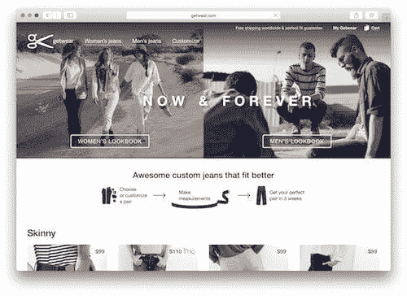
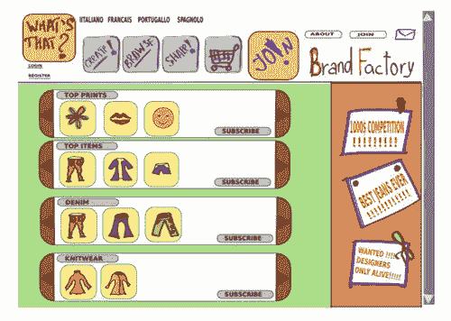
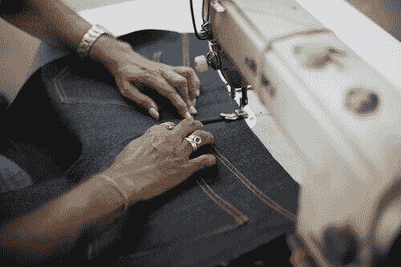

# 在经历了六年的奋斗之后，我关闭了自己的创业公司——粉碎杂志

> 原文：<http://www.smashingmagazine.com/2015/11/lessons-learned-shutting-startup/?utm_source=wanqu.co&utm_campaign=Wanqu+Daily&utm_medium=website>

2015 年 1 月 12 日， *Getwear* ，一家综合定制牛仔裤公司，处理其最后一笔订单。之后，公司倒闭了。尽管提出了独特的定制生产工艺和出色的牛仔裤，但我们并没有取得多大成功。几个月之后——经过大量的讨论和剖析——我找到了原因。

2015 年 1 月 12 日，综合定制牛仔裤公司 *Getwear* 处理了最后一笔订单。之后，公司倒闭了。尽管**提出了独特的定制生产流程和出色的牛仔裤，但我们并没有取得多大的成功**。几个月之后——经过大量的讨论和剖析——我找到了原因。在这篇文章中，我很乐意分享一些**的见解、错误和经验教训**，这样你就知道在你的项目中需要注意什么了。

这一切都要追溯到 2009 年，当时我正在意大利完成市场营销课程。我读了 Tim O'Reilly 的一篇著名文章“什么是 Web 2.0(T1)”，我被一个想法震惊了，那就是通过大规模定制将这个概念带到“真实”的世界。让用户制造他们自己的产品应该已经把设计决策的权力从少数人手中转移到大众手中——至少我是这么认为的。

## smashing mag 上的进一步阅读:

带着这个革命性的想法，我找到了我的同学兼未来的联合创始人，他在服装生产方面有着丰富的经验。他证实大规模生产定制服装是可能的。

More after jump! Continue reading below ↓

<aside class="feature-panel">

遇见 [**粉碎邮件简讯**](/the-smashing-newsletter/) 前端有用的小技巧，设计& UX。订阅并**获得“智能界面设计清单”**——一个**免费的 PDF 包**，有 150 多个问题可以在设计和构建几乎*任何东西*时问自己。

</aside>

我们的教授是李维斯的前高级经理，他给我们开了绿灯，我们的朋友告诉我们我们的想法有多酷，我们开始了为期六年的艰苦战斗之旅，并从中吸取了教训。

Getwear 基于五个假设:

1.  对独特或不寻常的牛仔裤有需求。
2.  人们想**设计自己的衣服**。
3.  人们会迷上定制自己的衣服，购买他们设计的衣服。
4.  人们会很乐意在社交媒体上分享他们的设计，以展示他们的设计并赚取佣金。
5.  社交分享会吸引新客户，循环往复。

Getwear’s website. ([View large version](https://cloud.netlifyusercontent.com/assets/344dbf88-fdf9-42bb-adb4-46f01eedd629/63807627-44a5-463c-9e2c-410cc69aaae2/01-gw1-opt.jpg))

所有的业务都建立在假设的基础上，但是将一个业务模型建立在五个未经测试的想法上，每一个都是公司成功的关键，这太过分了。

让我们最终接近的环境远远超出了我们的控制，但我们通过不做正确的事情铺平了道路。你自己看吧。

## 我们发展得太快，花了我们太长的时间

相信“建造它，他们会来的”，我们跳过了适当的研究和验证。毕竟，这个想法看起来太棒了，很难理解它怎么会失败。

我们对网络开发毫无经验，但我们设法在一个月内筹集到了资金。很自然，我们决定找一个代理机构来为我们建造一切。他们应该遵循我们自己设计的一套模型(见下文)；现在我认为那些人在工作中度过了愉快的时光。

Early mock-up of Getwear’s website. ([View large version](https://cloud.netlifyusercontent.com/assets/344dbf88-fdf9-42bb-adb4-46f01eedd629/89c20f6e-aea7-4211-87f4-db3919ebac13/02-gw2-opt-small.jpg))

长话短说，在一年内**我们推出了一个定制编码的网站，花费超过 10 万美元**——这是支付给代理的费用，不包括员工工资或创始人的生活费用。

一路走来，我们决定缩小关注范围，削减前期成本，只推出一个产品类别，一个能产生最高利润的类别:牛仔裤。令人惊讶的是，一条牛仔裤的生产成本与一件优质的帽衫相差无几，然而人们却习惯于为牛仔裤支付两倍的价格！除此之外，无论是装饰还是剪裁，牛仔都可以在很大程度上定制。

当网站准备好的时候，我们在印度有一个设备齐全的制作办公室。

## 我们预料到了病毒循环

你可以看到我们预期的增长和发展主要依赖于病毒循环。病毒式传播是许多企业家希望做但从未实现的事情，而其他实现了的人做梦也没想到会这样。

我们相信用户会喜欢在网上设计牛仔裤，并乐意在社交媒体上分享他们的设计，从而吸引新的访问者来我们的网站。那没有成功。虽然我们在网站上的平均时间为 3.5 分钟，但用户就是不分享。

简而言之，Getwear 没有成功是因为这个项目没有火起来。这部分是因为对定制服装的需求比我们想象的要少。

## 我们没有市场策略

自从公司成立以来，我们已经经历了几次转型，**试图找到一个我们可以发展的利基市场**。第一个支点是放弃美国市场，原因如下:美国牛仔裤往往分为几类:

*   价格在 15 美元到 40 美元之间的量产牛仔裤(例如牧马人、李维斯等。);
*   手工或设计师的牛仔裤，有很强的制造商的故事，价格超过 150 美元。

我们在印度制造的标准牛仔裤定价 99 美元，与美国(或日本)由粗犷、有纹身的伐木工人手工制作的手工牛仔裤相比，Getwear 显得格格不入。我们也无法与李维斯或李氏等品牌的大众市场价格竞争。大幅降价不是一个选择，因为业务将不再盈利。所以，我们转向了。又来了。

## 我们不假思索就做了一些事情

在这种绝望的情况下，我们决定开拓海外俄罗斯市场，尽管整个网站上没有一个俄语单词，但我们一直在那里进行临时销售。

因为我们没有花时间去试验，所以我们决定**把钱花在净覆盖率最高的频道**上，而没有真正考虑我们的投资回报。由最著名的俄罗斯网页设计师 Artemy Lebedev 运营的最大博客上的广告在几天内就收回了成本，并让我们相信我们可能会在大洋彼岸取得成功。

到那个时候，很明显定制设计的牛仔裤对任何人来说都没有真正的吸引力。也许我们中没有人曾经试图自己订购定制牛仔裤的事实应该敲响警钟。因此，我们决定重新关注质量、工艺和完美贴合，在此之前，我们一直认为这是次要的价值观。

Getwear’s factory. ([View large version](https://cloud.netlifyusercontent.com/assets/344dbf88-fdf9-42bb-adb4-46f01eedd629/104d2794-112b-4024-bbcf-d8d424a25b92/03-factory-opt.jpg))

## 我们没有增长的引擎

事实上，我们做到了，但这不符合我们的商业模式。根据《精益创业公司》一书的作者埃里克·里斯的说法，如果公司通过高比例的重复订单和非常高的客户终身价值(LTV)生存和发展，增长引擎是粘性的。

这是一个很好的机制，它适用于销售奢侈品等商品的公司，因为这些商品的成本和零售价格之间的差异很大。对于生产吸引或接近有限受众的商品的品牌和工匠来说，这使他们能够依靠相对较小的客户群生存。

与他们不同， **Getwear 定位于大众市场**，我们在每双鞋上赚的钱相对较少。我们必须不断获得新客户，以保持运转。

因为我们没有像病毒一样传播，也没有对定制牛仔裤的既定需求，所以短期内我们只能依靠付费用户获取——也就是广告。我们尝试了几乎所有的东西，从智能内容营销到地铁车厢里的海报。

客座博客(顺便说一句，付费的，因为这在俄罗斯网站上更常见)和脸书新闻订阅广告效果非常好，但这两个渠道很快就达到了顶峰(我们知道我们最终会用完受欢迎的博客，而脸书在俄罗斯的市场份额非常小)。

虽然我们设法获得了巨大的数字(近 6000 次点击，点击率为 4.36%，每次点击成本为 0.13 美元，转化率约为 1.2%)，但这一策略并没有带我们走远，很快就停止了工作。

Our Facebook statistics. ([View large version](https://cloud.netlifyusercontent.com/assets/344dbf88-fdf9-42bb-adb4-46f01eedd629/22551714-7fcc-4426-96a5-ffd03ed12660/04-fbstats-opt.png))

我们在脸书尝试的另一个策略是**推广我们的原创内容**(例如，关于我们制作部门的博客帖子)。与传统广告不同，这带来了巨大的有机影响(人们分享内容)，但转化率却低了两倍。不用说，很快我们就在俄国活跃的脸书用户中占据了相当大的比例。

俄罗斯强大的脸书竞争对手 VK——其总用户数是俄罗斯的两倍多，活跃用户数可能也是俄罗斯的数倍——对我们不起作用。似乎那里的人们太专注于猫和有趣的图像，以至于无暇顾及定制牛仔裤。

## 我们最后的努力失败了

当一切都不起作用时，我们不会怀疑我们的基本假设有任何问题。相反，我们决定**提升产品**的吸引力。因此，我们又向前跨了一步，完全重新设计了网站(这次是内部设计)，并制作了一些漂亮的[时尚书籍](https://getwear.com/explore/men-2014-2015/)(毕竟我们是卖服装的)。

为了确保网站设计不会造成问题，我们聘请了一位转化率优化专家来完善我们的销售漏斗。

到 2014 年秋天，很明显，用正确拍摄的照片取代电脑生成的牛仔裤图像，添加预先设计的牛仔裤目录，并进行多变量测试，都不会让我们有所收获。**转化率只有 0.6%** ，获取渠道变薄，我们的增长停滞不前。

Getwear 的后端是为我们从未达到的销售和增长水平而构建的。

一切都安排得很清楚。我们建立了一个智能的生产和订单管理系统，并集成了智能图案制作软件，允许在几秒钟内创建定制图案。

这一切都需要大量的维护和 R&D(研究和开发)，这迫使我们拥有合格的工程师，从而增加了我们的燃烧率。我们达到的销售水平(并努力提高)意味着公司只有在“好”的月份才能盈利。

## 棺材上的钉子

我们有六名内部工程师和四名客户支持代表来保持卓越的质量和服务水平。一年前，为了收支平衡，我们决定削减成本，停止所有的研发活动，解雇一些员工。

不幸的是，政治和经济现实受到了沉重打击:在邻国乌克兰的政治动荡、俄罗斯吞并克里米亚和货币崩溃之后，这两个国家的顾客一夜之间都要花两倍的钱买牛仔裤。

截至 2014 年 12 月底，我们的财务业绩比上一年差了七倍。2013 年，我们一天能卖出价值 3000 美元的圣诞礼券，而去年一整个月才卖出两三张。

Getwear 死了。

## 反光

从很多方面来说，Getwear 的故事是一次复活傀儡的尝试。大多数人，无论他们属于哪个社会群体，都不认为有必要设计自己的衣服。Getwear 从第一天起就注定要失败。

我们只是在已经启动并运行的时候才开始听取用户的反馈，并且根据反馈采取行动并没有太大的改变。如果人们对在网上购买定制牛仔裤不感兴趣，增加颜色和面料选择会有什么意义呢？

We started listening to user feedback only when we were already up and running, and acting on it didn’t change much. ([View large version](https://cloud.netlifyusercontent.com/assets/344dbf88-fdf9-42bb-adb4-46f01eedd629/eaf9faf3-63aa-46ab-80ef-f69ad4e0c1f0/05-made-in-india-ink-opt.jpg))

定制和“消费者共同创造”，正如它的正式名称一样，不能取代一个强大的、成熟的品牌。即使是强大的品牌也可能失败。截至目前，还没有成功的网上定制牛仔裤业务。由李维斯前高管经营的 INDi Custom Denim 比我们早一年停止运营；两家规模较小的创业公司 OriJeans 和 Tribe Jeans 在 2014 年沉没；一个 [Kickstarter 资助的项目](https://www.kickstarter.com/projects/sammiller/custom-fit-jeans/description)(四年前的)甚至还没有启动。

李维斯在 2004 年关闭了自己的定制牛仔裤业务 Original Spin——可能是有充分理由的。

### 错误的假设

我们建立业务的假设是错误的，我们没有注意到这一点。我们对自己不诚实，我们忽略了负面反馈。

我们浪费了大量的时间和金钱去创造一个没人需要的漂亮产品。

Getwear 拥有惊人的客户忠诚度，大量的正面评论和重复销售，但我们没有增长的市场，潜在客户数量也很少。虽然顾客终身价值可能非常好，但人们不会经常购买牛仔裤——尤其是质量好的牛仔裤——来刺激销售。我们努力寻找足够多的潜在顾客来维持生意。

精益创业告诉我们，企业要么在高产量和低利润上工作(想想大规模生产)，要么相反(想想设计师服装)。Getwear 本应成为独角兽——一家高利润*和*高销量的公司。事后看来，我们应该知道忽视常识通常会导致失败，而不是 10 亿美元的估值。

### 我们还能做什么

这个故事不是关于没能足够快地从一艘正在下沉的船上跳下来。这是关于未能理解船为什么会下沉。

验证商业想法的最好方法之一是预售产品。众筹定制牛仔裤项目的失败表明，事情没那么简单；为了验证，必须向成熟产品将吸引的相同目标受众进行预销售。如果让我重新开始，我不会去 Kickstarter，而是会和人们交谈，了解他们为什么购买某种牛仔裤，以及一个品牌名称在他们的决定中有多大分量。知道了这一点，我很可能会为我的第一笔生意想出一个更好的主意。

当 Getwear 完成后，我们在网站直播聊天软件的拥挤空间里成立了一家新的创业公司 *Chatra* 。我不知道它是否会成功，但至少我们正在为我们非常擅长的东西(客户支持)制作一个工具，并且在一个现有需求和激烈竞争的市场中，显示出增长的潜力是存在的。我们与客户发展息息相关。

### 外卖食品

我们相信一个公司的成功通常不是因为一个革命性的产品，而是因为微小的创新。做一些在某些方面比其他方面更好的事情会比发明一种新的做事方法给你带来更高的成功机会。

我希望你们中的一些人能从我们的错误中吸取教训。

有问题吗？请在下面的评论区告诉我！

## 总结经验教训

*   开始前做**客户开发**。在你对你的客户有清楚的了解之前，不要开始建设。《[企业家客户开发指南](https://www.custdev.com/)》是这方面的一本好书。
*   不要把目标定在革新什么东西上。致力于做得更好。
*   **尽早验证你的基本假设**，构建一个最小可行的产品。不要像我们一样花时间设计详细的模型，尤其是如果你是产品开发的新手；您可能会在尚不需要的功能上浪费大量时间和金钱。
*   如果最低可行的产品没有发挥应有的作用，不要责怪它。相反，检查你最初的假设。
*   **治标不治本**。当假设无效时，不要试图改变事实，而是尝试提出新的假设。
*   **让它死去**。做一个不动的项目是痛苦和压抑的。你可以欺骗媒体和投资者，让他们认为一切都很好，你就要成功了，但不要欺骗自己。永远不要忽视你的直觉。

 (vf, ml, al, jb)