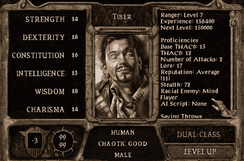

# 每个软件工程师都应该知道的一件事

> 原文：<http://blog.codinghorror.com/the-one-thing-every-software-engineer-should-know/?utm_source=wanqu.co&utm_campaign=Wanqu+Daily&utm_medium=website>

我是史蒂夫·耶格的超级粉丝，所以很荣幸史蒂夫·耶格能参加[最近的堆栈溢出播客](http://blog.stackoverflow.com/2008/10/podcast-25/)。然而，有一件事我没有预料到，那就是史蒂夫在谷歌和亚马逊的经历中一个反复出现的特殊主题:

> 如果有一件事我可以教给每个工程师，那就是如何营销。

不是[怎么打](http://steve-yegge.blogspot.com/2008/09/programmings-dirtiest-little-secret.html)，不是[怎么写](http://steve.yegge.googlepages.com/you-should-write-blogs)，不是[怎么设计一门编程语言](http://steve-yegge.blogspot.com/2008/06/rhinos-and-tigers.html)，而是*营销*。

这对于开发人员来说是痛苦的，因为[我们喜欢代码](http://www.codinghorror.com/blog/archives/000878.html)。但是所有这些精彩的代码都是无关紧要的，直到:

1.  人们明白你在做什么
2.  人们开始对你正在做的事情感兴趣
3.  人们对你所做的事情感到兴奋

简而言之，这就是营销。仅仅因为你是营销人员并不一定意味着你是营销黄鼠狼。当然，这两件事是高度相关的——但就其核心而言，市场营销只不过是基本人际沟通的中级课程。在历史上，T2 的程序员在 T3 时没有这么出色过。

这就是为什么即使是最强硬的核心程序员也应该关注像 Seth Godin 这样的人。史蒂夫指的是更广泛、更永恒意义上的营销，即**让其他人对你的想法感兴趣**。

听史蒂夫在我们的播客中多次提到这一点，并看过他的相关演讲[如何通过两个简单的步骤忽视营销并变得无关紧要](http://blip.tv/file/319044/)之后，我突然意识到为什么我对最近发现的两本书如此着迷。在 Stack Overflow 的开发过程中，我反复参考的书籍。

我无法放下这两本保罗·阿登的小画幅书。猜猜 Arden 先生是做什么的？没错，他是盛世长城&广告公司的执行创意总监。

我一直在看黄色书籍。*营销*书籍。甚至是自愿的。我有点不好意思承认这一点，因为这些正是我通常取笑其他人阅读的那种简洁的小商业书籍。但是在阅读这些书的过程中，我意识到我们在栈溢出上所做的很多事情与我们的代码有多棒无关——而是与*营销*有关。

我们都是软件开发人员，所以让我用程序员理解的术语来解释这个问题:[地下城&龙](http://en.wikipedia.org/wiki/Dungeons_and_Dragons)角色统计。你知道，经典。

如果你是一名程序员，你想每年都做得更好，你可能会认为最重要的角色属性是 T2 编码。我们把这个叫做 INT 吧。所以在多年的辛劳之后，你会得到这样的结果:

| 潜艇用热中子反应堆（submarine thermal reactor 的缩写） | six |
| DEXEDRINE 的简称 | nine |
| 精读 | Twelve |
| （同 Internationalorganizations）国际组织 | 51 |
| 知道 | Thirteen |
| 儿童健康研究（Child Health Research 的缩写） | four |

好吧，你是个天才程序员，可以绕着其他人编圈。但是[由于你无法控制的原因，你可能永远不会发布你的任何代码](http://www.codinghorror.com/blog/archives/000773.html)。那是一种错觉。你*可以*控制你的代码何时、如何以及在哪里发布。你可能花了太多时间构建你的代码，而**没有足够的时间作为你的代码**的*倡导者*。你有没有向人们解释你的代码是做什么的，为什么它很酷很重要？你提供了为什么你的代码会让他们的生活变得更好的理由吗，至少在一些小的方面？你是否让人们很容易找到并使用你的代码？

我相信，如果大多数程序员能够更好地按照以下原则来发展自己的个性，他们的职业生涯会更好:

| 潜艇用热中子反应堆（submarine thermal reactor 的缩写） | Sixteen |
| DEXEDRINE 的简称 | Fourteen |
| 精读 | Fifteen |
| （同 Internationalorganizations）国际组织 | Eighteen |
| 知道 | Sixteen |
| 儿童健康研究（Child Health Research 的缩写） | Seventeen |

有时候，[选择不编程](http://www.codinghorror.com/blog/archives/000543.html)，你会成为一个更好的程序员。我同意史蒂夫的观点:如果我能教我的软件工程师同事一件事，那就是**如何推销他们自己、他们的代码和他们的项目。**

