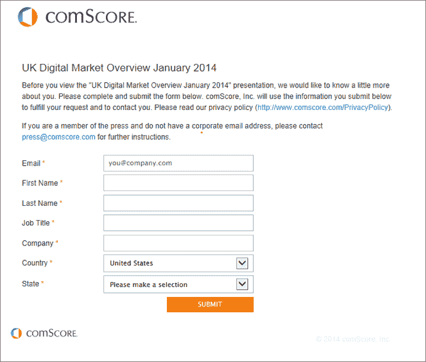
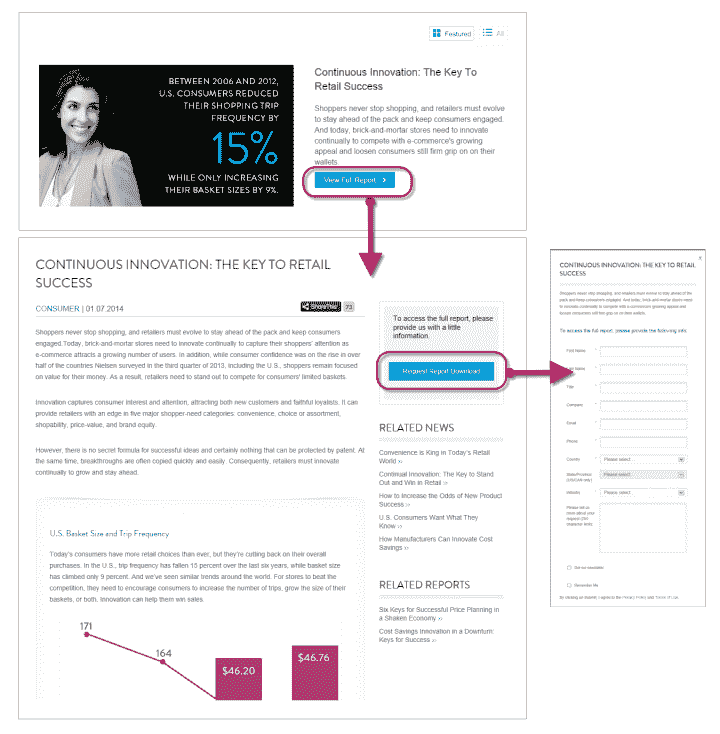
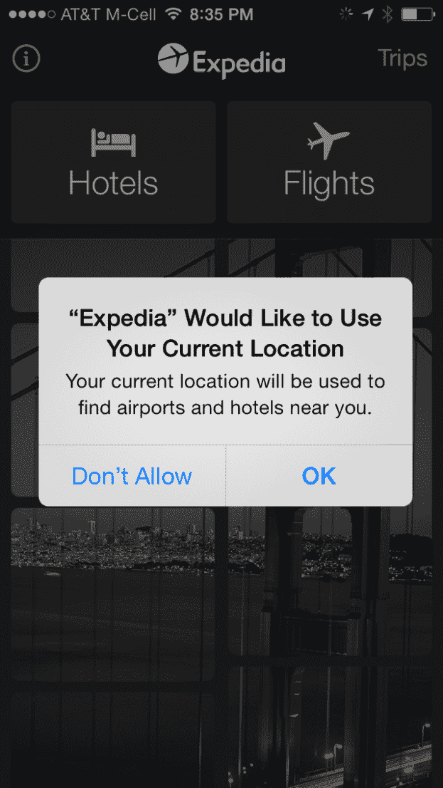
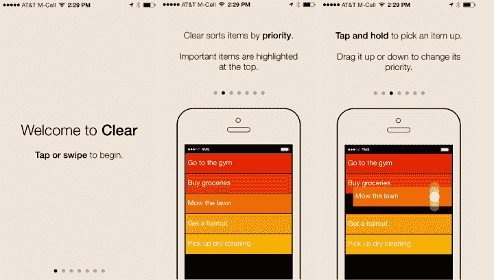

# 互惠原则:在接受网页设计之前先给予

> 原文：<http://www.nngroup.com/articles/reciprocity-principle/?utm_source=wanqu.co&utm_campaign=Wanqu+Daily&utm_medium=website>

在他的书《影响力:科学与实践》中，罗伯特·恰尔迪尼确定了六条影响力原则:

在本文中，我们讨论这个列表中的第一个原则:互惠。

最近，我收到了一家公司寄来的一美元，他们希望我填写一份问卷调查。你猜怎么着？我拿了美元(我还能做什么？)并觉得有义务寄回调查问卷。

这种情况是**互惠原则**在起作用的一个例子。互惠原则是社会心理学的基本法则之一:它说在许多社交场合**我们会回报我们从别人那里得到的东西**。换句话说，如果约翰帮了你的忙，你很可能会回报他。在我的例子中，我得到了美元，因此觉得我必须付出一些东西作为交换(我的时间和信息)。

对互惠的一个简单的进化论解释是，在一群原始人中，表现良好和合作是有回报的:那些遵守这一原则的人可能不太可能有敌人，因此更有可能生存下来并传递他们的基因。

互惠适用于各种情况；企业在广告、营销和宣传中使用它。例如，已经证明免费样品会鼓励人们购买相应的产品，因为他们觉得他们必须回报免费获得的东西。

在用户界面设计中，你也可以利用互惠原则来为你自己(也为你的用户)谋利(参见我们关于网页设计中[可信度和说服力的课程](http://www.nngroup.com/courses/credibility-and-persuasive-web-design))。底线很简单:**在你向用户要求任何东西之前，先给他们一些东西。**

## 免费提供信息

免费内容是来自现实世界的免费样本的数字副本，是互惠原则在网络上的根深蒂固的应用。这就是为什么[时事通讯](http://www.nngroup.com/articles/targeted-email-newsletters/)、[社交媒体内容](http://www.nngroup.com/articles/writing-social-media-facebook-twitter)以及像这样的文章在许多公司都很受欢迎——正如我们自己的研究所证明的那样，当这些来源信息丰富且相关时，用户会很欣赏它们。后来，这些用户更有可能通过与该公司做生意来回报。

许多提供白皮书或其他信息的网站会要求用户[填写表格，然后才能访问感兴趣的内容](https://www.nngroup.com/articles/content-behind-forms/)。这里的想法是，用户将首先为报纸工作(填写表格)，然后他们将从内容中获得回报。comScore(下图)正是采用了这种方法，它要求人们在下载免费报告之前输入他们的信息。

*comScore 要求用户在访问免费报告前输入自己的信息。*

尼尔森公司采取了一种稍微不同的方法。当人们点击*查看完整报告*时，网站不会显示要求用户填写联系信息的表格，而是将他们带到一篇关于该报告的简短文章。用户可以阅读文章，然后他们可以决定是否要填写信息以获得整个报告。(注意，我们并不隶属于尼尔森公司。)

*尼尔森公司让用户阅读一篇关于免费报告的文章。如果他们想下载整个文档，他们需要填写一个联系信息表。*

第二种方法更好。首先，它尊重用户的时间和精力——它允许用户做出更明智的决定，是否要花时间填写表单和加载报告。第二，它也利用了对等法则。用户将很高兴能够阅读摘要，并且更有可能填写信息，因为他们提前得到了一些有趣的东西。但是，即使那些认为报告不适合他们的用户也会欣赏这种诚实的方法，会对尼尔森公司形成积极的印象，并可能在被要求时以同样的方式回报(例如，通过返回网站获取更多信息)。他们也可能更愿意以诚实和有意义的方式填写表格，提供关于他们请求的额外信息，或者提供他们实际使用的电子邮件地址和联系信息。

(我们对 B2B 网站使用的[研究表明，在网站建立信誉之前，当用户遇到过于激进的潜在客户生成表单时，他们会频繁地输入编造的信息。除非你想让你的销售人员给米老鼠打很多电话，否则过早询问用户信息是个坏主意。)](https://www.nngroup.com/articles/b2b-vs-b2c/)

在 2007 年发表的一项研究中，帕多瓦大学的 Luciano Gamberini 和他的同事们调查了这个问题:网络用户填写联系信息以获取免费内容的可能性有多大。Gamberini 有两个类似于 Comcast 和 Nielsen 例子的条件:一个条件是要求用户首先填写表格，然后作为奖励，他们可以访问一组指南。在第二种情况下，用户首先获得指南，然后被要求填写表格。在互惠条件下，用户在联系表中给出的信息比在奖励条件下给出的多。然而，他们更有可能在奖励条件下提交表格。

那是什么意思？如果您决定在用户获得内容之前强制他们填写表单，您可能会获得更多的提交。但是如果你想和你的客户建立有意义的长期关系，那么你最好提前展示至少部分信息，不要要求用户。

## 移动设备上的权限和教程

移动应用和网站也将受益于互惠原则。他们经常要求用户越过[登录墙](http://www.nngroup.com/articles/login-walls/)，阅读复杂的指令，接受当前位置的使用，或者在这些用户收到应用程序提供的哪怕是最轻微的一瞥之前，允许接收通知。以任何类型的请求开始最初的体验都会给用户带来负担，产生怀疑，并使用户不愿意合作。相反，如果应用程序专注于让用户容易立即开始使用，那就更好了。一旦用户发现应用程序的价值，他们将更有可能信任它，并通过接受任何类型的请求来回报。

例如，通常在下载应用程序后，iOS 用户会收到一个警告框，提示他们接受推送通知。不对！在这一点上，用户不知道他们是否喜欢这个应用程序，他们是否会使用它，或者他们将被通知的内容类型是否会以任何方式相关。要求他们接受推送通知太过分了——在这个阶段，用户的第一反应往往是“不”。用户需要首先与应用程序建立关系，看看它是关于什么的，然后她可以决定她可以信任它的推送通知。

*Evernote 在用户有机会使用应用程序之前，会要求用户允许发送推送通知。*

一旦用户浏览了应用程序，你可以问他们是否希望在特定事件中得到通知。(但要尽可能明确，告诉人们他们将被通知什么；否则，你可能会因为用户不需要的通知而惹恼和疏远他们。)
很多 app 在实际需要之前，也会请求使用当前位置的权限。例如，在用户开始搜索之前，Expedia 没有理由在主页上询问当前位置。用户可能需要在不同于自己的位置进行搜索，在不必要的时候询问这些信息会降低他们对应用程序的信任。(尤其是在隐私丑闻不断的今天，用户担心任何窥探问题都是出于邪恶的目的。)

*Expedia 在用户发起搜索之前请求允许使用当前位置。*

只有当用户点击*语音控制*按钮时，Epicurious 才会正确地请求允许使用麦克风。在这种情况下，用户说是是合乎逻辑的，因为很清楚为什么应用程序需要那个许可。如果应用程序在第一个屏幕上就提出要求，在用户有机会形成这个应用程序如何工作的[心理模型](http://www.nngroup.com/articles/mental-models)之前，它会看起来没有必要，应用程序的要求很可能会被拒绝。

*Epicurious 只在需要启用语音控制时才请求允许使用麦克风(也就是说，在用户点击*语音控制*按钮后立即请求)。*

应用程序流行的另一种做法是在首次启动时显示教程。我们可以用一只手的手指数一数，有多少用户在刚刚下载完应用程序后，就已经耐心地看完了这些初始教程。即使教程看起来很有趣(比如漫画阅读器教程，它被设计得像一本漫画书)，用户也没有耐心看完。(如果他们耐着性子听完了，他们也不会记住所有的信息。)如果你必须指导你的用户，使用[快速提示页面](http://www.nngroup.com/articles/mobile-instructional-overlay/)会好得多。但更好的是:不要让你的用户觉得他们必须学习才能使用你的应用。创建一个简单易用的界面，不需要任何指导。这又是互惠原则的一个简单实例:在用户和应用程序的关系中，应用程序应该付出最大的努力，尤其是在开始的时候。

*Clear，一款待办事项 app，从 7 页教程开始。这很糟糕，因为它要求用户提前工作:他们必须耐心地阅读所有信息，并努力记住它们。*

## 结论

互惠原则认为，人们会对友善的行为做出善意的回应。如果你想让你的用户信任你的信息，并不断回来找你，那就预先对他们好，尽量减少他们的互动成本。尽可能少问你的用户。在网络和其他地方，先给予后索取，人们会回报你的。

## 参考

卢西亚诺·甘贝里尼、乔瓦尼·彼得鲁奇、安德里亚·斯波托和安娜·斯帕诺利。2007.获取访问者数据的嵌入式说服策略:在一个业余的、基于知识的网站中比较回报和互惠。第二届国际说服技术会议论文集。

