# 最好的图标是文本标签——托马斯·字节贝尔

> 原文：<http://thomasbyttebier.be/blog/the-best-icon-is-a-text-label?utm_source=wanqu.co&utm_campaign=Wanqu+Daily&utm_medium=website>

# 最好的图标是文本标签

以前我写过清晰是优秀界面最重要的特征。现在来说说图标。它们是许多用户界面的重要组成部分。事实是:通常情况下，他们打破了清晰。

自从人类早期以来，象形文字就一直在使用。它们通常被视为书面语言的第一种表达方式。一些不识字的文化今天仍然使用它们作为主要的书面交流媒介。

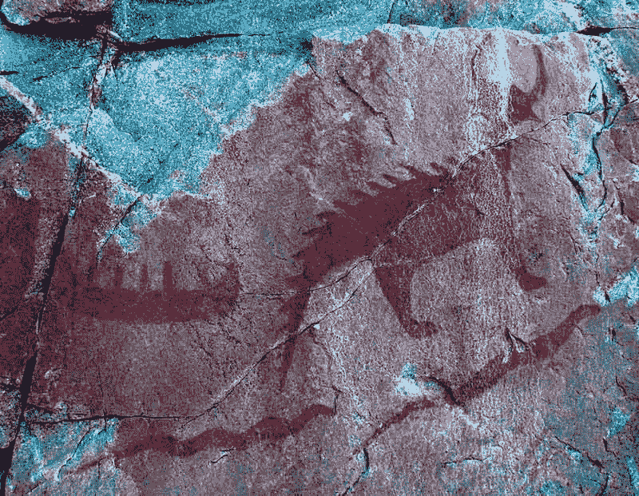

在许多公共场所，它们被用来寻路。特别是在像机场这样的多元文化环境中，传统的书面语言是不够的。

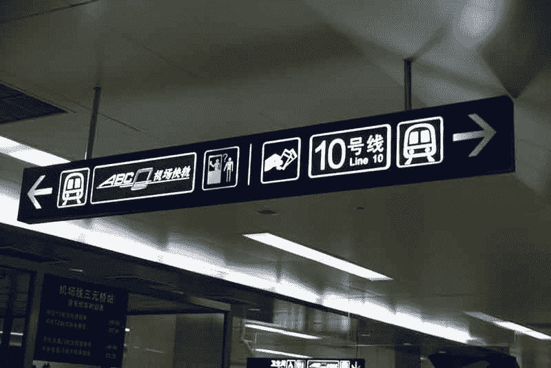

图标也很快在用户界面设计中流行起来。看看这张桌面电脑上第一个商业图形用户界面的照片(施乐之星)。设计师大卫·史密斯发明了图标和桌面隐喻的概念:

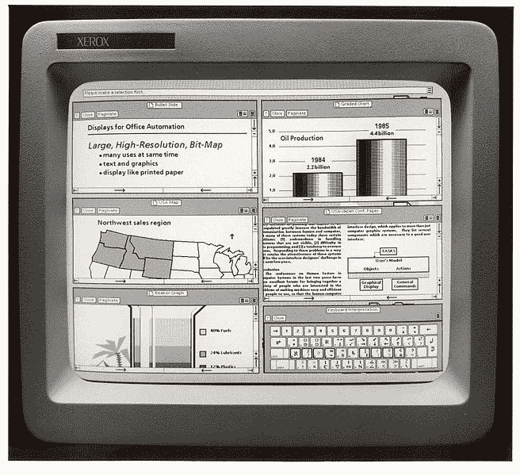

当然，我明白为什么图标在用户界面中变得流行。首先，它们使用户界面在图形上更令人愉快。如果做得好，它们肯定能给你的应用程序带来视觉个性。这是两件好事。

此外，图标通常可以代替一长串描述性的单词。随着屏幕变得越来越小，这很受欢迎。但是这里存在设计陷阱，因为大多数图标是不清楚的。它们让人思考。不清楚有漂亮的界面有什么好？因此很简单:只有当图标的信息对每个人来说都是 100%清楚的时候，才使用它。永远不要屈服。

(不清楚的图标让我想起了最近在 Twitter 上发布的这张搞笑图 [Ron](https://twitter.com/TechnicallyRon/status/570965607971209216) 。我猜有人对这些不可读的洗涤图标感到沮丧…)

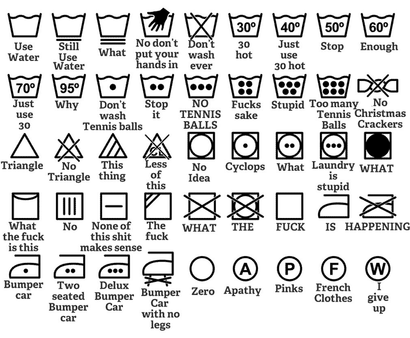

在与客户讨论图标的使用时，我经常听到这样的评论:“人们会每天使用我们的软件，他们很快就会了解我们的图标的含义。”有道理，但我不确定这是否完全正确。我一天要用几次苹果邮件，但在撰写新邮件时，我仍然不确定该点击哪个图标:

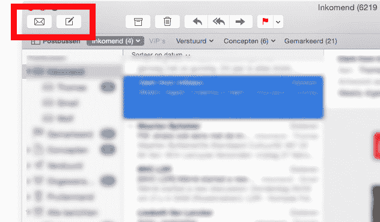

我还有更坏的消息:用户会避开他们无法理解的界面元素。不信任未知是我们的天性。当谷歌决定将其他应用程序隐藏在 Gmail 用户界面中一个不清楚的图标后面时，他们显然收到了一连串的支持请求，比如“我的谷歌日历在哪里？”

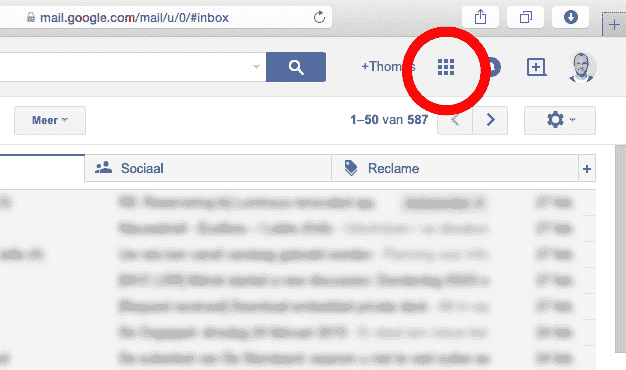

另一个例子:经过重新设计后，新的 Twitter 用户似乎不明白他们应该做什么。图标仅仅是[不够清晰](http://99designs.com/designer-blog/2014/01/15/7-unbreakable-laws-of-user-interface-design/):

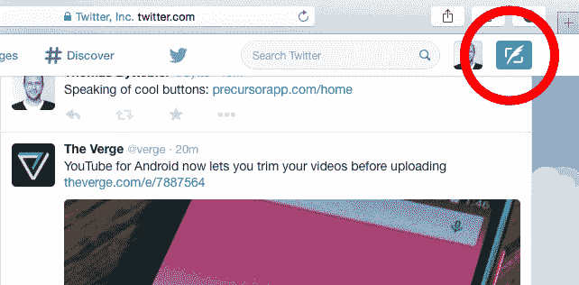

后来的版本让推特变得更加明显:

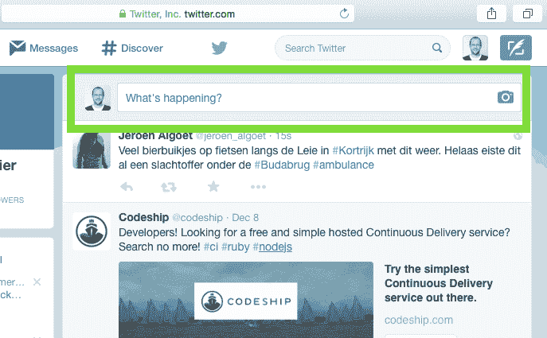

您知道吗，您可以直接向 Instagram 好友发送私人照片信息？在这个象形图后面:

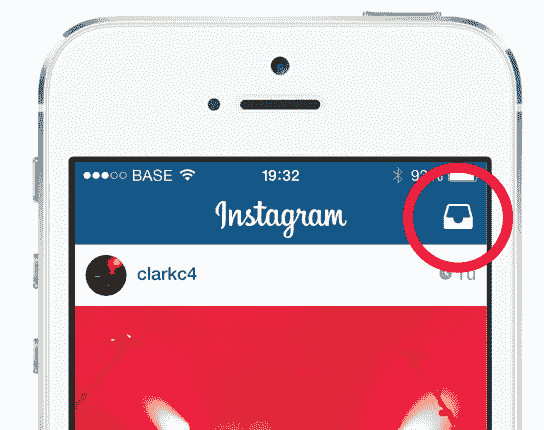

嗯……作为 Instagram 用户，你可能以前见过，但你用过吗？不清楚。这是什么意思？

当然，使用图标时，上下文也很重要。一些清晰的象形图在不同的上下文中变得模糊不清。小心点。打开 Gmail 电子邮件对话时，您会看到以下内容。看到这两个图标非常相似，但却有不同的含义了吗？

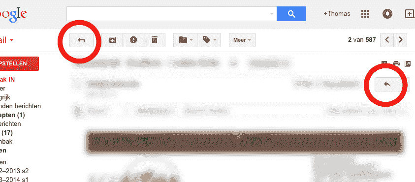

我肯定不止一次收到我的收件箱，当时我只想回复一封邮件。背景很重要。

对我们中的一些人来说，Tweetbot 的图标可能看起来不清楚，但在 Twitter 的上下文中它们是清楚的。Tweetbot 用户是 Twitter 用户，他们会识别这些，所以在我看来可以在这里使用它们:

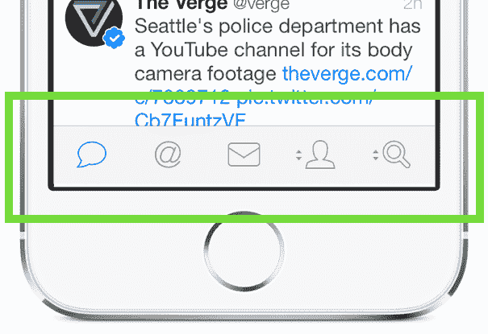

Tumblr iOS 应用也是如此。其中一些图标对我们大多数人来说可能看起来很奇怪，但在 Tumblr 的上下文中却非常清晰。它的用户会认识到这些。

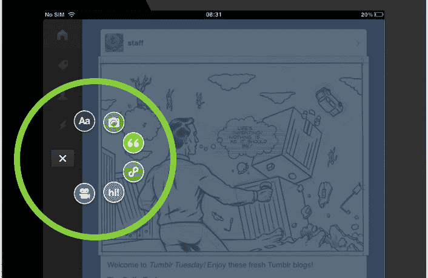

Rdio Mac 应用程序如下所示:

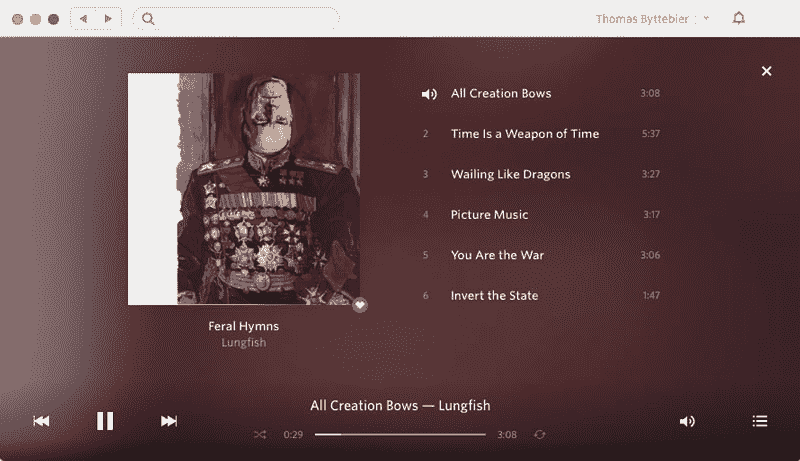

这里使用的大多数图标在音乐播放器的上下文中是清晰的。(奇怪的是，一个图标有两种含义:音量和当前播放的歌曲。)

所以让我重复一遍:不要使用一个图标，如果它的意思不是 100%清楚的话。如有疑问，跳过图标。驻留到简单副本。文本标签总是更清晰。

如果你想保留图标的图形优势，当然可以把图标和文案结合起来。这是一个极好的解决方案，结合了两个世界的精华。

Mac App Store 正是这么做的。这里几乎是强制性的，因为图标本身是完全不清楚的:

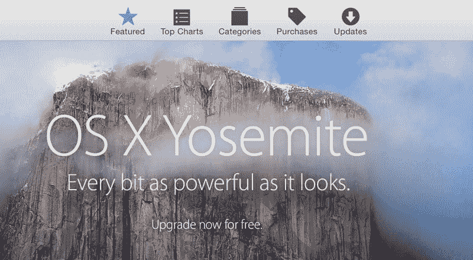

这也是 Twitter 在他们的网络界面上做的事情:

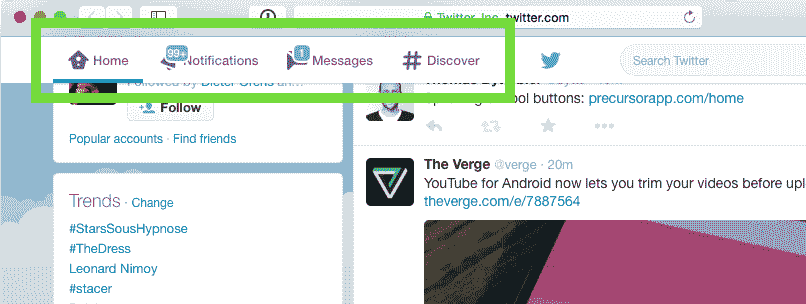

让我们看看脸书的最后一个例子:他们最近放弃了不清晰的汉堡菜单图标，转而使用了结合图标和清晰文本的无摩擦导航。干得好:

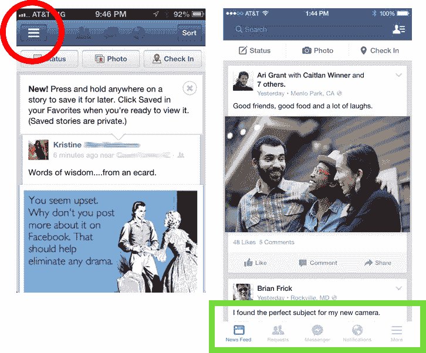

我希望所有这些都清楚地表明，图标很容易打破一个好的用户界面最重要的特征:清晰。所以要非常小心，并且要测试！如果有疑问，请记住:最好的图标是文本标签。

