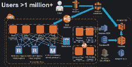

# 在亚马逊的 AWS 上扩展到 1100 万以上用户的初学者指南-高可扩展性-

> 原文：<http://highscalability.com/blog/2016/1/11/a-beginners-guide-to-scaling-to-11-million-users-on-amazons.html?utm_source=wanqu.co&utm_campaign=Wanqu+Daily&utm_medium=website>

如何将一个系统从一个用户扩展到超过 1100 万个用户？亚马逊网络服务解决方案架构师 Joel Williams 就这个主题做了一次精彩的演讲: [AWS re:Invent 2015 扩大到你的第一个 1000 万用户](https://www.youtube.com/watch?v=vg5onp8TU6Q&list=PLhr1KZpdzukdRxs_pGJm-qSy5LayL6W_Y)。

如果你是 AWS 高级用户，这个演讲不适合你，但如果你是 AWS 新手，云新手，或者你没有跟上亚马逊不断推出的新功能，这是一个很好的入门方式。

正如你所料，因为这是亚马逊的演讲，亚马逊服务总是作为任何问题的解决方案的核心。他们的舞台剧令人印象深刻，很有教育意义。很明显，从各个部分是如何组合在一起的来看，亚马逊已经做了很好的工作，找出用户需要什么，然后确保他们在那个领域有产品。

一些有趣的收获:

*   从 SQL 开始，仅在必要时转移到 NoSQL。
*   一个一致的主题是将组件分离出来。这允许这些组件独立扩展和失效。它适用于分解层和创建微服务。
*   只投资那些让你与众不同的业务，不要重新发明轮子。
*   可伸缩性和冗余不是两个独立的概念，您通常可以同时做到这两者。
*   没有提到成本。这将是一个很好的补充，因为这是对 AWS 解决方案的主要批评之一。

## 基础知识

## 1 个用户

## 垂直缩放

*   你需要一个更大的盒子。最简单的缩放方法是选择更大的实例类型。也许一个[c4.8x large](http://docs.aws.amazon.com/AWSEC2/latest/UserGuide/c4-instances.html)或者[m 3.2x large](https://aws.amazon.com/ec2/instance-types/)之类的。

*   这种方法叫做。

*   只需停止您的实例并选择新的实例类型，您就能以更大的能力运行。

*   有多种不同的硬件配置可供选择。您可以拥有一个 244 gig RAM 的系统(2TB 的 RAM 类型即将推出)。或者 40 核的。存在高 I/O 实例、高 CPU 实例、高存储实例。

*   一些亚马逊服务带有一个 [配置的 IOPS](http://serverfault.com/questions/580568/amazon-how-do-i-know-if-i-need-provisioned-iops) 选项来保证性能。这个想法是，你也许可以为你的服务使用一个较小的实例类型，并利用 Amazon 服务，比如 DynamoDB，它可以提供可伸缩的服务，这样你就不必这么做了。

*   垂直扩展有一个大问题:没有故障转移，没有冗余。如果实例有问题，您的网站将会死亡。你所有的鸡蛋都放在一个篮子里。

*   最终单个实例只能得到这么大。你需要做些别的事情。

## 用户> 10

*   将单个 主机分离成多个主机

    *   网站的一台主机。

    *   一台主机用于数据库。运行您想要的任何数据库，但是您被数据库管理所困扰。

    *   使用独立的主机允许网站和数据库彼此独立地扩展。例如，您的数据库可能需要比您的网站更大的机器。

*   或者，你可以使用数据库服务，而不是运行你自己的数据库。

    *   你是数据库管理员吗？您真的想担心备份吗？高可用性？补丁？操作系统？

    *   使用服务的一大优势是，只需点击一下，您就可以设置多可用性区域数据库。你不必担心复制或任何类似的事情。您的数据库将是高度可用和可靠的。

*   正如你可能想象的那样，亚马逊有几种完全托管的数据库服务出售给你:

    *   [亚马逊 RDS](https://aws.amazon.com/rds/) (关系数据库服务)。有很多选择:微软 SQL Server，Oracle，MySQL，PostgreSQL，MariaDB，亚马逊 Aurora。

    *   [亚马逊 DynamoDB](https://aws.amazon.com/dynamodb/) 。NoSQL 管理的数据库。

    *   [亚马逊红移](https://aws.amazon.com/redshift/) 。一个 Pb 级数据仓库系统。

*   更 [亚马逊极光](https://aws.amazon.com/rds/aurora/) :

    *   自动存储扩展至 64TB。您不再需要为您的数据调配存储。

    *   多达 15 个读取读取副本

    *   到 S3 的连续(增量)备份。

    *   跨 3 个 az 的 6 向复制。这有助于你处理失败。

    *   兼容 MySQL。

*   从 SQL 数据库而不是 NoSQL 数据库开始。

    *   建议从 SQL 数据库开始。

    *   技术确立。

    *   有很多现有的代码、社区、支持团体、书籍和工具。

    *   你不会用你的第一个 1000 万用户来破坏一个 SQL 数据库。差远了。(除非你的数据量很大)。

    *   明确模式的可扩展性。

*   什么时候你可能需要从 NoSQL 数据库开始？

    *   如果您需要在第一年存储> 5 TB 的数据，或者您有难以置信的数据密集型工作负载。

    *   您的应用具有超低延迟要求。

    *   你需要真正的高吞吐量。您需要真正调整读取和写入时获得的 io。

    *   您没有任何关系数据。

## 用户> 100

*   为 web 层 使用一个 单独的主机。

*   在亚马逊 RDS 上存储 数据库。它会处理好一切。

*   这就是你要做的一切。

## 用户> 1000

*   根据设计，您的应用程序存在可用性问题。如果您的 web 服务的主机出现故障，那么您的网站就会关闭。

*   所以您 需要另一个可用区域 中的另一个 web 实例。这没关系，因为 az 之间的延迟在较低的一位数毫秒内，几乎就像它们紧挨着一样。

*   你还需要一个 从数据库到运行在另一个 AZ 的 RDS 。如果主服务器有问题，你的应用程序会自动切换到从服务器。故障转移时不需要更改应用程序，因为您的应用程序总是使用相同的端点。

*   一个弹性负载平衡器(ELB)被添加到配置中，以在两个 az 中的两个 web 主机实例之间平衡用户负载。

*   弹性负载均衡器(ELB):

    *   ELB 是一款高度可用的托管负载平衡器。ELB 存在于所有的 az 中。它是应用程序的单一 DNS 端点。只要把它放在 Route 53 中，它就会在您的 web 主机实例之间实现负载平衡。

    *   ELB 进行健康检查，确保流量不会流向故障主机。

    *   不需要你做任何事，它就可以扩展。如果看到额外的流量，它会在幕后进行水平和垂直扩展。你不用管它。随着应用程序的扩展，ELB 也会随之扩展。

## 用户> 1 万- 10 万

*   之前的配置在 ELB 后有 2 个实例，实际上在 ELB 后可以有 1000 个实例。这就是。

*   您需要向数据库和 RDS 添加更多读取副本。这将减轻写主机的负载。

*   考虑性能和效率，通过 将一些流量转移到其他地方来减轻 web 层 服务器的负载。将 web 应用中的静态内容转移到亚马逊 S3 和亚马逊 CloudFront。CloudFront 是亚马逊的 CDN，在全球 53 个边缘位置存储你的数据。

*   亚马逊 S3 是一个基于对象的商店。

    *   与 EBS 不同，它不是附加到 EC2 实例的存储，而是对象存储，而不是块存储。

    *   这是一个存储静态内容的好地方，比如 javascript、css、图像、视频。这种内容不需要放在 EC2 实例上。

    *   高度耐用，11 个 9 的可靠性。

    *   无限扩展，想扔多少数据就扔多少。客户在 S3 存储数 Pb 的数据。

    *   支持最大 5TB 的对象。

    *   支持加密。您可以使用亚马逊的加密、您的加密或加密服务。

*   Amazon CloudFront 是您内容的缓存。

    *   它在边缘位置缓存内容，为您的用户提供尽可能低的访问延迟。

    *   如果没有 CDN，您的用户在访问您的内容时将会经历更长的延迟。您的服务器也将承受更高的负载，因为它们在提供内容服务的同时也在处理 web 请求。

    *   一位客户需要以 60 Gbps 的速率提供内容。web 层甚至不知道发生了什么，CloudFront 处理了这一切。

*   您还可以通过将会话状态从 web 层转移出来来减轻负载。

*   您还可以通过将数据库中的数据缓存到 ElastiCache 来减轻负载。

*   亚马逊 dynamo db——一个托管的 NoSQL 数据库

    *   您可以提供您想要的吞吐量。你拨出你想要支付的读写性能。

    *   支持快速、可预测的性能。

    *   完全分布式和容错。它存在于多个可用性区域中。

    *   这是一个键值商店。支持 JSON。

    *   支持最大 400KB 的文件。

*   Amazon elastic cache——托管 Memcached 或 Redis

    *   管理一个 memcached 集群并不能让你赚更多的钱，所以让 Amazon 来帮你做吧。这就是音高。

    *   聚类会自动缩放。这是一种自我修复的基础架构，如果节点出现故障，新节点会自动启动。

*   您也可以通过将动态内容转移到 CloudFront 来减轻负载。

    *   很多人都知道 CloudFront 可以处理静态内容，比如文件，但它也可以处理一些动态内容。这个话题在谈话中不再进一步讨论，但这里有的一个环节。

*   例如，如果你提供足够的容量来应对黑色星期五这样的高峰流量，那你就是在浪费金钱。让计算能力与需求相匹配会更好。这就是自动扩展让你做到的，自动调整计算集群的大小。

*   您可以定义池的最小和最大大小。作为用户，您可以决定集群中的最小实例数和最大实例数。

*   [CloudWatch](https://aws.amazon.com/cloudwatch/) 是一种嵌入到所有应用中的管理服务。

    *   CloudWatch 事件推动规模扩大。

    *   您是否打算扩展 CPU 利用率？您会扩展延迟吗？在网络流量上？

    *   您也可以将自己的定制指标推送到 CloudWatch。如果您想根据特定应用进行扩展，您可以将该指标推入 CloudWatch，然后告诉 Auto Scaling 您想根据该指标进行扩展。

## 用户> 50 万+

*   从之前的配置添加的是 [自动缩放组](http://docs.aws.amazon.com/gettingstarted/latest/wah/getting-started-create-as.html) 被添加到 web 层 。“自动缩放”组包括两个 az，但可以扩展到 3 个 az，最多可达同一区域中的数量。实例可以在多个 az 中弹出，这不仅是为了可伸缩性，也是为了可用性。

*   该示例在每个 AZ 中有 3 个 web 层实例，但也可能有数千个实例。您可以说您想要最少 10 个实例，最多 1000 个实例。

*   ElastiCache 用于从数据库中卸载流行的读取。

*   DynamoDB 用于卸载会话数据。

*   您需要添加监控、指标和日志记录。

    *   主机级指标。查看自动扩展组中的单个 CPU 实例，并找出问题所在。

    *   汇总级别指标。查看弹性负载平衡器上的指标，感受整个实例集的性能。

    *   日志分析。使用[cloud watch](https://aws.amazon.com/about-aws/whats-new/2014/07/10/introducing-amazon-cloudwatch-logs/)日志，看看应用程序告诉你什么。[cloud trail](https://aws.amazon.com/cloudtrail/)帮助你分析管理日志。

    *   外部现场表现。了解您的客户作为最终用户看到了什么。使用类似 New Relic 或 Pingdom 的服务。

*   你需要知道你的顾客在说什么。他们的潜伏期很长吗？当他们访问你的网页时，会得到一个错误吗？

*   从您的配置中获取尽可能多的性能。自动缩放可以对此有所帮助。您不想要 CPU 利用率为 20%的系统。

## 自动化

*   基础设施越来越大，可以扩展到数千个实例。我们有读取副本，我们有水平扩展，但我们需要一些自动化来帮助管理这一切，我们不想管理每个单独的实例。

*   自动化工具有等级之分。

    *   自己动手 :亚马逊 EC2，AWS CloudFormation。

    *   更高层次的服务 : AWS 弹性豆茎、AWS OpsWorks

*   [AWS 弹性豆茎](https://aws.amazon.com/elasticbeanstalk/) :自动为你的应用管理基础设施。这很方便，但没有太多的控制。

*   [AWS OpsWorks](https://aws.amazon.com/opsworks/) :一个你分层构建应用的环境，你使用 Chef recipes 来管理应用的各层。

*   [AWS cloud formation](https://aws.amazon.com/cloudformation/):存在时间最长。

    *   提供最大的灵活性，因为它提供了堆栈的模板化视图。它可用于构建整个堆栈或只是堆栈的组件。

    *   如果你想更新你的堆栈，你更新云形成模板，它将只更新你的应用程序的一部分。

    *   很多控制，但不太方便。

*   [AWS code deploy](https://aws.amazon.com/codedeploy/):将您的代码部署到 EC2 实例群中。

    *   可以部署到一个或数千个实例。

    *   代码部署可以指向自动扩展配置，因此代码被部署到一组实例。

    *   也可以配合厨师和木偶使用。

## 解耦基础设施

*   使用[SOA](https://en.wikipedia.org/wiki/Service-oriented_architecture)/[微服务](http://techblog.netflix.com/2015/02/a-microscope-on-microservices.html) 。从您的层中取出组件，并将它们分离出来。 创建单独的服务 就像您将 web 层与数据库层分离时一样。

*   然后，单个服务可以独立扩展。这为您的扩展和高可用性提供了很大的灵活性。

*   SOA 是亚马逊构建的架构的关键组成部分。

*   松散耦合让你自由。

    *   您可以独立地对组件进行扩展和故障排除。

    *   如果一个工人节点从 SQS 拉取工作失败，这有关系吗？不，再开始一个。事情会失败，让我们建立一个处理失败的架构。

    *   把一切都设计成一个黑盒子。

    *   解耦交互。

    *   支持具有内置冗余和可伸缩性的服务，而不是构建自己的服务。

## 不要多此一举

*   只投资那些能让你的业务与众不同的任务。

*   亚马逊有很多服务天生具有容错能力，因为它们跨越了多个 az。例如:排队、电子邮件、代码转换、搜索、数据库、监控、指标、日志、计算。您不必自己构建这些。

*   :排队服务。

    *   亚马逊提供的第一项服务。

    *   它跨越多个 az，因此具有容错能力。

    *   它可扩展、安全且简单。

    *   通过帮助您在基础设施的不同组件之间传递消息，排队可以帮助您的基础设施。

    *   以照片 CMS 为例。收集和处理照片的系统应该是两个不同的系统。它们应该能够独立扩展。它们应该是松散耦合的。摄取一张照片，将其放入队列，工作人员可以将照片从队列中取出并对其进行处理。

*   [AWS Lambda](https://aws.amazon.com/lambda/) :让你不用配置或管理服务器就能运行代码。

    *   一个伟大的工具，允许你分离你的应用程序。

    *   在 Photo CMS 示例中，Lambda 可以响应 S3 事件，因此当添加 S3 文件时，要处理的 Lambda 函数会自动触发。

    *   我们已经废除了 EC2。它可以为您横向扩展，并且无需管理任何操作系统。

## 用户>100 万+

*   达到 100 万及以上的用户需要上述所有要点:

    *   多 AZ

    *   各层之间的弹性负载平衡。不仅在 web 层，而且在应用层、数据层和您拥有的任何其他层。

    *   自动缩放

    *   面向服务的架构

    *   借助 S3 和 CloudFront 巧妙提供内容

    *   将缓存放在数据库前面

    *   将状态移出 web 层。

*   使用 [亚马逊 SES](https://aws.amazon.com/ses/) 发送邮件。

*   使用 CloudWatch 进行监控。

## 用户>1000 万+

*   随着我们的规模越来越大，我们会遇到数据层的问题。围绕与 [写主机](https://en.wikipedia.org/wiki/Multi-master_replication) 的争用，您可能会开始遇到数据库问题，这基本上意味着您只能向一个服务器发送这么多写流量。

*   你是怎么解决的？

*   联合-根据功能拆分成多个数据库

    *   例如，创建一个论坛数据库、一个用户数据库、一个产品数据库。以前，您可能将这些放在一个数据库中，现在将它们分散开来。

    *   不同的数据库可以彼此独立地扩展。

    *   缺点:你不能跨数据库查询；它延迟了下一个策略，即分片。

*   分片——将一个数据集分割到多个主机上

    *   在应用层更复杂，但在可伸缩性上没有实际限制。

    *   例如，在用户数据库中，用户的⅓可能被发送到一个分片，最后三分之一被发送到另一个分片，而另一个分片又被发送到另一个分片。

*   将一些功能转移到其他类型的数据库

    *   开始考虑一个 NoSQL 数据库。

    *   如果您的数据不需要复杂的连接，比如排行榜、点击流/日志数据的快速接收、临时数据、热门表、元数据/查找表，那么可以考虑将其移动到 NoSQL 数据库。

    *   这意味着它们可以彼此独立扩展。

## 用户>1100 万

*   缩放是一个迭代过程。随着你变得越来越大，你可以做的事情也越来越多。

*   微调您的应用程序。

*   更多特性/功能的 SOA。

*   从多 AZ 到多地区。

*   开始构建定制的解决方案来解决你的特殊问题，这是前所未有的。如果你需要服务十亿客户，你可能需要定制解决方案。

*   深入分析您的整个堆栈。

## 在审查中

*   使用多 AZ 基础设施提高可靠性。

*   利用 ELB、S3、SQS、社交网站、DynamoDB 等可自我扩展的服务。

*   在每一层都建立冗余。可伸缩性和冗余不是两个独立的概念，您通常可以同时做到这两者。

*   从传统的关系 SQL 数据库开始。

*   缓存基础设施内外的数据。

*   在您的基础设施中使用自动化工具。

*   确保你有好的指标/监控/记录。请确保您正在了解您的客户对您的应用程序的体验。

*   将层分割成单独的服务(SOA ),这样它们就可以彼此独立地扩展和失败。

*   一旦准备好，就使用自动缩放。

*   不要重新发明轮子，使用托管服务而不是自己编码，除非绝对必要。

*   如果有必要，搬到 NoSQL 去。

## 延伸阅读