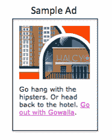

# 甲板:一个迷人的广告平台——loo . me

> 原文：<http://loo.me/2010/03/the-deck/?utm_source=wanqu.co&utm_campaign=Wanqu+Daily&utm_medium=website>

 本周我在 SXSW 上了解到一个有趣的广告网络，叫做 [The Deck](http://decknetwork.net/) 。他们以不同的方式做一件事，并对其他所有事情产生重大影响:他们摆脱了 CPM。通过 1000 英镑出售广告是平面媒体和电视时代的遗留物，当时公司希望将广告与发行量和收视率挂钩。Deck 的做法与众不同。

如果你看看广告销售的三个组成部分:出版商(网站)、读者和广告商。CPM 只对广告商有利。有了 CPM，出版商可以优化他们的网站页面浏览量。这导致将故事分割成 3 页，制作图片库，缺乏 ajax，或者其他导致更多页面浏览量而牺牲用户享受的手段。通常情况下，当网站开始专注于赚钱时，对读者来说会变得更糟，而不是更好。

[甲板](http://decknetwork.net/)是一个广告网络。他们代表两家出版商(Twitteriffic、[、Daring Fireball](http://daringfireball.net/) 等)。)和广告商(Rackspace、Gowalla、KickApps 等。).他们主观地审查他们两个。还具有以下规则:

1.  他们只会代表某一类型的网站。在这种情况下，它的网站侧重于设计或技术
2.  他们只会投放他们喜欢或认可的产品的广告
3.  然后，他们将在每页上只放置一个相同大小和格式的广告。他们按月向广告商收取费用，并与出版商签订年度合同。
4.  他们的广告有多达 80 个字符和一个图像

 有用吗？绝对的。广告商和出版商都超额认购了。即使广告商得到的印象更少，但效果更好。因此，10 个广告客户中有 7 个月又回来了。出版商有了更有吸引力、更整洁的网站，不再需要担心追逐网页。当然，他们想要一个受众，而且越大越好，但是不管是每个用户 3 次页面浏览还是 10 次，这都不重要

《勇敢的火球》的作者讲述了他使用谷歌广告而不是 Deck 的故事。就收入而言，有一段时间他最成功的一篇文章是把某个设计比作男人的假发。他发现他文章旁边的所有谷歌广告都与男士假发有关。他还发现，男士假发关键词的价格非常高，他在这个页面上赚的钱是其他页面的 7 倍。这对他来说很麻烦，因为当他写文章时，他开始考虑哪些词对谷歌有价值，而不是他的读者想要什么。他的收入(和利益)与广告商和读者都保持了适当的一致。

Deck 是一个围绕广告网络进行创新的有趣例子。我觉得这很有趣，因为我也不喜欢 CPM。但是，它能扩展到其他非设计/技术领域吗？也许吧。我认为它要求读者聪明并且(有点)富裕。所以我可以看到旅游或汽车也有类似的广告网络。但之后会变得更难。

T2】