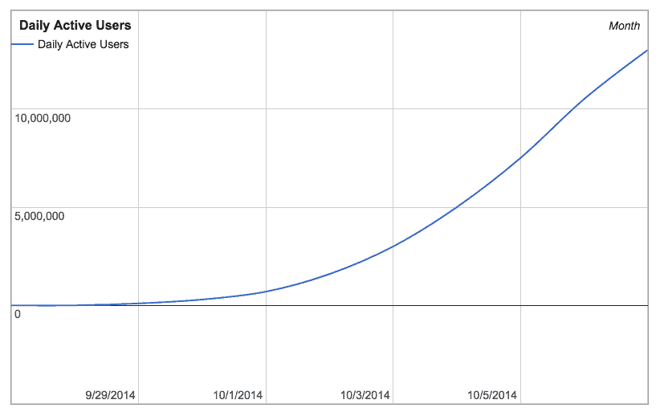
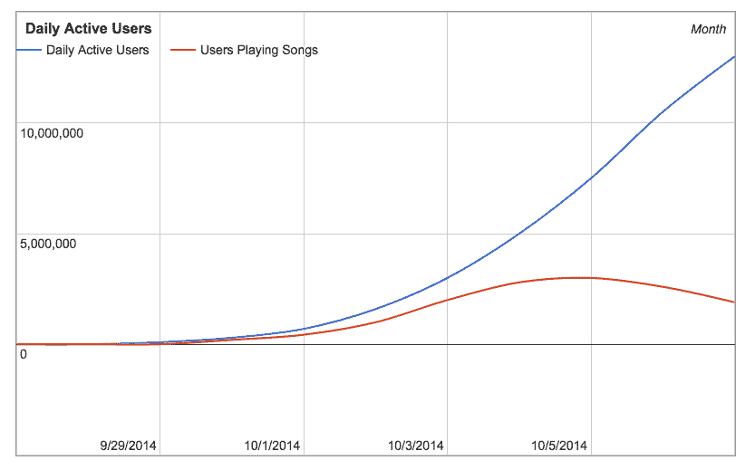
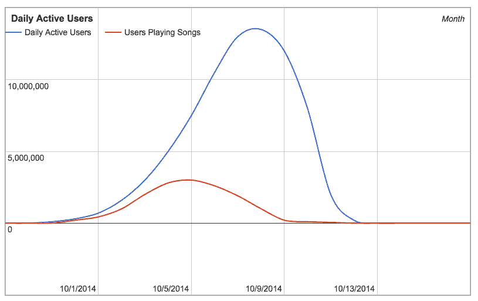
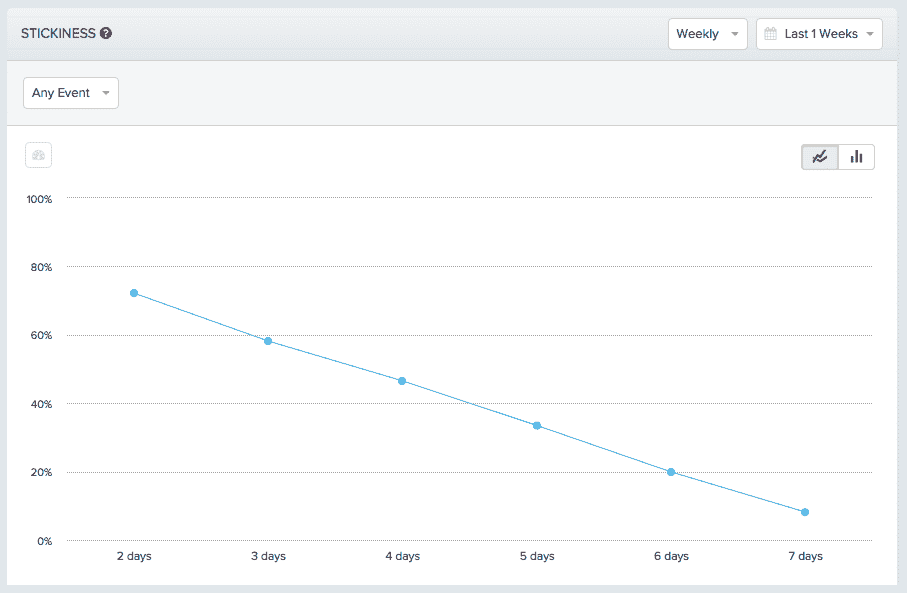
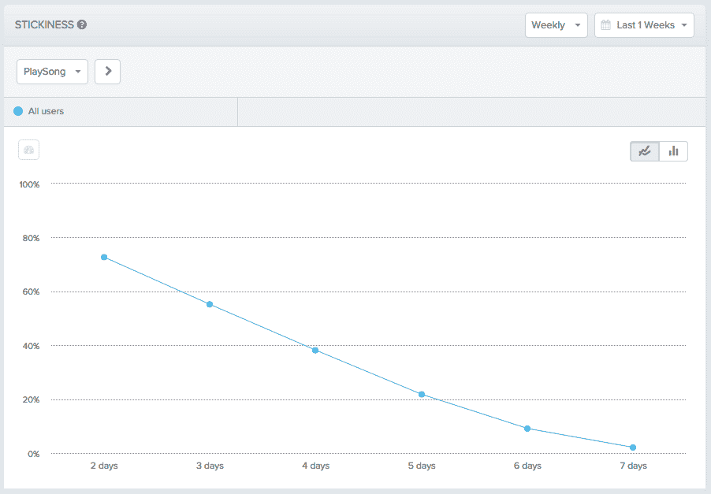
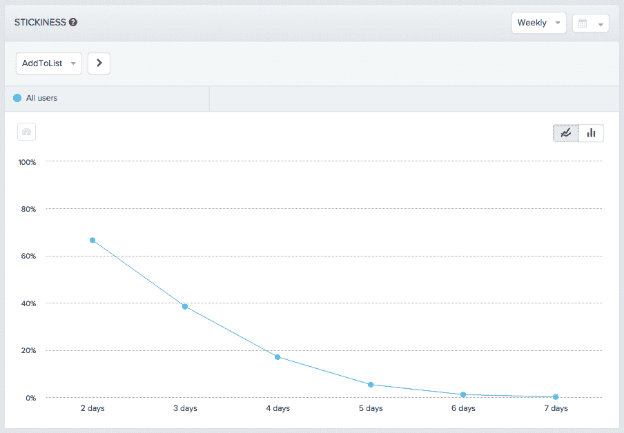
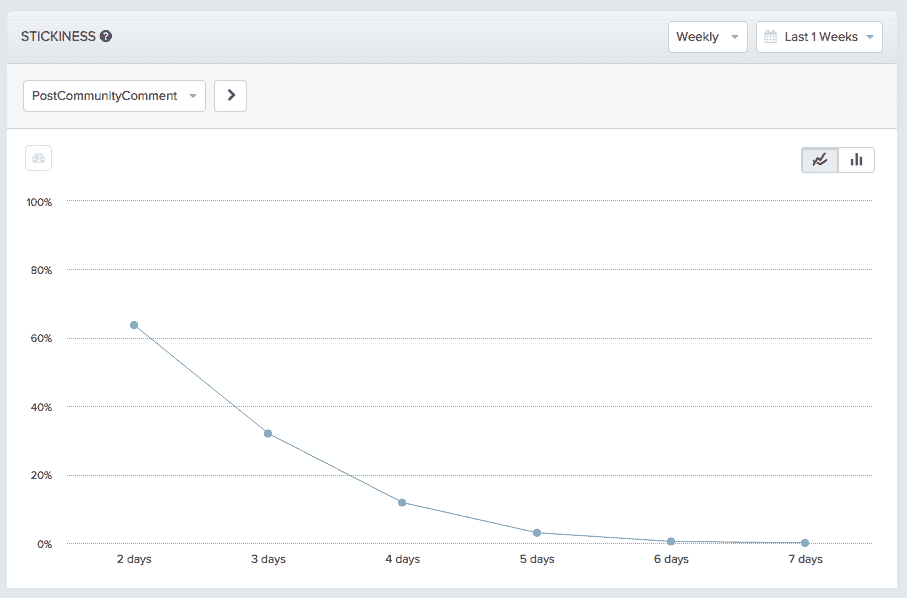
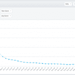
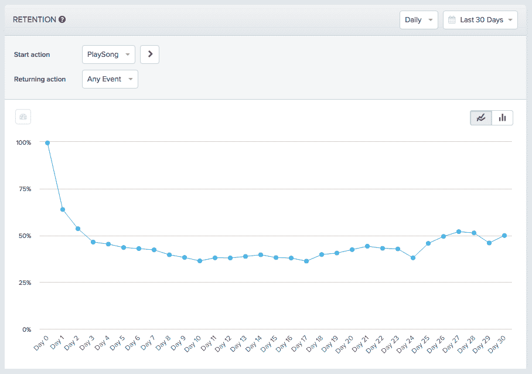
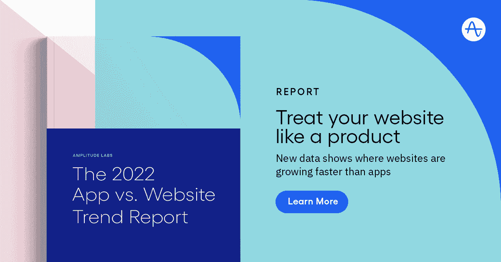

# 你对每日活跃用户的衡量是错误的

> 原文：<https://amplitude.com/blog/2016/01/14/measuring-active-users/?utm_source=wanqu.co&utm_campaign=Wanqu+Daily&utm_medium=website>

如果你还没有停止关心[虚荣指标](https://medium.com/@joshelman/the-only-metric-that-matters-ab24a585b5ea#.145fkhyew)——独特的浏览量、应用下载量、注册量等等。—你应该。

很多企业家都有。他们已经阅读了精益创业公司，或者听说了脸书的“10 天 7 个朋友”增长黑客，他们已经开始关注每日活跃用户(DAU)等指标。

DAU 有两个问题:

*   不可诉。面对下跌的 DAU，你什么也做不了，除了想知道哪里出了问题，反之亦然。
*   它很容易操作。每家发布 DAU 数据的公司都以不同的方式计算，这使得这些数据实际上甚至无法用于应用程序之间的比较。

当脸书在一天之内达到 10 亿活跃用户时，每一个科技博客都争相报道。但是根据脸书的招股说明书，你甚至不需要[离脸书](https://dealbook.nytimes.com/2012/02/06/those-millions-on-facebook-some-may-not-actually-visit/)很近就能被算作“用户”你所要做的就是与他们的第三方集成互动，这可能意味着任何事情，从点击 ESPN 文章上的一个小小的蓝色拇指，或者在 Spotify 上分享一首歌。

这也指出了衡量“活跃用户”的真正问题。主动是一个在功能上没有意义的词。它是你想要的任何东西。

要真正改进你的产品，让它变得非常有粘性，你需要将你对“活跃”的定义与你的增长目标联系起来:弄清楚什么样的活动和特征会导致用户的保留，然后围绕这些活动和特征建立你的活跃用户概念。否则，你可能会遇到严重的问题。

> 你需要把你对“积极”的定义和你的成长目标联系起来。

在我们真正进入之前，让我们对每日活跃用户的定义达成一致。

## 什么是日活跃用户？

每日活跃用户(DAU)是在给定的一天内以某种方式使用 web 或移动产品的用户总数。在大多数情况下，要被认为是“活跃的”，用户只需查看或打开产品。网络和移动应用业务通常将 DAU 视为增长或参与度的主要衡量标准。

月活跃用户(MAU)是一个月内每日活跃用户的总和。在大多数情况下，要被视为“每月活跃用户”，一个人必须在一个月内至少打开或查看一个应用程序一次。DAU/MAU 比率通常是衡量互联网产品“粘性”的指标。

## 为什么依赖你的 DAU 是危险的

假设你几天前把你的社交音乐播放应用放到了应用商店。增长缓慢而稳定，直到几个科技博客发现你的应用程序，并开始谈论它有多棒——突然间你每小时获得数千次下载。

然后有一天早上你醒来，收到一封来自苹果公司的电子邮件:他们将在应用程序商店中展示你！事情再好不过了。

为了了解你的应用增长有多快，你决定测量你的日活跃用户数。你对“活跃”的定义是你对某一天登录的任何人的用户活跃度的测量。生成的图形可能如下所示:

是时候开香槟庆祝了，对吧？

嗯，不一定。你刚刚推出，得到了媒体的关注，并得到了特写。如果用户只需下载你的应用并打开一次，那么随着注册量的增加，你的“活跃用户”肯定会增加——人们很好奇，下载应用是一种低摩擦的交易，零承诺。

用登录次数这样的简单指标来定义你的“活跃用户”的危险在于，你只是看到了媒体和炒作的反映。它不会衡量你的应用程序的实际使用情况。

> 下载一个 app 是低摩擦的交易，零承诺。

当你的 DAU 飙升时，播放歌曲的人数却没有。人们下载你的应用程序并登录，但大多数人并没有真正按照预期的方式使用它。如果你只关注你的 DAU，你会忽略一个事实，那就是实际使用正在下降——你不会听到你的应用程序的煤矿里的金丝雀。

从短期来看，这看起来不错——新用户注册掩盖了因缺乏参与而流失的用户。但是，通过用户搅动不是一个长期可持续的战略，随着时间的推移，你将面临一个严厉的纠正。

虽然由于外部因素，你的 DAU 可能会在早期增长很快，但在某种程度上，你的应用程序的增长将取决于它的实际使用情况。媒体的关注不会创造留存:你需要粘性来做到这一点。

粘性是 Candy Crush、Instagram 和 WhatsApp 的东西。当你的应用成为你用户生活的一部分时，当它不是一天打开一次而是多次打开时，你知道它真的很有粘性。这不是你仅仅通过良好的营销就能达到的结果:当你开发出用户无法抗拒的功能时，你就达到了。

如果你没有真正的使用，你的 DAU 将会随着新鲜感的消失而直线下降——你的应用将会沉没。幸运的是，有一个简单的解决方案:不要让事情发展到那一步。看看你的实际使用指标，找出那些能让人们一次又一次回来的特性。

## 如何识别应用程序中的真实使用情况

DAU 的前提基本上是可靠的——你衡量你的应用程序的活跃程度。每个人都想建立一个人们每天都会回到的应用程序。问题是找到正确的方法来衡量这些活动，这样你才能知道你实际上做得如何，而不是媒体对你的描述有多好。

换句话说，你想弄清楚用户获取你的应用核心价值的频率。这是唯一重要的事情。不是下载次数，不是登录次数。要实现这一点，你需要改变衡量活动的方式。

这不是看一段时间内的单一行为。它是关于在一段时间内观察多种行为和多次执行这些行为的人。它是关于一个一个的浏览你的应用程序，看看人们回来使用它们的频率。

你如何解读这些数据将取决于你所拥有的应用程序的类型，以及你对用户的活跃度的预期。如果你是脸书，你会希望用户每天查看他们的新闻、聊天和发帖。如果你是一家价格昂贵的高端午餐外卖服务公司，你可能希望看到人们至少每周点一次餐。

> 你想知道用户获取你的应用核心价值的频率。

首先，你需要一个图表，让你看到上周每天有多少百分比的用户返回你的应用程序。与你的 DAU 图不同，这个图不关心你的用户总数，只关心返回的百分比:

72%的用户每周返回两天或以上，58%的用户返回三天或以上，33%的用户每周返回五到七天。每天只有 8%的用户回来。

这种数字并不罕见。即使是没有曲棍球棒一样的 DAU 图的应用程序，实际使用量通常也只是 DAU 的一小部分。你只是在衡量人们打开应用的频率。现在你需要开始调查是什么特性在驱动你的使用。

### 实现您的核心价值

分析你的应用程序的使用情况通常意味着面对一些严峻的现实，尤其是如果你习惯于像活跃用户这样衡量一个松散的指标。但就像一剂苦药，查看实际使用情况是唯一的方法，你可以弄清楚你是否向你的用户传递了你的应用的核心价值，或者你的受欢迎程度是否只是昙花一现。

你现在要做的是开始关注真正的用法，忘记 DAU。你希望看到人们每天都在使用你的应用并回来。要做到这一点，你需要一个一个地审视你的应用程序，并确定它吸引用户的程度。首先，查看回来播放歌曲的用户的百分比:

72%的用户每周返回两天或更多。54%的人一周回来三天或以上，21%的人回来五天或以上，2%的人每天都回来。

有趣的是，每周回来两三天播放歌曲的用户的百分比与所有回来的用户的百分比大致相同。由此，您可以推测，播放歌曲是大多数普通用户执行的主要操作。

但是，在超级用户这一端，您开始看到两个图表之间的漂移。8%的用户每天都会回到你的应用程序，但只有 2%的用户每天都会回来播放歌曲。或许随着你使用量的增加，其他功能偶尔会优先于播放歌曲。

这就是你不仅仅检查一个特性的原因。如果你想真正了解发生了什么，你会做一个全面的粘性审计，检查你的应用程序中的每个功能。你可能会感到惊讶:有时候你的应用真正的核心价值并不是你设计的那样。

> 如果你想了解你的应用程序发生了什么，你会做一个全面的粘性审计。

## 找出使用频率最高的地方

对于如何使用你的应用程序，你可能已经有了一个非常全面的计划。然而，你的用户并不在乎。引用迈克·泰森的话，“每个人都有一个计划，直到他们被打脸。”

你的用户第一次下载并开始使用你的应用程序，就像是在脸上打了一拳。你认为会流行的功能不会流行；你认为是附属的功能将成为你的一些用户的核心体验。

要真正了解你的应用程序发生了什么，你需要了解哪些功能远远胜过其他功能。无论你认为你的应用程序的核心价值是什么，或者活跃用户是什么样子，真正定义这些术语的唯一方法是看看什么功能会让人们最常回来。

因为你的应用基于歌曲播放和社交，你可以看看用户返回添加歌曲到播放列表的比率:

不足为奇——66%的人一周做两次，5%的人一周做五次，只有 0.11%的人一周做七次。当然，你可能不会看到任何音乐应用程序的指标表明许多用户每天都在向播放列表添加歌曲。大多数人会制作播放列表，这样他们以后就不必管理他们的音乐了。

但你可以把它放在一边，因为你只是在寻找一个活跃用户的好定义，这意味着找到人们经常回来的功能。

试着看看谁会回来发表社区评论:

63%的人一周回来两次，3%的人一周回来五天，0.04%的人一周回来七天。这些数字并不意味着发表评论是你的应用核心价值的一部分，但它们也不一定不好；你的用户群中有相当一部分每周都会发布几次帖子，而音乐应用通常不是最健谈的。

像这样仔细检查你的应用程序，一个功能一个功能地检查，最终你会发现有一个比其他的都好。一旦你找到了，就把这个特性和你的活跃用户定义联系起来——接下来，你想看看这个特性随着时间的推移对用户保留的预测有多好。

## 识别导致保留的特征

当你根据应用程序中最能让用户回头客的功能来定义“活跃用户”时，你解决了 DAU 的核心问题:衡量炒作和受欢迎程度，而不是真实使用情况。相反，你可以开始衡量有多少用户真正获得了你的应用的核心价值。您可以使用这些测量来规划未来。当谈到你的应用程序的未来时，没有什么比保持更重要了。

当你确定了能让用户最频繁地回到你的应用程序并能最好地预测长期留存的特性时，你就有了一个能团结整个团队的特性。这就是它的美妙之处:只需用真实的使用指标重新定义你的“活跃用户”概念，你就建立了一个激励你朝着正确方向开发应用的结构。

这是你的社交音乐应用程序的整体留存图:对于一个月前注册的所有用户，它显示了他们每天回来的百分比。

只有 46%的用户在一天后回来，20%的用户在四天后回来，大约 4%的用户在一个月后回来。[对于一款手机 app 来说完全一般，实际上是](https://andrewchen.co/new-data-shows-why-losing-80-of-your-mobile-users-is-normal-and-that-the-best-apps-do-much-better/)。但你不要一般。或许可以尝试将歌曲播放作为保持记忆的一个因素。为此，您只需将开始动作改为播放歌曲。这样，数据收集就开始了:

*   在特定的一天(第 0 天)
*   对于当天播放歌曲的所有客户

由此产生的图表将显示在接下来的一个月中每天有多少人回来。

播放歌曲的用户比普通用户的留存率高得多:63%的用户在一天后回来，45%的用户在四天后回来，大约 50%的用户在第 30 天回来。

这不仅仅是对一般保留图的改进:这些结果表明了可持续增长的开始。播放歌曲的用户很早就获得了你的应用的核心价值，他们随后会经常回来。快到月底的时候，你甚至开始看到一些已经退出的用户重新参与进来。

当你第一次检查你的使用指标时，通常没有理由庆祝。但这些都不是虚荣的衡量标准。庆祝不是重点。关键是，即使在一条总体上消极的趋势线内，你仍然可以找到哪些功能表现良好，以及你的应用程序需要向什么方向发展。这不是银弹，但却是一线希望。

## 把虚荣心从活动中去掉

Chamath Palihapitiya 说，如今创业公司最大的问题是自我妨碍了核心价值的实现。[虚荣指标](https://amplitude.com/blog/vanity-metrics)，浮华的估值和闪闪发光的办公室优先于产品和商业意识。k 因子、下载计数和 DAUs trounce 实验、迭代和重复。

在脸书，查马斯像管理实验室一样管理成长团队，不断试验和尝试新事物，看看什么有效。他们所有的测试、实验和分析最终教会了他们一个简单的事实:如果用户在 10 天内添加了 7 个好友，他们就会被脸书留住。

从那时起，整个公司都团结在一个目标周围:10 天内交到 7 个朋友。这是传递脸书核心价值观的最佳时机。

这也可能是真的，脸书可能在追求“9 天 6 个朋友”或“2 周 11 个朋友”时取得了类似的结果但这不是重点。你钻研你的数据并得出这样一个指标的原因，一种长期保留的临界点，并不是为了从科学上精确地描绘你的应用程序的粘性。这是给你的团队一些具体的工作目标，这将是未来一段时间的目标，但也被证明是成功的预测。

这当然比“让我们达到 10 亿用户”更容易实现这是一个巨大的数字，没有人能够概念化如何到达那里。但是让更多的用户在 10 天内加 7 个人为好友？这似乎非常容易实现。这是终极胡萝卜，就在你面前晃来晃去。

你的应用程序的核心价值不会以完全相同的方式表达。你必须找到自己的方向，如果没有对你的功能、使用和保留数进行广泛的分析，你将找不到方向。当你这么做的时候，你不会有银弹。

你会有更好的东西——一个框架，驱使你和你的整个团队在正确的方向上构建你的应用，在这个方向上，你会得到心爱的产品和长期的保留。

