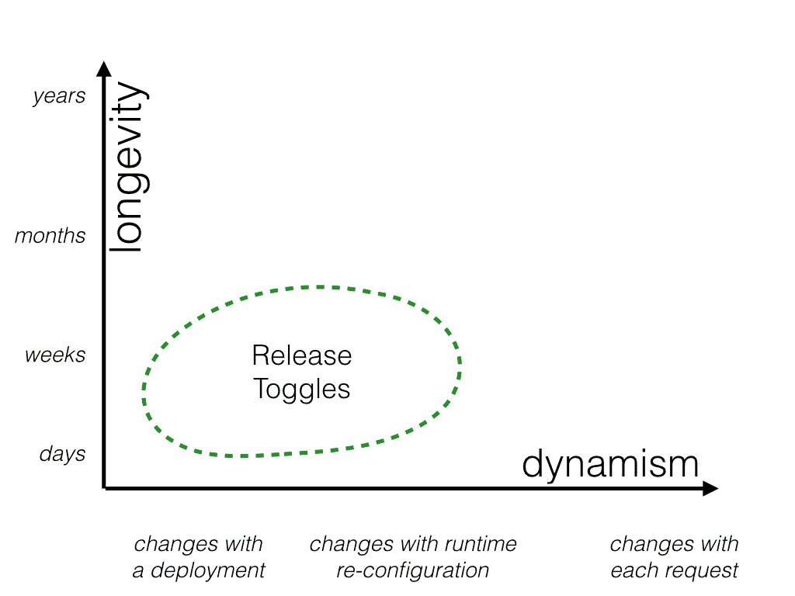
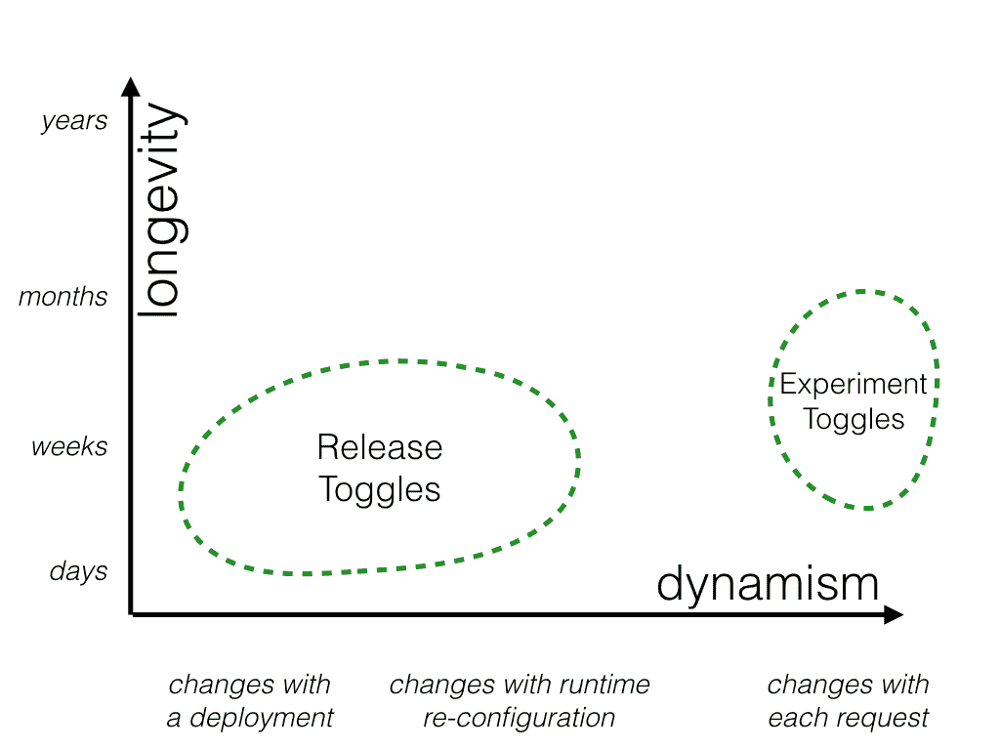
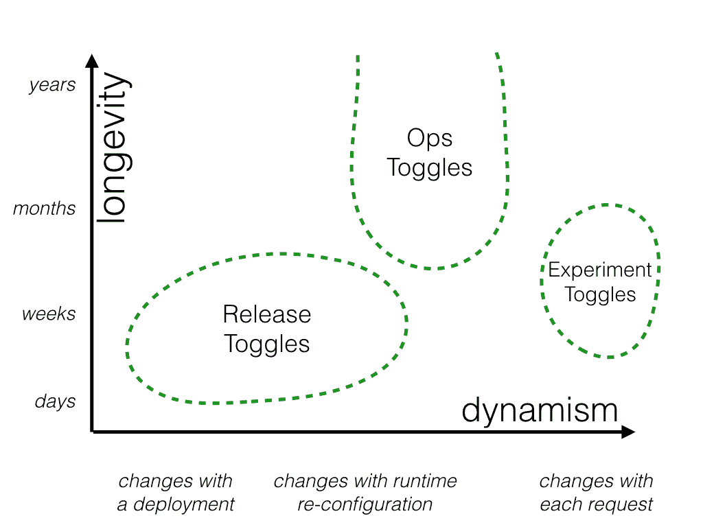
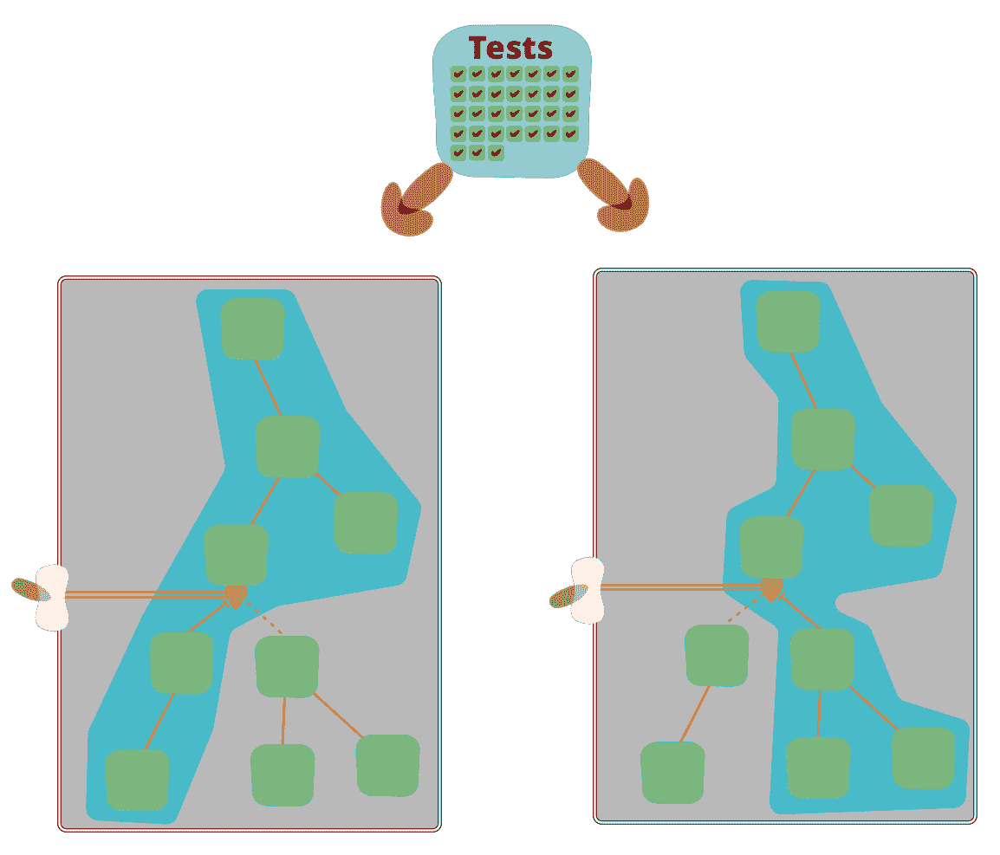

# 特征切换(又名特征标志)

> 原文：<http://martinfowler.com/articles/feature-toggles.html?utm_source=wanqu.co&utm_campaign=Wanqu+Daily&utm_medium=website>

“特性切换”是一组模式，可以帮助团队快速而安全地向用户交付新的功能。在这篇关于特性切换的文章中，我们将以一个小故事开始，展示一些特性切换有用的典型场景。然后我们将深入细节，涵盖特定的模式和实践，这将有助于团队在特性切换方面取得成功。

特征切换也被称为特征标志、特征位或特征翻转。这些都是同一套技术的同义词。在整篇文章中，我将交替使用特性切换和特性标志。


## 一个动人的故事

想象一下这个场景。您是几个团队中的一员，正在开发一个复杂的城镇规划模拟游戏。你的团队负责核心模拟引擎。你的任务是提高样条网状算法的效率。您知道这将需要对实现进行相当大的检查，这将需要几个星期的时间。与此同时，您团队的其他成员将需要在代码库的相关领域继续一些正在进行的工作。

基于过去合并长期分支的痛苦经历，如果可能的话，您希望避免对这项工作进行分支。相反，您决定整个团队将继续在 trunk 上工作，但是从事 Spline Reticulation 改进的开发人员将使用一个特性切换来防止他们的工作影响团队的其他成员或破坏代码库的稳定性。


### 特征标志的诞生

这是研究算法的两个人引入的第一个变化:

以前

```
  function reticulateSplines(){
    // current implementation lives here
  }
```

在...之后

```
  function reticulateSplines(){
    var useNewAlgorithm = false;
    // useNewAlgorithm = true; // UNCOMMENT IF YOU ARE WORKING ON THE NEW SR ALGORITHM

    if( useNewAlgorithm ){
      return enhancedSplineReticulation();
    }else{
      return oldFashionedSplineReticulation();
    }
  }

  function oldFashionedSplineReticulation(){
    // current implementation lives here
  }

  function enhancedSplineReticulation(){
    // TODO: implement better SR algorithm
  }
```

这两个人将当前的算法实现移到了一个`oldFashionedSplineReticulation`函数中，并将`reticulateSplines`变成了一个**切换点**。现在，如果有人正在研究新算法，他们可以通过取消对`useNewAlgorithm = true`行的注释来启用“使用新算法”**特性**。


### 使旗帜动态化

几个小时过去了，两人准备好通过模拟引擎的集成测试来运行他们的新算法。他们还想在同一个集成测试运行中测试旧算法。他们需要能够动态地启用或禁用该特性，这意味着是时候从注释或取消注释`useNewAlgorithm = true`行的笨拙机制中走出来了:

```
function reticulateSplines(){
  if( featureIsEnabled("use-new-SR-algorithm") ){
    return enhancedSplineReticulation();
  }else{
    return oldFashionedSplineReticulation();
  }
}

```

我们现在引入了一个`featureIsEnabled`函数，一个**切换路由器**，它可以用来动态控制哪个代码路径是活动的。实现切换路由器的方法有很多种，从简单的内存存储到具有漂亮 UI 的高度复杂的分布式系统。现在我们从一个非常简单的系统开始:

```
function createToggleRouter(featureConfig){
  return {
    setFeature(featureName,isEnabled){
      featureConfig[featureName] = isEnabled;
    },
    featureIsEnabled(featureName){
      return featureConfig[featureName];
    }
  };
}

```

我们可以基于一些默认配置创建一个新的切换路由器——也许是从配置文件中读取的——但是我们也可以动态地打开或关闭某个功能。这允许自动测试来验证切换特性的两个方面:

```
describe( 'spline reticulation', function(){
  let toggleRouter;
  let simulationEngine;

  beforeEach(function(){
    toggleRouter = createToggleRouter();
    simulationEngine = createSimulationEngine({toggleRouter:toggleRouter});
  });

  it('works correctly with old algorithm', function(){
    // Given
    toggleRouter.setFeature("use-new-SR-algorithm",false);

    // When
    const result = simulationEngine.doSomethingWhichInvolvesSplineReticulation();

    // Then
    verifySplineReticulation(result);
  });

  it('works correctly with new algorithm', function(){
    // Given
    toggleRouter.setFeature("use-new-SR-algorithm",true);

    // When
    const result = simulationEngine.doSomethingWhichInvolvesSplineReticulation();

    // Then
    verifySplineReticulation(result);
  });
});

```


### 准备发布

随着时间的推移，该团队相信他们的新算法功能完备。为了证实这一点，他们已经修改了他们的高级自动化测试，以便他们在关闭和打开该功能的情况下都可以使用该系统。该团队还希望进行一些手动探索性测试，以确保一切按预期运行——毕竟，样条网状结构是系统行为的关键部分。

为了对一个还没有被验证为可用于一般用途的特性进行手动测试，我们需要能够为生产中的一般用户群关闭该特性，但是能够为内部用户打开它。有许多不同的方法可以实现这一目标:

*   让切换路由器基于**切换配置**做出决定，并使该配置特定于环境。仅在生产前环境中启用新功能。
*   允许通过某种形式的管理 UI 在运行时修改切换配置。使用 admin UI 在测试环境中打开新特性。
*   教导切换路由器如何做出动态的、按请求的切换决策。这些决定将**切换上下文**考虑在内，例如通过寻找特殊的 cookie 或 HTTP 头。通常 Toggle Context 用作代理来识别发出请求的用户。

(我们将在后面更详细地探讨这些方法，所以如果这些概念对您来说是新的，请不要担心。)

该团队决定使用按请求切换路由器，因为它给了他们很大的灵活性。该团队特别赞赏这将允许他们在不需要单独测试环境的情况下测试他们的新算法。相反，他们只需在生产环境中打开算法，但只对内部用户开放(通过特殊的 cookie 检测)。团队现在可以为自己打开 cookie，并验证新特性是否按预期执行。


### 金丝雀释放

基于目前为止所做的探索性测试，新的样条网状算法看起来不错。然而，由于它是游戏模拟引擎的一个关键部分，仍然有些人不愿意为所有用户打开这个功能。该团队决定使用他们的功能标志基础设施来执行一次[](/bliki/CanaryRelease.html)**的金丝雀发布，只为他们总用户群中的一小部分——一群“金丝雀”开启新功能。**

 **该团队通过教授用户群的概念来增强 Toggle 路由器，用户群是指持续体验某项功能的用户群，该功能总是处于开启或关闭状态。金丝雀用户群是通过随机抽样 1%的用户基础创建的——可能使用用户 ID 的模。这一金丝雀群体将持续打开该功能，而其他 99%的用户群仍在使用旧算法。对两组的关键业务指标(用户参与度、总收入等)进行监控，以确保新算法不会对用户行为产生负面影响。一旦团队确信新特性没有不良影响，他们就修改他们的切换配置，为整个用户群打开它。** 

 **

### A/B 测试

团队的产品经理了解了这种方法，非常兴奋。她建议团队使用类似的机制来执行一些 A/B 测试。关于修改犯罪率算法以考虑污染水平是否会增加或减少游戏的可玩性，一直存在争论。他们现在有能力用数据来解决争论。他们计划推出一个廉价的实现，它抓住了这个想法的精髓，用一个特性标志来控制。他们将为一个相当大的用户群体打开该功能，然后研究这些用户与“控制”群体相比的行为。这种方法将允许团队基于数据而不是[河马](http://www.forbes.com/sites/derosetichy/2013/04/15/what-happens-when-a-hippo-runs-your-company/)来解决有争议的产品争论。


这个简短的场景旨在说明功能切换的基本概念，并强调这一核心功能可以有多少不同的应用程序。现在，我们已经看到了这些应用的一些示例，让我们再深入了解一下。我们将探索不同类别的切换，看看是什么使它们不同。我们将讨论如何编写可维护的切换代码，最后分享一些实践来避免功能切换系统的一些缺陷。** 

 **

## 切换的类别

我们已经看到了特性切换所提供的基本功能——能够在一个可部署的单元中提供不同的代码路径，并在运行时进行选择。上面的场景还显示了这个工具可以在不同的环境中以不同的方式使用。把所有的特性都放在同一个桶里可能很诱人，但是这是一条危险的道路。不同种类的肘节的设计力量有很大的不同，以同样的方式管理它们会导致痛苦。

特性切换可以从两个主要方面进行分类:特性切换将持续多长时间以及切换决策的动态性。还有其他因素需要考虑——例如，谁来管理特性切换——但是我认为寿命和动态性是可以帮助指导如何管理切换的两大因素。

让我们通过这两个维度的镜头来考虑各种类型的切换，看看它们适合在哪里。


### 释放开关

发布切换允许不完整和未测试的代码路径作为潜在代码被发布到产品中，这些代码可能永远不会被打开。

这些是用于为实践连续交付的团队启用基于主干的开发的特性标志。它们允许正在进行的特性被检入到一个共享的集成分支(例如，主或主干)中，同时仍然允许该分支在任何时候被部署到生产中。释放开关允许不完整和未测试的代码路径作为可能永远不会打开的[潜在代码](http://www.infoq.com/news/2009/08/enabling-lrm)被运送到生产中。

产品经理也可以使用这种方法的以产品为中心的版本来防止半成品的产品特性暴露给他们的最终用户。例如，一个电子商务网站的产品经理可能不希望让用户看到一个新的估计发货日期功能，该功能只适用于该网站的一个发货伙伴，而更愿意等到该功能已经为所有发货伙伴实现。产品经理可能有其他原因不想公开特性，即使它们已经完全实现和测试。例如，功能发布可能与营销活动相协调。以这种方式使用发布切换是实现“将[特性]发布与[代码]部署分离”的连续交付原则的最常见方式



释放开关本质上是过渡性的。虽然以产品为中心的切换可能需要保持更长的时间，但它们通常不会停留超过一周或两周。释放切换的切换决定通常是非常静态的。给定发布版本的每个切换决策都是相同的，通过推出带有切换配置更改的新版本来更改该切换决策通常是完全可以接受的。


### 实验切换

实验切换用于执行多变量或 A/B 测试。系统的每个用户被放入一个群组中，并且在运行时，触发路由器将基于他们在哪个群组中，一致地沿着一个码路径或另一个码路径发送给定用户。通过跟踪不同群体的总体行为，我们可以比较不同代码路径的效果。这种技术通常用于对电子商务系统的购买流程或按钮上的行动号召等进行数据驱动的优化。



实验切换需要保持相同的配置足够长的时间，以生成具有统计意义的结果。取决于交通模式，这可能意味着几个小时或几个星期的生活。更长的时间不太可能有用，因为对系统的其他改变有使实验结果无效的风险。从本质上来说，切换是高度动态的——每个传入的请求很可能代表不同的用户，因此路由可能与上一个不同。


### 操作切换

这些标志用于控制我们系统行为的操作方面。我们可能会在推出具有不明确性能影响的新功能时引入 Ops 切换，以便系统操作员可以在需要时在生产中快速禁用或降级该功能。

大多数操作切换都是相对短暂的——一旦对新功能的操作方面有了信心，该标志就应该退役。然而，对于系统来说，拥有少量长寿命的“终止开关”并不罕见，当系统承受异常高的负载时，这些“终止开关”允许生产环境的操作员适度地降低非关键系统功能。例如，当我们的负载很重时，我们可能希望禁用主页上的推荐面板，这是一个相对昂贵的生成过程。我咨询了一家维护 Ops Toggles 的在线零售商，该零售商可以在高需求产品发布前故意禁用其网站主要采购流程中的许多非关键功能。这些类型的长寿命 Ops 触发器可以被视为手动管理的[断路器](/bliki/CircuitBreaker.html)。



如前所述，这些标志中的许多只存在很短一段时间，但一些关键控制可能会无限期地留给操作员。由于这些标志的目的是允许操作员对生产问题做出快速反应，因此他们需要非常快速地进行重新配置——需要推出新的版本来切换操作开关不太可能让操作人员感到满意。


### 许可切换

为一组内部用户打开新功能是一个香槟早午餐——一个喝自己香槟的早期机会

这些标志用于更改某些用户获得的功能或产品体验。例如，我们可能有一组“高级”功能，我们只为我们的付费客户打开。或者，我们可能有一组只对内部用户开放的“alpha”功能，以及另一组只对内部用户和 beta 用户开放的“beta”功能。我把这种为一组内部或测试版用户开启新功能的技术称为香槟早午餐——一个“喝你自己的香槟”的早期机会。

香槟早午餐在很多方面与金丝雀放生相似。两者之间的区别在于金丝雀发布的特征被暴露给随机选择的用户群，而香槟早午餐特征被暴露给特定的用户群。

当用作管理只对高级用户公开的特征的方式时，与其它类别的特征切换相比，许可切换可能存在很长时间——在数年的规模上。由于许可是特定于用户的，所以许可切换的切换决定将总是基于每个请求，这使得这是一个非常动态的切换。


### 管理不同类别的切换

现在我们有了一个切换分类方案，我们可以讨论动态性和寿命这两个维度如何影响我们如何处理不同类别的特征标志。


#### 静态与动态切换

做出运行时路由决定的切换必然需要更复杂的切换路由器，以及这些路由器的更复杂的配置。

对于简单的静态路由决策，切换配置可以是每个功能的简单开或关，切换路由器仅负责将静态开/关状态中继到切换点。正如我们前面所讨论的，其他类型的 toggle 更加动态，需要更复杂的 toggle 路由器。例如，一个实验开关的路由器为一个给定的用户动态地作出路由决定，也许使用某种基于用户 id 的一致协同算法。不是从配置中读取静态触发状态，而是该触发路由器将需要读取某种群组配置，该群组配置定义了诸如实验群组和控制群组应该有多大之类的事情。该配置将被用作协同算法的输入。

稍后，我们将深入探讨管理这种切换配置的不同方法的更多细节。


#### 长寿命触发器与瞬态触发器

我们还可以将我们的切换类别分为本质上是短暂的类别和长期存在并可能存在多年的类别。这种区别应该对我们实现特性切换点的方法有很大的影响。如果我们添加一个将在几天后被移除的发布触发器，那么我们可能会得到一个在触发器路由器上执行简单 if/else 检查的触发器点。这就是我们之前在样条网状例子中所做的:

```
function reticulateSplines(){
  if( featureIsEnabled("use-new-SR-algorithm") ){
    return enhancedSplineReticulation();
  }else{
    return oldFashionedSplineReticulation();
  }
}

```

然而，如果我们正在创建一个新的带有切换点的许可切换，我们希望它能保持很长一段时间，那么我们当然不希望通过不加选择地使用 if/else 检查来实现那些切换点。我们需要使用更易维护的实现技术。


## 实现技术

特性标志似乎会产生相当混乱的切换点代码，而且这些切换点也有在整个代码库中扩散的趋势。在代码库中检查任何特性标志时，保持这种倾向是很重要的，如果标志是长期存在的，这一点尤为重要。有一些实现模式和实践有助于减少这个问题。


### 从决策逻辑中分离决策点

功能切换的一个常见错误是将做出切换决策的位置(切换点)与决策背后的逻辑(切换路由器)联系起来。让我们看一个例子。我们正在开发下一代电子商务系统。我们的新功能之一将允许用户通过点击订单确认电子邮件(又名发票电子邮件)中的链接来轻松取消订单。我们使用功能标志来管理所有下一代功能的推出。我们最初的特征标记实现如下所示:

invoiceEmailer.js

```
  const features = fetchFeatureTogglesFromSomewhere();

  function generateInvoiceEmail(){
    const baseEmail = buildEmailForInvoice(this.invoice);
    if( features.isEnabled("next-gen-ecomm") ){ 
      return addOrderCancellationContentToEmail(baseEmail);
    }else{
      return baseEmail;
    }
  }

```

在生成发票邮件时，我们的 invoice emailer 会检查是否启用了`next-gen-ecomm`功能。如果是，则电子邮件发送者在电子邮件中添加一些额外的订单取消内容。

虽然这看起来是一个合理的方法，但它非常脆弱。关于是否在我们的发票邮件中包含订单取消功能的决定直接与那个相当广泛的`next-gen-ecomm`功能联系在一起——使用一个神奇的字符串。为什么发票电子邮件代码需要知道订单取消内容是下一代功能集的一部分？如果我们想在不暴露订单取消的情况下打开下一代功能的某些部分，会发生什么？还是反过来？如果我们决定只向某些用户推出订单取消，该怎么办？随着功能的开发，这种“切换范围”的变化是很常见的。还要记住，这些转折点往往会在整个代码库中激增。对于我们当前的方法，由于切换决策逻辑是切换点的一部分，所以对该决策逻辑的任何改变都将需要在遍布代码库的所有那些切换点中进行搜索。

令人高兴的是，[软件中的任何问题都可以通过增加一层间接层](https://en.wikipedia.org/wiki/Fundamental_theorem_of_software_engineering)来解决。我们可以将切换决策点从决策背后的逻辑中分离出来，如下所示:

featureDecisions.js

```
  function createFeatureDecisions(features){
    return {
      includeOrderCancellationInEmail(){
        return features.isEnabled("next-gen-ecomm");
      }
      // ... additional decision functions also live here ...
    };
  }

```

invoiceEmailer.js

```
  const features = fetchFeatureTogglesFromSomewhere();
  const featureDecisions = createFeatureDecisions(features);

  function generateInvoiceEmail(){
    const baseEmail = buildEmailForInvoice(this.invoice);
    if( featureDecisions.includeOrderCancellationInEmail() ){
      return addOrderCancellationContentToEmail(baseEmail);
    }else{
      return baseEmail;
    }
  }

```

我们引入了一个`FeatureDecisions`对象，它充当任何特性切换决策逻辑的收集点。我们在这个对象上为代码中的每个特定切换决策创建一个决策方法——在这个例子中,“我们是否应该在我们的发票电子邮件中包含订单取消功能”由`includeOrderCancellationInEmail`决策方法表示。现在，决策“逻辑”只是检查`next-gen-ecomm`特性状态的一个简单的通道，但是现在随着逻辑的发展，我们有了一个单独的地方来管理它。每当我们想要修改特定切换决策的逻辑时，我们只有一个地方可去。我们可能想要修改决策的范围——例如哪个特定的特征标志控制决策。或者，我们可能需要修改决策的原因——从由静态切换配置驱动到由 A/B 实验驱动，或者由运营问题驱动，例如我们的一些订单取消基础设施中断。在所有情况下，我们的发票电子邮件发件人可以幸福地保持不知道如何或为什么要做出切换决定。


### 决策倒置

在前面的例子中，我们的发票邮件发送者负责询问特征标记基础设施应该如何执行。这意味着我们的发票邮件发送者需要知道一个额外的概念——特性标记——和一个额外的模块。这使得发票邮件更难单独使用和考虑，包括更难测试。随着时间的推移，特征标记有在系统中变得越来越普遍的趋势，我们将会看到越来越多的模块作为全局依赖项耦合到特征标记系统。不是理想的情况。

在软件设计中，我们通常可以通过应用控制反转来解决这些耦合问题。这种情况下确实如此。以下是我们如何将发票电子邮件与我们的功能标记基础设施分离的方法:

invoiceEmailer.js

```
  function createInvoiceEmailler(config){
    return {
      generateInvoiceEmail(){
        const baseEmail = buildEmailForInvoice(this.invoice);
        if( config.includeOrderCancellationInEmail ){
          return addOrderCancellationContentToEmail(email);
        }else{
          return baseEmail;
        }
      },

      // ... other invoice emailer methods ...
    };
  }
```

featureAwareFactory.js

```
  function createFeatureAwareFactoryBasedOn(featureDecisions){
    return {
      invoiceEmailler(){
        return createInvoiceEmailler({
          includeOrderCancellationInEmail: featureDecisions.includeOrderCancellationInEmail()
        });
      },

      // ... other factory methods ...
    };
  }
```

现在，不是我们的`InvoiceEmailler`向`FeatureDecisions`伸出手，而是在构建时通过一个`config`对象将那些决定注入其中。`InvoiceEmailler`现在对特征标记一无所知。它只知道其行为的某些方面可以在运行时配置。这也使得测试`InvoiceEmailler`的行为变得更加容易——我们可以测试它生成包含和不包含订单取消内容的电子邮件的方式，只需在测试期间传递不同的配置选项:

```
describe( 'invoice emailling', function(){
  it( 'includes order cancellation content when configured to do so', function(){
    // Given 
    const emailler = createInvoiceEmailler({includeOrderCancellationInEmail:true});

    // When
    const email = emailler.generateInvoiceEmail();

    // Then
    verifyEmailContainsOrderCancellationContent(email);
  };

  it( 'does not includes order cancellation content when configured to not do so', function(){
    // Given 
    const emailler = createInvoiceEmailler({includeOrderCancellationInEmail:false});

    // When
    const email = emailler.generateInvoiceEmail();

    // Then
    verifyEmailDoesNotContainOrderCancellationContent(email);
  };
});

```

我们还引入了一个`FeatureAwareFactory`来集中创建这些决策注入对象。这是通用依赖注入模式的一个应用。如果阿迪系统在我们的代码库中，那么我们可能会使用该系统来实现这种方法。


### 避免条件句

在我们的例子中，到目前为止，我们的切换点是使用 if 语句实现的。这对于一个简单、短暂的切换来说可能是有意义的。然而，如果一个特性需要几个切换点，或者您希望切换点是长期的，那么就不建议使用点条件。更容易维护的替代方法是使用某种策略模式实现替代代码路径:

invoiceEmailler.js

```
  function createInvoiceEmailler(additionalContentEnhancer){
    return {
      generateInvoiceEmail(){
        const baseEmail = buildEmailForInvoice(this.invoice);
        return additionalContentEnhancer(baseEmail);
      },
      // ... other invoice emailer methods ...

    };
  }
```

featureAwareFactory.js

```
  function identityFn(x){ return x; }

  function createFeatureAwareFactoryBasedOn(featureDecisions){
    return {
      invoiceEmailler(){
        if( featureDecisions.includeOrderCancellationInEmail() ){
          return createInvoiceEmailler(addOrderCancellationContentToEmail);
        }else{
          return createInvoiceEmailler(identityFn);
        }
      },

      // ... other factory methods ...
    };
  }
```

这里我们应用了一个策略模式，允许我们的发票电子邮件程序配置内容增强功能。`FeatureAwareFactory`在其`FeatureDecision`的指导下，选择创建发票邮件的策略。如果订单取消应该在电子邮件中，它会传递一个增强函数，将该内容添加到电子邮件中。否则它会传入一个`identityFn`增强器——一个没有任何效果的增强器，只是简单地将邮件不加修改地传回。


## 切换配置


### 动态路由与动态配置

之前，我们将特性标志分为两类，一类是对于给定的代码部署，切换路由决策基本上是静态的，另一类是在运行时动态变化的。值得注意的是，在运行时有两种方式可以改变标志的决定。首先，像 Ops Toggle 这样的东西可能会被动态地*重新配置*从开到关，以响应系统中断。第二，某些类型的切换，如许可切换和实验切换，基于某些请求上下文(如哪个用户发出请求)为每个请求做出动态路由决定。前者是通过重新配置实现的动态，而后者是固有的动态。这些固有的动态切换可以做出高度动态的**决策**，但仍然有一个**配置**，这是相当静态的，也许只有通过重新部署才能改变。实验切换就是这种特征标志的一个例子——我们实际上不需要能够在运行时修改实验的参数。事实上，这样做可能会使实验在统计学上无效。


### 首选静态配置

如果特性标志的性质允许的话，最好通过源代码控制和重新部署来管理切换配置。通过源代码控制来管理切换配置给我们带来了同样的好处，就像我们使用源代码控制来管理代码一样。它可以允许切换配置与被切换的代码库共存，这提供了一个真正的大胜利:切换配置将以与代码变更或基础设施变更完全相同的方式通过您的连续交付管道。这充分实现了 CD 可重复构建的好处，这些构建在不同环境中以一致的方式得到验证。它还极大地减轻了特性标志的测试负担。不太需要验证释放在切换关闭和打开时将如何执行，因为该状态已经融入到释放中，不会被更改(至少对于动态性较低的标志)。切换配置在源代码控制中并存的另一个好处是，我们可以很容易地看到以前版本中切换的状态，并且如果需要的话，可以很容易地重新创建以前的版本。


### 管理切换配置的方法

虽然静态配置更可取，但在某些情况下，如 Ops 切换，需要更动态的方法。让我们看看管理切换配置的一些选项，从简单但不太动态的方法到高度复杂但带来很多额外复杂性的方法。


### 硬编码切换配置

最基本的技术——可能如此基本以至于不被认为是特性标志——是简单地注释或取消注释代码块。例如:

```
function reticulateSplines(){
  //return oldFashionedSplineReticulation();
  return enhancedSplineReticulation();
}

```

比注释方法稍微复杂一点的是使用预处理器的`#ifdef`特性，如果可以的话。

因为这种类型的硬编码不允许切换的动态重新配置，所以它只适用于我们愿意遵循代码部署模式来重新配置标志的特性标志。


### 参数化切换配置

硬编码配置提供的构建时配置对于许多用例来说不够灵活，包括许多测试场景。一种简单的方法是通过命令行参数或环境变量指定切换配置，这种方法至少允许重新配置功能标志，而无需重新构建应用程序或服务。这是一种简单且历史悠久的切换方法，在任何人将该技术称为特性切换或特性标记之前就已经存在了。然而，它也有局限性。跨大量进程协调配置会变得很难，并且对触发器配置的更改需要重新部署或至少重启进程(并且重新配置触发器的人也可能有访问服务器的特权)。


### 切换配置文件

另一种选择是从某种结构化文件中读取切换配置。这种方法很常见，将配置作为更一般的应用程序配置文件的一部分。

使用切换配置文件，您现在可以通过简单地更改该文件而不是重新构建应用程序代码本身来重新配置功能标志。然而，尽管在大多数情况下您不需要重新构建您的应用程序来切换功能，但您可能仍然需要执行重新部署来重新配置标志。


### 在应用数据库中切换配置

一旦达到一定规模，使用静态文件来管理切换配置会变得很麻烦。通过文件修改配置相对复杂。确保整个服务器群的一致性成为一项挑战，不断地进行更改更是如此。对此，许多组织将 Toggle 配置转移到某种类型的集中存储中，通常是现有的应用程序数据库。这通常伴随着某种形式的管理 UI 的构建，它允许系统操作员、测试人员和产品经理查看和修改特性标志及其配置。


### 分布式切换配置

使用已经是系统架构的一部分的通用数据库来存储切换配置是非常常见的；一旦引入功能标志并开始获得关注，这是一个显而易见的去处。然而，现在有一种特殊用途的分层键值存储，更适合管理应用程序配置服务，如 Zookeeper、etcd 或 Consul。这些服务形成了一个分布式集群，为连接到该集群的所有节点提供了一个共享的环境配置源。配置可以在需要的时候动态修改，集群中的所有节点都会被自动通知这一变化——这是一个非常方便的额外特性。使用这些系统管理 Toggle 配置意味着我们可以让群中每个节点上的 Toggle 路由器根据整个群中协调的 Toggle 配置做出决策。

其中一些系统(比如 Consul)带有一个管理 UI，它提供了一种管理切换配置的基本方法。然而，在某些时候，通常会创建一个用于管理切换配置的小型定制应用程序。


### 覆盖配置

到目前为止，我们的讨论都假设所有的配置都是由单一机制提供的。许多系统的实际情况更加复杂，覆盖的配置层来自不同的来源。使用切换配置，通常会有一个默认配置和特定于环境的覆盖。这些覆盖可能来自简单的附加配置文件，也可能来自复杂的东西，如 Zookeeper 集群。请注意，任何特定于环境的覆盖都与持续交付的理念背道而驰，即在整个交付管道中始终有完全相同的位和配置流。实用主义通常要求使用一些特定于环境的覆盖，但是尽可能使您的可部署单元和配置与环境无关将会导致更简单、更安全的管道。当我们谈到测试功能切换系统时，我们将很快再次讨论这个主题。


#### 每请求覆盖

特定于环境的配置覆盖的另一种方法是允许通过特殊的 cookie、查询参数或 HTTP 头基于每个请求覆盖开关的开/关状态。这比完全配置覆盖有一些优势。如果一个服务是负载平衡的，那么无论您遇到哪个服务实例，您仍然可以确信覆盖将被应用。您还可以在不影响其他用户的情况下在生产环境中覆盖特性标志，并且您不太可能意外地将覆盖留在原处。如果每请求覆盖机制使用持久 cookies，那么测试您的系统的人可以配置他们自己的自定义切换覆盖集，这些覆盖将在他们的浏览器中保持一致地应用。

这种基于请求的方法的缺点是，它引入了一种风险，即好奇或恶意的最终用户可能会自己修改功能切换状态。一些组织可能会对某些未发布的特性可以被足够坚定的团体公开访问的想法感到不安。加密签名您的覆盖配置是减轻这种担忧的一种选择，但不管怎样，这种方法将增加您的功能切换系统的复杂性和攻击面。

我在这篇文章的[中详细阐述了这种基于 cookie 的覆盖技术，并且](http://blog.thepete.net/blog/2012/11/06/cookie-based-feature-flag-overrides/)[也描述了一个由我和一个 Thoughtworks 同事开源的 ruby 实现](http://blog.thepete.net/blog/2013/08/24/introducing-rack-flags/)。


## 使用有特征标记的系统

虽然特性切换绝对是一种有用的技术，但它也带来了额外的复杂性。有几个技巧可以帮助您在使用带有特征标志的系统时更加轻松。


### 显示当前功能切换配置

将构建/版本号嵌入到已部署的工件中，并在某处公开该元数据，以便开发人员、测试人员或操作人员可以发现给定环境中正在运行的特定代码，这一直是一种有益的做法。同样的想法也适用于特性标志。任何使用特征标志的系统都应该为操作员提供一些方法来发现触发配置的当前状态。在面向 HTTP 的 SOA 系统中，这通常是通过某种元数据 API 端点来完成的。例如，参见 Spring Boot 的[致动器端点](http://docs.spring.io/spring-boot/docs/current/reference/html/production-ready-endpoints.html)。


### 利用结构化的切换配置文件

通常将基本切换配置存储在通过源代码控制管理的某种结构化的、人类可读的文件(通常是 YAML 格式)中。我们可以从这个文件中获得一些额外的好处。为每个切换包含一个人类可读的描述是非常有用的，特别是对于由核心交付团队之外的人管理的切换。当试图决定是否在生产中断事件期间启用 Ops 切换时，您希望看到什么: **basic-rec-algo** 或**“使用简单的建议算法。这种算法速度更快，对后端系统产生的负载也更少，但精度远不如我们的标准算法。”**？一些团队还选择在他们的切换配置文件中包含额外的元数据，比如创建日期、主要开发人员联系方式，或者甚至是打算短期使用的切换的截止日期。


### 以不同的方式管理不同的切换

如前所述，有各种类别的特征切换具有不同的特征。这些差异应该被接受，不同的触发器以不同的方式管理，即使所有不同的触发器可能使用相同的技术机器来控制。

让我们重温一下我们之前的例子，一个电子商务网站的主页上有一个推荐产品部分。最初，我们可能会在开发时将该部分放在释放开关的后面。然后，我们可能会将它移到实验开关的后面，以验证它是否有助于推动收入。最后，我们可能会将它移到 Ops 开关后面，这样我们就可以在极端负载下关闭它。如果我们遵循早期关于从切换点解耦决策逻辑的建议，那么切换类别中的这些差异应该对切换点代码没有任何影响。

然而，从特征标志管理的角度来看，这些转变绝对应该有影响。作为从发布切换到实验切换的一部分，切换的配置方式将会改变，并可能转移到不同的区域——可能转移到管理 UI，而不是源代码控制中的 yaml 文件。产品人员现在可能会管理配置，而不是开发人员。同样，从实验切换到操作切换将意味着切换的配置方式、配置的位置以及管理配置的人员都将发生变化。


### 特征切换引入了验证复杂性

有了特性标记系统，我们的连续交付过程变得更加复杂，特别是在测试方面。当同一个工件通过 CD 管道时，我们经常需要测试它的多个代码路径。为了说明原因，假设我们正在交付一个系统，它可以使用一个新的优化的税收计算算法，或者继续使用我们现有的算法。当一个给定的可部署工件通过我们的 CD 管道时，我们不知道在生产中的某个时刻开关是打开还是关闭——毕竟这是特性标志的全部意义。因此，为了验证所有可能在生产中结束的代码路径，我们必须在**和**两种状态下测试我们的工件:开关打开和关闭。



我们可以看到，在使用单个触发器的情况下，这引入了对至少一些测试的加倍要求。随着多个切换的进行，我们有一个可能的切换状态的组合爆炸。验证每个状态的行为将是一项艰巨的任务。这可能会导致关注测试的人对特性标志产生一些健康的怀疑。

令人高兴的是，情况并不像一些测试人员最初想象的那样糟糕。虽然一个特性标记的候选版本确实需要测试一些切换配置，但是没有必要测试每一种可能的组合。大多数功能标志不会相互作用，并且大多数版本不会涉及对多个功能标志的配置的更改。

一个好的惯例是当功能标志关闭时启用现有的或传统的行为，当功能标志打开时启用新的或未来的行为。

那么，团队应该测试哪些特性切换配置呢？最重要的是测试您希望在生产中投入使用的切换配置，这意味着当前的生产切换配置加上您打算释放的任何切换。测试回退配置也是明智的，在回退配置中，您打算释放的那些开关也被关闭。为了避免在未来的版本中出现任何令人惊讶的倒退，许多团队也会在所有开关都打开的情况下进行一些测试。请注意，这个建议只有在您遵循切换语义的约定时才有意义，在切换语义中，当某个功能关闭时启用现有或遗留行为，而当某个功能打开时启用新的或未来的行为。

如果您的特性标志系统不支持运行时配置，那么您可能不得不重新启动您正在测试的过程，以便进行切换，或者更糟糕的是将工件重新部署到测试环境中。这可能会对您的验证过程的周期时间产生非常不利的影响，进而影响 CI/CD 提供的所有重要的反馈回路。要避免此问题，请考虑公开一个端点，该端点允许在内存中动态重新配置功能标志。当您使用像 Experiment Toggles 这样的东西时，这种类型的覆盖变得更加必要，因为在这种情况下，对 toggle 的两个路径进行操作甚至更加复杂。

这种动态重新配置特定服务实例的能力是一个非常锐利的工具。如果使用不当，它会在共享环境中造成许多痛苦和困惑。这个工具应该只被自动化测试使用，并且可能作为手工探索性测试和调试的一部分。如果需要在生产环境中使用更通用的切换控制机制，最好使用一个真实的分布式配置系统，如上面的切换配置部分所讨论的。


### 在哪里放置您的开关


#### 在边缘切换

对于需要每个请求上下文的切换类别(实验切换、许可切换),将切换点放在系统的边缘服务中是有意义的——即向最终用户展示功能的公开 web 应用。这是您的用户的单个请求首次进入您的域的地方，因此您的切换路由器具有最多的上下文来基于用户及其请求做出切换决定。将切换点放在系统边缘的另一个好处是，它将复杂的条件切换逻辑排除在系统核心之外。在许多情况下，您可以将切换点放在呈现 HTML 的地方，如 Rails 示例所示:

someFile.erb

```
  <%= if featureDecisions.showRecommendationsSection? %>
    <%= render 'recommendations_section' %>
  <% end %>
```

当您控制尚未准备好发布的面向用户的新功能时，在边缘放置切换点也是有意义的。在这种情况下，您可以使用简单地显示或隐藏 UI 元素的开关来控制访问。举个例子，也许你正在构建使用脸书登录应用程序的能力，但是还没有准备好向用户推广。该特性的实现可能涉及到架构各个部分的变化，但是您可以通过在 UI 层隐藏“使用脸书登录”按钮的简单特性切换来控制该特性的公开。

有趣的是，使用这些类型的功能标记，大部分未发布的功能本身实际上可能是公开的，但是位于用户无法发现的 url 上。


#### 在核心中切换

还有其他类型的低级切换，必须放在您的体系结构的更深处。这些切换通常本质上是技术性的，控制某些功能如何在内部实现。一个例子是 Release Toggle，它控制是否在第三方 API 前面使用一个新的缓存基础设施，或者只是将请求直接路由到那个 API。在这些情况下，将这些切换决策本地化到其功能被切换的服务中是唯一明智的选择。


### 管理特征的持有成本

特征标志有迅速增加的趋势，尤其是在首次引入时。它们是有用的，而且制造起来很便宜，所以经常会制造出很多。然而，切换带来了运输成本。它们要求你在代码中引入新的抽象或条件逻辑。它们也带来了巨大的测试负担。骑士资本集团(Knight Capital Group)的 4.6 亿美元的错误(T1)是一个警示故事，告诉我们当你没有正确管理你的功能标志时会发生什么。

精明的团队将他们的功能视为库存，这带来了持有成本，并努力保持尽可能低的库存。

精明的团队将代码库中的特性切换视为库存，这带来了持有成本，并寻求尽可能降低库存。为了保持特性标志的数量可控，团队必须主动移除不再需要的特性标志。一些团队有一个规则，每当第一次引入发布切换时，总是将切换移除任务添加到团队的 backlog 中。其他团队把“到期日期”放在他们的肘节上。有些人甚至制造出测试失败的“定时炸弹”(甚至拒绝启动应用程序！)如果特征标志在其到期日期之后仍然存在。我们还可以应用精益方法来减少库存，限制系统在任何时候允许拥有的特性标志的数量。一旦达到这个限制，如果有人想添加一个新的切换，他们首先需要做的工作是删除一个现有的标志。


**