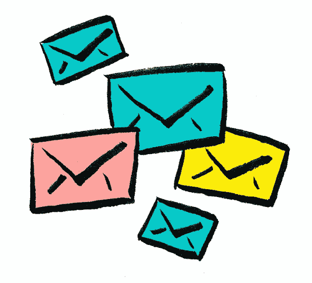
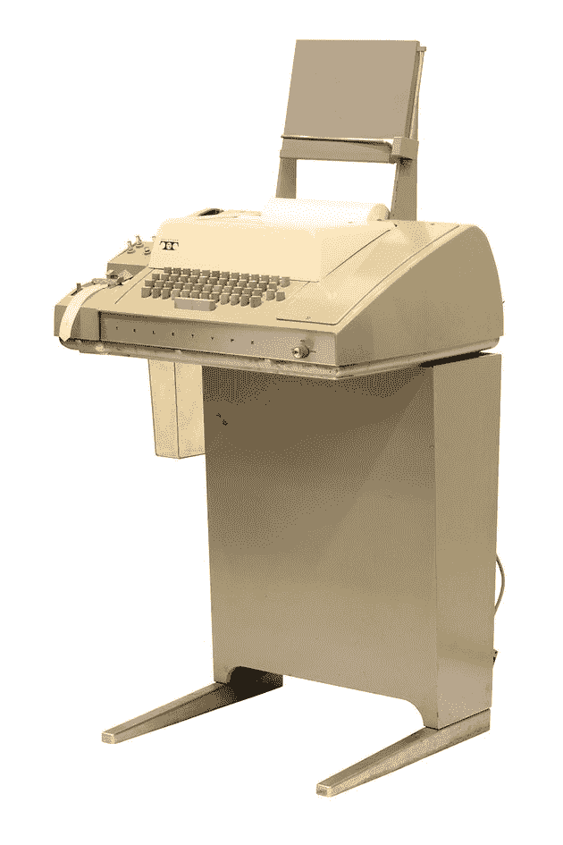
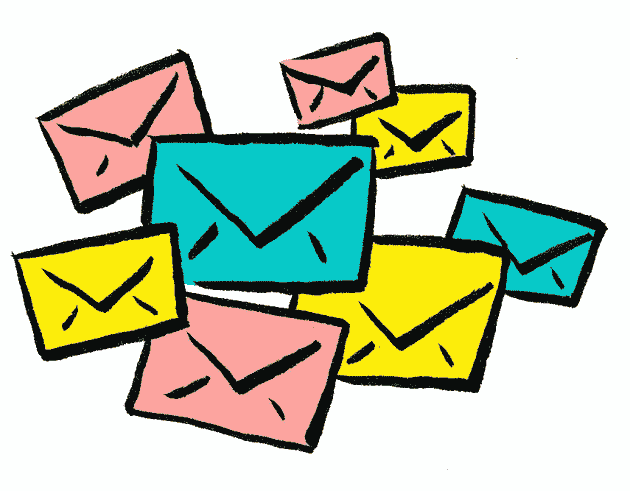
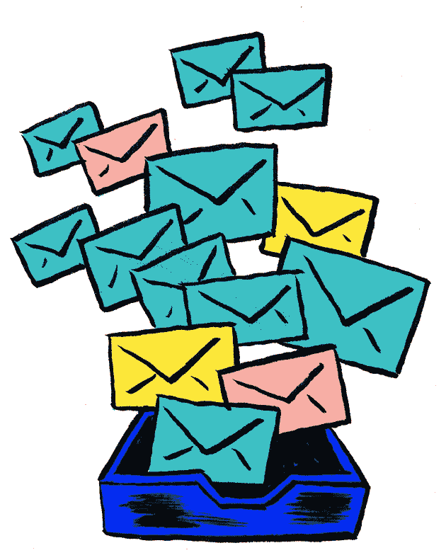

# 什么将取代电子邮件？-大西洋

> 原文：<https://www.theatlantic.com/technology/archive/2016/01/what-comes-after-email/422625/?utm_source=wanqu.co&utm_campaign=Wanqu+Daily&utm_medium=website>

邮件， *ughhhh* 。来自错误的人的错误的信息太多了。当人们不再大声讨厌他们的收件箱时，他们会悄悄地发邮件说，他们很抱歉这么晚才回复，很抱歉所有的错别字，很抱歉错过了你之前的留言，很抱歉忘记关闭自动回复，很抱歉从他们的移动设备上发送这封邮件，很抱歉写得太长，很抱歉打扰了你。

对于一项如此平凡的活动来说，电子邮件似乎注入了大量的恐惧和内疚。几项研究表明频繁查看电子邮件与高度焦虑有关。[一项研究](https://www.theatlantic.com/health/archive/2012/05/study-of-the-day-email-breaks-at-work-reduce-stress-improve-productivity/256796/)发现，经常检查电子邮件的人心脏活动也显示皮质醇水平较高，这是一种与压力有关的激素——直到他们被禁止进入收件箱。

在移动互联网时代，查收邮件既是一种神经紧张的行为，也是许多员工在办公室的束缚。一个人的电子邮件收件箱是忘记的密码复活的地方；收集大量邮件的地方；在这里，人们可以分享南瓜派食谱、蹒跚学步的孩子的照片和荒谬的俏皮话。因此，收件箱是一个汇聚的地方:垃圾邮件、工作邮件、广告邮件，有时还有非正式的亲密信件。电子邮件就像它应该的那样工作，而且比以前更好，但人们似乎比以往任何时候都更讨厌它。

在大约半个世纪的过程中，电子邮件从晦涩和专业，到超级流行和喜爱，再到被嘲笑和勉强容忍。随着电子邮件的名声越来越差，服务提供商提供工具来帮助你达到“零收件箱”，而初创公司则承诺彻底消灭电子邮件。吹嘘一个人很少使用电子邮件已经成为科技圈的时尚。

电子邮件并不总是这样。我们并不总是这样。发生了什么事？

<picture class="ArticleInlineImageFigure_picture__HoflP"></picture>

Mike Reddy

计算机工程师雷蒙德·汤姆林森在 1971 年发出了第一封电子邮件。他不记得上面写了什么，但人们还是不停地问他。“它完全是短暂的，所以它的任何痕迹都消失了，”他说。“可能有一台机器有一些当时连接的内存，但你永远也找不到它。”

当时，汤姆林森正在为阿帕网开发应用程序和协议，阿帕网是今天的互联网所基于的早期网络。(如今，他是国防巨头雷神公司研发部门 BBN 技术公司的首席科学家。)在 1971 年，除了汤姆林森的同事，任何人都不会想使用电子邮件。“这台电脑不是个人的，”汤姆林森说。“它在几十个用户之间分时使用。大多数电脑都很贵——几万甚至几十万美元。”

<aside class="ArticlePullquote_root__YtnHv">“We’re stressing ourselves out. We’re living in notification hell.”</aside>

在移动电话出现之前，电子邮件就已经出现了，那时要联系一个不在你身边的人要困难得多。汤姆林森说:“联系人们，尤其是那些在其他时区的人，非常困难。”。“如果他们不接电话，如果你幸运的话，也许他们有一个秘书——或者如果他们真的很重要的话，有一个接听服务。”

在为阿帕网开发应用程序时，汤姆林森和他的同事们谈到了某种邮箱协议。一个想法是建立有编号的电子邮箱，这样信息就可以打印出来，然后用相应的号码亲手送到小房间里。汤姆林森告诉我，“我看了看，然后说，‘嗯，这是一个有趣的想法，但它太复杂了。’”。他认为，一种更简单的方法是将信息发送给个人。虽然目标是能够与在其他大学的 ARPANET 上工作的工程师交流，但汤姆林森发送的第一封电子邮件是从一台电脑发送到另一台电脑，两台电脑“实际上并排”站在马萨诸塞州剑桥的一个实验室里。

在电脑的轰鸣声和冷却电脑所需的空调的呼呼声之间，房间里一片嘈杂。汤姆林森用来发送信息的机器几乎不像今天的电脑。“准备好急转弯，”汤姆林森告诉我，“没有监视器。”

取而代之的是，他使用一个米色的终端，大小相当于一台大型打字机，没有鼠标或触控板，用来输入指令。终端本身有点像 33 型 KSR 电传打字机，它连接着一台每秒钟打印 10 个字符的打印机，全部是大写字母。

这意味着:第一封邮件必须打印出来才能被阅读。

汤姆林森是选择@符号作为电子邮件地址的人，尽管在 20 世纪 80 年代的一个短暂时期，一些服务提供商尝试用感叹号和百分号代替。

<picture class="ArticleInlineImageFigure_picture__HoflP"></picture>

The ASR-33 Teletype terminal, on display at the Musée Bolo, EPFL, Lausanne ([Rama / Wikimedia](https://en.wikipedia.org/wiki/Teletype_Model_33#/media/File:Teletype-IMG_7287.jpg))

在早期，检查电子邮件需要一个人登录到计算机上，使用键盘输入“键入邮箱”命令。“邮箱只是一个文件，type 命令把文件的内容输入到终端的纸上，”Tomlinson 说。有些系统会在用户登录后检查用户的邮箱，如果邮箱不是空的，就会打印出“你有邮件”这样的信息。在收件箱-发件箱功能最终集成之前，必须使用一个单独的程序来编写待发邮件。“到 20 世纪 70 年代末，我们认为理所当然的电子邮件的大多数功能都出现了，”汤姆林森说。

起初，电子邮件很有用，但没有被广泛使用——几十年后电子邮件才成为主流。在 20 世纪 80 年代，早期的采用者蜂拥至像 CompuServe 和 Prodigy 这样的网络服务，这两家公司都提供电子邮件访问，尽管不一定是核心功能。蒂姆·伯纳斯·李在 1989 年概述了他对万维网的想法，当时大多数美国成年人还没有个人电脑。这种情况很快改变了。

到 1995 年，大约三分之一的美国人拥有电脑，其中 14%的人报告有家庭互联网连接——大多数是缓慢的拨号连接。随着互联网普及率稳步攀升，电子邮件成为其文化试金石，收件箱成为一种现象。“如果你没有一个互联网地址，”1994 年，一个当时 37 岁的新泽西人[告诉*纽约时报*](http://www.nytimes.com/1994/06/19/business/getting-down-to-business-on-the-net.html?pagewanted=4) ，提到电子邮件，“它标志着你是一个无名小卒，一个 40 多岁的人。这已经到了你被社会排斥的地步。”

帮助数百万美国人首次探索网络的美国在线公司是围绕查收邮件的体验而建立的。这意味着对于数百万人来说，从一开始，上网的体验基本上就是查看你的电子邮件。到 1997 年，电子邮件悄悄进入工作场所和大学校园。1998 年，电子邮件成为浪漫喜剧《你有邮件》的核心情节，也是布兰妮 1999 年歌曲《给我的心发电子邮件》的主题。

人们敬畏电子邮件。他们很喜欢。

直到他们没有。

新鲜感在某种程度上消失了。自 1999 年以来，互联网的使用增长了十倍多——根据互联网实时统计数据，全球在线人口从大约 2 . 8 亿增加到超过 30 亿。电子邮件数量似乎仍在增长，但其在整个电子通信中的份额已经缩水。

如果从青少年的行为中可以看出某种特定技术的发展方向，那么电子邮件似乎注定要失败。青少年很少使用它(或脸书)，而是选择在 Snapchat 和 Instagram 等平台上发短信和聊天。根据 2012 年皮尤研究中心的一项研究，四分之三的青少年定期发短信，而只有 6%的青少年定期交换电子邮件。

人们讨厌电子邮件的原因似乎和他们曾经喜欢它的原因一样。电子邮件潜在的胜利，也是使其具有革命性的品质，是你可以立即向某人发送书面信息，即使他们不在那里接收它。(尽管传真机提供了一些同样的好处，但它们更常用于企业对企业的交流，而不是人对人的通信。)但是，留下信息让人们以后去取意味着增加收件箱的数量，这需要时间来维护。

电子邮件是中性的，这意味着任何人都可以用电子邮件地址给任何人发电子邮件。如果你有一个人的电子邮件地址，无论你是谁，你的信息都会被发送出去——无论收件人是你的老朋友、你的孙女、你老板的老板还是碧昂斯。在网络诞生的那一年，这种扁平化效应是惊人的。正如 1989 年《纽约时报》 [在一篇关于“电脑邮件”的文章中所说,](http://www.nytimes.com/1989/12/26/business/computer-mail-gaining-a-market.html?pagewanted=all)“无论职位高低”,组织中的任何人都可以直接和立即与他人交流。这种中立性是电子邮件如此特别的部分原因。然而，这也是收件箱泛滥的原因。

2016 年，电子邮件不再是浪漫喜剧和爱情歌曲的主题，而是关于数字超载和工作生活失衡的谈话的中心。使用了“溺水”、“雪崩”、“T2 暴政”等词汇。人们怨恨他们的收件箱，因为他们无法控制收件箱。电子邮件会造成心理伤害。Boomerang 的首席执行官亚历克斯·摩尔(Alex Moore)说，它“在情感上给我们带来了压力”，Boomerang 提供了一套效率工具，如电子邮件调度、小睡功能、阅读回执和提醒。

“我们每天被电子邮件打断几十次，这太可怕了，”摩尔说。“有研究表明，每当你收到电子邮件通知并查看它时，你需要 64 秒才能恢复。你基本上永远无法工作。你一直在从通知中恢复过来。”

“我们正在给自己施加压力，”他补充道。“我们生活在通知地狱。这才是人们讨厌电子邮件的根本原因。”

<picture class="ArticleInlineImageFigure_picture__HoflP"></picture>

Mike Reddy

随着更多的交流平台可供选择，人们不再像以前那样使用电子邮件。今天，有太多的实时通信平台需要跟踪。除了电子邮件，人们还可以通过 tweets、Gchat、Yik Yak、Snapchat、脸书、Instagram、Viber、Skype、HipChat、FireChat、Cryptocat 以及最受欢迎的短信聊天。

Slack 是一个为移动时代打造的实时信息平台，它可能是后电子邮件时代商业通信可能会是什么样子的最著名的例子，但许多公司自称为收件箱破坏者。(毫不夸张地说，Slack 可以极大地改变一个人与电子邮件的关系:*《大西洋月刊》*自 2014 年以来一直使用 Slack，对我来说，它具有变革性。)在前 Slack 时代，我在使用 Skype 和 Yammer 的新闻编辑室工作。Asana 是一个项目管理工具，承诺“没有电子邮件的团队合作”对于无电子邮件的任务协作，还有 Trello 和 Basecamp 等。

在硅谷，电子邮件之后是什么的问题已经过时了。五年多前，在我和同事们使用 Skype 的新闻编辑室，一位网站开发人员原则上拒绝使用电子邮件。最近，我看到一家公司 Ryver 的推广推文，宣传自己是将取代 Slack 的产品。2011 年，Robert Half Technology 对 1400 名高管进行了调查，[发现](http://www.prnewswire.com/news-releases/youve-got-less-mail-cios-surveyed-say-workplace-communication-will-favor-real-time-tools-128376293.html)超过一半的人认为实时通信平台将在今年超过电子邮件。一些人认为这已经发生了。

所有这一切呈现出一个奇怪的悖论。在互联网圈子里，尤其是那些在网上呆了很长时间的人，一个普遍的心态是开放是好的。尽管电子邮件可能被轻视，但它仍然是开放网络的基石。“电子邮件是最后一项伟大的无主技术，”哈佛大学法学教授乔纳森·齐特林在 11 月的播客 [Codebreaker](http://codebreaker.codes) 中说道，“所谓无主，我是指没有电子邮件的首席执行官...这只是一种有效的共享幻觉。”

激烈争论了本世纪大部分时间的不可靠的网络中立性可以归结为这个原则。“这是因为互联网被设计得如此干净利落，只允许在它上面建立任何东西，而且因为它是去中心化的，”伯纳斯-李[在 2014 年的一次演讲中说](http://www.computerweekly.com/video/Tim-Berners-Lee-Keep-the-web-open)“我可以不需要征得任何人的同意就开发网络。”

<picture class="ArticleInlineImageFigure_picture__HoflP"></picture>

Mike Reddy

Slack 的首席执行官斯图尔特·巴特菲尔德喜欢提醒人们他从 1992 年就开始上网了，他说他实际上并不打算消灭电子邮件——即使他的公司因为这样做而出名。作为价值数十亿美元的科技宠儿的掌门人，巴特菲尔德让他的雄心听起来几乎是狭隘的。他只是想和整个世界进行一次“即兴即兴的即兴表演”，他说，他指的是 Slack 从 IRC 等经典早期互联网聊天协议中获得的灵感。

虽然巴特菲尔德也认为电子邮件是“互联网上最后一块无主之物”，但他也表示，企业使用电子邮件进行如此多的办公室内部交流是“疯狂的”，尤其是在收件箱已经饱和的情况下。“对于电子邮件，可能有 80%不是来自个人——我不仅仅指垃圾邮件，”他说。“这是你优步之旅的收据，有人在 Twitter 上关注你，还有营销通讯。在业务环境中，来自系统的消息可能更多。”

Slack 背后的想法是，无论如何，当你一直通过电子邮件与同一批核心人员沟通时，你最好有一个共享的数字空间，这样人们就可以根据需要加入和退出对话。(想想看:再也不用筛选六个人回复的邮件了——都是为了说“谢谢”巴特菲尔德说，懈怠并不是减少沟通的时间，而是在这段时间里完成更多的事情。

电子邮件的地位一直依赖于技术在时间和空间上的发展前景。 电子邮件不再拴在电脑上；相反，它几乎一直都在大多数人的掌控之中。这种变化几乎完全是由手机的兴起推动的。就像手机让人们不必在家就能接电话一样，智能手机也让人们不必坐在电脑前就能回复邮件。

<aside class="ArticlePullquote_root__YtnHv">If email represents one kind of “notification hell,” push notifications are the next circle of it.</aside>

今天，在第一代 iPhone 问世不到十年的时间里，超过三分之二的美国成年人拥有智能手机。美国人越来越多地只通过智能手机上网，并完全放弃高速互联网连接。

如果电子邮件代表一种“通知地狱”，推送通知就是它的下一个循环。智能手机开创的互联网无处不在的时代带来了来自无数人和应用程序的振动、钟声、敲击、响声，以及随时随地的提醒。无论是 MyFitnessPal 告诉你记录午餐卡路里，还是《纽约时报》发布突发新闻警报，直接接触某人口袋里的屏幕对企业来说都具有巨大的吸引力。

推送通知是电子邮件的自然延伸，随着可穿戴设备和联网设备的兴起，这只会变得更糟。当人们已经在不停地发短信时，这些通知就像短信一样。一家希望用户参与其应用的公司可以单独锁定目标人群，并模仿他们与最亲密的朋友和家人的交流方式。销售人员也试图模仿通过电子邮件进行的非正式的个人交流(参见:[总统竞选](http://thehairpin.com/2012/05/subject-lines-of-obama-campaign-emails-that-sound-like-a-stalker-wrote-them/)、 *BuzzFeed* 时事通讯和[路易斯·C·K](https://www.theatlantic.com/technology/archive/2014/07/the-brilliance-of-louis-cks-emails-he-writes-like-a-politician/374034/))，但是尽管电子邮件被发送出去并留给收件人去接收，推送通知的目的是在发送的那一刻打断你，并且——如果你的智能手机震动了——从身体上让你知道有人现在想要你的注意*。*

“你可以以他妈的光速吸引任何人的注意力，”巴特菲尔德说。“这种诱惑是如此强大…很难不检查你的手机。”这也是为什么 Slack 上个月[推出了](https://www.theatlantic.com/business/archive/2015/12/slack-do-not-disturb/421716/)一个“请勿打扰”的功能，这样人们就可以在手机上屏蔽掉 Slack 通知不会到达他们的时间，除非他们去寻找它们。这个功能的另一面是，任何人都可以在任何时候将任何内容发布到 Slack 频道，而不用担心在空闲时间打扰同事。换句话说，它将松散的消息框定为在阅读它们的人方便的时候可以检索。有趣的是，这让 Slack 更像电子邮件。

应该注意的是，电子邮件在手机上非常好用。这是一个老派的协议，在新派的设备上华丽地呈现。“虽然移动网络是一堆生锈的无法阅读的文本、破损的广告和花哨的布局，但普通的电子邮件在手机上看起来很棒！”亚历克西斯·牧歌[在 2014 年写了](https://www.theatlantic.com/technology/archive/2014/08/why-email-will-never-die/375973/)。“它们是超级轻量级的，所以它们可以通过任何类型的连接快速下载，转发或处理它们的工具专业地内置在我们的移动设备中。”

电子邮件的持久性不仅仅是运气。它也有所改善。垃圾邮件过滤器非常非常好用。许多提供商提供免费且非常实用的电子邮件服务。Gmail 将把营销从新闻标题和你姐夫的邮件中分离出来。它最近还推出了一个[智能自动回复](http://www.newyorker.com/tech/elements/google-new-smart-reply-sounds-great?mbid=rss)功能，这是一个节省时间的功能，旨在猜测你可能想要如何回复电子邮件。该服务的早期版本过于亲昵:当机器不确定如何结束时，它会默认说“我爱你”，这个细节可能足够甜蜜，以至于最顽固的讨厌电子邮件的人也会软化。

过滤和预测回复功能暗示了电子邮件在未来会变成什么样，特别是随着通信继续分裂到其他平台，如 Slack、脸书、即将推出的谷歌聊天应用和短信。社交网络 Whisper 的首席执行官迈克尔·海沃德(Michael Heyward)表示:“电子邮件已经经历了与蜗牛邮件类似的演变。“两者最初都是人们兴奋不已的主要通信手段，而现在，你主要会看到垃圾邮件——账单、营销推广——偶尔还会有一条重要的信息。”

因此，服务提供商有动力提高接收电子邮件的效率——不仅仅是分拣垃圾邮件，而是使用机器学习来确定哪些邮件是最高优先级的。这并不是一件容易的事情。每天发送数千亿封电子邮件，每年总计约 75 万亿封电子邮件。根据多项估计，三年后，这一数字预计将上升至每年 90 万亿。

加州大学欧文分校的信息学教授格洛丽亚·马克的研究表明，白领平均每天查看收件箱 77 次。(如果你觉得这听起来很低，她发现有些员工查看邮件的频率要高得多，一天多达 343 次甚至更多。)马克发现，人们花在电子邮件上的时间越多，他们就越不快乐，效率越低。

保罗·福特[去年写道](https://medium.com/message/doomed-to-repeat-it-fb03757dfcca)“电子邮件已经演变成一种奇怪的沟通媒介，你能做的最好的事情就是迅速摧毁它，就好像每封电子邮件都是一只疯狂的蝙蝠在攻击你的脸一样。"然而，即使是悲惨的电子邮件负担仍然有一个特殊的疯狂，攻击脸的蝙蝠奇怪的爱."

然而，这种爱可能并不那么奇怪——尤其是当电子邮件的竞争对手，通过推送通知，变得更加令人讨厌的时候。电子邮件有效。它开着。在手机上很可爱。随着其他交流方式理论上减轻了电子邮件给人们带来的负担，也许它会再次变得更容易被接受。毕竟，人们经常与电子邮件联系在一起的负罪感并不是技术性的。(记住，根据 1979 年《纽约时报》文章中的一篇[文章，当电话答录机还是新设备时，它会产生类似的“偏执和内疚”浪潮。发出第一封电子邮件的汤姆林森说:“这必须是人类的特征。“电子邮件不会产生负罪感。”](http://query.nytimes.com/mem/archive/pdf?res=990DEFD91739E732A2575BC2A9629C946890D6CF)

“它可能被称为其他东西，可能被嵌入到其他应用程序中。我们甚至可以放弃协议。但我不认为它会消失，”他说。“电子邮件总会有一席之地。”

* * *

* *<small>正如科技史上的许多关键时刻一样，第一封电子邮件是何时以及如何发出的问题一直存在争议。你可以在这里[、这里](http://www.wired.com/2012/06/noam-chomsky-email/)[、这里](http://www.bostonmagazine.com/2012/05/shiva-ayyaduri-email-us-postal-service/)[、这里](https://www.washingtonpost.com/national/on-innovations/va-shivaayyadurai-inventor-of-e-mail-honored-by-smithsonian/2012/02/17/gIQA8gQhKR_story.html)和这里阅读更多关于这些争议的内容。</small>T13】*

