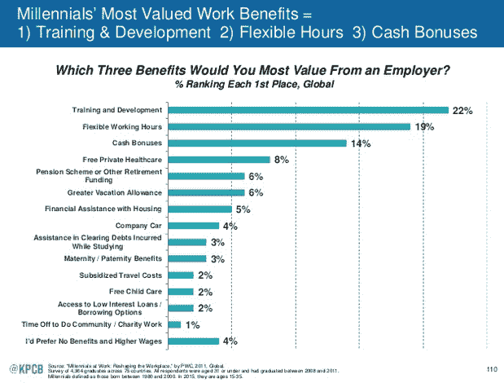
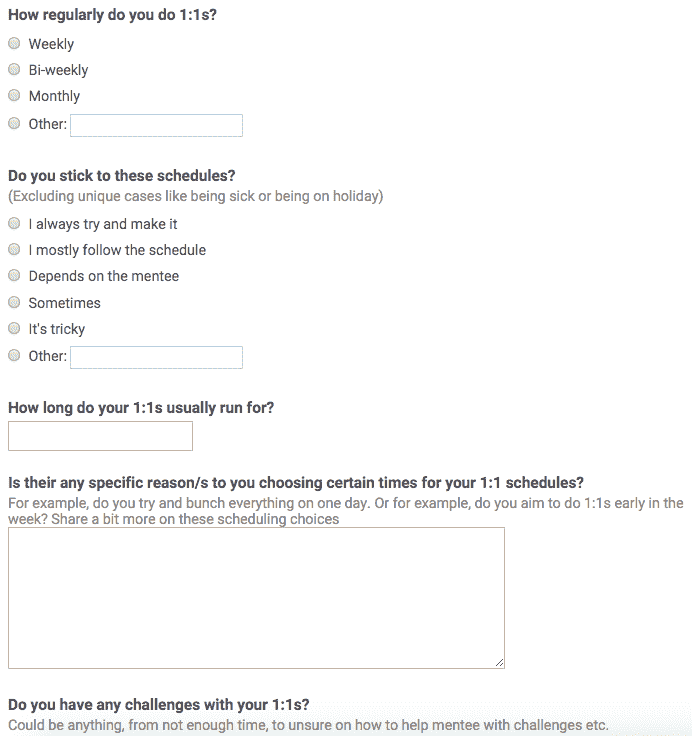

# 为什么我们没有绩效评估

> 原文：<https://open.buffer.com/coaching/?utm_source=wanqu.co&utm_campaign=Wanqu+Daily&utm_medium=website>

你好。这是一个更老的帖子，我们为了透明而保留了下来，但这意味着有时信息不再准确。前往我们的主页查看我们最近的帖子。

我记得那种感觉——之前的不眠之夜，内心的紧张。

我在等待年度绩效评估的结果。

绩效评估——通常是一年一次——是许多公司向员工提供反馈的数量。它们通常包括一个数字评级，以及一个小时左右的谈话，讨论过去一年哪些地方做得对，哪些地方需要改进。

这个系统有一些缺陷:

*   很难记住你一整年做了(或没做)什么。
*   得到一个“评级”可能会破坏原本可能是一次深思熟虑的谈话。
*   无论你得到多少积极的反馈，都很容易把消极的反馈加进去。
*   这通常是你可以更快使用的信息。

最近，在评估员工表现的领域里，发生了一场静悄悄的革命。各种各样的创新公司正在重新制定标准审查，而其他公司则完全抛弃了标准审查(T3)。

我们的实时文化——包括社交媒体的兴起——可能是很大一部分原因。埃森哲首席执行官皮埃尔·南特姆在《华盛顿邮报》上写道:

> “如果你把新一代放在我们过去 30 年一直使用的绩效管理的盒子里，你就会失去他们。人们希望不断地知道，‘我做得对吗？’？我的方向正确吗？你认为我在进步吗？没有人会等到年度周期才得到反馈。"

事实上，最近的一项研究发现，千禧一代最希望从工作中获得的是更多的学习和发展机会:

在 Buffer，我们发现[持续的、每周的反馈](https://blog.bufferapp.com/a-simple-guide-to-better-coaching-and-feedback-in-your-company)是持续改进的最佳途径——此外，你可以跳过紧张的胃痛！

我们花了一些时间来弄清楚如何构建我们的指导和反馈流程，它们很可能会再次改变！但是我们想分享一下我们现在是如何做事情的，希望对其他人有所帮助。

## 我们的核心教练单元:一对一

在 Buffer 的早期，我们开始在每个队友和他们的团队领导之间进行一对一的会谈，至少每两周一次。

我们已经对这些会议的结构进行了多次不同的迭代。一般来说，它们持续大约一个小时，包括成就、挑战和团队领导给队友的反馈。

大多数时候，他们看起来像一个团队领导在问一个简单的问题，比如“这周过得怎么样？”队友可以在他们喜欢的任何地方进行训练。

我很幸运能和 Leo 进行一对一的交流，他指导了我所有的事情，从基于角色的事情，比如媒体和公共关系，到日常生活的事情，比如礼貌的坚持和自信。这是一种特殊的关系，我知道这种关系极大地挑战了我的成长。

### 对于团队成员，而不是团队领导

与大多数类型的反馈会议不同，我们的一对一会议的一个要素是，它们几乎完全由队友驱动，团队领导很少有时间“控制”

本·霍洛维茨写了一篇名为[一对一](http://www.bhorowitz.com/one_on_one)的精彩文章，总结了这背后的动力:

> “良好的一对一会议的关键是理解这是员工的会议而不是经理的会议。”

当大部分时间都花在团队成员身上，并由他们来设定议程时，这就变得非常有力量。

例如，我意识到我每周三都会和我的主管聊天，我要想出一些话题。因此，我会在一周内记下我想庆祝的事情、我想得到建议的事情以及我认为可能需要重点讨论的问题。

这往往会让那些可能被忽视或遗忘的话题、想法和观点浮出水面。这也有助于我对一周的进步负责，所以我总是有新的东西可以分享！

我总是让一对一的感觉充满活力和支持。

### 不断进行的工作

一旦你在一段时间内进入了一对一的状态，信任和动力就会建立起来，感觉就像整个团队进入了一个全新的状态。

对于队友来说，这是一种开放式的方式来应对挑战，获得建议并一起集思广益。对于团队领导来说，这是一个很好的方式来获得信号，了解哪些工作做得很好，哪些在工作流和结构方面需要一些额外的思考。

但我们一直在努力让这一过程对双方都更令人满意。下面是我们最近发出的关于一对一的调查:

最近，[这篇关于更好的一对一的文章](https://getlighthouse.com/blog/10-10-10-rule-for-one-on-ones/)一直在我们的虚拟办公室流传，激励着我们。如果我们对系统进行了更改，我们一定会与您分享！

## 额外的个人成长机器:智囊团

除了一对一，队友们还有另一个选择，那就是结对、庆祝成就并与同伴一起应对挑战。我们称这些会议为“智囊团”，它们可以追溯到我们创业的初期。

在很早的时候，Buffer 的联合创始人乔尔和利奥会在旧金山的 Samovar 度过他们的周五晚上，喝茶，在智囊团聊天中度过他们所谓的一周中“最有成效的时间”。

这些会议几乎一直持续到今天，无论它们在世界的什么地方。

我们已经对我们的策划会议的结构进行了许多不同的迭代，它们今天仍在发展。一些队友现在使用这种结构:

*   *20 分钟分享和庆祝你的成就(每人 10 分钟)*
*   *40 分钟讨论你当前面临的最大挑战(每人 20 分钟)*

这两个部分服务于不同的目的，它们结合在一起创建一个非常富有成效的会议。

我很幸运能和 Buffer 的杰出博主[凯旺](https://buffer.com/about/team#kevan)一起策划，我们在一起的时候我收获了很多。这是一个非常脆弱的空间——几乎就像每周一次的治疗！

我们遵循上面的通用格式，也发明了一些我们自己的规则:

*   没有所谓的小成就！(我们一直称它们为小型，直到我们创建了这个规则)
*   **没有互相验证。(换句话说，如果我说“我认为我可以做得更好”，凯旺不能说“不，你很棒！”相反，他会坚持问一些问题，比如为什么我认为我需要改进，以及我该如何去做。)**

### 点对点、个人和专业

不是所有的队友都选择参与策划——他们是可选的。

在我们的自我管理试验中，我们 T2 完全放弃了一对一，而是鼓励每个人做策划。现在我们已经意识到师徒关系是非常有价值的，并且回到了一对一的关系中，但是我们中的一些人继续在大师中寻找价值。

点对点的性质意味着我们可以与经历类似旅程的其他人分享挑战和经验。

理想情况下，他们最好和与你工作至少有些相似的人一起工作，这样你们可以分享最多的挑战和成就。

在这些会议中，任何事情都有可能发生——专业的和个人的讨论都很常见。

Buffer 文化中的一个独特价值观是“专注于自我提升”，这意味着鼓励谈论个人提升——例如，改善睡眠、学习一门新语言、尝试新的锻炼形式或更频繁地写作。

## 有什么区别？

策划和一对一的关键区别在于关系:策划是点对点的关系，而一对一是 T2 式的导师/学员关系。

对于一些人来说，一对一满足了他们应对挑战的大部分需求。在这种情况下，坚持下去感觉很棒。

对于新队友，我们鼓励他们探索大师，如果他们感到被吸引，但也要非常反思他们所做的贡献。如果策划者并不觉得自己有很高的价值，那么他们可以自由地把注意力放在一对一上。

## 两者的关键是:倾听，而不是解决

在这两种类型的会议中，有一个我们试图遵守的关键规则:仔细倾听并提出问题，但不要试图解决别人的问题。

目的是帮助其他人以不同的方式思考挑战，并提出他们自己的解决方案。

我们可能会问问题，也许会分享想法或类似的经历，但我们试图停止解决问题。

真的很难忍住！Buffer 是一个非常有同情心的团队，我们都想提供帮助。但是我们知道，通过提问，你经常会发现你自己的想法并不是正确的解决方案。

此外，当其他人知道是他们自己想出的解决方案时，他们会有百倍的动力离开。伽利略完美地解释了为什么我们试图以这种方式接近它:

> “你不能教一个人任何东西；你只能帮助他在自己内心找到它。”

贵公司是否有绩效评估，或不同类型的反馈流程？

我们很想听听你的想法！