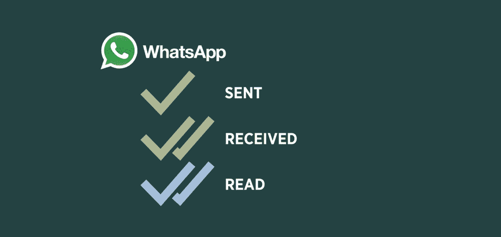
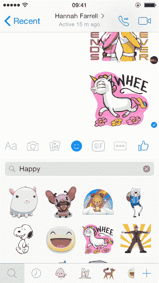
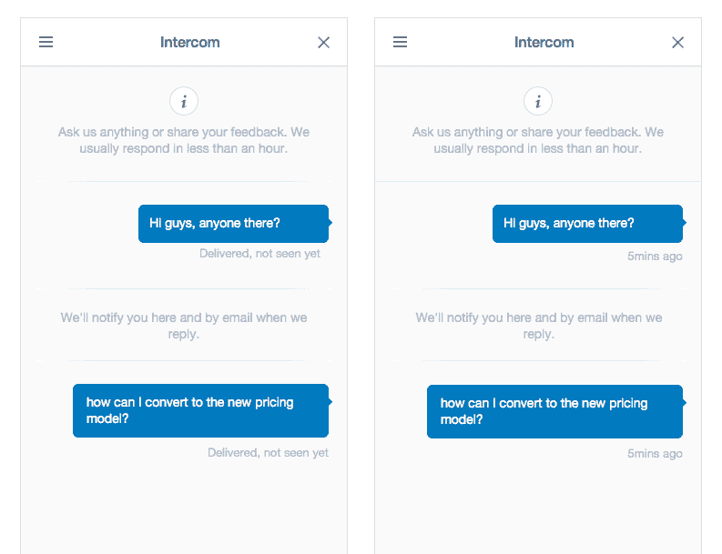
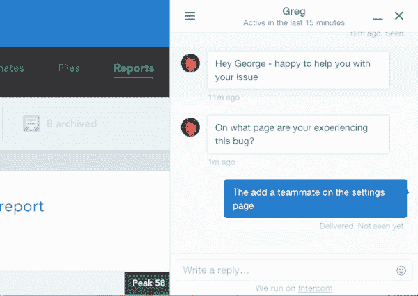

# 产品原理:阅读收据-内部对讲

> 原文：<https://blog.intercom.io/product-principles-read-receipts/?utm_source=wanqu.co&utm_campaign=Wanqu+Daily&utm_medium=website>

当我们发布我们的[实时信使](https://www.intercom.com/messenger)时，我们试图将传统的实时聊天模式推到一边，取而代之的是从现代通讯应用中获取线索。

我们的布道是，企业与客户交谈应该像朋友之间交谈一样自然和熟悉。

但是我们很快发现我们做得还不够。我们意识到我们的信使根本没有心跳。当客户没有参与实时对话时，信息会感觉像是被发送到了空中。当我发送消息时会发生什么？我会马上收到回复吗？

当给朋友和家人发信息时，我们习惯于实时的、持续几个小时或几天的对话。但是涉及到客户和业务沟通的时候呢？没有那么多。

我们制定了几个指标来帮助控制对我们的 Messenger 的期望，并希望分享一些产品原则，这些原则贯穿于这些功能之一——阅读回执。

## 评估现有模式

阅读回执是告诉你一条消息已经被看到的信号，现在是消息应用的核心功能。但是不同平台的实现是不同的；有些人比其他人更成功。

Telegram 和 WhatsApp 都使用复选标记组合来表示“已发送”和“已查看”。但是我很想知道有多少用户真正知道这些检查意味着什么。WhatsApp 变得更加模糊；只有彩色支票表示您的消息已被看到。这几乎是故意隐晦的:

苹果有最简单的设计。这里没有歧义:

苹果公司的做法有趣的是，阅读回执在默认情况下是关闭的。人们必须努力打开它们。由于大多数人都懒得这么做，已读回执的真正价值在大多数对话中都消失了。

脸书颠覆了这一模式。这不仅仅是因为他们用俏皮的脸来表示信息已经被阅读。

他们不只是默认打开已读回执；你甚至不能关掉它们。当时是有争议的。已读回执是

[seen by many](http://gizmodo.com/turn-off-read-receipts-1707250022)

作为信息世界的大厅监视器，让你为任何沟通失误负责。但脸书明白，如果信息传递更加透明，效果会更好。

## 为什么阅读收据很重要

如果已读回执对于个人信息如此有争议，那么为什么还要费心为企业建立它们呢？尤其是因为企业的标准做法是尽可能少地披露幕后发生的事情。

在 Intercom，我们刻意为最终用户优化，而不仅仅是业务。我们相信，当我们的用户和客户有很好的体验时，我们的客户就能得到最好的服务。透明是创造美好体验的一部分。

已读回执，即使没有人回复，也是一种交流的表征。它将人们从未知的状态中带出来，并微妙地表明对话的直接性(或不直接性)。只要“还没看到”标签存在，用户就知道他们不会得到即时回复。

阅读回执也是关于改变行为的。企业需要更好地使用快速、简短的对话信息。即使是一些简单的事情，比如，“让我检查一些事情，我会给你打电话。”阅读回执鼓励商家快速确认。这是关于改变如何与客户交谈的商业思维。冗长、正式和延迟的沟通世界正迅速留给律师和官僚。

## 我们如何建造它

到了设计的时候，我们采用了三个产品原则来确保每个人都获得功能的价值，并提供我们想要的透明和对话式的消息传递模型。

### 1.它不能是可选的

构建一个不能被禁用的特性从来都不是一个容易的决定。我们讨论了阅读回执中的可选性，但很快意识到它引入了一种类似于囚徒困境的情况:

> *“囚徒困境”是博弈论中分析博弈的典型例子，它表明为什么两个人可能不合作，即使这样做似乎对他们最有利。”*

就像在囚徒困境中一样，如果有选择的话，企业和消费者可能会选择不阅读收据，选择个人回报而不是集体利益。当没有人决定加入时，系统就崩溃了。它变成了一种单方面的消息传递体验，没有人能够获得该功能的真正价值。

由于 Intercom Messenger 的宗旨是透明和对话，我们开始阅读收据，因此它们必须成为每次对话的一部分。无论是客户还是企业，都没有关闭它的选项。这个没有设定。

### 2.你不能半途而废

当我们最初设计收据时，我们在消息下显示了“尚未看到”标签。一旦被看到，我们就把标签拿掉。我们从来没有展示过“看过”这个词。这是我们深思熟虑后做出的决定；我们试图降低用户对响应的期望。

但是一旦我们在真实的对话中测试了这种模式，我们很快意识到它不起作用。它没有降低期望值，而是引入了更多的模糊性。当没有消息被标记为“已看到”时，人们怎么知道电话那头还有另一个人呢？我们很快意识到，我们需要沟通“看到”和“没有看到”的状态。

### 3.为现实而设计

消费者消息应用程序是我们的产品模型，但 Intercom 在一些重要方面有所不同。对讲机有一个[团队收件箱](https://www.intercom.com/inbox)——任何数量的人都可以回复一个新的对话。团队经常对对话进行筛选——他们回顾新的对话并决定先回答哪个。

所以我们决定为新的对话设计一些呼吸空间。在第一个代理开始响应之前，我们不会将新对话中的消息标记为“已看到”。这样，团队可以安全地筛选新的对话，而不会无意中提高用户对快速响应的期望。

## 长期影响

阅读收据是一个很好的例子，说明一个小小的短语实际上对产品有很大的影响。他们是一座冰山。它们在信息传递的管弦乐队中只扮演了很小的一部分，但对于我们使客户和企业之间的沟通更加真实和透明的使命来说，它们是至关重要的。

* * *

在 Intercom，我们总是抓住这样的产品问题。我们现在发展得很快，还在招聘产品经理。为什么不加入我们呢？