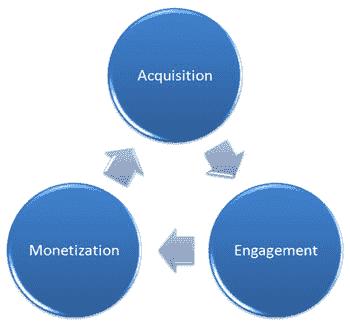

# 每种产品的 3 个基本仪表盘| Sachin Rekhi

> 原文：<http://www.sachinrekhi.com/3-essential-dashboards-for-every-product?utm_source=wanqu.co&utm_campaign=Wanqu+Daily&utm_medium=website>

我发现，在我管理的许多产品中，我最终至少开发了三个关键的仪表板，我每周都会详细检查它们。它们帮助我持续了解产品相对于我们的目标表现如何，并在持续的基础上对它们进行审查，这有助于我建立自己的直觉，知道最终会如何朝着正确的方向前进。

这三个仪表板是获取、参与和货币化。

**Acquisition**

收购仪表板记录了您在吸引新用户使用您的产品方面的表现。如果你有你的产品的营销网站，这个仪表板从主页或登陆页面捕捉到注册用户的漏斗。这有助于你了解那些正在访问你的营销网站，但还没有完全注册的用户的下车点。

收购仪表板的另一个同样重要的部分是提供对每个收购渠道及其相对于过去业绩和其他渠道的业绩的洞察。捕获的具体指标将取决于您跟踪的具体渠道。付费广告可能包括印象、点击、点击率和注册对话率。搜索引擎优化可能包括关键词排名，内容页面的有机流量，以及来源注册。产品内病毒获取可能包括发送的邀请、接受的邀请以及中间的漏斗。重点是了解和掌握每个渠道的每个关键驱动因素。

您还需要确保能够比较一个通道与另一个通道的相对性能。早期，这可以是一个简单的仪表板，涵盖每个渠道的注册。最终，你会希望了解每个频道注册的最终价值，因为你可能会看到每个注册的质量和价值取决于它的来源。实现这一点的一个常用方法是基于客户最终价值的 LTV。在更复杂的情况下，您需要整合多渠道归属意识到用户在最终转化为注册用户之前，通常在您的收购工作中有多个接触点，多渠道归属为您提供了了解每个渠道的相对权重所需的工具。

对于每一个捕获的指标，我发现显示周与周之间的绩效以及最终的年与年之间的绩效(如果有)是很有帮助的。年复一年有助于确定季节性，因此您可以了解指标是否有长期变化，或者只是季节性的规律。

**Engagement**

参与度仪表板记录了您的用户如何参与您的产品。我喜欢将此分为三个关键方面:激活、定期参与和保留。

激活涵盖了从首次注册到首次有意义地参与应用程序的漏斗指标。一些人称之为快乐因素。这个想法是为了确保每一个新注册的用户可以立即开始第一次有意义的接触。例如，如果你是一个博客平台，第一次有意义的接触可能是在他们发表第一篇文章的时候。你会注意到在注册博客平台和发表文章之间有很多步骤，包括给你的博客加标题，设计你的博客，起草第一篇文章，最后发表。激活指标涵盖了产品的每一个关键步骤，以及从注册到首次有意义互动的转化率。

常规互动包括与产品内部关键体验的互动。这可能是用户每周采取的行动。您需要确保不要让自己淹没在太多的指标中。选择对你的应用程序中有意义的活动最重要的子集，以及有意义的行动的关键驱动因素。除了绝对数量之外，我希望看到基于每个用户的操作和基于独立用户的这些指标。这有助于您区分是增加现在采取该行动的用户数量，还是增加现有参与用户参与该行动的深度。

保持期包括在某个保持期内仍在积极使用服务的激活用户的百分比。这有助于你了解作为一个活跃用户，你失去了谁，最终没有看到你的应用程序的价值。你需要了解你的产品的规律来决定什么时候一个用户被认为不再被保留。这实际上取决于典型的使用频率，以及是每天、每周、每月等等。

我发现，在整个受众中以及在群组基础上查看这些指标，有助于判断您是否正在提高进入漏斗的新用户的参与度。通过这种方式，你可以在接下来的几周内观察新用户群，并将他们的表现与前几周进行比较，以了解你是否最终改善了新用户的体验。

**Monetization**

货币化仪表板涵盖了您如何有效地货币化您的用户。这最终取决于你的商业模式。如果你有免费和付费用户的免费增值业务，你应该包括免费用户到付费用户的转换率，以及最终购买的订阅计划的组合。您还应该包括经常性和取消的订阅指标。如果你通过广告赚钱，你应该包括可用广告库存、售出库存、eCPM、广告客户总数等指标。

关键是要在这些仪表板中包含货币化的最终驱动因素。对于可以是每周页面浏览量的广告，因为这与可用库存直接相关。对于订阅业务，这可能是你的定价页面的浏览量，或者是你的最活跃用户或最有可能转化用户的数量。

对于订阅业务来说，了解你的流失率，最终了解你的客户终身价值，对于了解你从客户那里获得的最终价值也变得很重要。

我希望这能让您快速了解我跟踪的每个产品的三个仪表板，以帮助您更好地了解产品在购买、参与和货币化方面的表现。