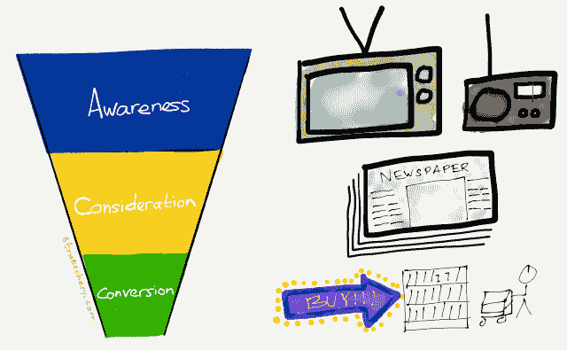
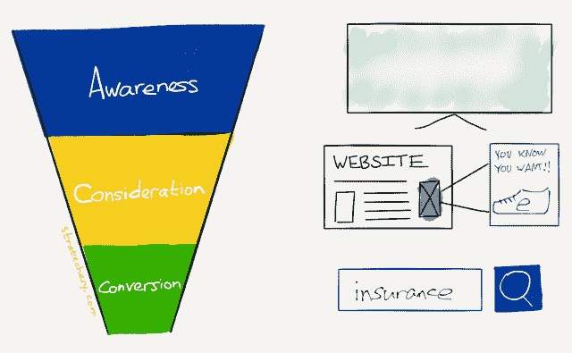
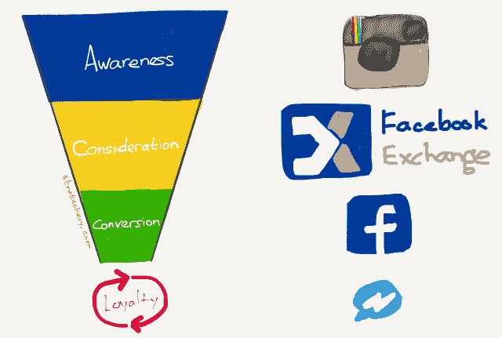

# 错过的现实——本·汤普森的策略

> 原文：<https://stratechery.com/2016/the-reality-of-missing-out/?utm_source=wanqu.co&utm_campaign=Wanqu+Daily&utm_medium=website>

说到广告支持的服务，各地的专家都喜欢这句格言“如果你不是顾客，你就是产品”。不过，有趣的是，在评估上述服务的可行性时，这句格言很快就被遗忘了。

Twitter 就是一个很好的例子。关于我的文章[脸书如何压制推特](https://stratechery.com/2016/how-facebook-squashed-twitter/)，我收到了来自[约翰·格鲁伯](http://daringfireball.net/linked/2016/01/27/mossberg-twitter):T5】1T7】的一大堆回复

> 多年来，我一直认为根本问题在于 Twitter 被比作脸书，但这是不应该的。脸书吸引着数十亿人。公平地说，“大多数人”。Twitter 吸引了数亿人。这太不可思议了，其中蕴含着巨大的价值——但这不是脸书。将额外的功能塞进 Twitter 永远不会让它像脸书一样受欢迎——它只会冲淡让 Twitter 像现在一样受欢迎和有用的东西。

从一个用户的角度，我完全同意。但请记住这句格言:顾客才是最重要的，从广告商的角度来看，脸书和 Twitter 绝对可以相提并论，这是后者问题的根源。数字广告正成为一个相当简单的命题:脸书，谷歌，或者别麻烦了。

#### 消费者服务大屠杀

上周五，LinkedIn 经历了股票市场有史以来最糟糕的一天，暴跌 40%，尽管该公司的收入和调整后的收益都超过了预期；这一下滑是由远低于投资者预期的指引引发的。

LinkedIn 的问题在于，公司的股价不是记分卡； [2](#fn2-2021 "A point consistently missed by far too many AAPL stockholders, at least the ones on Twitter and in my mailbox") 更确切地说，它是市场对一家公司未来*收益的估计，股票价格与当前收益的比率是投资者预期该收益增长的程度。以 LinkedIn 为例，该公司服务于招聘人员的相对成熟的核心业务继续表现良好；这就是该公司超出预期的原因。然而，这个市场有一个天然的限制，这意味着增长必须在其他地方找到，LinkedIn 希望其他地方是广告业。LinkedIn 的场外广告计划 Lead Accelerator(紧随 LinkedIn 之前决定停止展示广告之后)低于预期的估计和关闭表明，上述增长可能不会实现。*

与此同时，Yelp 在发布了并不那么糟糕的收益(并发布了指引)后，昨天仅下跌了 11%。去年夏天，该公司大受打击，股价单日暴跌 28%，低于预期，部分原因是 Yelp 决定终止其品牌广告计划。

与此同时，雅虎的核心业务实际上一文不值，因为收入和收益持续下降，前面提到的 Twitter 的估值已跌至 100 亿美元以下；这两家公司都与各自传统上的关联公司形成了鲜明的对比:谷歌价值 4600 亿美元(一度是世界上最有价值的公司)，脸书价值 2670 亿美元。

这种明显分歧的原因最终都与“客户”有关:广告商实际上购买了所有这些“免费”消费者服务的广告。

#### 模拟广告简史

报纸是广告商胸中最古老的工具，而且多年来一直是唯一的工具。这不是问题，因为报纸有神奇的能力，可以根据某一天的广告销量来扩张或收缩；从商业角度来看，社论一直是填充剂。

20 世纪上半叶，美国报纸总收入的增长大致跟随 GDP，这是你所期望的，因为只要有记录，广告在经济活动中的比重就一直在 1.2%左右。然而，在 20 世纪下半叶，由于先是广播，然后是电视的出现，报纸的增长速度稍微放缓了一点。

与报纸广告相比，广播和电视广告都有明显的优势，无论是在讲故事方面，还是在吸引潜在消费者注意力的有效性方面。尽管报纸不再获得所有的广告收入，但它们仍然增长良好，因为广播和电视都有三个重要的局限性:

*   因为广播和电视都是临时编排的，所以广告库存有限；因此，正如你在任何供应短缺的情况下都会预料到的那样，价格会高得多
*   与报纸广告相比，制作一个有效的广播或电视广告时段要昂贵得多
*   很难衡量广播和电视广告的投资回报；报纸也好不到哪里去，尽管优惠券之类的东西可以被更密切地追踪

最终，广告商(在消费品行业被称为“品牌经理”，率先使用这些技术)开发出了利用所有三种媒介，再加上零售商现场促销的策略，将顾客“推下漏斗”:

[T2】](https://i0.wp.com/stratechery.com/wp-content/uploads/2016/02/stratechery-Year-One-2691.png?ssl=1)

电视和广播在建立认知度方面特别有效——让顾客意识到你的产品存在——也在建立品牌亲和力方面特别有效——在购买时潜意识中对你的产品比对竞争产品的偏好。与此同时，报纸在“考虑”方面是有用的:帮助消费者决定购买他们现在知道的产品(优惠券在这里非常有用)。最后，品牌经理在他们与零售商的关系上花费了大量的时间和金钱，以帮助消费者通过漏斗进行转化，并模糊地希望所述消费者将被证明是忠诚的。

#### 数字广告 1.0

数字广告的第一波浪潮瞄准了漏斗的底部:计算机记录一切的事实使得展示广告何时直接导致购买(或点击)变得容易，没有哪家公司比谷歌受益更多。搜索广告之所以如此有效，是因为消费者已经进入了购买漏斗的底部:他们已经想要保险，或旅行，或律师，所以谷歌可以收取大量的费用，以获得在有保证的线索前投放广告的权利，并在每次该线索点击时收取费用。

在漏斗中进一步实施数字广告的努力更加复杂；重新定位显示你之前看过的商品的广告是让顾客经历考虑阶段的最直接、可能也是最有效的尝试，尽管这种直接会让很多人害怕。然而，漏斗的顶端从未真正起飞:它真的不清楚如何在数字上以一种成本有效的方式建立意识。

[T2】](https://i0.wp.com/stratechery.com/wp-content/uploads/2016/02/stratechery-Year-One-2701.png?ssl=1)

互联网上的品牌广告有两个大问题:首先，根本没有好的广告单元。横幅广告是对平面广告的苍白模仿，平面广告本身不如更具沉浸感的媒体，如广播，尤其是电视。其次，鉴于品牌广告的投机性更强，将赌注分散到最大数量的顾客身上更划算；换句话说，把钱花在身临其境的电视广告上仍然是一个更好的主意，这种广告可以基于在单一时刻面向一大群潜在消费者的节目，而不是花更多的时间——这就是钱！—制作一大堆更有针对性的横幅广告。

然而今天，这种情况开始改变。

#### 数字广告 2.0

脸书·首席运营官·雪莉·桑德伯格在脸书最近的收益电话会议上讲述了一件有趣的轶事:

> 临近黑色星期五，英国第二大在线零售商 Shop Direct 用 cinemagraph 视频调侃即将到来的销售，以建立知名度。然后，他们重新定位了那些只看了一天交易视频的人。在黑色星期五，他们利用我们的旋转木马和 DPA 广告来推广人们感兴趣的产品。他们从这次活动中获得了 20 倍的广告支出回报，帮助他们实现了最大的黑色星期五和有史以来最成功的销售日。

桑德伯格在这里详细描述的东西确实非常不同寻常:脸书帮助 Shop Direct 在漏斗的每个部分移动客户:从通过 Instagram 视频广告的认知到通过重新定位的考虑，最后到脸书上的动态产品广告的转化(在不太遥远的将来，通过 Messenger 建立直接的客户关系以建立忠诚度)。

[T2】](https://i0.wp.com/stratechery.com/wp-content/uploads/2016/02/stratechery-Year-One-2711.png?ssl=1)

谷歌也承诺了类似的东西:通过 YouTube 这样的属性获得认知，通过 DoubleClick 获得考虑，通过 AdSense 获得转化。同样重要的是，两家公司都承诺，利用各自的平台将为投资回报等式的双方带来好处:鉴于两家公司卓越的定位能力和衡量转化率的能力，回报将更好，投资将更小，因为你可以从一个广告购买界面管理你的整个漏斗。

然而，这也是与模拟广告时代最大的不同:脸书和谷歌平台彻底改变了电视和广播的劣势:

*   脸书和谷歌拥有最多的库存，在用户和广告负载方面仍在增长；没有对其他房产有利的时间限制(特别是脸书正在加大努力，在非脸书房产上使用脸书数据做广告)
*   只为脸书和谷歌制作广告比为每个潜在的广告平台定制更便宜
*   脸书和谷歌拥有最好的追踪功能，不仅延伸到数字购买，也越来越多地延伸到离线购买

两家公司，尤其是脸书，都占据着主导的战略地位；他们在每一个方面都优于其他数字平台*:有效性、覆盖范围和投资回报率。难怪我上面列出的小公司——LinkedIn、Yelp、雅虎、Twitter——都在苦苦挣扎。*

 *#### 赢家通吃的含义

一段时间以来，我一直认为科技行业总体来说还不错，基于广告的服务的状况是一个很好的例子来说明我的意思:本文中的六家公司(谷歌、脸书、雅虎、Twitter、LinkedIn 和 Yelp)总体来看在过去一年上涨了 19%，尽管后四家公司总共下跌了 53%；谷歌和脸书的股价合计上涨了 31%，这一事实足以弥补这一点。

这是有道理的:虽然广告作为一个整体是一个零和游戏，但长期以来，不仅是平面广告，广播和电视也在向数字广告转变，这就是为什么这一篮子数字广告公司在上升。然而，数字技术受制于聚合理论的影响，聚合理论的一个关键组成部分是赢家通吃的动态，脸书和谷歌确实正在接受这一切。

我预计这一趋势将会加速:首先，在数字广告领域，除了脸书和谷歌之外，很难看到任何人实现有意义的增长，Snapchat 可能是个例外，它刚刚与维亚康姆(Viacom)签署了一项协议，这与我对该公司在 T2 的分析非常一致。其他每个人都将经历一场艰苦的战斗来展示他们为什么值得广告商花费时间。

更广泛地说，聚集理论描述的赢者通吃的动态在投资者中激发了一种强烈的 FOMO 感(害怕错过),导致许多独角兽有意拥有各自的行业；我认为，最近估值和融资的降温是要接受这样一个事实，即许多独角兽与脸书和谷歌的广告竞争对手处于同一条船上:它们已经错过了本领域的主导者(或者说，它们的领域从一开始就不可行)。

在某些方面，这是科技行业自身的不平等故事:普通和中等水平的公司和初创公司将日益分化。这不是泡沫，这是一种再平衡，赢家将比我们以前见过的任何公司都更大、更富有。

### *相关**