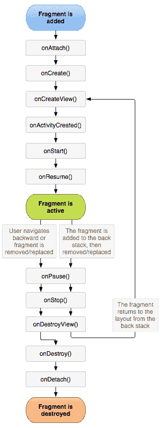

# API 设计的七大致命烦恼——鸡爪——鸡翅软件

> 原文：<http://chickenwing.software/scratches/programming/annoying-apis?utm_source=wanqu.co&utm_campaign=Wanqu+Daily&utm_medium=website>

设计 API 是一门艺术，也是一门科学。许多聪明人都失败了。那些成功的人是通过牢记 API 的主要目标来做到这一点的:惹恼开发者。

我的兄弟姐妹们，为了纪念这种高尚的追求，我们聚集在一起列举(看我在那里做了什么)API 设计的七个致命烦恼。我从未想过我会写一篇文章，但至少它在标题中提到了 T2 博学的宗教。

首先，几个规则:我们在这里谈论的是成功的、工作的 API。因此，像“它不工作”或“它打开了一个巨大的安全漏洞”这样的事情不能算作烦恼。不要从字面上理解“致命”这个词。而没人用的 API 是不合格的。不，失败的 API 不是讨厌，只是不好。这里我们只讨论次要的事情。我们都知道并厌恶的那些次要的、令人讨厌的、敲键盘的、引用城市词典的烦恼。

许多例子来自 Android，因为这是最近让我感到烦恼的人，但我并不想挑他们的毛病。他们没有垄断这些罪恶。

**烦恼第一——trsnss**

是的，事物的命名是困难的。尽管如此，常识仍然大有帮助。你不得不称赞 Unix 的人们为保存一个按键所做的英勇努力——为什么说 *dupe* 当我们可以保存那个有价值的 E 并且说 [*dup*](http://linux.die.net/man/2/dup) 的时候？

数字二相关:

**烦恼第二——让 namesmuchtoolong 变得实用**

相比之下，苹果给了我们像

```

outputImageProviderFromBufferWithPixelFormat:pixelsWide:pixelsHigh:baseAddress:bytesPerRow:releaseCallback:releaseContext:colorSpace:shouldColorMatch:

```

**烦恼之三——使用同义词**

哦，安卓，我在看着你。

显然,“空白活动”和“空活动”是有区别的。有什么区别？我曾经知道，但现在我画了一个空——我的意思是一片空白。

Android 给了我们工具栏，工具栏在某个时候被重命名为应用程序栏，[也被称为动作栏](http://developer.android.com/training/appbar/index.html)，给了我们可爱的代码，如:

```

    // Set the toolbar as my app bar
    setSupportActionBar(myToolbar);

```

缩写还是不缩写。这显然不是谷歌总部的问题。 *Por que no los dos* ？交叉引用**获取外部目录**和**获取外部文件目录**。顺便说一下，它们返回两个不同的位置，因为有时候你想在一个目录中存储文件，有时候你想存储——我不知道，其他的东西。

点击和触摸之间有什么区别？我不知道(至少在手机上不知道)，Android 设计团队也不知道，他们有时也称之为点击。

嘿，你用的是什么版本？哦，是凯特。还是 4.1？不，也许是 SDK 版本 19…哦，等等，这些都是同一个意思。祝你好运让他们保持直线。

最后一个 Android 例子。想要通过 URL 使项目资产可用吗？只需将它放在源代码树的/assets/目录中，并构建一个以“file:///android_asset/”开头的 URL。是的，一个是复数，一个是单数。一个前面有 android_ 一个没有。为什么？因为他们是谷歌，他们可以为所欲为，这就是原因。你要做什么，用火狐操作系统吗？

**烦恼之四——文档质量差(或缺乏文档)**

说到资产 URL，除了在[web settings . setallowfileaccess](http://developer.android.com/reference/android/webkit/WebSettings.html#setAllowFileAccess(boolean))方法中偶然提到之外，你不会通过阅读文档来找到它们——这种方法对你是否能以这种方式访问文件没有任何影响。是的，的确，旧的半文档化的功能。

然后是[上下文](http://developer.android.com/reference/android/content/Context.html)类。这是班级的卡戴珊:没有人很清楚它是做什么的，但它无处不在。没有人知道为什么，但是几乎所有的 API 调用都需要它。这就是原因。

想在活动中添加工具栏/操作栏/应用程序栏吗？[这里](http://developer.android.com/training/appbar/index.html)告诉你如何使用向后兼容库。如果您不需要向后兼容，该怎么办？当然，有一种方法可以通过内置类做到这一点？可能是，但你不会在官方文档中找到。

说到向后兼容性

**烦恼 5.1beta3 版本不兼容**

如果你开发过 Android，你会知道。哦，你知道的。我甚至不能写这个。记忆太原始了。仅仅..你知道的。

为什么它对 KITKAT 有效，而对棉花糖或软糖无效？！？！？！？！？！？

烦恼 6-过度复杂化(简单的事情变得很难！)

啊，碎片，我多么爱恨你。这是来自 Android 文档的真实图表:

[T2】](http://developer.android.com/guide/components/fragments.html)

但是比碎片更糟糕的是通知。查看 Android 文档中的“创建简单通知”一节。以防他们不清楚这有多简单，他们确保在第一句话中重复这个词:下面的片段演示了一个简单的通知。想看看这个如此简单的代码片段吗？

```

NotificationCompat.Builder mBuilder =
        new NotificationCompat.Builder(this)
        .setSmallIcon(R.drawable.notification_icon)
        .setContentTitle("My notification")
        .setContentText("Hello World!");
// Creates an explicit intent for an Activity in your app
Intent resultIntent = new Intent(this, ResultActivity.class);

// The stack builder object will contain an artificial back stack for the
// started Activity.
// This ensures that navigating backward from the Activity leads out of
// your application to the Home screen.
TaskStackBuilder stackBuilder = TaskStackBuilder.create(this);
// Adds the back stack for the Intent (but not the Intent itself)
stackBuilder.addParentStack(ResultActivity.class);
// Adds the Intent that starts the Activity to the top of the stack
stackBuilder.addNextIntent(resultIntent);
PendingIntent resultPendingIntent =
        stackBuilder.getPendingIntent(
            0,
            PendingIntent.FLAG_UPDATE_CURRENT
        );
mBuilder.setContentIntent(resultPendingIntent);
NotificationManager mNotificationManager =
    (NotificationManager) getSystemService(Context.NOTIFICATION_SERVICE);
// mId allows you to update the notification later on.
mNotificationManager.notify(mId, mBuilder.build());

```

哦，亲爱的，我被这美丽的单纯所淹没了！

为了强调这一点，Android 纪录片制作人接着说“就是这样”。您的用户现已收到通知。哦，就是它！哇，我还以为会涉及到一些代码，但是现在你已经向我展示了这清晰的 27 行代码，我感到放心了。不要忘记导入您需要的三个类。哦，是的，如果你想要向后兼容，这是一个完全不同的类集，加上你升级你的 gradle 文件和做其他事情，我的意思是谁在乎它是愚蠢的，我放弃了，我会成为一个酒保。

什么？

哦，不要忘记将这 30 行 XML 复制粘贴到一个完全不同的文件中。

说到这里，API 设计的最后也是第七个致命的烦恼是…

**7。XML**

说够了。

### 像这样:

像 装...

### *相关*