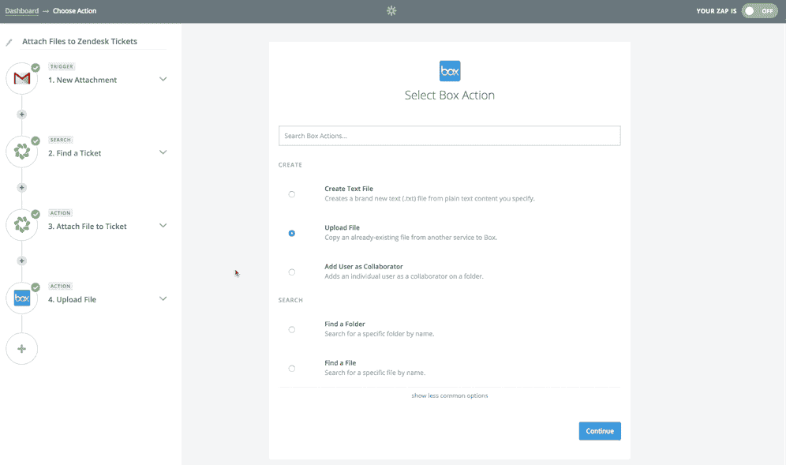

# 扩展 Zapier 以自动化数十亿项任务- Zapier 技术堆栈

> 原文：<http://stackshare.io/zapier/scaling-zapier-to-automate-billions-of-tasks?utm_source=wanqu.co&utm_campaign=Wanqu+Daily&utm_medium=website>

***编者按**:由[布莱恩·赫尔姆格](/bryanhelmig)，联合创始人&首席技术官在[扎皮尔](/zapier)*

* * *

Zapier 是一种网络服务，可以自动处理超过 500 个网络应用之间的数据流，包括 MailChimp、Salesforce、GitHub、Trello 等等。

想象一下[构建一个工作流](https://zapier.com/multi-step-zaps/)(或者我们称之为“Zap ”),当用户填写你的 Typeform 表单时触发，然后自动在你的 Google 日历上创建一个事件，发送一个延期通知，并通过向 Google Sheets 电子表格添加一行来结束。那是扎皮尔。像这样构建 Zaps 非常容易，即使对于非技术用户来说也是如此，并且可以无限定制。

作为首席技术官和联合创始人，我构建了大部分原始核心系统，现在领导着工程团队。我想带您了解一下我们的堆栈，我们是如何构建它的，以及我们今天仍在如何改进它！

## 窗帘后面的队伍

Zapier 的成功需要付出很多努力，因此我们在工程领域有四个不同的团队:

*   前端团队，他们在非常强大的工作流编辑器上工作。
*   **全栈团队**，它是跨职能的，但专注于工作流引擎。
*   保持引擎运转的 devops 团队。
*   **平台团队**，帮助 QA，并让合作伙伴加入我们的开发者平台。

总的来说，这涉及到大约 15 名工程师(并且还在增加！).

## 建筑

我们的堆栈不会赢得任何新奇的奖项——我们正在使用一些非常标准(但很棒)的工具来支持 Zapier。更有趣的是我们用它们来解决特定问题的方式，但是让我们先来看看基本的东西:

#### 前端

我们正处于从骨干向反应型转变的过程中。我们用 [Babel](/babel) 做 ES6，用 [Webpack](/webpack) + [Gulp](/gulp) 来编译前端。我们严重依赖 [CodeMirror](/codemirror) 来完成我们需要的一些更复杂的输入窗口小部件，并使用 [React](/react) + [Redux](/reduxjs) 来完成超级强大的 Zap 编辑器的大部分繁重工作。

#### 后端

Python 为我们的大部分后端提供动力。Django 是 HTTP 方面的首选框架。芹菜是我们分布式工作流引擎的一个大部分。大多数例行的 API 工作都是用 epic [`requests`](https://github.com/kennethreitz/requests) 库完成的(用一堆定制适配器和抽象)。

#### 数据

MySQL 是我们主要的关系型数据存储库——你可以在 MySQL 中找到我们的用户、Zaps 等等。 [Memcached](/memcached) 和 [McRouter](/mcrouter) 作为无处不在的缓存层出现。其他类型的数据放在其他更有意义的数据存储中。例如，计费和节流的进行中任务计数会在 [Redis](/redis) 中找到，而 [Elasticsearch](/elasticsearch) 会存储 Zaps 的历史活动提要。对于数据分析，我们爱我们一些 [AWS 红移](/amazon-redshift)。

#### 站台

我们平台的大部分位于我们相当完整的核心 Python 代码库中，但也有许多有趣的分支提供了专门的功能。最好的例子可能是我们如何利用 [AWS Lambda](/aws-lambda) 运行合作伙伴/用户提供的代码来定制应用程序行为和 API 通信。

#### 基础设施

由于 Zapier 运行在 AWS 上，我们的指尖有相当多的权力。 [EC2](/amazon-ec2) 和 [VPC](/amazon-vpc) 是这里的核心，尽管我们尽可能使用 [RDS](/amazon-rds) 以及大量的自动扩展组来确保服务器池处于最佳状态。[詹金斯](/jenkins)、 [Terraform](/terraform) 、[木偶](/puppet)和 [Ansible](/ansible) 都是 devops 团队的日常工具。对于监控，我们对 [Statsd](/statsd) 、 [Graylog](/graylog) 、 [Sentry](/sentry) (他们*那么好*)怎么夸都不为过。

## 一些粗略的数字

这些数字代表了一个粗略的最小值，以帮助读者衡量 Zapier 建筑的一般大小和尺寸:

*   每天自动完成超过 800 万项任务
*   每天超过 6000 万次 API 调用
*   每天超过 1000 万的入站网页挂钩
*   大约 12 个 c 3.2x 大盒子在 [ELB](/aws-elastic-load-balancing) 后面运行 HTTP
*   约 100 个 3.2 米的大型后台工作人员运行[芹菜](/celery)(在投票、挂钩、电子邮件、杂项之间分配)
*   大约 3 m3.medium [集群中的 RabbitMQ](/rabbitmq) 节点
*   大约 4 个 3.2 倍大的 [Redis](/redis) 实例-一个热实例、两个故障转移实例、一个备份/映像实例
*   大约 12 个 m2.xlarge [Memcached](/memcached) 实例在大约 6 个 c3.xlarge McRouter 实例之后
*   约 10 个 m3.xlarge [ElasticSearch](/elasticsearch) 实例在约 3 个 m3.xlarge 无数据 ElasticSearch 实例之后
*   约 6 m3 . XL 大型 ElasticSearch 实例，支持约 1 个 C3 . 2x 大型 Graylog 服务器
*   集群中约 10 个 dc1.large [红移](/amazon-redshift)节点
*   1 个主 db.m2.2xlarge [RDS MySQL](/amazon-rds) 实例，2 个以上副本，用于生产读取和分析
*   一些支持 RDS MySQL 的实例(更多细节见下文)
*   ...以及大量微服务和各种专业服务

## 改进架构

虽然体系结构的大致轮廓保持不变——我们只执行了一些大规模的迁移——但我们已经做了大量工作来发展两类产品:

1.  支持大型新产品功能
2.  为更多用户扩展应用程序

让我们深入到每一个的一些例子中，在不陷入困境的情况下，尽可能多的提供一些基本细节！

#### 像多步 Zaps 这样的大功能

当我们开始 Zapier(有趣的事实:它最初被称为 Snapier！)在一个创业周末，我们在不到 54 小时的时间里(喝了很多咖啡和几瓶啤酒)就设计好了基本架构。总的来说，还过得去。我们保持了非常非常简单的设计，这在当时是正确的。

除了太简单的地方。具体来说，我们让 Zaps 分两步走:一个触发器与一个动作配对，句号。

没过多久，我们就意识到错过了机会，但过渡将会非常复杂。我们必须实现一个支持任意数量的步骤(节点)的有向根树，但是要保持对现有 zap(已经有几十万个)的一对一支持。我们必须这样做，同时保留对数百个独立合作伙伴 API 的支持。

从数据模型开始，我们在 MySQL 中构建了一个非常简单的有向有根树实现。想象一下这样一个表，其中每一行都有一个自引用的`parent_id`外键，外加一个额外的`root_id`外键来简化查询，这样就差不多了。我们讨论过切换到适当的图形数据库(如 neo4j ),但决定不这样做，因为我们进行的查询种类很简单，而且是较小大小(大约 2-50 个节点)的孤立图形。

实现这一点的一个关键方面是步骤间的独立性。每一步都必须消耗一些数据(例如，读取哪个文件夹或添加哪个列表 ID)，使用一些 API 魔法，并返回一些数据(比如，创建的新文件或添加到列表中的新卡)，但除此之外不知道它在工作流中的位置。每一个独立的步骤都像石头一样笨。

中间是无所不知的工作流引擎，它通过将步骤串成任务来协调独立的芹菜任务——一个步骤进入下一个步骤，如 Zap 的有向根树所定义的。这个无所不知的引擎还包含了所有其他好东西，比如错误和重试处理、报告、日志、节流等等。

即使在我们钉上后端支持之后，我们还有另一个巨大的问题:**你如何为这个东西建立一个 UI？**

首先，你要确保团队中有一些令人惊叹的设计师和 Javascript 工程师。然后，在进入 React 之前，您将与嵌套的主干视图进行一段时间的较量。:-)严肃地说:[反应](/react)对于我们正在构建的各种复杂界面来说是天赐之物。

React 的一个独特之处是其性能特征对开发人员来说是友好的，但前提是您已经弄清楚了数据。如果你没有使用不可变的数据结构，你应该使用一些结构共享库来完成所有的突变，并在开发中使用 deep `Object.freeze()`来捕捉你试图直接突变的地方。

在构建这样一个复杂的 UI 时有大量的挑战，其中大部分是围绕着测试和反馈，但是仅仅是从不同的 API 中获取长尾数据以优雅地适应相同的位置就花费了大量的时间。几乎每一种奇怪的数据都必须被考虑在内。

最后，我们的任务是让新的编辑器出现在用户面前，进行 alpha 和 beta 测试。为了做到这一点，我们同时发布了两个版本的编辑器，并使用功能开关来选择用户。在我们对结果满意之前，我们做了几个月的测试和调整——你可以查看[多步 Zap 启动页面](https://zapier.com/multi-step-zaps/)来了解它的最终结果。

#### 扩展应用程序

如果服务没有可靠地启动和运行，这一切都是徒劳的。因此，我们的大部分注意力都集中在支持水平可伸缩性的应用程序设计和确保可用性的冗余基础设施上。

到目前为止，我们做出的一些比较明智的决定是，在遇到瓶颈时，加倍使用我们熟悉的技术，并剥离孤立的功能。关键是重用完全相同的解决方案，并将其移到另一个盒子中，在那里它可以自由地漫游 CPU 和 RAM 的新鲜牧场。

例如，在过去一年左右的时间里，我们注意到会话数据已经消耗了我们主数据库的大量 IO 和存储。由于会话数据实际上是一种具有较软一致性要求的键/值安排，我们激烈地讨论了像 [Cassandra](/cassandra) 或 [Riak](/riak) (甚至 Redis！)，但最终决定建立一个只有一个会话表的专用 MySQL 实例。

作为工程师，我们的本能是找到最适合这项工作的工具，但实际上，这项工作并不保证额外的操作复杂性。我们知道 MySQL，它可以做简单的键/值存储，我们的应用程序已经支持它。谈论一个不用动脑筋的人。

此外，应用程序的精心设计可以使水平缩放同样简单。长时间运行的后台任务(比如我们的多步 Zaps)由于其轻量级的写模式，不会受到严格的一致性要求的约束，所以它是琐碎的(也是安全的！)使用 MySQL 只读副本作为*主要*接触点。即使我们偶尔会遇到以分钟为单位的可怕的复制延迟，99.9%的 zap 不会改变——当然也不会很快改变——所以它们会继续嗡嗡作响。

另一个好的做法是做最坏的打算。从一开始就为失败而设计。虽然通常这说起来容易做起来难，但现在做起来却出奇的容易。首先:使用带有自动替换的自动缩放组。一个常见的误解是，ASG 仅用于调整以适应波动的负载。**错了！**ASG+ELB 组合可以成为你的可靠性支柱，它使你能够随机杀死实例而不用担心，因为它们会很快被替换。

不知何故，我们不断地重新认识到，系统越简单，你就能睡得越好。

## 日常生活

在当地，我们的工程师享受着[码头](/docker)提供的全功能环境。[`docker-machine`](/docker-machine)[`docker-compose`](/docker-compose)一起站起来的是 MySQL、Memcached、Redis、Elasticsearch 以及所有 web 和后台工作者的合适版本。我们通常建议在本地运行 [`npm`](/npm) 甚至`runserver`，因为用 VirtualBox 看文件会有点问题。

canonical [GitHub](/github) “拉请求模型”驱动着我们大多数以工程为中心的项目，在这里，日常工作被记录下来，最终的代码审查发生在合并之前。 [Hackpad](/hackpad) 存放了我们的大部分文档，包括丰富的入职文档。

Zapier 的一件大事是[所有人都支持](https://zapier.com/blog/everyone-on-support/)。每隔四到五周，每个工程师都会花整整一周的时间提供支持，帮助调试和解决棘手的客户问题。这对我们来说非常重要，因为它为理解客户的痛苦提供了一个基线(另外，您可能必须处理您带来的 bug！).

对于 CI 和部署，我们使用 [Jenkins](/jenkins) 对每个 PR 中的每个提交进行测试，并提供公司中任何人都可以按下的“一键部署”。对于一名新工程师来说，在工作的第一周点击部署按钮并不罕见！

我们在一个独立的 VPC 中有一个完整的暂存环境，以及一些独立的 web 盒子，非常适合测试长期的拉请求。Canary 部署到生产环境是很常见的 Graylog 提供了所有错误的完整日志。

## 你也可以扎皮尔！

开发人员可以使用 Zapier 做一些非常棒的事情。

除了多步 Zaps，我们还推出了编写 [Python](https://zapier.com/help/code-python/) 和 [Javascript](https://zapier.com/help/code/) 作为工作流程中代码步骤的能力。不需要自己托管和运行脚本—我们会处理所有这些。我们还提供绑定来调用 web ( `requests`和`fetch`)，甚至在运行之间存储一些状态！

我们的用户正在使用代码步骤来构建 [Slack](/slack) 机器人(和游戏！)，替换一次性脚本等等。我个人使用代码步骤来编写机器人和工具来跟踪代码&错误度量到电子表格，转换奇怪格式的数据并替换一吨*crontabs。*

或者，如果你有一个你想让非开发者也能使用的 API，我们也有一个相当史诗般的[开发者平台](https://zapier.com/developer/)。只需定义您的触发器、搜索和操作，任何用户都可以将您的 API 混合到他们的工作流中，并将您的应用程序与 GitHub、Salesforce、Google Docs 等 500 多个应用程序集成。

而且，我们经常招聘，所以如果你想帮助我们帮助人们更快地工作并自动化他们最乏味的任务，请关注我们的[工作页面](https://zapier.com/jobs/)！

* * *