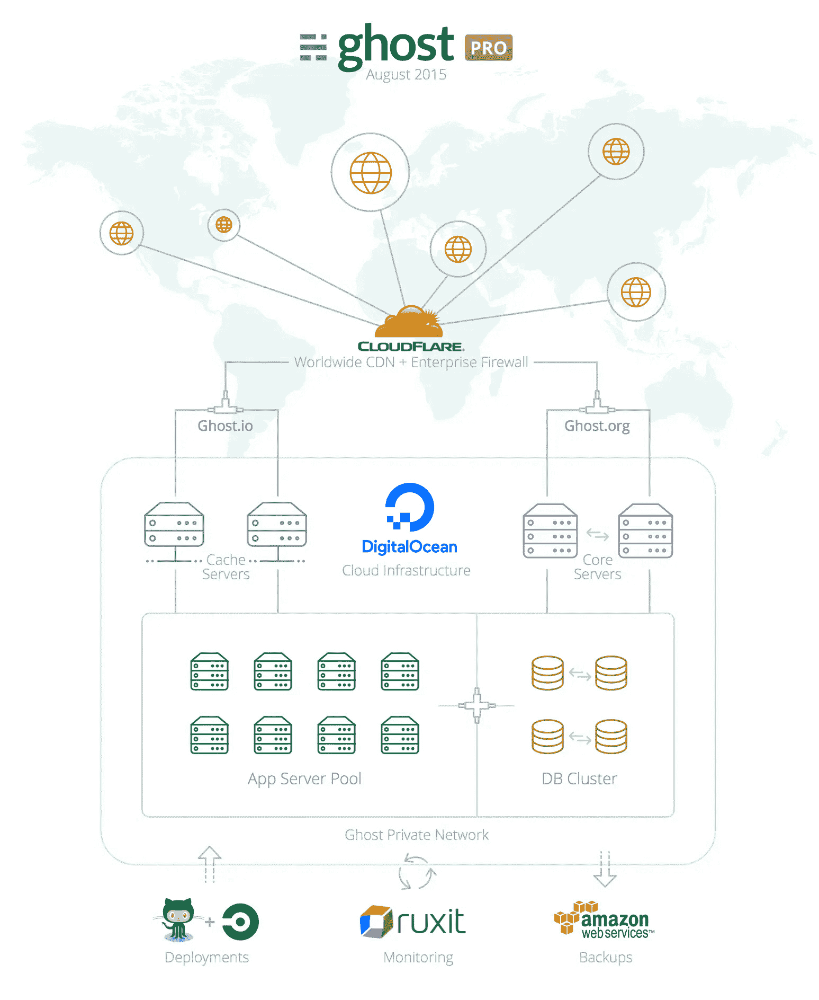

# 客户-幽灵

> 原文：<https://www.digitalocean.com/customers/ghost/?utm_source=wanqu.co&utm_campaign=Wanqu+Daily&utm_medium=website>

# Ghost 如何从专用服务器迁移到数字海洋

### 介绍

这篇数字海洋蓝图文章是由 Ghost 的高级 DevOps 工程师 Sebastian Gierlinger 撰写的。它涵盖了将 Ghost(Pro)基础架构从专用服务器迁移到 DigitalOcean Droplets 的步骤。在每一步中，Sebastian 将讨论所面临的挑战、如何解决每个挑战以及为什么选择每个解决方案。他还会提供他认为有用的相关资源的链接。

Ghost(Pro)是 Ghost 的托管平台，Ghost 是一个开源博客平台，用户只需点击几下鼠标，就可以租用预先构建的 Ghost 博客。Ghost(Pro)是管理 Ghost 开源项目的非营利组织 Ghost Foundation 的持续资金来源。Ghost(Pro)最初托管在专用服务器上，现已迁移至 DigitalOcean，以实现按需扩展。

### 问题陈述

在 2014 年最后一个季度，Ghost(Pro)的原始专用服务器基础设施很快就无法满足需求，因为它每月要为数万个博客的约 1 亿次请求提供服务。扩展现有基础架构需要大约两个月的时间来购买和部署新的物理服务器。简而言之，扩展专用服务器基础设施的局限性威胁着 Ghost(Pro)平台的发展，并因此威胁着 Ghost 开源项目的进一步发展。

我们需要通过迁移到改进的基础架构来解决我们无法快速扩展的问题，以免对客户或我们的增长产生负面影响。

### 要求

根据我们一年多来运行 Ghost(Pro)的经验，我们很清楚需要改进我们的服务。我们确定我们的下一个基础架构应该满足这些要求:

*   能够在几分钟内扩展服务器容量
*   足够的内存来服务数千个博客
*   提供强大的客户支持
*   允许我们在不进行重大重构的情况下迁移我们的软件

数字海洋满足了所有这些要求。

在规划迁移的过程中，我们确定需要执行零宕机迁移。我们稍后将深入探讨这种情况的技术原因。

## 迁移大纲

规划任何项目的迁移都有一定程度的不确定性；预测所有需要的步骤是不可能的，更不用说你会遇到的任何问题了。我们的迁移计划是通过研究和实施的迭代过程形成的。

因为这是一篇回顾性的文章，所以我们能够将迁移过程组织成这些宽泛的步骤，以便于理解:

*   创建现有服务器基础架构的清单
*   安全公共网络
*   安全专用网络
*   复制数据库
*   更新 DNS(专门切换到目标服务器)
*   淘汰旧环境

如今，作为迁移的结果，Ghost(Pro)服务器拓扑如下所示:

*   Cloudflare 提供内容交付网络(CDN)、域名服务(DNS)、缓存和防止恶意请求
*   核心服务器托管 ghost.org，并负责用户和支付管理
*   缓存服务器用于进一步加快响应速度，并将请求导向正确的博客
*   应用服务器池由许多运行我们客户的 Ghost 博客的应用服务器组成
*   DB Cluster 是一个 MySQL 数据库集群，用于保存您的博客数据
*   GitHub 处理我们的源代码管理
*   Ruxit 负责监控 Ghost(Pro)基础设施
*   亚马逊 S3 用于存储加密的异地备份

让我们看一下实现我们新的可扩展服务器基础架构的步骤。

## 步骤 1:创建库存

第一步是使用配置管理工具创建当前在我们现有专用服务器基础架构上运行的内容清单。

### 为什么？

在规划任何服务的迁移时，有一种可靠地再现现有环境的方法是很重要的。这将有助于确保迁移顺利进行。当然，这需要考虑到每个服务器和软件组件。

当 Ghost(Pro)第一次设置时，采用了快捷方式来快速启动和运行它。我们手动配置我们的原始服务器，因此，尽管现有的平台运行良好，但我们没有记录每一个小的配置细节。

### 怎么会？

为了解决没有已安装软件包、防火墙设置和其他服务器配置的完整清单的问题，我们在工具包中引入了一个配置管理系统。**配置管理**的一个好处是，一旦系统建立起来，它就可以兼作文档和部署工具。

在选择配置管理系统时，我们考虑了几种流行的配置管理工具，包括 Puppet、Chef、Ansible 和 SaltStack。我们需要一种工具，既能完成工作，又不会过于复杂。最终，我们选择了**盐堆**。

以下是我们选择 SaltStack 的一些原因:

*   它重量轻，易于安装和维护
*   它使用主/从管理基础设施，其中 Salt 主“推送”更改给从。这意味着，与从设备从主设备获取变更的架构相比，主设备被数百个试图联系它的从设备拒绝的风险降低了
*   它有一个专用的主服务器。这阻止了管理员和开发人员直接从不受保护的开发机器上部署变更
*   它使用 ZeroMQ，而不是 SSH，在主设备和从设备之间进行通信。ZeroMQ 使用更少的处理器资源，在处理许多并发连接时比 SSH 更高效，同时仍然提供加密

另外，SaltStack 中包含的 Salt Cloud 与- DigitalOcean API 紧密集成，通过生成新的液滴来扩展我们的服务，并允许我们从命令行管理我们的基础架构。事实证明，它是一个非常重要的工具，可以在几分钟内可靠地启动、停止和部署服务器。

### 结果

虽然新 Ghost(Pro)基础架构的初始设置和部署需要一些时间(大约三周),但 SaltStack 已经展示了它的威力。第二次迭代花了大约一周的时间来部署。我们托管平台的第三次安装，也就是今天我们的生产系统，只花了两天时间。

创建清单并转移到配置管理工具是一个迭代过程，几乎跨越了我们平台的整个迁移过程。除了使迁移成为可能之外，它还暴露了我们的设置中需要改进的部分。

### 资源

如果你想开始使用 SaltStack，请查看数字海洋 SaltStack 系列的第一个教程:[salt stack 术语和概念介绍](https://www.digitalocean.com/community/tutorials/an-introduction-to-saltstack-terminology-and-concepts)。在那里，您可以找到其他教程，帮助您在自己的基础设施中使用 SaltStack。

如果您有兴趣了解其他一些流行的配置管理工具，这里有一些教程可以帮助您入门:

## 步骤 2:保护公共网络

第二步是用防火墙保护我们平台内部服务器的公共网络。

### 为什么？

在我们的旧环境中，只有面向公众的服务器在互联网上可用。我们所有的其他服务器，如应用程序和数据库服务器，只能通过内部专用网络访问。随着迁移到 DigitalOcean 的云，每台服务器(甚至不需要公开访问的服务器)都有一个公共 IP 地址，我们需要解决这一新的安全问题。

### 怎么会？

我们通过设置一个 **iptables 防火墙**来保护我们内部服务器的公共网络，该防火墙可以阻止除 SSH 流量之外的所有流量。由于我们的服务器运行的是 Ubuntu，我们使用 UFW 作为 iptables 的接口。

与基础设施的其余部分一样，我们的防火墙配置由 SaltStack 集中管理。这使我们能够轻松管理所有服务器上的防火墙，即使是那些需要特殊防火墙规则的服务器。

### 结果

所有非公共服务器，包括应用程序和数据库服务器(见拓扑图)，都禁止公众访问。除了我们稍后将讨论的私有网络之外，我们所有的内部服务器都只能通过 SSH 使用基于证书的认证来访问。

### 资源

如果您想了解防火墙的基础知识，请从[什么是防火墙及其工作原理开始。](https://www.digitalocean.com/community/tutorials/what-is-a-firewall-and-how-does-it-work)教程。它解释了防火墙的基础知识，并链接到其他教程，这些教程将帮助您使用 iptables、UFW 或 FirewallD (CentOS)设置防火墙来保护您的公共网络接口。

## 步骤 3:保护专用网络

第三步是用 VPN 保护我们所有服务器的私有网络。

### 为什么？

DigitalOcean 的专用网络功能允许同一数据中心内的液滴在不将流量发送出数据中心的情况下相互通信。虽然此功能非常棒，因为它在我们的基础设施内实现了高带宽和低延迟连接，但专用网络是由数据中心内的所有液滴共享的，包括属于其他 DigitalOcean 客户的液滴。也就是说，我们的私人网络受到保护，不会受到一般互联网连接的影响，但不一定会受到私人网络上不属于我们的水滴的影响。

### 怎么会？

我们选择通过设置虚拟专用网络(VPN)来保护所有服务器的专用网络。VPN 提供的加密和认证功能非常适合我们的需求。

我们选择 Tinc 作为我们的 VPN 解决方案，主要是因为它使用网状路由布局，这意味着 VPN 流量尽可能直接发送到目的主机。它还允许我们通过连接的微滴路由流量，以到达不直接连接到请求者的微滴。与 OpenVPN 不同，OpenVPN 会使 VPN 管理变得复杂，因为它通过一个中央 VPN 服务器路由每个连接，我们的 VPN 的行为很像传统的专用网络。

如果我们决定需要跨越多个数据中心，它还允许我们将 VPN 扩展到远程数据中心的 Droplets。

像我们的防火墙配置一样，我们使用 SaltStack 来集中管理我们的 VPN 配置。这使我们能够自动更新我们所有服务器中的 Tinc VPN 配置，从而确保我们的 VPN 成员始终是准确的和最新的。

### 结果

我们基础设施内的所有网络流量都是安全的，因为它通过专用网络接口上的 Tinc VPN。每个 Droplet 运行一个 Tinc 守护进程，负责连接(和重新连接)给定的 Droplet 列表。由于使用网状 VPN，服务器之间的 VPN 连接的配置非常简单。

### 资源

如果你想开始使用 Tinc 作为 VPN 解决方案，请查看[如何在 Ubuntu 14.04 上安装 Tinc 并设置基本 VPN](https://www.digitalocean.com/community/tutorials/how-to-install-tinc-and-set-up-a-basic-vpn-on-ubuntu-14-04)教程。

## 步骤 4:激活数据库复制

第四步是通过设置复制来迁移我们的数据库。

### 为什么？

最初，我们计划在数据库迁移期间让 Ghost(Pro)离线。这将允许我们停顿(暂停以确保数据一致性)并创建 MySQL 数据库的备份。然后，我们可以将备份转移到新的数据库服务器，并恢复它们以完成数据库迁移。然而，在分析了我们现有的数据后，我们很快意识到这个过程是不可行的。我们有大约 500 GB 的数据库，这意味着迁移将需要大约 6 小时的停机时间，这还不包括任何意外的错误。让我们的服务离线那么长时间是完全不可接受的。我们需要另一种解决方案。

我们决定转向复制来迁移我们的 MySQL 数据库。数据库复制跨多个服务器维护数据库的相同副本，提供了一种不中断数据库迁移的方法。这消除了我们服务的任何停机需求，并为我们提供了一个安全网，使我们能够在关闭旧数据库服务器之前测试我们的新数据库服务器。

### 怎么会？

利用复制来迁移我们的数据库需要一些额外的规划。虽然我们不能包括所有的细节，为了简洁起见，这里是我们经历的值得注意的步骤的顺序。

**1。配置主/从复制**

我们将原来的数据库服务器配置为主服务器，新的数据库服务器配置为从服务器。这意味着数据是单向复制的，从原始数据库系统复制到新基础架构中的数据库系统。

**2。测试新的基础设施**

使用这种主/从设置，我们能够进行负载测试，并查看我们的新 Ghost(Pro)系统是否与我们的旧设置表现相同。请注意，由于设置的性质，在我们的测试中对从数据库所做的更改不会影响原始(主)数据库。

测试成功后，我们清除了新(从属)数据库服务器中的数据，为下一步做准备。

**3。配置主/主复制**

测试了新的数据库服务器后，我们激活了主/主复制，这意味着所有数据库更改都可以双向复制。

### 结果

一旦主/主复制被激活，并且原始数据库被迁移到我们的新服务器，新的基础设施就可以使用了。我们有两个功能完整的 Ghost(Pro)基础架构实例，一个是旧的，一个是新的，具有同步的数据库。然而，新的基础设施尚未激活，因为[ghost.org](http://ghost.org)和 [ghost.io](http://ghost.io) DNS 记录——我们的用户如何访问我们的服务——仍指向旧的基础设施。

这意味着我们服务的迁移现在简化为切换 DNS 条目以指向新的服务器。作为使用主/主数据库复制的一个额外好处，如果我们遇到任何问题，我们的设置将允许我们快速而轻松地恢复到我们的旧基础架构。

### 资源

要了解如何在您自己的环境中设置数据库复制，请查看以下教程:

## 步骤 5:更新 DNS 记录

第五步是通过更新我们的 DNS 记录将我们的新基础设施投入生产。

### 为什么？

为了将我们的新基础设施投入生产，我们需要做的就是更新我们面向公众的缓存和核心服务器的 DNS 记录，分别是 [ghost.io](http://ghost.io) 和【ghost.org】的。

### 怎么会？

更新 DNS 记录有时会有问题，因为传播 DNS 更改需要时间。如果操作不当，传播可能需要几个小时，用户可能会被发送到旧系统和新系统。我们使用 **CloudFlare** 来管理我们的 DNS 条目，这允许我们实时进行 DNS 更改，因此我们能够避免这些问题。

当我们准备好开始使用我们的系统时，我们执行以下序列。首先，我们更新了[ghost.org](http://ghost.org)以指向新的核心服务器，然后测试它是否工作。接下来，我们更新了 [ghost.io](http://ghost.io) 以指向新的缓存服务器，然后运行了更多的测试。

### 结果

在更新我们的 DNS 记录以指向新的缓存和核心服务器之后，我们的新基础设施就投入使用了；我们所有的用户都从我们在 DigitalOcean 上的新基础设施访问我们的 Ghost(Pro)服务，这是目前正在生产的同一组服务器。

如果我们遇到任何问题，我们仍然能够恢复我们的 DNS 更改以切换回原始基础架构。这只需要几秒钟的时间，因为生产数据库对两个基础架构仍然可用，因为主/主复制仍然处于活动状态，并且使用 Cloudflare 的 DNS 传播几乎是即时发生的。幸运的是，这是不必要的，因为迁移到新服务器的过程非常顺利。

### 资源

正如我们所讨论的，我们使用 Cloudflare 来控制我们服务的域记录。除了他们的 DNS 服务，我们还为他们的应用防火墙、CDN 和 DDOS 保护付费。他们还免费提供功能较少的基本服务。要使用 CloudFlare 管理您的域，请遵循本教程的[配置您的域以使用 Cloudflare 部分。](https://www.digitalocean.com/community/tutorials/how-to-mitigate-ddos-attacks-against-your-website-with-cloudflare#configure-your-domain-to-use-cloudflare)

或者，DigitalOcean 也提供域名服务器，您可以将您的域名指向这些服务器。然而，DigitalOcean DNS 可能不是迁移项目快速 DNS 传播的理想解决方案，因为 TTL(生存时间)值不可配置。通过以下教程了解如何设置:[如何指向数字海洋域名服务器](https://www.digitalocean.com/community/tutorials/how-to-point-to-digitalocean-nameservers-from-common-domain-registrars)。

如果你正在寻找关于 DNS 概念的初级读本，那么[DNS 术语、组件和概念介绍](https://www.digitalocean.com/community/tutorials/an-introduction-to-dns-terminology-components-and-concepts)教程是一个很好的入门途径。

## 步骤 6:淘汰旧环境

最后一步是淘汰旧环境中的服务器。

### 为什么？

随着我们的服务完全在新的数字海洋系统上运行，我们不再需要原来的专用服务器基础设施。淘汰我们的旧环境将节省我们的运营和传统管理成本。

### 怎么会？

在关闭我们的旧基础架构之前，我们需要关闭新旧数据库服务器之间的复制。

### 结果

由于我们两个环境之间的数据库复制不再活跃，我们的活动 Ghost(Pro)设置不再与旧的基础架构有任何联系。一旦我们关闭了旧服务器，我们的迁移就完成了！

## 结论

将 Ghost(Pro)平台从专用服务器迁移到 DigitalOcean 获得了成功！

我们希望分享我们的经验，因为我们知道迁移服务器环境是许多项目面临的一项具有挑战性的任务。我们希望我们如何迁移到 DigitalOcean 的详细信息将对其他希望进行迁移的项目有所帮助。