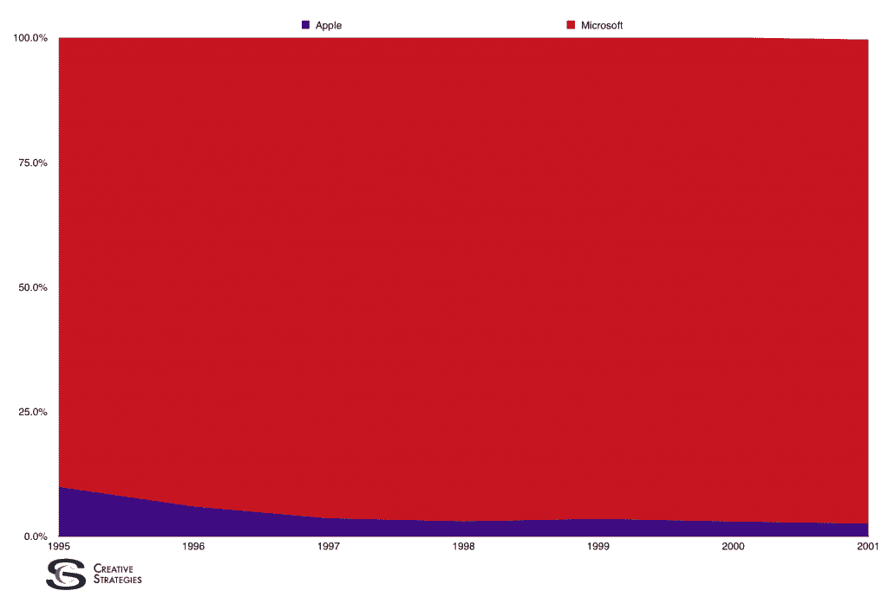
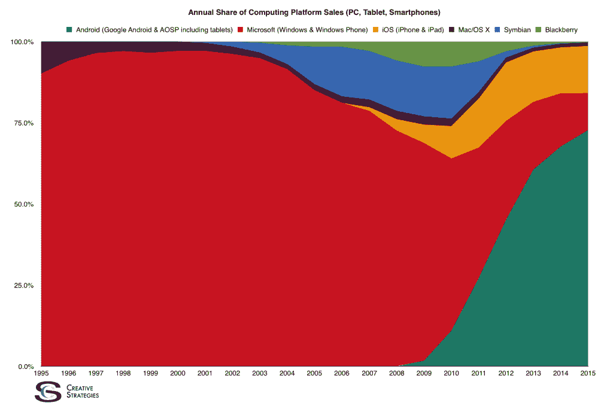
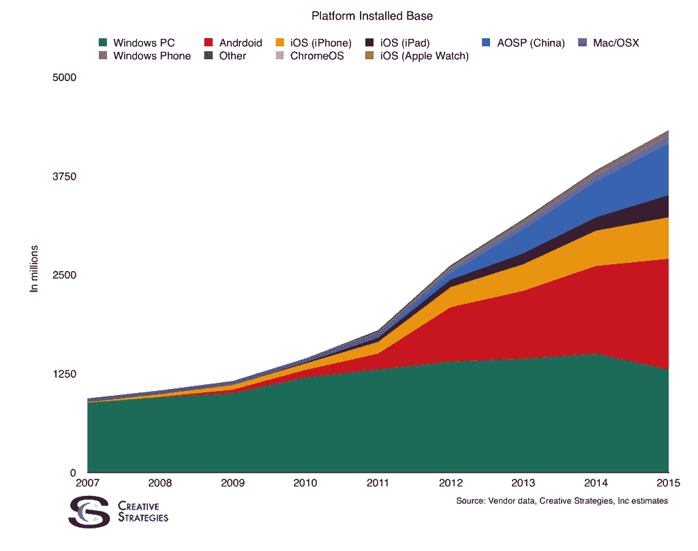

# 标准化平台的终结——技术小齿轮

> 原文：<https://techpinions.com/the-end-of-standardized-platforms/43781?utm_source=wanqu.co&utm_campaign=Wanqu+Daily&utm_medium=website>

# 标准化平台的终结

科技行业的历史学家观察到了一种关于新计算平台的可预测模式。在计算领域的早期，如大型机、小型机和台式机，存在大量的平台碎片。这些早期的计算系统通常运行专有软件和操作系统，几乎没有互操作性。最终，一个标准出现了——Windows。尽管 MAC 电脑一直存在，但在个人电脑时代的大部分时间里，它们的市场份额都远低于 3%。这是一个展示平台如何开始分散，然后围绕 Windows 标准化的视频。

[T2】](http://techpinions.com/wp-content/uploads/2016/02/Screen-Shot-2016-02-12-at-5.30.49-PM.png)

你看到的是操作系统在每年售出的设备中所占的份额。在上述大部分时间销售的计算设备中，微软是标准。快进到今天，我们看到一个略有不同的画面出现。Windows 在个人电脑上运行，Android 和 iOS 在移动设备上运行，这给了我们三个主要的操作系统，占据了每年销售的大部分计算设备。

[T2】](http://techpinions.com/wp-content/uploads/2016/02/Screen-Shot-2016-02-12-at-5.31.40-PM.png)

你可以看到，随着馅饼从每年销售数亿台计算设备到现在每年销售近 20 亿台计算设备(当你把个人电脑、平板电脑和智能手机加起来时)，馅饼变得越来越大，但格局也发生了变化。虽然 Android 拥有最大的一块蛋糕，但他们没有微软曾经拥有的 97%的份额。馅饼的大小和全球消费者市场的多样性带来了几个计算平台同时存在的机会。

如果我们后退一步，看看安装的基础，我们会更清楚地看到当今使用的计算平台的多样性以及市场的规模。

[T2】](http://techpinions.com/wp-content/uploads/2016/02/Screen-Shot-2016-02-12-at-4.50.01-PM.png)

现在，世界上有超过 30 亿台活跃的计算设备，在中国运行着五种主要的操作系统/计算平台——Windows、OS X、iOS、Android 和 AOSP(非谷歌)Android。这里的关键点是，随着移动领域规模的扩大和全球消费市场的加入，不存在单一的标准计算平台。接下来的问题是，像虚拟/增强现实平台或人工智能平台这样的东西会发生什么？我们应该期待 VR/AR 或人工智能统一起来，像企业 PC 时代一样出现一个单一的平台，还是像我们今天在消费计算中看到的那样存在许多不同的平台？

我倾向于后者。虽然 VR/AR 将开始细分，Oculus 有一个平台，索尼有一个平台，微软有一个平台，谷歌有一个平台，甚至苹果最终也有一个平台，但它也可能保持细分，而不是整合。

全球消费智能手机市场已经向我们表明，它可以支持许多平台，因此，无论接下来发生什么，都可能遵循相同的范式。正如我在可穿戴设备方面观察到的那样，市场实际上正在发展成为一个丰富的细分市场，或许 VR/AR 或人工智能也会这样做，在现有平台上添加新的计算平台层，而不是整合成一个单一的平台。

