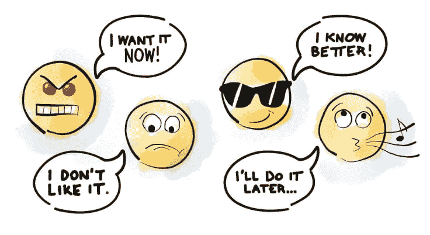

# 聊天中 4 类难相处的客户以及如何应对他们

> 原文：<https://www.livechatinc.com/blog/types-of-difficult-customers/?utm_source=wanqu.co&utm_campaign=Wanqu+Daily&utm_medium=website>

*   

    在推特上发帖

*   

    脸书股票

*   

    在 LinkedIn 上发帖

*   

    在 Reddit 上发布

*   

    将链接复制到剪贴板

    Link copied to clipboard

不管你提供的服务有多好，在这个过程中你总会遇到难缠的顾客。我们对此有所了解。难缠的顾客就像温暖美好的夏天过后寒冷多雨的秋天一样不可避免。你只需要面对它，最好的方法是做好心理准备。

有两种**方法**来考虑难相处的顾客。

一是顾客总是错的。你不必听他们的，因为没有服务一切都很好。第二种方法是花一些额外的时间和每一个难相处的顾客在一起。你仔细听他们解释你的产品。但与此同时，你不害怕考虑他们实际上是对的可能性。

无论如何，在这两种方法中，你都需要学习一些处理难相处的客户的知识。你可以通过更好地理解他们的性格类型和思维方式来实现这一点。

下面是 **4 种难缠的客户**用我们聊天时发生的情况来解释。另外，如何处理他们的建议。

## 我现在就要先生

这就是那种不在乎某样东西暂时没货或者做不了的客户。他无法想象你没有一些特色或服务。他无法相信你在下午 6 点就关门了，而且在这个时间之后你没有提供任何额外的联系方式。此外，除了诉诸愤怒之外，他不能以任何其他方式表现出来。他通常会说:“我不敢相信”，“你真差劲！”、“我要解决这件事”、“我现在就要，否则我就去找你的竞争对手！”

### 聊天情况:

像每个企业一样，我们有时会遇到大问题，如 DDoS 攻击。击退他们需要时间，但这并不取决于我们。“我现在就要”先生来聊天，认为我们有一个类似“修复”按钮的东西，他不能理解我们为什么不用它。

### 如何处理这种情况:

我想得越久，就越相信“我现在就要”这种类型的客户不明白，不是所有事情都可以做到的。

并不是说他总体上就是个小人，逼着你做一些做不到的事情。只是事情并不像他想象的那样。所以他威胁要离开，但这往往意味着他对自己的生意没有安全感。

要有耐心，千万不要带着情绪去回应。等待顾客冷静下来，并解释他或她的情况。学会对顾客说不也是有用的。

<iframe src="https://www.youtube.com/embed/pgxqnj0ivxE?start=0" frameborder="0" allow="accelerometer; autoplay; encrypted-media; gyroscope; picture-in-picture" allowfullscreen="">视频</iframe>

## 抱怨者先生

从我在生活中了解到的情况来看，满足那些在抱怨的人真的很难。不是因为你解决不了他们的问题，而是因为他们自己也在不断制造新的问题，不断抱怨。这只是他们的天性。他们不喜欢那种快乐满足的感觉。

### 聊天情况:

这种类型的客户来聊天，对我们应用程序中的任何更改都心怀不满。他不能理解我们在进化，需要重新设计我们应用的外观。他抱怨它，并声称他喜欢旧版本。然而，一周后他就忘记了这些变化。他习惯了新造型，爱上了新造型，却记不起之前的造型。

### 如何处理这种情况:

即使有时你会设法解决“问题”，抱怨的顾客可能甚至不会注意到它。有一点是肯定的——很快，他们就会发现另一个“问题”。是因为他们的性格类型——脾气暴躁。

说到暴躁——它们的脸和思维与暴躁的猫没有什么不同。你不会指望一只脾气暴躁的猫会欣赏某样东西，变得令人愉快，对吧？你看着迷因，放声大笑。对抱怨的客户尝试这种方法。别忘了在心里笑。

## 懒惰先生

这很有趣，因为通常问题是一个懒惰的服务。但是懒惰的顾客怎么办？你遇到过吗？懒汉先生想尽可能少自己做事情。他期望你会为他做一切。他付钱给你，所以有时他要求你为他多做一点。虽然通常他不想过度使用权力。总的来说，他只是一个懒惰的人。你不能指望他会主动去做他不喜欢做的事情。

### 聊天情况:

有时我们会遇到这样的情况，客户不想处理他在 LiveChat 上的发票。他过来聊天，让我们帮他把发票发给他的会计。

### 如何处理这种情况:

懒惰只是一种习惯。意思是可以改变。在我们的例子中，懒先生需要养成给会计送发票的习惯。

我们可以教他，这很容易做到，只需要几分钟。如果他这样做几次，他很可能会形成一种新的习惯。他每个月都会处理他的发票。

这是否意味着当客户要求你时，你不应该为他多做一点？嗯，这要看情况。我非常喜欢**为顾客**做一些额外的事情，但要在合理的范围内。记住，无论你做什么决定，如果懒汉习惯了你的帮助，就很难教他改变做法。

## 我更了解先生

这种客户类型不一定是刻薄或愤怒的客户，比如“我现在就要”先生。但他肯定不愿意接受自己不喜欢的答案。这些争论没有影响到他。他坚信自己是对的，要改变他的信念几乎是不可能的。

### 聊天情况:

一位客户在聊天中声称某些功能无法正常工作。在调查并解释一切正常后，客户就是不同意。他退出聊天，稍后回来希望另一个代理会给他一个不同的答案。

### 如何处理这种情况:

在大多数情况下，一切正常。问题是客户对你的产品没有足够的了解。他争辩是因为他确信自己是对的。

首先，你可以做的是**对他的担忧给予积极的反馈**。然后，你的工作是耐心地解释你的产品实际上是如何工作的。如果他仍然坚持他是对的，发送一些统计数据或者你的知识库的链接可能是个好主意。他的顾虑大概在那里有详细的解释。

如果你给他资源和空间去思考，也许他会发现他错了。他也不必直接向你承认。既然人们很难承认自己错了，想象一下“我知道得更多”先生有多难

## 应付难缠的顾客

总会有[种顾客](https://www.livechat.com/success/types-of-customers/)对你的产品或服务不满意。你的工作是理解它们并接受它。如果你能做到这一点，你就能有效地应对它们。

谁知道呢，也许有一天它们会成为你的灵感源泉，让你改变自己的生意。

## 与数字原生者一起一窥商业交流的未来。

[Get the FREE report](/gen-z-communication/)

