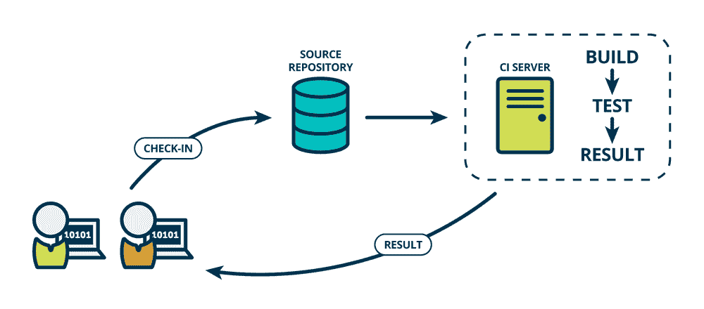
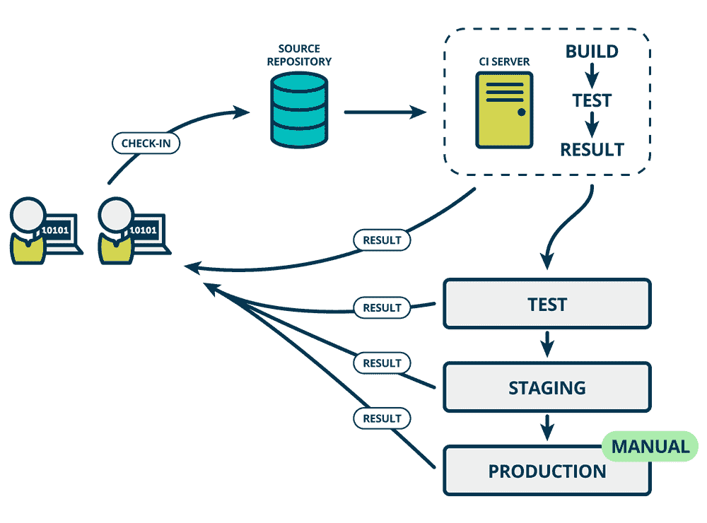
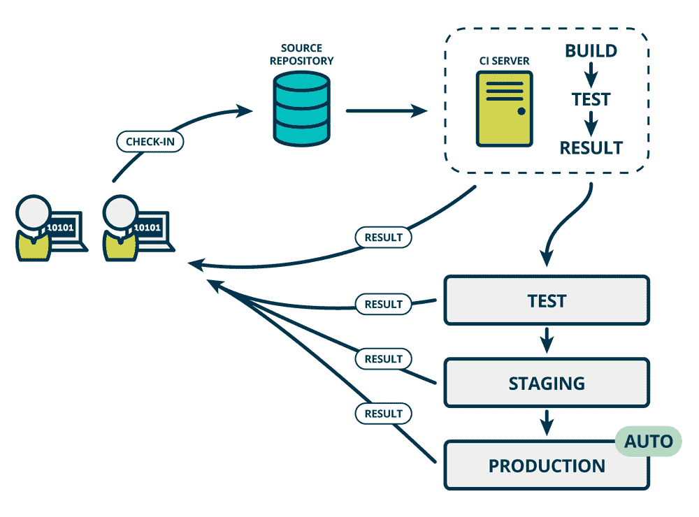
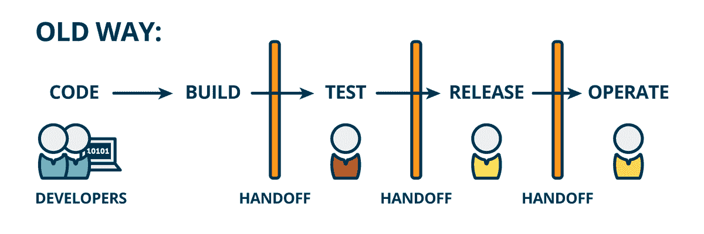
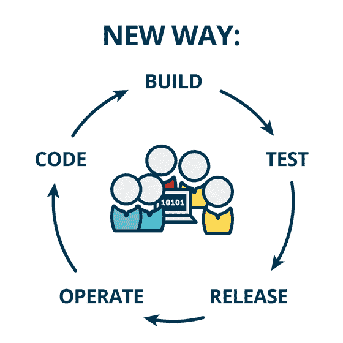

# 产品经理持续交付和开发指南——关注产品

> 原文：<http://www.mindtheproduct.com/2016/02/what-the-hell-are-ci-cd-and-devops-a-cheatsheet-for-the-rest-of-us/?utm_source=wanqu.co&utm_campaign=Wanqu+Daily&utm_medium=website>

在本指南中，我旨在揭开

[Continuous Delivery](https://www.youtube.com/watch?v=t5vhLBvJzgc&t=25s)

还有 DevOps。我将解释这些实践，告诉你它们对你“业务方面”有多重要，并帮助你参与其中。没那么复杂，我们有照片什么的。

*This guide is for you if ...*

*   你从事技术工作，你是产品经理或者 MBA。你的团队 A/B 测试，功能切换，你有一只狗在办公室！当然，你知道什么是特性分支，什么是 CD，什么是 DevOps 文化。对吗？哦...当然可以。

*   你变得敏捷了。工程团队现在每周与你的产品人员会面，讨论故事和迭代。他们合作得很好，他们所构建的东西感觉比以往任何时候都好。但是您的客户仍然不能更快地获得这些功能。你还是要等放行列车出站。你可能听说过 Etsy、Flickr 和 Google 这样的公司，它们每天递送 100 次邮件。他们是怎么做到的？
*   *你的开发团队想“做 CD”。您已经听到了一些好消息，但是您也担心在没有经过适当测试的情况下将变更投入生产，或者无法适当地将变更推向市场。这个 CD 是什么东西？*

让我们从一些定义和例子开始:

## 持续集成

在传统的软件开发中

*integration*

通常在项目结束时，每个人完成工作后进行。整合通常需要几周或几个月的时间，可能会非常痛苦。

[Continuous integration](https://codeship.com/continuous-integration-essentials)

是一种实践，它将集成阶段放在开发周期的早期，这样构建、测试和集成代码就可以更有规律地进行。CI 意味着一个开发人员(嗨，Steve！)谁在家用笔记本电脑写代码，另一个 dev(嗨 Annie！)在办公室的桌面上编写代码的人可以分别为同一产品编写软件，在一个叫做

*the source repository*

。然后，他们可以根据各自编写的比特构建组合软件，并测试它是否按照预期的方式工作。

开发人员通常使用一种叫做

*CI Server*

为他们做建筑和整合。CI 要求 Steve 和 Annie 拥有自测代码。这是对自身进行测试以确保其按预期工作的代码，这些测试通常被称为

*unit tests.*

当所有的单元测试通过后，代码集成史蒂夫和安妮将得到一个

*green build*

。这表明他们已经验证了他们的更改被成功地集成在一起，并且代码如测试所预期的那样工作。然而，尽管集成代码可以成功地协同工作，但它还没有准备好投入生产，因为它还没有经过测试和验证

*production-like environments*

。您可以在

**Continuous Delivery**

下面的部分。要被认为是实践 CI，Steve 和 Annie 必须

*check-in*

到主要的源代码库，经常集成和测试他们的代码。通常一小时多次，但最少一天一次。CI 的好处是集成变成了非事件。软件一直在编写和集成。在 CI 之前，集成发生在创建过程的最后，一次完成，花费了未知的时间；现在有了 CI，它每天都在发生，只需几分钟，而且只是“我们的工作方式”。很有可能你的团队正在做 CI(或者至少他们认为是这样)。您可以通过询问他们是否每天集成一次代码来确认——CI 是需要做的第一个练习

[Continuous Delivery](https://continuousdelivery.com/)

。事实上，如果您曾经查看过帮助文本、文档或图像，那么您可能一直在持续集成！你也可以看到

['7 signs you're mastering continuous integration'](https://devops.com/7-signs-youre-mastering-continuous-integration/)

需要更多的确认。

## 连续交付(CD)

让我们回到我们的两个开发人员，史蒂夫和安妮。

[Continuous Delivery](https://aws.amazon.com/devops/continuous-delivery/)

意味着每次 Steve 或 Annie 更改代码、集成和构建代码时，他们

*also*

在与生产非常相似的环境中自动测试这段代码。我们将这种在不同环境中部署和测试的过程称为

*deployment pipeline*

。通常，部署管道有一个开发环境、一个测试环境和一个阶段环境，但是这些阶段因团队、产品和组织而异。举个例子，

[our Mingle team](https://www.thoughtworks.com/mingle/)

有一个叫做“纸杯蛋糕”的舞台，这是一个舞台环境

[Etsy’s staging environment is called “Princess”](https://codeascraft.com/2010/05/20/quantum-of-deployment/)

。

在每一个不同的环境中，Annie 或 Steve 编写的代码都会受到不同的测试。这给了他们和您越来越多的信心，当代码被部署在生产环境中时，代码将在那里工作。至关重要的是，代码只被提升到部署管道中的下一个环境(在其上测试)

*if*

它通过了先前环境的测试。这样，Annie 和 Steve 可以从每个环境中的测试中获得新的反馈，如果出现故障，他们可以更容易地了解问题可能出在哪里，并在代码进入生产环境之前修复它。

### 持续学习

这个过程对我们这些从事商业的人来说非常有力量。这意味着，如果 Annie 的测试通过了所有的环境，您就知道她的代码在进入生产时很可能会按预期工作。一旦测试在所有环境中通过，您就可以马上决定您的最终用户是否能得到它。我们现在就想让这个绿色建筑投入生产吗？是啊！有了它，一旦开发人员完成构建，新的、经过全面测试的、可工作的软件就随时可供客户使用。呜！

## 持续部署

这是一个实践，史蒂夫或安妮所做的每一个改变，通过了所有的测试阶段，

*automatically*

投入生产。

[Tim Fitz has a great explanation of it as it was first coined](http://www.paulhammond.org/2010/06/trunk/alwaysshiptrunk.pdf)

。有些公司这样做，有些不这样做。为了实现连续部署，您首先需要获得连续交付，因此在您开始实践连续部署之前，决定哪一个对您更好并不是一个优先事项。不管怎样，我认为持续交付就是授权

*the business as a whole*

，因此至少您应该参与决定是否应该使用连续部署。毕竟，如果你正在读这篇文章，那么你可能是在“商业方面”。

## DevOps

“DevOps”一词来自“开发”和“运营”两个词的组合。DevOps 是一种促进开发人员(嘿，史蒂夫和安妮，你们回来了)和其他技术专业人员之间协作的文化，通常被称为运营或简称为 Ops(击掌运营明星乔伊！).特别是软件交付和部署过程中的沟通和协作，目标是更快更可靠地发布更高质量的软件。拥有所谓的 DevOps 文化的组织的共同特征是:自治的多技能团队(Steve，Annie 和 Joey 都在同一个团队)，高水平的测试和发布自动化(类似连续交付)以及多技能成员之间的共同目标。

你可以在你的组织中看到这种工作的一种方式是我们的开发者朋友 Steve 和 Annie 将会工作

*with*

ops 人员喜欢 Joey 将软件交付到产品中，而不是在他们完成代码后将代码“交给”Joey 发布。同样，史蒂夫、安妮和乔伊都将扮演

*common product or service team*

他们都将负责产品的支持和维护，而不仅仅是运营团队的责任。您还将看到，对于一个从事 CD 和 DevOps 的组织来说，活动的自动化变得越来越重要。这是因为，为了实现我们对 CD 和 DevOps 组织所期望的可重复的、定期的和成功的软件发布过程

*must*

转向自动化流程。手动流程太容易出错且效率低下。

DevOps 文化通常与持续交付相关联，因为它们都旨在增加开发人员和运营团队之间的协作，并且都使用自动化过程来更快、更频繁和更可靠地构建、测试和发布软件。这些都是我们这种人想要的。虽然开发团队经常看到过程改进最直接的好处，但是 CI、CD 和 DevOps 对我们其他人也有很多好处。简而言之，我相信实践 CD 和拥抱 DevOps 文化的组织会更频繁地向他们的客户交付更有价值、更可靠的软件。那一定很好，对吧？尤其是如果你是“商业一方”下一次我将更多地谈论

*why*

你应该关心这些概念。我将阐述它对您业务的影响以及如何参与其中。如果你有任何问题，请在评论中告诉我。这些帖子的全部目的是赋予你权力，并告诉你与业务相关的技术实践。提问很棒！

* * *

### ***有用术语***

#### **入住**

将本地开发代码变更推送到公共源代码库的过程。

#### **CI 服务器**

用于构建和测试源代码的工具。CI 服务器将告诉开发人员他们最新的代码构建是否成功，以及他们是否继续通过测试。

#### **开发环境**

开发人员在那里创建、集成、构建和测试代码。

#### **部署管道/管道**

这是 Steve 和 Annie 的代码更改在完成并准备交付生产之前要经历的一系列阶段。通常这些将是“构建”、“单元测试”、“功能测试”、“性能测试”和“部署”。不同的自动化测试将在不同的阶段运行。只有代码通过了整个部署管道，软件才能交付到生产环境中。

#### **绿色建筑**

绿色是成功的标志。绿色版本是指通过了开发和交付过程中特定阶段的测试。通常，软件的构建或版本不会被提升到部署管道的下一阶段，除非它是“绿色”的。与绿色建筑相对的是红色建筑(见下文)。

#### **增量开发**

不要与混淆

*iterative development*

(见下文)。增量开发是指一次构建产品的一小部分，直到全部完成。每一个增量中都添加了一些小块，这些增量可大可小。您可以在增量开发中使用 CI，但是在增量开发中实现连续交付或连续部署可能会更困难，因为您必须等到所有的增量都完成后才能交付价值。增量开发和迭代开发之间的区别的一个很好的例子是

[Jeff Paton's Mona Lisa.](http://www.agileproductdesign.com/blog/dont_know_what_i_want.html)

#### **整合**

所有由个人或团队编写的代码都需要组合在一起。我们称之为整合。在持续集成中，我们通常指的是来自个人的软件需要定期整合。在连续交付中，我们通常意味着来自不同团队的软件被集成在一起以创建整个产品。

#### **迭代开发**

不要与混淆

*incremental development*

(见上)。迭代开发是指一次构建产品的一小部分，并对其进行改进，直到完成为止。产品是迭代构建的，每次迭代都要返工相同的部分。不同迭代中的特性之间的变化是预期的和计划的。您可以使用 CI、持续交付或迭代开发的持续部署。增量开发和迭代开发之间的区别的一个很好的例子是

[Jeff Paton's Mona Lisa.](http://www.agileproductdesign.com/blog/dont_know_what_i_want.html)

#### **主/干线/主线**

“主”、“主干”或“主线”分支是源存储库的主要分支。大多数人都这样

*trunk-based development*

,

这意味着他们总是将他们的变更集成到主线中。其他人有

*branch-based*

单独开发时，开发人员将有自己的分支，或者团队将有针对不同功能的分支。

#### **生产环境**

这是部署或发布软件的地方。使用您的产品或网站的客户最有可能使用这种环境。也称为“生产中”、“生产中”或“现场”。

#### **红色构建**

红色是失败的标志。红色版本是指没有通过开发和交付过程中特定阶段的测试。通常，如果软件的构建或版本是“红色”的，它将不会被提升到部署管道的下一个阶段。与红色建筑相对的是绿色建筑(见上文)。

#### **源库**

这是源代码所在的地方。Steve 和 Annie 有他们自己的本地版本的代码(意思是在他们自己的机器上)，但是源代码库将包含

*all*

开发人员签入他们的更改后的代码。

#### **测试自动化**

需要高质量的测试自动化来进行持续集成和持续交付。测试是检查软件是否按预期工作的方法。自动化测试是编码好的测试，一旦代码被检入到公共源代码库中，就会自动运行。在 CI 世界中，单元测试是在每次软件集成和构建时运行的。如果测试没有通过，该版本的软件将被判定为“不工作”、“红色”或“损坏”。在一些工作场所，当这种情况发生时，会出现“红灯”或悲伤的声音。在构建失败的情况下，Steve 或 Annie(无论是谁提交了有故障的代码)需要“修复它”、“让它变绿”或“让它工作”。他们可以通过修改代码来修复它，或者删除破坏它的先前的修改。

#### **单元测试**

单元测试是代码中的自动化测试，它测试底层的单段代码，以确保它们可用并按预期工作。单元测试被认为是实践 CI 和 CD 的先决条件。

### **更多资源**

**You can also read the follow up to this article -  [Why Continuous Delivery and DevOps are Product Managers’ Best Friends.](https://www.mindtheproduct.com/continuous-delivery-devops-product-managers-new-bff/)**