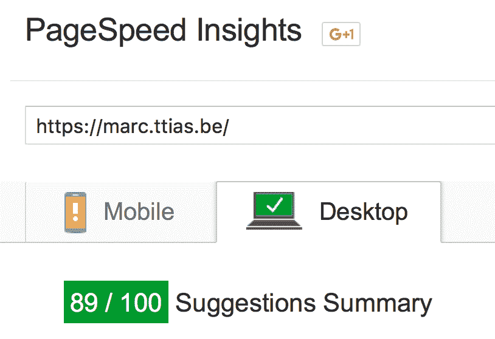
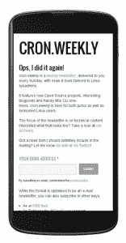
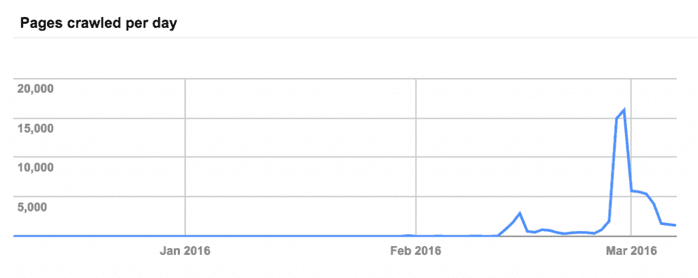
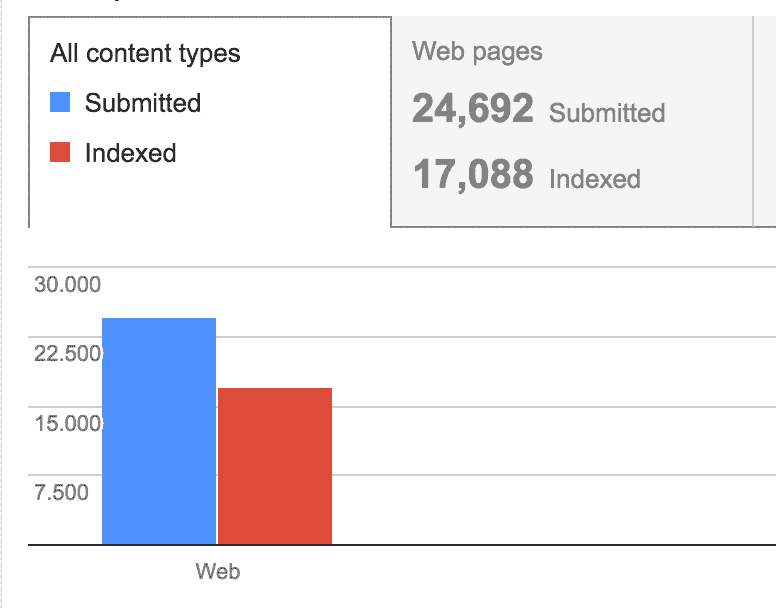
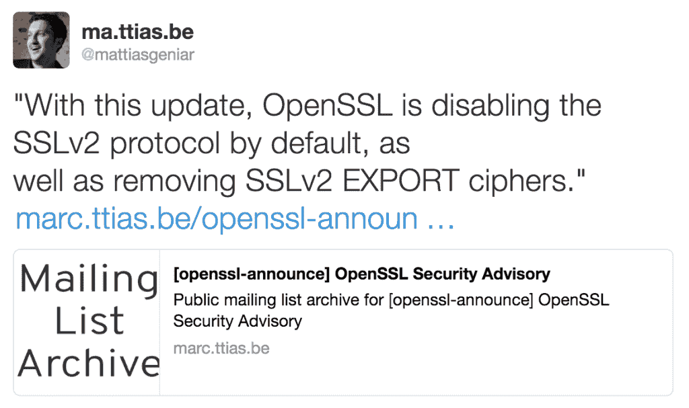
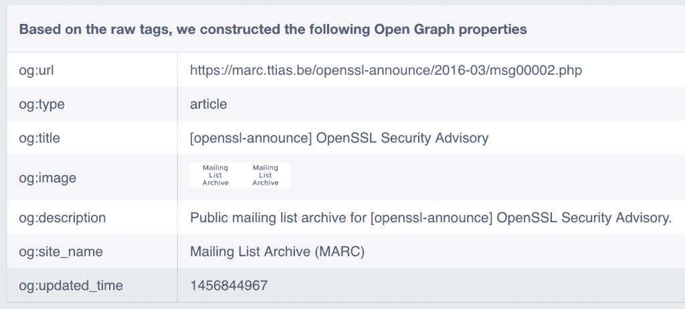

# 搜索引擎优化技术指南

> 原文：<https://ma.ttias.be/technical-guide-seo/?utm_source=wanqu.co&utm_campaign=Wanqu+Daily&utm_medium=website>

如果你是一个网站的所有者或维护者，你知道 <abbr title="Search Engine Optimisation">SEO</abbr> 很重要。很多。本指南旨在准确列出搜索引擎优化的所有*技术*方面。

“SEO 友好”不仅仅是技术部分。内容一如既往还是王道。不管你的网站在技术上有多好，如果内容不符合标准，它对你没什么好处。

但是技术部分毕竟很重要。这篇博客文章涵盖了以下主题:

1.  [强制单域](#singledomain)
2.  [更喜欢 HTTPs 而不是 HTTP](#https)
3.  [优化速度](#speed)
4.  [元标签:标题&描述](#title)
5.  [语义页面标记](#semantic)
6.  [消除重复内容](#duplicate)
7.  [清理 URL 结构](#cleanurls)
8.  [响应式布局](#responsive)
9.  [Robots.txt](#robots)
10.  [Sitemap.xml](#sitemap)
11.  [谷歌的网站管理员工具](#webmastertools)
12.  [推特卡片](#cards)
13.  [脸书的开放图](#opengraph)
14.  [用于索引的 HTML 元标签](#meta_indexing)
15.  [抓取你的网站 404 的](#404)
16.  除了 HTTP 200 之外，抓取你的网站
17.  [您的 IP 地址的地理位置](#geolocation)
18.  [站点维护:HTTP 503](#503)

由于我最近启动了两个兼职项目( [MARC，开源邮件列表归档器](https://marc.ttias.be/)和 [cron.weekly，我的开源& linux 简讯](https://www.cronweekly.com/))，我不得不再次经历通常的 SEO 舞蹈。

但这一次，我在记录我的行为。每当你启动一个新的网站或项目时，就把它当成一份技术 SEO 清单。

事不宜迟，我们开始吧。

# 强制单个域:有或没有 WWW 子域

可能有几个域名允许访问者访问你的网站。想法是强制一个单独的域，为重定向设置正确的 HTTP 头，并强制该单独的域是已知的。

如果您正在运行 Apache，这是将所有请求强制到一个域的最简单的方法。将此添加到您的`.htaccess`配置中。

```
RewriteEngine On
RewriteBase /
RewriteCond %{HTTP_HOST} !www.cronweekly.com$ [NC]
RewriteRule ^(.*)$ http://www.cronweekly.com/$1 [L,R=301] 

```

这种本质遵循这样的逻辑:

1.  如果域名(`%{HTTP_HOST}`)与`www.cronweekly.com`不匹配
2.  然后通过永久重定向(301)重定向到[www.cronweekly.com](http://www.cronweekly.com)

太好了，现在任何指向我的站点的其他域都将被重写为`www.cronweekly.com`。

如果你使用 Nginx，有两种方法可以解决这个问题。一个好的和更好的方法。这是最容易实现的一个，因为它只需要对服务器上的 vhost 配置进行简单的更改。

```
server {
  ...

  if ($http_host != 'www.cronweekly.com') {
    rewrite  ^(.*)$  http://www.cronweekly.com$1;
  }
}
```

虽然这种方式可行，但它并不是 Nginx 的首选方式。这里有一个更好的解决方案，但是需要更多的配置工作。

```
server {
    listen       80;
    server_name  cronweekly.com alternativedomain.com;

    # Force rewrite for everything that reaches this vhost to www.cronweekly.com
    return 301 http://www.cronweekly.com$uri;    
}

server {
    listen       80;
    server_name  www.cronweekly.com;

    # The rest of your vhost logic goes here
}
```

第二个示例实际上创建了两个虚拟主机:一个虚拟主机(最后一个)包含实际站点的配置。理想情况下，它应该只有一个`server_name`组件，即你网站的最终域名。

第一个服务器块有一组`server_name`，它们基本上是真实站点的类属，但不应该被使用。任何指向这些域的站点都会触发重写部分，并强制使用新的域，然后进入第二个 vhost。

这需要更多的配置工作，但对 Nginx 来说更有效。

# 比起 HTTP，更喜欢 HTTPs

这有待讨论，但我将坚持一点:确保你的网站可以通过 HTTPs 访问，并在任何地方强制使用 HTTPs 版本。

谷歌更喜欢 HTTPs 而不是 HTTP(即使只是 0.0001%)，所以如果你有可能激活 HTTPs，那就去吧。自从[让我们加密](https://letsencrypt.org/)，[的兴起，一些共享主机提供商甚至向他们所有的客户提供免费的 SSL 证书](https://www.nucleus.be/en/blog/free-ssl-certificates-for-all-customers/)。那是免费的，你不应该错过。

不过要注意的是，[实现 HTTPs 并非没有危险](/real-cost-s-https/):一个好的实现会在地址栏给你一个漂亮的绿锁，但是一点点的错误(比如[混合内容，你在你的 HTTPS 站点中包含 HTTP 资源](/mixed-content-handling-ssl-https-enabled-websites/))都会破坏这种体验。

如果您正在启用 HTTPs，请确保将所有 HTTP 连接重定向到 HTTPs。如果你不这样做，搜索引擎可以索引你的网站的两个版本，并区别对待:HTTP 和 HTTPs 版本。

在上面的例子中，确保将`http://`替换为`https://`，这样重定向会直接转到 HTTPs。

如果您在 Apache 服务器前使用 Nginx 作为反向代理(如果您想在您的站点上启用 HTTP/2，这是一种常见的做法[，您可以在您的`.htaccess`中使用这样的配置。](/enable-http2-in-nginx/)

```
RewriteEngine On
RewriteCond %{HTTPS} off
RewriteRule (.*) https://%{HTTP_HOST}%{REQUEST_URI} [L,R=301]

```

在 Nginx 中，您可以使用上面显示的重写版本。侦听端口 80 的虚拟主机将所有内容重定向到端口 443 上的 vhost(HTTPs)。

```
server {
  listen        80;
  server_name   cronweekly.com www.cronweekly.com;

  # Rewrite all to HTTPs
  return 301 https://www.cronweekly.com$uri;
}

server {
  listen        443 ssl;
  server_name   www.cronweekly.com;

  # Your vhost logic goes here
}

```

当正确实现时，您在浏览器中键入的域名的每一个变体都应该通过 HTTPs 将您引向同一个域名。

# 页面速度:优化响应速度

Google 提供了一个非常好的工具来测试这个: [PageSpeed](https://developers.google.com/speed/pagespeed/insights/) 。

速度快的网站会比速度慢的网站获得更好的排名。即使对搜索引擎来说这只是一个微小的差别，但对你的访问者来说却是一个巨大的差别。如果一个网站的加载时间超过 2-3 秒，将会失去访问者的兴趣，并可能导致你的销售或潜在的损失。



结果是一个清晰的行动计划:优化哪个 CSS 或 JavaScript，在哪里添加缓存头，等等。

如果您运行的是 Apache，您可以添加以下内容，让您的静态内容(如 CSS、Javascript、图像等)被缓存长达 2 周。再次将此添加到您的`.htaccess`中。

```
<IfModule mod_headers.c>
    &ltfilesMatch "\.(ico|pdf|flv|jpg|jpeg|png|gif|js|swf|css)$">
        Header set Cache-Control "max-age=1209600, public"
    </filesMatch>
</IfModule>

```

如果你确信你的站点的每一部分都可以被缓存，你可以完全移除`<filesMatch>`块，只为所有内容设置那些标题。

在 Nginx 上，使用类似这样的东西。

```
server {
  ..

  location ~ \.(jpg|jpeg|png|gif|ico|css|js)$ {
    expires 14d;
  }
}

```

这为匹配该正则表达式的所有内容设置了 14 天的到期头。

这是显而易见的，但是当我第一次创建邮件列表存档时我确实忘记了。为标题和描述设置正确的元标签对你的网站至关重要。

```
<HTML>
  <title> Mailing List Archive - MARC&lt/title>
  <meta name="description" content="A public mailing list archive for open source projects.">
  ...

```

每一页都应该有一个独特的，清晰的标题和适当的描述。这是 SERPs(搜索引擎结果页面)的入场券。标题和描述应该被认为是诱惑用户点击你的链接。

# 语义页面标记:h1，h2，h3，…

充分利用 HTML 元素:h1 标题用于最重要的标题，h2 用于下一级标题，h3 用于下一级标题，以此类推。谷歌分析你的内容，并使用这些标签作为指导方针。

语义标记比 h1 标签更进一步。如果你是一个活动或预订网站，你可以在你的标记中添加结构化数据，这些数据可以被解析并直接显示在谷歌的搜索结果页面中。

# 消除重复内容(以一些意想不到的方式)

谷歌不喜欢相同的内容出现在不同的页面上。你会因此受到惩罚，因为这被认为是重复内容，并可能被视为人为增加网站规模的一种方式。

但是重复的内容是很容易得到的，即使你没有推广它。以下列网址为例:

```
http://yoursite.tld/page/?search=keyword&page=5&from=homepage
http://yoursite.tld/page/?page=5&search=keyword&from=homepage
http://yoursite.tld/search/keyword/?page=5
...

```

这些 URL 可能都指向相同的内容:不同 URL 变量的位置，由`.htaccess`文件重写的 URL 的干净版本，…

对于谷歌来说，这些可能看起来像 3 个内容相同的唯一网址。这可不好。

这些问题很难解决和追踪，但在开发任何新网站时，应该牢记在心。如果有多个 URL 显示相同的内容，可以:

*   设置正确的元标签以防止索引(`<meta name="robots" content="noindex,follow"/>`)
*   强制对最终 URL 进行 301 永久重写

对于提供搜索功能的网站来说，这种情况经常发生:不同的关键词显示相同的结果，因此显示相同的内容。正因为如此，许多人在搜索结果页面中添加了`noindex,follow`标题，以防止它们被索引。

**更新:**正如评论中正确提到的，解决这个问题的另一种方法是创建[规范的 URL](https://support.google.com/webmasters/answer/139066?hl=en)。这允许您将一个 URL 传递给可能存在该 URL 的多个变体的搜索引擎。

# 清理网址

如果你还记得 21 世纪初，你会记得这样的网址:

```
site.tld/page.php?page_id=512
site.tld/profile.php?id=12
site.tld/forumpost.php?thread=66
...

```

这种数据库 id 清晰可见的 URL 越来越少了。现在，你有这样的网址:

```
site.tld/9-ways-to-make-money-online
site.tld/profile/mattias-geniar
site.tld/forum/thread/how-do-i-undelete-a-file-in-linux
...

```

这些 URL 有几个共同点:

*   网站的信息架构清晰可见:URL 显示了内容组织的层次结构。
*   URL 包含关键字，通常在没有打开页面的情况下就给出了页面的部分内容(在搜索引擎结果中很有用，可以诱使用户点击你的链接)。

如果你仍然有像第一个例子那样的 URL，考虑为你的所有页面创建一个清晰的层次结构，并像第二个例子那样组织它们。

至于整个“尾随斜线或没有尾随斜线的辩论”:我不关心那个。我不相信从 SEO 技术的角度来看，结尾的斜线有什么不同，所以选择一种让你开心的风格。

# 响应式布局



响应性设计比非响应性布局给移动搜索者更高的分数。如果你当前的网站还没有做出响应，考虑把它作为下一次重新设计的重点之一。

对于邮件列表存档，我简单地依赖于 [Twitter Bootstrap](http://getbootstrap.com/) ，这是一个 CSS 框架，具有开箱即用的响应能力。响应式布局的一个关键*技术*方面是在 HTML 的头部出现以下 meta 标签。

```
<meta name="viewport" content="width=device-width, initial-scale=1.0">

```

因为有了 Twitter Bootstrap，获得一个响应性的布局是一件很容易的事情。它没有花费我更多的工作。作为一名非 web 开发人员，我确实花了更长的时间来适应 Bootstrap 的网格系统，并不得不在多个分辨率下测试布局，但最终——这种努力是值得的。

# Robots.txt

搜索引擎会在你网站的根目录下寻找一个`robots.txt`文件，指示*如何*和*如果*抓取你的网站。以下文件允许进行所有索引，没有任何内容被阻止。

```
User-agent: *
Disallow:

```

几个现场的，看这里:[marc.ttias.be/robots.txt](https://marc.ttias.be/robots.txt)，[google.com/robots.txt](http://www.google.com/robots.txt)，[nucleus.be/robots.txt](https://nucleus.be/robots.txt)，…

如果你不想让搜索引擎抓取网站的某些部分，可以像这样添加排除:

```
User-agent: *
Disallow: /search
Allow: /search/about
Disallow: /sdch
Disallow: /groups
...

```

不过要注意:这是给搜索引擎的建议。谷歌会承认这一点，但不能保证明天的搜索引擎也会这么做。

# 网站地图. xml

站点地图是一组结构化的数据(XML 格式),它列出了站点的所有页面以及特定页面的最后更新时间。比较你所有的网页和已经被索引的网页是很有用的。

以下是几个例子:

大多数内容管理系统可以为您生成这些内容。如果您已经编写了自己的代码，可能有社区贡献的模块可以帮助生成它们。

如果您有一个静态网站，其中所有文件都已经生成，您可以使用 python 脚本来解析这些文件并为您生成一个站点地图。这是我在[邮件列表存档](https://marc.ttias.be)中使用的，因为我已经在磁盘上生成了文件。

[这个 python 脚本可以帮你做到这一点](http://goog-sitemapgen.sourceforge.net/)。

```
$ /bin/python sitemap_gen.py --config=config.xml
```

下载中包含了配置，您可能只需要修改以下部分(保留原始版本，只修改这些参数)。

```
$ cat config.xml
<site
  base_url="https://marc.ttias.be"
  store_into="/path/to/htdocs/sitemap.xml.gz"
  verbose="0"
>

<directory
  path="/path/to/htdocs/"
  url="https://marc.ttias.be"
  default_file="index.php"
/>

```

一个非常简单的配置，你告诉它索引哪个目录(`~/htdocs/`)，站点的名称和输出站点地图文件的位置。

完成了。

每个网站都应该被添加到谷歌的网站管理员工具中。

这个工具让你深入了解你的网站的抓取状态，谷歌在抓取或解析网站时发现了哪些问题…



网站管理员工具还允许你明确地添加你的 sitemap.xml，并获得关于哪些页面已经被抓取，哪些页面已经被添加到 Google 的索引中的反馈。



添加 sitemap 并不能保证 Google 会抓取并索引所有的站点，但是你可以清楚地看到 Google 的状态以及你提交的(sitemap)和 Google 抓取的内容之间的区别。

*“Twitter 和 SEO 有什么关系？”*

嗯，比你想象的要多。通过社交媒体传播更远的网址增加了在多个网站上发布的机会，从而增加了你的有机接触和 pagerank。

实现推特卡并不需要太多努力，但是收益是巨大的。

您实际上添加了一组额外的标题标签, Twitter 可以在网络上共享链接时解析这些标签。对于[马克](https://marc.ttias.be/openssl-announce/2016-03/msg00002.php)，看起来是这样的:

```
<meta name="twitter:card" content="summary" />
<meta name="twitter:title" content="[openssl-announce] OpenSSL Security Advisory" />
<meta name="twitter:description" content="Public mailing list archive for [openssl-announce] OpenSSL Security Advisory" />
<meta name="twitter:image" content="https://marc.ttias.be/assets/social_logo.png" />
<meta name="twitter:creator" content="@mattiasgeniar" />
<meta name="twitter:site" content="@mattiasgeniar" />

```

现在，每当用户分享到该网站的链接时，Twitter 会很好地解析它，并以更简洁的方式呈现出来。这*应该*鼓励更多的分享和你的帖子的进一步传播。

[T2】](https://twitter.com/mattiasgeniar/status/704674494347091970)

这比只有一个链接，没有额外内容的帖子要好。

# 脸书的开放图

出于与 Twitter 卡相同的原因，您应该实现脸书的开放图。脸书还提供了一个 [URL 调试器](https://developers.facebook.com/tools/debug/)来帮助诊断这些标题的问题。

对马克来说，它们看起来像这样。

```
<meta property="og:url" content="https://marc.ttias.be/openssl-announce/2016-03/msg00002.php" />
<meta property="og:type" content="article" />
<meta property="og:title" content="[openssl-announce] OpenSSL Security Advisory" />
<meta property="og:description" content="Public mailing list archive for [openssl-announce] OpenSSL Security Advisory." />
<meta property="og:site_name" content="Mailing List Archive (MARC)" />
<meta property="og:image"  content="https://marc.ttias.be/assets/social_logo.png" />

```

在[调试器](https://developers.facebook.com/tools/debug/)中，它们是这样解析的。



时间线中更好的视图将增加任何页面的覆盖范围。

除非某个页面在 robots.txt 中被屏蔽，否则谷歌会认为该页面可以被编入索引。

您可以通过在标题中添加 HTML 标记来使这一点更加清楚，这些标记明确地告诉搜索引擎对该页面进行索引，并跟踪它链接到的所有页面。

```
<meta name="robots" content="index, follow">
```

或者，如果这个页面不应该被索引(就像上面提到的重复内容页面)，你可以用`noindex`值来阻止它。

```
<meta name="robots" content="noindex, follow">
```

你可以阅读更多可能的变化。

# 对你的网站进行 404 抓取

死页或死链是应该避免的，但是如果你有一个已经存在了几年的网站，很有可能你的页面中会有你不知道的 404。

这里有一个非常简单的命令行脚本来抓取您的网站，并报告任何 404 发现。应该检查其中的每一项，或者将其重定向到新的页面(最好通过 301 HTTP 重定向，表示永久重定向)。

```
$ wget --spider -r -p http://www.cronweekly.com 2>&1 | grep -B 2 ' 404 '

--2016-03-09 22:08:14--  https://www.cronweekly.com/three-tiers-package-managers/
Reusing existing connection to www.cronweekly.com:443.
HTTP request sent, awaiting response... 404 Not Found

```

这告诉我，在我自己的网站上，我链接到了一个不再存在的页面:它给出了一个 404 错误。

现在，我可能应该查找我链接到该页面的位置，并修复引用。

# 除了 HTTP 200 之外，抓取你的站点

如果你抓取你自己的站点，理论上你应该只找到 HTTP/200 响应。HTTP/200 是一个“好的，内容在这里”的消息。

任何其他情况都可能意味着内容丢失(404)、损坏(503)或重定向(301/302)。但是理想情况下，你不需要链接到任何内容，而是直接链接到最终的目标页面。

所以这里有一个小爬虫完全抓取你的站点，并把它存储在一个叫做`~/crawl_results.log`的文件中。

```
$ wget --spider -r -o ~/crawl_results.log -p http://www.cronweekly.com 2>&1
```

结果在`~/crawl_results.log`文件中:

```
$ cat  ~/crawl_results.log
...
--2016-03-09 22:13:16--  https://www.cronweekly.com/
Reusing existing connection to www.cronweekly.com:443.
HTTP request sent, awaiting response... 200 OK

2016-03-09 22:13:16 (114 MB/s) - 'www.cronweekly.com/index.html' saved [17960]

```

现在，您可以分析结果日志文件中任何不期望的 HTTP 状态代码。

# 您的 IP 地址的地理位置

如果你有一个针对比利时的网站，请确保该网站位于比利时。

IP 地址后面的 WHOIS 数据可以指定一个位置。对于谷歌的“本地”搜索结果，位置在某种程度上是由托管你的网站的 IP 地址决定的。

因此，如果你去了德国大型主机提供商 [Hetzner](https://www.hetzner.de/en/) ，因为它很便宜，但是你的业务是针对比利时访问者的，你最好在比利时本地主机提供商的 [Nucleus 托管你的网站。如果你的目标是挪威，那就把你的网站放在挪威。等等。](https://www.nucleus.be/en/)

如果您的目标是多个地区，请考虑几个额外的技术特性:

*   像 CloudFlare 这样的 CDN，可以通过镜像帮助您在全球托管您的站点
*   设置您自己的多语言代理，并重定向您的。荷兰代理的 NL 域名，比利时代理的 BE 域名，等等。

简而言之:去你的访客所在的地方。这将给他们更低的延迟和更快的体验，谷歌在提供本地结果时会记住位置。

# 站点维护:HTTP 503 错误

每当你因为维护而不得不使你的站点长时间离线时，考虑向所有页面发送 HTTP 503 头。

HTTP 503 标头表示“服务不可用”。这正是维护过程中发生的情况。

谷歌不会索引 a 503，它会认为它“暂时不起作用”，所以它可以稍后再试。

您甚至可以将访问者重定向到解释维护的页面，同时仍然为所有索引机器人提供 HTTP 503 标题。像这样的重写规则触发了这种行为。

```
RewriteEngine On
RewriteCond %{SCRIPT_FILENAME} !maintenance.html
RewriteRule ^.*$ /maintenance.html [R=503,L]
ErrorDocument 503 /maintenance.html

# Make sure no one caches this page
Header Set Cache-Control "max-age=0, no-store"

```

所有流量都被重定向到`/maintenance.html`，同时保持正确的 HTTP 状态代码。

# 更多技术性的待办事项？

如果我错过了更多的技术技巧来提高你的搜索引擎优化，让我知道-我很乐意学习更多！