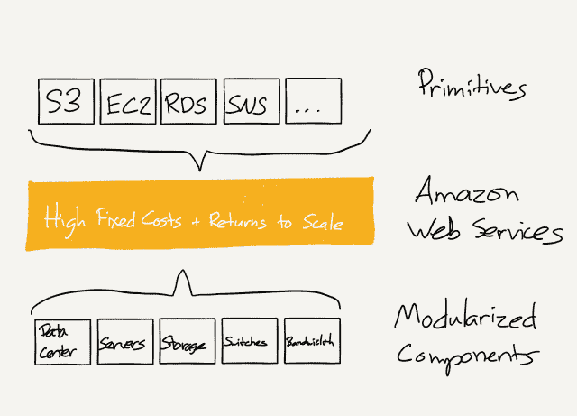
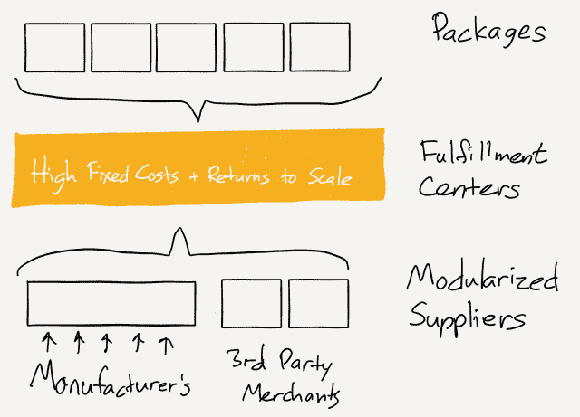

# 本·汤普森的亚马逊税收战略

> 原文：<https://stratechery.com/2016/the-amazon-tax/?utm_source=wanqu.co&utm_campaign=Wanqu+Daily&utm_medium=website>

十年前的昨天，亚马逊福音传道者杰夫·巴尔在亚马逊网络服务博客 [1](#fn1-2069 "<a href="https://web.archive.org/web/20060316053138/http://aws.typepad.com/aws/2006/03/amazon_s3.html">Hosted on Typepad</a>") 上发布了一篇 222 字的文章，文章开头写道:

> 今天早些时候，我们推出了亚马逊 S3，这是我们可靠、高度可扩展、低延迟的数据存储服务。

在那之前，亚马逊网络服务主要是为开发者提供一种进入亚马逊零售店的方式；然而，S3 与零售业毫无关系，至少没有直接关系。

#### AWS 的起源

正如布拉德·斯通在 [The Everything Store](http://brad-stone.com/book/) 中详细描述的那样，到 21 世纪初，亚马逊越来越受到这样一个事实的限制，即公司的各个团队都由一个单一的技术团队服务，该团队必须为每个项目授权和提供资源。斯通写道:

> 与此同时，贝佐斯迷上了史蒂夫·格兰德(Steve Grand)写的《创造》(Creation)一书，这本书是上世纪 90 年代一款名为《生物》(Creatures)的视频游戏的开发者，该游戏允许玩家在电脑屏幕上引导和培育一个看似智能的有机体。Grand 写道，他创造智能生命的方法是专注于设计简单的计算积木，称为原语，然后坐下来看令人惊讶的行为出现。
> 
> 这本书……有助于将关于公司自身基础设施问题的辩论具体化。如果亚马逊想激发其开发者的创造力，它不应该试图猜测他们可能想要什么样的服务；这种猜测是基于过去的模式。相反，它应该创造原语——计算的构建模块——然后退出。换句话说，它需要将其基础设施分解成最小、最简单的原子组件，并允许开发人员尽可能灵活地自由访问它们。

“原语”模型模块化了亚马逊的基础设施，有效地将原始数据中心组件转化为存储、计算、数据库等。这不仅可以由 Amazon 的内部团队临时使用，也可以由外部开发人员使用:

[T2】](https://i0.wp.com/stratechery.com/wp-content/uploads/2016/03/stratechery-Year-One-274.png?ssl=1)

中间的这个 AWS 层有几个关键特征:

*   AWS 有巨大的固定成本，但从规模经济中受益匪浅
*   构建 AWS 的成本是合理的，因为亚马逊的电子商务业务是第一个也是最好的客户
*   AWS 对“原语”的关注意味着它可以按原样出售给亚马逊以外的开发者，增加规模回报，并进一步深化 AWS 的护城河

最后这一点是双赢的:开发者将可以获得企业级的计算资源，而无需预先投资；与此同时，亚马逊将获得更大规模的一系列产品，因为它们将是第一个也是最好的客户。

#### AWS 税

说 AWS 成功完成了它的使命是一种保守的说法:对开发者的影响正是 AWS 负责人 Andy Jassy 在他的愿景声明中所写的。斯通这样总结道:

> 该文件阐述了扩展的 AWS 使命:“使开发者和公司能够使用 Web 服务来构建复杂的和可伸缩的应用程序”…
> 
> “我们试图想象一个住在宿舍的学生，他或她拥有与世界上最大的公司一样的基础设施，”Jassy 说。“我们认为，初创公司和小公司拥有与大公司相同的成本结构，这是一个很好的公平竞争环境。”

过去是，而且过去几年中几乎所有值得注意的初创公司都是从 AWS 或其竞争对手那里起步的。然而，衡量 AWS 影响力的真正标准是它改变开发者生态系统的方式，包括风险投资。

这对亚马逊的影响同样显著:我去年[详细介绍了 AWS 财务结果的披露实际上是一次脸书级别的 IPO，随后的收益报告中，AWS 展示了规模的力量——增加的收入加上增加的利润——这只是巩固了一个事实，即 AWS 将是亚马逊收入的重要驱动力，并且(最终！)未来很长一段时间的利润。社交+资本创始人查马斯·帕里哈皮蒂亚(Chamath Palihapitiya)，当被问及如果只能选择一家，他会投资哪家公司时，](https://stratechery.com/2015/the-aws-ipo/)[在 Quora](https://www.quora.com/Chamath-Palihapitiya-If-you-had-to-put-ALL-of-your-money-in-one-investment-today-with-a-10-year-holding-period-what-would-it-be) 上回应道:

> AWS 是对计算经济的征税。因此，无论你关心的是移动应用、消费应用、物联网、SaaS 等，更多的公司将使用 AWS 而不是构建自己的基础设施。电子商务是 AMZN 的方式狗粮 AWS，并继续这样做，以便它是任务级。如果你相信随着时间的推移，软件行业是一个数十万亿的行业，那么问问你自己，一个对这个行业的大部分征税的公司会有多大价值？1%、2%、5%——这无关紧要，因为这些数字太大了——收入、利润、利润率等等。我看不到现在在公共市场上有任何更清洁的垄断产品。

Palihapitiya 所指的垄断是基于我上面提到的规模效应:AWS 变得越大，亚马逊在 AWS 服务定价方面的优势就越大，这意味着他们可以赚取更多的业务，这进一步增加了他们的优势。最终结果是，除了最大的基于云的公司 [3](#fn3-2069 "I will discuss Dropbox’s recent announcement that they are moving away from AWS in tomorrow’s <a href="https://stratechery.com/membership/">Daily Update</a> ") 之外，这一优势，加上 AWS 提供的灵活性(这在运营和财务上都至关重要)，将导致一个不可避免的结论，即亚马逊应该服务于他们所有的基础设施需求；他们为这项服务支付的费用是 Palihapitiya 的“税”。

然而，值得考虑的是，正如 AWS 对开发者的影响扩散到更广泛的创业生态系统一样，AWS 对亚马逊本身的影响似乎越来越超出了它对底线的巨大贡献。用斯通的话来说，亚马逊可能已经开始成为“一切商店”，但它的未来是成为受益于规模经济的一系列行业的收税人，AWS 就是这种模式。

#### 亚马逊电子商务业务的转型

长期读者会记得，我[在 2014 年经历了我的亚马逊熊阶段](https://stratechery.com/2014/losing-amazon-religion/)[4](#fn4-2069 "It’s like puberty for tech analysts")；是 AWS 让我放弃的。尽管我收回了自己的观点，但我认为我对亚马逊电子商务业务的悲观分析是正确的:

*   亚马逊的图书、CD、DVD 和视频游戏等“媒体”业务提供了绝大部分“利润”，但这项业务在亚马逊总销售额中所占的比例正在缩小，鉴于媒体的长期趋势，这一比例很可能会继续缩小
*   “电子和百货”增长迅速，但销售商品的性质意味着利润相对较少

然而，如果亚马逊满足于在销售“电子产品和普通商品”上无利可图，又会怎样呢？我不是指马修·伊格雷西亚斯所说的亚马逊“是一个慈善组织，由投资界的一些人为了消费者的利益而经营”；而是，如果亚马逊电商业务的商业模式改成了“税收”征收呢？

以好市多为例:去年，这家批发零售商向其 8100 多万会员销售了 1140 亿美元，净收入 23 亿美元；会费总额为 25 亿美元。换句话说，好市多 11%的毛利率甚至不够支付运营成本；这个差额，连同所有的利润，来自于向好市多顾客征收的“税”。

我认为 Prime memberships 对亚马逊来说扮演着同样的角色:该业务的非 AWS 部分去年产生了 26 亿美元的营业利润；与此同时，消费者智能研究伙伴(CIRP)估计，亚马逊现在有 5400 万 Prime 会员，按每名会员 99 美元计算，将产生 53 亿美元的收入；亚马逊电子商务业务盈利能力的差异来自于对亚马逊最佳客户征收的“税”。

然而，事实上，我认为即使是这种分析也过于狭隘:电子商务正在不可阻挡地占据美国零售业越来越多的份额，特别是亚马逊正在占据电子商务增长的 50 %( T3)。将这一现实与 Prime 的增长结合起来，亚马逊实际上正在向所有零售环节征税。

不过，就像 AWS 的情况一样，这种税是消费者愿意接受的:Prime 是一种价格和选择都很好的超级体验，它也有助于扩大规模。结果是这样一个企业:

[T2】](https://i0.wp.com/stratechery.com/wp-content/uploads/2016/03/stratechery-Year-One-275.png?ssl=1)

当然，这与 AWS 的结构相同，并且具有相似的特征:

*   电子商务分销有巨大的固定成本，但从规模经济中获益巨大
*   扩建亚马逊履约中心的成本是合理的，因为第一个也是最好的客户是亚马逊的电子商务业务
*   最后一点可能看起来很奇怪，但事实上亚马逊 40%的销售额(单位销售额)是由第三方商家售出的；大多数这些商家利用亚马逊履行，这意味着他们的商品存储在亚马逊的履行中心，并由 Prime 覆盖。这增加了亚马逊履行中心的规模回报，增加了 Prime 的价值，并加深了亚马逊的护城河

“税收”的类比超越了黄金；例如，亚马逊从这些第三方销售中抽取一部分，并从他们直接销售的商品中抽取更大一部分收入。然而，效果是一致的:亚马逊正在对一个庞大的行业征收“税”，没有人介意，因为亚马逊的规模确保了最好的价格和最好的体验。

#### 物流与回声

越来越明显的是，亚马逊打算在物流方面重复这一模式:在去年试验了 6 架飞机后，该公司最近又在 T2 租赁了 20 架飞机来充实其私人物流网络；除此之外，[还将其中国子公司](http://www.reuters.com/article/us-amazon-com-freight-idUSKCN0US2YW)注册为海洋货运代理。毫不奇怪，正如《华尔街日报》指出的:

> 在一份证券文件中，亚马逊首次将“为自己或第三方提供履行和物流服务的公司，无论是在线还是离线”视为竞争对手。它自称为“运输服务提供商”在这两种情况下，这标志着亚马逊首次在其年度报告中使用这种语言，即 10-K。

那么这将会如何发展呢？

首先，亚马逊本身将是这个物流网络的第一个也是最好的客户，就像 AWS 一样。这证明了建设一个与 UPS、联邦快递、*等*竞争的物流网络所需的巨额支出是合理的，大多数商店都将这些举措视为亚马逊控制运输成本和提高可靠性的一种方式，尤其是在假期前后。

然而，我认为认为亚马逊将止步于此的想法是错误的:正如他们在 AWS 和电子商务分销方面所做的那样，我预计该公司将向第三方提供其物流网络，这将增加规模回报，进而加深亚马逊的最终护城河。 [7](#fn7-2069 "To be sure, UPS, Fedex, <em>et al</em> have a big head start, but their networks and cost structures are focused on businesses; Amazon will focus on consumers")

闹哄哄的回声也符合这种模式:所有常见的嫌疑人都可以构建出互联住宅的各个部分；亚马逊将简单地提供关键，Echo 的成本是联网家庭的“税”。

#### 原始组织

贝佐斯著名的 1997 年致股东信明确指出，这种模式的根源从一开始就存在。具体来说，贝佐斯非常注重规模的力量:

> 我们的市场领导能力越强，我们的经济模式就越强大。市场领先地位可以直接转化为更高的收入、更高的盈利能力、更高的资本流动速度，以及相应更高的投资资本回报……我们选择优先发展，因为我们相信规模是实现我们商业模式潜力的核心。

然而，同样清楚的是，贝佐斯当时并没有完全意识到他的模式将远远超出电子商务的范畴；不过，这也是亚马逊内部组织如此强大的原因。该公司由多个相对独立的团队组成，每个团队都有自己的 P&L、责任和分布式决策。斯通解释了贝佐斯早期的一项计划:

> 他说，整个公司将围绕他所谓的“双披萨团队”进行重组员工将被组织成不到 10 人的自治小组——小到当工作到很晚时，团队成员可以得到两个披萨饼。这些团队将独立解决亚马逊最大的问题……贝佐斯将一种混沌理论应用于管理，通过将组织分解成最基本的部分来承认其复杂性，希望可能会出现令人惊讶的结果。

斯通后来写道，双披萨团队最终并不是在所有地方都有意义，但正如他在后续文章中指出的，该公司仍然非常扁平，责任广泛分配。在那里，在那些“最基本的部分”中，有适合于规模和实验的原语。还记得上面描述贝佐斯和他的团队是如何想出 AWS 这个主意的吗:

> 如果亚马逊想激发其开发者的创造力，它不应该试图猜测他们可能想要什么样的服务；这种猜测是基于过去的模式。相反，它应该创造原语——计算的构建模块——然后退出。

史蒂文·辛诺夫斯基喜欢注意到组织倾向于发布他们的组织结构图，虽然我一开始建议亚马逊复制 AWS 模型，但事实证明 AWS 模型在许多方面是亚马逊本身的代表(就像 iPhone 在许多方面反映了苹果的单一组织一样):创建一堆原语，离开这种方式，并从顶部进行很好的浏览。

### *相关*