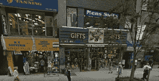
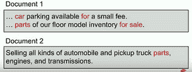
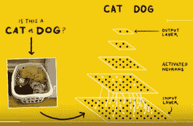
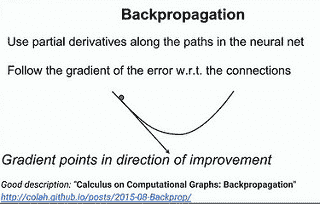
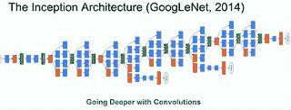
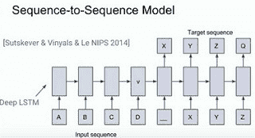
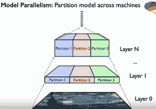
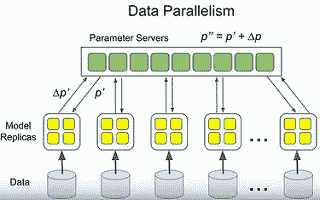

# Jeff Dean 谈谷歌的大规模深度学习——高可扩展性

> 原文：<http://highscalability.com/blog/2016/3/16/jeff-dean-on-large-scale-deep-learning-at-google.html?utm_source=wanqu.co&utm_campaign=Wanqu+Daily&utm_medium=website>

<iframe src="https://www.youtube.com/embed/QSaZGT4-6EY?rel=0" frameborder="0" allowfullscreen="">视频</iframe>
*如果你不能理解信息中的内容，那就很难组织起来。*

这句话出自 [杰夫·迪恩](http://research.google.com/pubs/jeff.html) ，目前是一名向导，呃，谷歌系统基础设施组的研究员。摘自他最近的演讲: [面向智能计算机系统的大规模深度学习](https://www.youtube.com/watch?v=QSaZGT4-6EY) 。

自从[alpha go vs Lee Se-dol](https://gogameguru.com/tag/deepmind-alphago-lee-sedol/)，现代版[John Henry](https://en.wikipedia.org/wiki/John_Henry_(folklore))的致命种族 [对战](https://www.youtube.com/watch?v=j3LVFdWBHVM) 的一个蒸汽锤，已经迷住了全世界，如同已经对一个 AI [天启](http://thenextweb.com/insider/2014/03/08/ai-could-kill-all-meet-man-takes-risk-seriously/) 有了广义的恐惧一样，这似乎是一个极好的时间来给杰夫‘添彩’而如果你现在觉得 AlphaGo 不错，那就等它达到 beta 吧。

当然，杰夫指的是谷歌臭名昭著的 [座右铭](https://www.google.com/about/company/) : *组织全世界的信息并使其普遍可用* 。

历史上，我们可能会将“组织”与收集、清理、存储、索引、报告和搜索数据联系在一起。谷歌早期掌握的所有东西。随着这一任务的完成，谷歌开始迎接下一个挑战。

现在 **组织手段理解** 。

我演讲的一些亮点:

*   **真正的神经网络是由上亿个参数组成的**。谷歌拥有的技能是如何在大型有趣的数据集上建立和快速训练这些庞大的模型，将它们应用于实际问题，*和*，然后在各种不同的平台(手机、传感器、云等)上将这些模型快速部署到生产中。).

*   神经网络在 90 年代没有起飞的原因是缺乏计算能力和大型有趣的数据集。你可以看到谷歌对算法的天然热爱与他们庞大的基础设施和不断扩大的数据集相结合，如何在谷歌为人工智能创造了一场**完美风暴。**

*   谷歌和其他公司的一个关键区别是，当他们在 2011 年开始谷歌大脑项目时，他们没有把他们的研究放在象牙塔里，而是在公司的一个独立研究部门进行研究。该项目团队与 Android、Gmail 和 photos 等其他团队密切合作，以实际改善这些特性并解决难题。这很少见，对每个公司来说都是一个很好的教训。 **与人合作应用研究** 。

*   这个想法很强大:他们已经知道他们可以带走一大堆子系统，其中一些可能是机器学习的， **用一个更通用的端到端机器学习块** 来代替它。通常，当你有很多复杂的子系统时，通常会有很多复杂的代码将它们缝合在一起。如果你能用数据和非常简单的算法取代所有这些，那就太好了。

*   **机器学习只会变得更好更快** 。引用杰夫的话:机器学习社区发展得非常非常快。人们发表一篇论文，在一周之内，世界各地的许多研究小组下载了这篇论文，阅读了它，剖析了它，理解了它，对它进行了一些扩展，并在[【arXiv.org](http://arxiv.org/)上发表了他们自己的扩展。它不同于计算机科学的许多其他部分，在那里人们会提交一篇论文，六个月后会议将决定是否接受它，然后它会在三个月后的会议过程中出来。到那时已经一年了。将这个时间从一年缩短到一周是惊人的。

*   **技法可以神奇地组合** 。翻译团队使用计算机视觉编写了一个应用程序，可以识别取景器中的文本。它翻译文本，然后将翻译的文本叠加在图像本身上。另一个例子是写图片说明。它将图像识别与序列对序列神经网络相结合。你只能想象未来所有这些模块化组件将如何串在一起。

*   **功能强大的机型小到可以在智能手机上运行** 。为了让技术消失，智能必须移动到边缘。它不能依赖于连接到远程云大脑的网络脐带。由于张量流模型可以在手机上运行，这也许是可能的。

*   如果你不是在考虑如何利用深度神经网络解决你的数据理解问题， **你几乎可以肯定应该是** 。这句话直接摘自演讲，但是当你看到一个又一个难题被深度神经网络处理后，它的真相就非常清楚了。

杰夫总是做精彩的演讲，这次也不例外。很直白，很有趣，很深入，也相对容易理解。如果你正试图掌握深度学习，或者只是想看看谷歌在做什么，那么它是 的必看之地。

谈话中没有太多无聊的内容。挤满了。所以我不确定这篇文章能给你增加多少价值。所以如果你想看视频，我可以理解。

正如 Google talks 经常发生的那样，你会有这样一种感觉，我们只是被邀请进入威利·旺卡巧克力工厂的大厅。我们面前是一扇锁着的门，我们没有被邀请进去。那扇门后一定充满了奇迹。但即使是威利·旺卡的游说也很有趣。

那么，让我们来听听杰夫对未来有什么看法……这太迷人了...

## 理解是什么意思？

*   当一个人被展示一个街道场景时，他们毫无问题地从场景中挑出文本，理解一个商店卖纪念品，一个商店卖很低的价格，等等。直到最近，计算机还不能从图像中提取这些信息。

T2】

*   如果你真的想从图像中理解物理世界，计算机需要能够挑选出有趣的信息，阅读文本，并理解它。

*   无论是现在还是未来，小型移动设备都将主导计算机交互。这些设备需要不同种类的接口。你需要真正能够理解并产生语言。

*   拿个查询:【汽车配件出售】。旧的 Google 会匹配第一个结果，因为关键字匹配，但更好的匹配是第二个文档。真正在深层次上理解查询的意思，而不是在表面的单词层次上，才是你构建好的搜索和语言理解产品所需要的。

T2】

## 谷歌深度神经网络的一点历史

*   [谷歌大脑项目](https://en.wikipedia.org/wiki/Google_Brain) 始于 2011 年，致力于推动神经网络技术的发展。

*   神经网络已经存在很长时间了。发明于 60 年代和 70 年代，流行于 80 年代末和 90 年代初，后来逐渐消失。两个问题:1)缺乏训练大型模型所需的计算能力意味着神经网络无法应用于更大的有趣数据集上的更大问题。2)缺乏大量有趣的数据集。

*   开始在谷歌只与几个产品团队合作。随着时间的推移，当团队发布了一些好的东西或者解决了一些他们以前无法解决的问题，消息就传开了，更多的团队会去找他们帮忙解决问题。

*   利用深度学习技术的一些产品/领域:Android、应用、药物发现、Gmail、图像理解、地图、自然语言、照片、机器人、语音翻译等等。

*   深度学习可以应用于如此多样化的项目的原因是它们**涉及应用于不同领域的同一组构建模块**:语音、文本、搜索查询、图像、视频、标签、实体、单词、音频特征。你可以输入一种信息，决定你想要什么样的信息，收集一个训练数据集，这个数据集代表你想要计算的函数，然后你就可以开始了。

*   这些模型工作得如此之好是因为 **你输入非常原始形式的数据** ，你不必手工设计许多有趣的特征，模型的强大之处在于它能够通过观察大量的例子来自动决定数据集的有趣之处。

*   你可以学习通用的表示法，有可能是跨领域的。例如,“汽车”可以表示汽车图像的意思。

*   他们已经知道他们可以带走一大堆子系统，其中一些可能是机器学习的，然后**用一个更通用的端到端机器学习部件**来代替它。通常，当你有很多复杂的子系统时，通常会有很多复杂的代码将它们缝合在一起。如果你能用数据和非常简单的算法取代所有这些，那就太好了。

## 什么是深度神经网？

*   [神经网络](https://en.wikipedia.org/wiki/Artificial_neural_network) 从数据中学习一个真正复杂的函数。来自一个空间的输入被转换成另一个空间的输出。

*   这个函数不像 x 2 ，它是一个非常复杂的函数。例如，当你输入原始像素时，比如一只猫，输出将是一个对象类别。

T2】

*   深度学习中的**深度**是指神经网络中的**层数**。

*   深度的一个很好的属性是，系统是由一个 **简单且可训练的数学函数** 集合而成。

*   深度神经网络与许多机器学习风格兼容。

    *   例如，你有一个输入是一张猫的图片，一个输出是一个人将图片标记为猫，这被称为 [监督学习](https://en.wikipedia.org/wiki/Supervised_learning) 。你可以给系统举很多有监督的例子，你要学习逼近一个函数，类似于它在那些有监督的例子中观察到的函数。

    *   你也可以做 [无监督训练](https://en.wikipedia.org/wiki/Unsupervised_learning) 只给你图像，你不知道里面有什么。然后，该系统可以学习挑选出现在大量图像中的模式。因此，即使你不知道如何称呼这张图片，它也能识别出所有这些图片中有一只猫的共同点。

    *   它还兼容更奇特的技术，如 [强化学习](https://en.wikipedia.org/wiki/Reinforcement_learning) ，这是一种非常重要的技术，正被用作 AlphaGo 的一部分。

## 什么是深度学习？

*   一个神经元有一堆输入。真正的神经元可以将不同的强度与不同的输入联系起来。人工神经网络试图学习所有这些边上的权重，这些权重是与不同输入相关联的强度。

*   真正的神经元接受它们的输入和强度的某种组合，并决定触发或不触发一个尖峰。

    *   人造神经元不只是发出一个尖峰信号，而是发出一个实数值。这些神经元计算的函数是它们输入的加权和乘以通过一些非线性函数应用的权重。

    *   通常今天使用的非线性函数是一个 [整流线性单元](https://en.wikipedia.org/wiki/Rectifier_(neural_networks)) (max(0，x))。在 90 年代，许多非线性函数是更加平滑的 sigmoid 或 tanh 函数。它有一个很好的特性，当神经元没有激活时，它会给出真正的零，而不是接近零的值，这有助于优化系统。

    *   例如，如果一个神经元有三个输入 X1、X1、X3，权重分别为-0.21、0.3 和 0.7，则计算结果为:y = max(0，-0.21 * X1+0.3 * x2+0.7 * x3)。

*   在确定一个图像是一只猫还是一只狗的过程中，图像会经过一系列的层。一些神经元会根据它们的输入而激活或不激活。
    

    *   最底层的神经元会看小块的像素。更高级别的神经元会看下面神经元的输出，决定是否开火。

    *   例如，这个模型会一层层地往上走，说它是一只猫。在这种情况下哪一个是错的，它是一只狗(虽然我也认为它是猫，一只在篮子里的狗？).

    *   这是一个错误决定的信号反馈到系统中，然后系统将对模型的其余部分进行调整，以使下次查看图像时输出更有可能是狗。

    *   这是神经网络的**目标，** **对整个模型中所有边的权重** **进行小调整，以使你更有可能得到正确的例子。你对所有的例子都这样做，这样总的来说，你可以得到大多数正确的例子。**

*   学习算法真的很简单。未完成时:

    *   挑选一个随机的训练例子”(输入，标签)。例如具有期望输出的猫图片，“猫”。

    *   在“输入”上运行神经网络，看看它会产生什么。

    *   调整边缘权重，使输出更接近“标签”

T2】

*   你需要沿着箭头的方向拿着重物，这样它更有可能会说“狗”。不要因为是复杂的凹凸不平的表面就迈一大步。迈出很小的一步，让下一次的结果更有可能是失败。通过大量的迭代和查看示例，结果越有可能是 dog。

*   通过链式法则，你可以了解下层参数的变化将如何影响输出。这意味着网络中的 **变化可以通过** 一路波及到输入，使整个模型适应并更有可能说狗。

*   真正的神经网络是由数以亿计的参数**组成的，所以你要在一个亿维空间中进行调整，并试图理解这如何影响网络的输出。**

 **## 神经网络的一些好特性

*   **神经网络可以应用于很多不同种类的问题** (只要你有很多有趣的数据要理解)。

    *   文本:英语和其他语言有数万亿个单词。有许多对齐的文本，其中有一种语言和另一种语言的逐句翻译版本。

    *   视觉数据:数十亿张图片和视频。

    *   音频:每天上万小时的演讲。

    *   用户活动:有很多不同的应用程序生成数据。例如来自搜索引擎的查询或人们在电子邮件中将消息标记为垃圾邮件。你可以从很多活动中学习并构建智能系统。

    *   知识图:亿万个带标签的关系三元组。

*   **如果你扔给他们更多的数据，让你的模型更大，结果往往会变得更好** 。

    *   如果你在一个问题上扔了更多的数据，而没有在某个时候让你的模型变得更大，那么模型的容量会因为学习关于你的数据集的更明显的事实而饱和。

    *   通过增加模型的大小，它不仅可以记住显而易见的事情，还可以记住微妙的模式，这些模式可能只出现在数据集中的一小部分例子中。

    *   通过在更多的数据上建立更大的模型 **需要更多的计算** 。谷歌一直在做的大量工作是如何扩大计算量，以解决这些问题，从而训练更大的模型。

## 深度学习在谷歌的哪些地方有重大影响？

### 语音识别

*   这是谷歌大脑团队合作部署神经网络的首批团队之一。他们帮助他们部署了一种新的声学模型，这种模型基于神经网络，而不是他们正在使用的 [隐马尔可夫模型](https://en.wikipedia.org/wiki/Hidden_Markov_model) 。

*   声学模型的问题是从 150 毫秒的语音到预测中间 10 毫秒发出什么声音。例如，它是 ba 音还是 ka 音？然后你就有了这些预测的完整序列，然后你用一个语言模型将它们缝合在一起，以理解用户所说的话。

*   他们最初的模型 **减少了 30%的单词识别错误** ，这真是一件大事。从那时起，语音团队一直在研究更复杂的模型和先进的网络，以进一步降低错误率。现在，当你对着手机说话时，语音识别比三五年前好得多。

### ImageNet 挑战赛

*   大约 6 年前 [ImageNet](http://image-net.org/) 数据集发布。大约一百万张图片是当时计算机视觉最大的数据集之一。这个庞大数据集的发布推动了计算机视觉领域的发展。

    *   图像被分为大约 1000 个不同的类别，每个类别大约有 1000 张图像。

    *   有一千种不同的豹子、摩托车等等的图片。

    *   一个复杂的因素是并非所有的标签都是正确的。

*   目标是推广到新的图像类型。你能说出一张新照片是豹子还是樱桃吗？

*   在挑战中使用神经网络之前，错误率约为 26%。2014 年，谷歌以 6.66%的错误率赢得了挑战。2015 年错误率下降到 3.46%。

*   这是一个又大又深的模型。每个盒子都是一整层进行卷积运算的神经元。下面是这张纸: [深入卷积](http://www.cs.unc.edu/~wliu/papers/GoogLeNet.pdf) 。

T2】

#### 神经网络模型擅长什么？

*   模特们**非常擅长** **进行精细的等级区分**。例如，计算机擅长区分狗的品种，而人类却不擅长。当一个人看到一朵花并说它是一朵花时，计算机可以分辨出它是“芙蓉”还是“大丽花”。
*   这些模型**善于概括**。例如，不同种类的膳食，看起来不相似，仍然会被正确地标记为“膳食”
*   当计算机出错时,**错误是显而易见的**为什么。例如，蛞蝓看起来很像蛇。

### 谷歌照片搜索

*   查看像素和理解图像内容的能力非常强大。

*   Google 相册团队实现了无需标记即可搜索照片的功能。你可以找到雕像、尤达、图画、水等的图片，而不用给这些图片贴标签。

### 街景图像

*   在街景图像中，你希望能够阅读所有文本。这是一个更精细更具体的视觉任务。

*   首先，你需要能够在图像中找到文本。一个模型被训练来基本上预测像素的热图，哪些像素包含文本，哪些不包含文本。训练数据是围绕文本绘制的多边形。

*   由于训练数据包含不同的字符集，因此查找多种语言的文本没有问题。它适用于大字体和小字体；离镜头近的词和离镜头远的词；不同颜色的。

*   这是一个相对容易训练的模型。这是一个卷积网络，试图预测每个像素是否包含文本。

### 谷歌搜索排名中的 rank brain

*   [RankBrain](http://searchengineland.com/faq-all-about-the-new-google-rankbrain-algorithm-234440) 于 2015 年上线。这是第三个最重要的搜索排名信号。更多信息请访问: [谷歌将其利润丰厚的网络搜索交给人工智能机器](http://www.bloomberg.com/news/articles/2015-10-26/google-turning-its-lucrative-web-search-over-to-ai-machines) 。

*   搜索排名不同是因为你想能够理解模型，你想理解它为什么在做某些决定。

    *   这是搜索排名团队在使用神经网络进行搜索排名时犹豫不决的原因之一。当系统出错时，他们想知道为什么会这样。

    *   创建了调试工具，并在模型中内置了足够的可理解性来克服这一异议。

    *   一般来说，你不想手动调整参数。你试着去理解为什么模型会做出这种预测，并且弄清楚这是否与训练数据有关，是否与问题不匹配？您可以在一个数据分布上进行培训，并应用于另一个分布。通过搜索，你每天得到的查询分布会有一点点变化。变化总是因为事件而发生。你必须明白，如果你的分布是稳定的，就像语音识别一样，人们发出的声音不会改变太多。查询和文档内容经常变化，因此您必须确保您的模型是新鲜的。更一般地说，我们需要更好地构建工具来理解这些神经网络内部发生了什么，找出是什么导致了预测。

### 序列到序列模型

*   世界上的许多问题都可以归结为将一个序列映射到另一个序列。谷歌的 Sutskever、Vinyals 和 Le 就这个话题写了一篇开创性的论文: [用神经网络进行序列对序列学习](http://papers.nips.cc/paper/5346-sequence-to-sequence-learning-with-neural-networks.pdf) 。

*   他们特别关注语言翻译，即把英语翻译成法语的问题。翻译实际上就是将一系列英语单词映射成一系列法语单词。

*   神经网络非常擅长学习非常复杂的函数，所以这个模型学习了英语到法语句子映射的功能。

T2】

*   使用 EOS(句子结束)信号一次一个单词地输入一种语言的句子。当 is 看到 EOS 开始用另一种语言产生相应的句子时，模型被训练。训练数据是意思相同的语言句子对。它只是试图模拟这个函数。

*   在每一步，它都会在你的词汇表中的所有词汇条目上发出一个概率分布。在推理时，你需要做一点搜索，而不是训练。如果你必须最大化每个单词的概率，你不一定会得到最可能的句子。在联合概率上进行搜索，直到找到最可能的句子。

*   这个系统在公共翻译任务上达到了最先进的水平。大多数其他翻译系统是一堆针对问题子部分的手动编码或机器学习模型，而不是这种完整的端到端学习系统。

*   由于许多问题都可以映射到这种序列对序列的方法上，因此人们对这种模型的兴趣大增。

#### 智能回复

#### 图像字幕

*   在生成图像标题时，你试图在给定图像像素的情况下，最大化人类可能写下的图像标题。

*   将开发的图像模型和开发的序列对序列模型连接在一起。图像模型被用作输入。你不是一次一个单词地读一个英语句子，而是看图像的像素。

*   它被训练生成标题。训练数据集包含由五个不同的人写的五个不同标题的图像。总共写了大约 700，000 个句子，大约 100，000 到 200，000 个图像。

*   关于一张婴儿抱着泰迪熊的照片，电脑写道:一个小孩抱着一个毛绒玩具的特写；一个婴儿在泰迪熊旁边睡着了。

*   它没有人类的理解能力。当它是错误的时候，结果会很有趣。

### 组合视觉+翻译

*   技法可以组合。翻译团队使用计算机视觉编写了一个应用程序，可以识别取景器中的文本。它翻译文本，然后将翻译的文本叠加在图像本身上(看起来非常令人印象深刻，大约在 37:29)。

*   型号小到 **it** **都在 设备上运行！**

## 周转时间和对研究的影响

*   一天内完成单个 GPU 卡需要 6 周才能完成的培训。

*   谷歌真正关心的是能够快速扭转研究的局面。这个想法是快速训练模型，了解哪些效果好，哪些效果不好，并找出下一组要运行的实验。

*   一个模型应该可以在几分钟或几小时内训练出来，而不是几天或几周。它让每个做这种研究的人更有效率。

## 如何快速训练大型模特

### 模型并行性

*   神经网络有许多内在的并行性。

*   当你计算它们时，所有不同的单个神经元大多是相互独立的，特别是如果你有局部感受野，其中一个神经元只接受它下面一小部分神经元的输入。

*   工作可以在不同的 GPU 卡上跨不同的机器进行划分。只有跨越边界的数据才需要通信。

### 数据并行性

*   您正在优化的模型的参数集不应该在一台机器上，而应该在一个集中的服务中，这样您就可以拥有模型的许多不同副本，它们将协作来优化参数。

*   在培训过程中，阅读不同的随机数据(示例)。每个复制品将获得模型中的当前参数集，读取关于梯度应该是什么的一点数据，找出它想要对参数进行什么调整，并将调整发送回参数服务器的集中集。参数服务器将对参数进行调整。并且重复该过程。

T2】

*   这可以跨多个副本完成。有时，他们在 500 台不同的机器上使用 500 个模型副本，以便快速优化参数和处理大量数据。

*   该过程可以是 **异步** 其中每个筒仓处于其自己的循环中，获取参数、计算梯度并将其发送回，而无需任何控制或与其他筒仓同步。不利的一面是，当梯度返回时，参数可能已经从计算完成时开始移动。事实证明，这对于实践中多达 50 到 100 个副本的许多类型的模型来说是可以的。

*   流程可以 **同步** 。一个控制器控制所有的复制品。两者似乎都有效，各有不同的优缺点(未列出)。

演讲的下一部分是关于 TensorFlow 的，我不会在这里介绍。这个帖子已经太长了。

## 问&答

*   **如果你不是 Google 这样的大公司，没有大数据集的权限，你会怎么做？** 从一个在公共数据集上训练好的模型开始。公共数据集通常是可用的。然后根据你的问题进行更有针对性的数据训练。当您从一个相似的公开可用的数据集开始时，您可能只需要 1000 或 10000 个针对您的特定问题标记的示例。ImageNet 是这个过程工作的一个很好的例子。

*   **你作为工程师最大的错误是什么？** 未将分布式事务放入 BigTable 中。如果您想要更新多行，您必须使用自己的事务协议。没有放进去是因为这会使系统设计变得复杂。回想起来，许多团队都想要这种能力，并建立了自己的能力，取得了不同程度的成功。我们应该在核心系统中实现事务。它在内部也是有用的。Spanner 通过添加事务解决了这个问题。

## 相关文章**