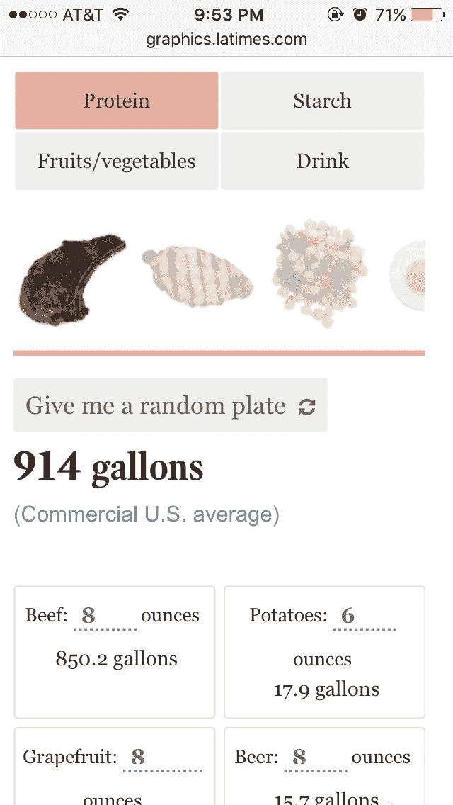
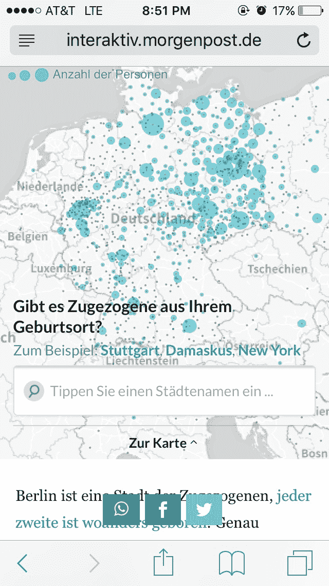
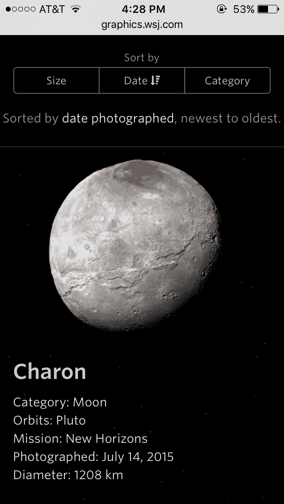

# 小屏幕，全艺术，不能输:尽管尺寸很大，手机为互动开辟了新的机会

> 原文：<http://www.niemanlab.org/2016/03/small-screens-full-art-despite-their-size-smartphones-open-up-new-opportunities-for-interactives/?utm_source=wanqu.co&utm_campaign=Wanqu+Daily&utm_medium=website>

数据，数据，无处不在，却没有足够的空间来展示。至少，当我想到我们在桌面上所熟知的美丽、广阔和互动的体验时，我想到的只是表面上的担忧

[Snow Falls](http://www.nytimes.com/projects/2012/snow-fall/#/?part=tunnel-creek)

以及它们如何翻译到我的手机上。

在较小的屏幕上创建信息丰富(在更基本的层面上，清晰易读)的图形存在一系列挑战，但将移动设备视为桌面的简化版本可能会有所限制:“这些设备就在那里，它们内置了这些功能，所以我们如何在讲故事时使用它？”《洛杉矶时报》的数据可视化主管 Len DeGroot 说，他指给我看一篇关于洛杉矶地区总水管漏水的[文章](http://graphics.latimes.com/los-angeles-pipe-leaks/)，这篇文章可以立即找到读者的位置，并显示附近的漏水情况。

手机有一系列不同的功能和用户行为，设计师和开发人员可以利用并需要迎合这些功能和行为。

“这些设备可以带来丰富的机会:感应倾斜和移动的陀螺仪，更容易的地理定位，内置摄像头，”华尔街日报全球视觉主管[虞琳敏](https://twitter.com/UjessU)说。“所有平台都有其独特的机会。”(在《华尔街日报》的[2050 年](http://graphics.wsj.com/2050-demographic-destiny/)世界互动中，“顶部的透镜状插图被想象成读者的‘复活节彩蛋’，当他们倾斜手中的手机时就会发现。桌面交互排在第二位，”于告诉我。)

有时，移动优先的思想渗透到图形和交互最终如何呈现在桌面上，或者完全决定这些团队如何构建图形密集型的故事。

彭博设计师说:“在某些情况下，用移动格式思考肯定会有所帮助，它提供了一种以较小的篇幅组织信息的好方法。”

[Mira Rojanasakul](https://twitter.com/rjnskl)

说道。“例如，当我们和编辑们一起列出这些世界末日的时候，

[worst-case scenarios of what could happen in 2016](http://www.bloomberg.com/graphics/pessimists-guide-to-2016/)

，试图在一个视图中展示所有内容比将其分解为移动大小，每个移动大小包含一点文本图像，以便读者可以滚动浏览要复杂得多。"

“我们已经改变了为大屏幕设计的习惯。无论我们在想什么，我们都在为移动而想，”[NPR 视觉团队的负责人 Brian Boyer](https://twitter.com/brianboyer) 强调地告诉我。“如果它在移动设备上不起作用，它就不起作用。这通常意味着，对于大型、膨胀、华丽的信息图表，我们不会这么做。”

当我请设计师和开发人员向我介绍他们如何将移动体验融入到在线互动中时，他们都说智能手机让他们能够以更有创意的方式来展示故事。然而，许多人也表达了类似的失望:全屏地图，没有 iOS 自动播放视频，担心数据过载，试图适应垂直和水平方向。为了篇幅和清晰起见，下面的回答已经过编辑。

[Len DeGroot](https://twitter.com/lendegroot) ，数据可视化总监:

我们有多种方法，取决于我们有多少时间。我们认为我们的用户会想要什么样的体验？例如，关于洛杉矶老化水管的文章，我们认为读者最想知道他们附近哪里漏水。所以我们决定假设人们会在手机上看这个。我们使用地理定位服务来定位页面顶部，并立即向他们显示他们周围的漏洞。我们开始这个项目时就考虑到了移动。

有些互动在手机上不太好用，有时我们会在手机上禁用它。如果有些东西在手机上真的很难阅读，我们完全重做图形或地图；在手机尺寸方面，我们有不同的东西可以互换。我们的东西是自动响应的，但有时不去强迫某样东西重塑自己会更经济。

当你有一些真正水平的东西时，它通常在手机上不起作用，特别是如果数据非常密集:当你缩小它时，它在小屏幕上变得不可读。所以我们可以做的是把信息收集到更大的桶里并简化它，这样你就可以看到它，并且仍然可以看到一个趋势。或者我们可以改变方向——我们真的不希望任何人转动他们的手机。

有时候，如果可视化不起作用，我们就放弃复杂的东西，而选择简单的表格。我们为手机做我们必须做的事情，这意味着有时我们会取消复杂的图形。

我们的图表显示了某些食物需要多少水，当你缩小到移动尺寸时，我们从[可视化](http://graphics.latimes.com/food-water-footprint/)(圆圈显示不同食物的水足迹)切换到一个简单的表格列表。桌面可视化在这里不起作用。

我们还有一个关于[发现火星盖尔陨石坑](http://graphics.latimes.com/mars-gale-crater-vr/)的片段，我们想在虚拟现实中完成，但想让它在浏览器中正常工作。在手机上，你可以四处走动，并在导游的带领下参观这个空间。我们希望帮助人们了解地形，并使用任何大小的设备来探索环境。

我们是 [D3](https://d3js.org/) 的大用户。火星盖尔陨坑那段是在 [Three.js](http://threejs.org/) 完成的。但是有时候漂亮的 HTML 就可以了。我们也是低科技的粉丝。我们的很多努力都集中在降低页面权重上。不管怎样，我们都尽量减小文件大小。Mars 产品在 wifi 连接下效果最佳。

我们仍在为手机地图寻找更好的答案。水项目是我们第一次雄心勃勃的尝试，尝试在手机上建立的东西。但是，和其他人一样，我们仍然在寻找在地图上一个非常小的空间里展示复杂信息的最佳方式。

我们有许多小技巧来帮助事情进展。正如你所知，加载视频是有问题的，尤其是当你在为 iPhone 做事情时，它不允许你自动播放。在我们的 [Gardena 警察拍摄片段](http://graphics.latimes.com/gardena-police-shooting/)中，你可以拖动不同的摄像机视图视频来倒退或前进，我们通过创建一个 GIF 并将其大幅缩小，然后在一个 [HTML 画布元素](http://www.w3schools.com/html/html5_canvas.asp)中增加它来解决这个问题。

互动负责人 Julius trger:

几年前，在柏林墙倒塌 25 周年之际，我们调查了柏林市这些年来的变化，我们向市统计局索要了居住在柏林的柏林人实际出生地点的数据，但他们当时掌握的数据并不详细。一年后，我们再次询问，他们能够发送给我们一个巨大的新 Excel 文件。

我们考虑了两件事。第一，这里有什么新闻？在柏林，你很少会遇到一个出生在这里的柏林人！第二，我们如何吸引读者？我们总是有一个规则，任何互动都必须从远处和近处进行。从第一张图片，读者需要能够看到:嘿，这很有趣，这对我来说是新闻。

我们的[zugezonen Atlas interactive](http://interaktiv.morgenpost.de/berliner-zugezogenen-atlas/)，展示了现在生活在柏林的柏林人实际上是在哪里出生的，让*靠近*是非常重要的，这样人们就可以放大他们的地址，他们的城市，看看什么适用于他们。

我们把这张互动地图放在最前面，它以德国为中心，但是如果你想要更大的图片，你可以缩小到整个世界。我们还让你找到你的具体家乡城市，获得号码，并分享它。我们有数万股脸书股票——这对我们来说真的很多，因为我们是一家本地报纸。我们添加了一个 100 大城市的名单进行比较，然后我们的视频编辑走到柏林的大街上，问那些不是在柏林出生的人，他们为什么会在柏林。

在手机上导航地图没那么容易。在桌面上你可以悬停，但在移动设备上你不能这样做——你必须点击，然后你没有足够的空间来看到工具提示。但是在这里，我们做了一些我认为有效的事情——或者至少没有人抱怨——你可以输入你感兴趣的地址，然后立刻放大。因此，用户更专注于输入地址，而不只是偶然地平移和缩放。

我们总是同时想到移动和桌面。在我们有了一个基本的想法，有了文本和其他元素，有了我们想要展示的东西，我们的设计师就开始着手了。我们的设计师为我们设计了两个模型，一个是桌面模型，一个是移动模型。然后我们的开发人员开始建造它。我们没有严格的流程；我们只是不断迭代，使用 Slack 和 Trello，发送我们喜欢和不喜欢的模型。我们私下在网上部署我们的互动，这样我们就可以在我们自己的设备上测试链接，比如说，当我们在地铁里的时候。

我们总是有一个视频问题，你不能在 iOS 设备上自动播放。你必须点击视频来启动它，它变成全屏，所以你被踢出故事，但这是苹果的政策。对于我们的[变化的天际线互动](http://interaktiv.morgenpost.de/berlins-neue-skyline/)，它在桌面上非常复杂，当你滚动文本时，地图可视化放大到所描述的地方。这也适用于手机。我们已经能够使用我的一个在纽约时报工作的同事的一个叫做 [canvid](https://github.com/gka/canvid) 的黑客工具，他公开了它的源代码。它获取视频的不同帧，并从中制作 jpg，然后在一个镜头中将它们打包在一起。所以你可以在你的 iPhone 上看到柏林的天际线。

我们这里的解决方法很好，因为它主要是图形，而不是大量的数据。让它在移动设备上工作是一项巨大的努力，所以当普通读者，而不仅仅是数据记者和技术专家写信给我们，告诉我们它在移动设备上做得很好时，我很高兴。

[秋月](https://twitter.com/yueqiu_cuj)，新闻应用开发者:

当我考虑设计一个互动或图形时，它不完全是关于设计，而是如何使数据与读者相关，如何使设计个性化，以帮助读者传达他们的位置，起源，职业。它是关于如何让读者关心数据，或者让他们把数据和他们已经知道的东西联系起来。然后是设计部分，你试图找到一种视觉上吸引人的方式来呈现数据，在这一点上，我们需要考虑不同的设备。

我对桌面和移动的看法非常不同。为移动设备设计不仅仅是修饰花里胡哨的东西；它为移动用户编辑内容本身。屏幕大小并不是唯一的大区别:它也是用户对你的交互的有限关注。还有其他不同的移动用户习惯。

这有很多挑战，对很多人来说可能是相似的。桌面上的点击和点击动作可以很容易地集成为滑动，这是一种非常自然的移动手势。但大部分时间令人不安的是悬停:在桌面上，当你将鼠标悬停在某个东西上时，你可以探索交互，并看到呈现的信息，但你无法在移动设备上真正做到这一点。我不认为为移动用户呈现一个探索性的交互总是有趣的。这可能不是人们想在移动设备上做的事情。

如果我有一个探索性的桌面数据可视化，我会尝试为移动用户制定不同的步骤，这样他们就不必四处闲逛来点击或浏览。你可以经常在静态图像中捕捉你需要的信息，这样人们在手机上就有了更轻松的体验，同时也获得了关键信息。

地图在手机上是一个大问题，尤其是当你水平放置时，它会占据整个屏幕。所以有时候你会挑选最有趣的景点，把它们做成静态图片，在手机上展示这些静态图片。那很好。对于手机，你可以为读者创造更有限的选择——不可能指望他们能点击每一个小点。

当我们有时间序列数据时，我们倾向于在桌面上做小模块。仍然有一种非常直接的方式来讲述这个故事。为了在手机上为读者播放定时的故事，我可以循环播放 GIF——其他方法可以让用户看到他们眼前的变化。

在有用的交易工具方面，我使用了一个名为 [Modernizr](https://modernizr.com/) 的 Javascript 库，它可以帮助检测屏幕是否是触摸屏，也可以帮助检测屏幕的大小——基本上可以确定用户是否从移动设备向你走来。没有多少现成的工具可以让可视化在移动设备上工作，所以对我来说，它必须一个一个来。

[全球视觉总监虞琳敏](https://twitter.com/UjessU):

如今，我们有超过 50%的流量来自移动设备，当我们着手设计体验时，移动设备当然不是一个可有可无的东西。开始时的设计过程相对来说是不固定的，与平台无关。我们首先关注我们试图讲述的故事，然后深入研究它的“如何”——它应该是一个游戏、一系列信息图表、动画插图、时间线还是视频？在头脑风暴这些特殊的方法时，会出现或多或少适合某个设备的想法。

桌面和移动的用户界面模式有一些基本的区别:桌面允许鼠标悬停和精确的点击交互，而移动允许你以更直观的方式滑动、倾斜和平移。在手机上，你可能会决定通过滚动或滑动来按照逻辑顺序呈现信息，从而为读者选择路径:[从冥王星到太阳](http://graphics.wsj.com/from-pluto-to-the-sun/)向桌面用户展示了宇宙。用户可以非常自由地以他们选择的任何顺序点击他们选择的任何星球。在移动设备上，由于有限的可视空间，最初的视图是不可能的，所以我们使用垂直滚动，显示默认打开的信息卡(在桌面上需要点击才能打开)。

一般来说，最好在手机上使用不精确、容易重复的动作，特别是因为人们有时会用导航的同一只手握着设备。这意味着在可能的情况下，滚动和滑动比点击更可取，因为水平滑动可以激活浏览器的后退/前进，垂直有时比水平更好。

对于某些数据密集型图形，有时我们会选择隐藏桌面上可能出现的其他更深层次的交互。但是，如果我们有一个暗示，如果读者发现桌面上有一个更丰富的数据集，或者如果这个故事不是由更简单的解决方案提供的，他们可能会感到“被欺骗”，那么我们就继续头脑风暴。通常会有办法的。

我们使用人们觉得舒服的任何工具来模拟事物，无论是代码、[插图画家](http://www.adobe.com/products/illustrator.html)、[素描](https://www.sketchapp.com/)，还是经典的纸笔——总是从一开始就考虑到我们的断点。鉴于我们完全响应的网站，我们的模板已经为移动、平板和桌面视口预定义了网格断点，这有助于我们从模块化开始思考。我们还认为这些项目的社交和主页宣传片是一个额外的断点。

为了容纳我们的交互，我们创建了基于定制 [Bootstrap](http://getbootstrap.com/) 的 HTML 模板，这些模板映射到我们网格的断点并引用我们的样式表，从而涵盖了基本的响应和类型层次。根据需要，定制不可避免地会在此基础上增加一层。除了我们的交互式容器模板，我们还为新闻编辑室构建了一套内部响应的故事讲述工具，移动体验是输出的一部分，无需编辑进行任何额外的定制工作。

一些窍门/技巧:

*   在手机上滚动时尽量减少无意的交互。最常见的是，这意味着禁用图表上的工具提示和地图上的平移。
*   在手机上，固定位置的覆盖图往往是复杂而有缺陷的。相反，尝试“折叠”设计(参见:[“英格兰超级联赛:一个经理的墓地”](http://graphics.wsj.com/english-premier-league-managers-graveyard/))或者干脆链接到一个新的页面。
*   如果你必须包含固定的元素，确保它们不超过屏幕的 30 %,即使这也是一个延伸。
*   通常，在桌面上效果最好的图表类型并不能很好地移植到手机上。换成条形图没什么丢人的。
*   动画也是如此。最好坚持简单可靠的方法，比如简单的渐变或线性运动。
*   当你削减到一列设计时，避免把所有东西都藏在下拉菜单后面的冲动，下拉菜单很少是直观的界面设备。用户更习惯于简单的滑块或有限的按钮或过滤器。
*   对于时间序列图表，显示更窄的视图，如最近的数据。

NPR 视觉团队负责人 Brian Boyer :

对我们来说，最大的发展是创建了我们的开源系统

[Daily Graphics](https://github.com/nprapps/dailygraphics)

我们应该给它取个更酷的名字。这是一个相对轻量级的工具包，用于制作图形，供会写代码的人使用。它不是一个点击和所见即所得的工具，也不是

[chartmaker from Quartz](http://www.niemanlab.org/2013/07/how-to-turn-everyone-in-your-newsroom-into-a-graphics-editor/)

或者类似的东西。它假设你精通 Javascript 和 CSS 等等。

这是我们使用的一套初始模板。它从条形图开始，慢慢发展成为一个小的常用图形类型库，您可以复制并开始使用它。如果你看看 NPR 图形，我们的狗屎不是世界上最华丽的狗屎，我们没有赢得我们的图表设计比赛，但那是因为人们仍然经常像他们看待印刷杂志一样看待这个问题。例如，我们的选举网站就被设计为移动优先。如果你看一看它的桌面，它只是我们的移动版本延伸。

选举地图以标准的投影方式显示，并给予物理上较大的州不成比例的权重。我们试图找出如何展示实际的选举权力；我们做的东西最终看起来有点像俄罗斯方块屏幕。

你有这些垂直的列，每一个州都有选举人票，他们在一夜之间填满了。当盒子装满门槛时，有人赢得了选举。对我们来说，这已经够漂亮了，而且很有效，在手机上也很有效。

地图很难绘制，但是，老实说，我们并不绘制很多国家地图，当我们绘制时，除非自然地理真的很重要——河流的路径、山脉的大小、鸟类的迁徙模式。我们制作专题地图。最近的时尚似乎是人们设计的图表，其中每个州是一个正方形。但是我们不想那样，因为我们是相反的！我们认为六边形实际上更接近真实的地理。

我们反对过多的互动。别让我为了看什么东西而互动！很多交互都有悬停状态之类的东西，这些东西在移动设备上是行不通的。我们的工具箱里没有这个。如今我们制作的最具互动性的东西通常是踏步机，你可以点击它，让它前进，来观察随时间的变化。

我最喜欢的图形之一是一组关于沃尔玛接管城市的地图。桌面上是这幅三联画，标明了每一年。但在手机上，我们制作了一个动画 GIF，并在这三张地图之间旋转。

我们有一些锦囊妙计。我们设计了一个名为 [MapTurner](https://github.com/nprapps/mapturner) 的工具，这是一种基于代码的命令行方式，用于生成基于定位器的矢量地图——尽管我们显然在该过程中使用了 [Arc](https://www.arcgis.com/features/) 工具。有一件事我们已经不常做了，那就是使用[地图框](https://www.mapbox.com/)。这些地图很漂亮，但在手机上很难操作。

我们在日常的图形系统中加入了另一个东西，叫做 [Pym.js](http://blog.apps.npr.org/pym.js/) ，以汉克·皮姆博士的名字命名，又名[蚁人](http://www.imdb.com/title/tt0478970/)。这是一个响应式 iframe 库。Pym 的工作原理是，图形实际上可以告诉包含它的页面它需要多大:图形的大小可以水平变化，也可以垂直变化。

[布莱基·米廖齐](https://twitter.com/blackili)，[米拉·罗詹纳萨库尔](https://twitter.com/rjnskl)，以及[亚历克斯·特里布](https://twitter.com/alextribou)，彭博图形团队:

**Rojanasakul**

:在故事的研究阶段之后，我可能会开始在 Illustrator 中模仿一些东西。然后，人们可能会在 HTML 页面中模仿一些东西。我们用了很多 D3。我知道其他团队也可能使用类似

[Highcharts](http://www.highcharts.com/)

，这可能更简单，但更具约束性。

但正是内容让你看到了设计可能是什么样子以及交互可能是什么样子的机会，因此有些图形确实像这些大型桌面体验一样闪耀，而其他图形也可以在较小的移动格式中消费。

Migliozzi :作为一名网络开发人员，我们通常会尝试遵循适应性设计。有时它是响应性的，有时我们只是显示交替的部分(例如，图表的图像)。我们总是考虑每个图形所有可能的格式，然后决定什么是最好的。

有时动画可能会减慢页面的速度，我们希望尊重这一点，所以你只需妥协，将其放在静态形式中——但它仍然是读者可以在较小的设备上理解的东西。

最终你希望读者得出一个独特的结论，无论他们是在移动设备上还是在桌面上浏览。可能让他们理解那个故事的交互在每个平台上都不一样。

Rojanasakul :这是另一个对我们很有效的例子:这个[预算测试](http://www.bloomberg.com/politics/graphics/2015-budget-quiz/)。在构建产品时，我们总是会考虑点击链接——最大限度地减少读者在完成某件事情时可能会遇到的摩擦，这是文章非常重要的一部分。

我们过去常常制作一些步进式的图形，但是我们已经放弃了这种方式，转而支持滚动体验，例如，部分是因为在这种情况下后续跟进更高。

相对于点击浏览，我们在滚动体验方面做了很多。如果用户不需要寻找新的页面，那么在文章中移动会更容易。

内容有助于决定这些设计决策。您可能正在创作一个故事，并发现动画有助于讲述故事并帮助读者更好地理解它。这有助于决定我们想尝试什么。

Migliozzi :我们的[是什么让世界变暖的图片](http://www.bloomberg.com/graphics/2015-whats-warming-the-world/)，这个简单的图片最终做得非常好。它没有花费大量的时间来制作，也没有真正的新闻，而且它做得非常好。相比之下，我们的[碳钟](http://www.bloomberg.com/graphics/carbon-clock/)花了几个月的时间——我们在内部创建了一个预测大气二氧化碳的模型，大部分工作是验证该模型，确保它是准确的。我们以前从未做过这样的事。

图形本身是干净的，非常简单。我们知道碳钟将是一个常青树，所以我们不介意花那么多时间来建造一个模型。有时候，你在一周内建立起来的东西最终也会常青；很难说。

我们被赋予了很多尝试新形式的自由。我们基本上总是在用我们当时认为有效的东西来进化。即使一年也有所不同:我回头看旧的视觉数据，它看起来过时了。但事实并非如此。在我们的工作中，我们仍然从那些旧的图形中提取，但是我们总是在改变和调整一些东西。