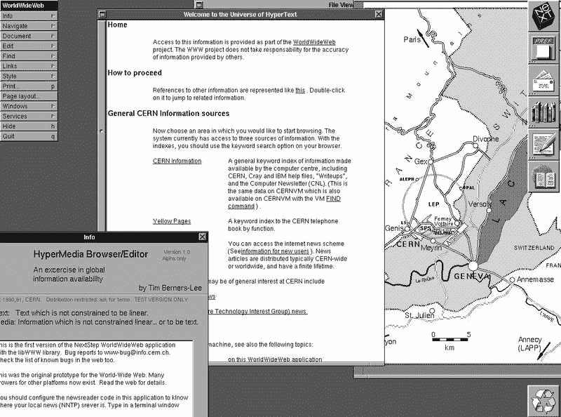
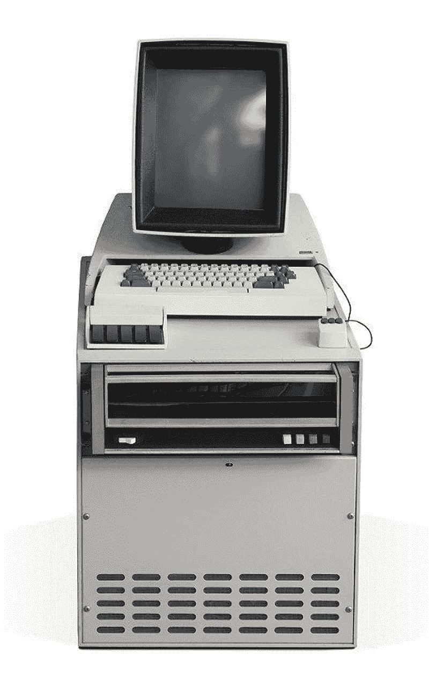
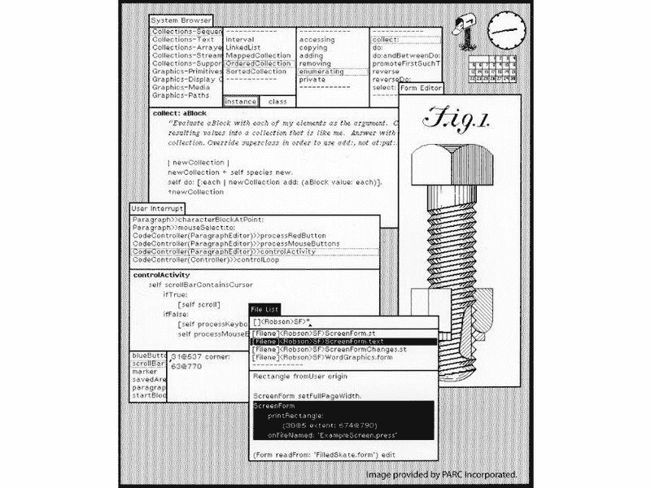

# 你的应用程序的深层历史:史蒂夫·乔布斯、NeXTSTEP 和早期面向对象编程

> 原文：<http://www.computerhistory.org/atchm/the-deep-history-of-your-apps-steve-jobs-nextstep-and-early-object-oriented-programming/?utm_source=wanqu.co&utm_campaign=Wanqu+Daily&utm_medium=website>

自 2008 年以来，已经有超过 1000 亿个应用程序从苹果应用商店下载到用户的 iPhones 或 iPads 上。成千上万的软件开发者为苹果的“iOS”移动平台编写了这些应用。然而，推动移动“应用程序革命”的技术和工具本身并不新鲜，而是有超过 30 年的悠久历史，不仅可以追溯到史蒂夫·乔布斯在 1985 年创办的 NeXT 公司，还可以追溯到 20 世纪 60 年代末软件工程和面向对象编程的开端。

下一个立方体(1990)是工程学的杰作…但是太贵了。在 Cube 和其他几个 NeXT 硬件产品在市场上失败后，NeXT 发展成为一家软件公司。NeXT 最大的创新是 NeXTSTEP 操作环境。CHM# 102626734

苹果的 iOS 基于其桌面操作系统 Mac OS X。更重要的是，iOS 的软件开发工具包(SDK)被称为“Cocoa Touch”，与 Mac OS X 的桌面 SDK Cocoa 基于相同的原则和基础。(SDK 是应用程序开发人员用来构建应用程序的一组工具和软件库。这些通常以应用程序接口或“API”的形式出现，API 是对平台内置库提供的功能的接口或“调用”。)OS X 和可可，于 2001 年 3 月首次发货，转而基于 NeXTSTEP(最初大写为“NeXTStep”)操作和开发环境。NeXT 是史蒂夫·乔布斯从苹果辞职后创立的，他在一次董事会政变后被剥夺了权力。NeXTSTEP 和 NeXT 的电脑都是最先进的，但对于 NeXT 瞄准的教育市场来说，这些电脑太贵了。

其硬件业务萎靡不振，到 1993 年 NeXT 被迫关闭工厂，成为一家专注于为企业定制应用程序开发的软件公司。NeXTSTEP 开发平台更名为“OpenStep”，被移植到其他硬件和其他操作系统，包括英特尔处理器和 Sun 工作站。

1996 年，苹果自身也陷入了困境，需要用更现代、更强大的操作系统替换老化的 Mac OS。由于无法生产自己的产品，苹果收购了 NeXT，以便使 NeXTSTEP 成为最终成为 Mac OS X 的基础。1997 年 1 月，在一年一度的 Macworld Expo 贸易展上，史蒂夫·乔布斯自 1985 年以来第一次以苹果员工的身份胜利重返舞台，这一次他解释了他认为苹果需要什么才能生存并再次变得伟大，以及 NeXTSTEP 技术如何帮助苹果实现这一目标。

视频:乔布斯在 1997 年 1 月的 MacWorld Expo 上演示 OpenStep

在 1997 年 1 月的 MacWorld Expo 上，在这个短短 20 分钟的演示中，乔布斯展示了后来成为 Cocoa 的技术，这是一个软件开发系统，最终将被全球成千上万的 iOS 应用程序开发人员使用。史蒂夫·乔布斯向苹果开发者展示了他们的未来，事实上，今天的 iOS 开发者会发现这与他们的日常经历非常相似。事实上，乔布斯在 1997 年向苹果开发者展示的东西并不新鲜，而是由 NeXT 在 1988 年发布的。

视频:史蒂夫·乔布斯向世界介绍 NeXTStep 面向对象开发环境

事实上，NeXTSTEP 是一个如此高效的开发环境，以至于在 1989 年，就在下一台计算机问世一年后，CERN 的蒂姆·伯纳斯·李爵士用它创建了万维网。

运行在 NeXTSTEP 上的蒂姆·伯纳斯·李首款网络浏览器/编辑器

是什么让 NeXT 的开发环境如此超前？在 1997 年的 MacWorld 演示上，乔布斯讲了一个小寓言。在那个时候，众所周知，乔布斯在 1979 年和苹果公司的一个团队参观 PARC 施乐公司时获得了麦金塔图形用户界面的灵感。PARC，或“帕洛阿尔托研究中心”，是一个蓝天计算机研究实验室，由施乐公司创办，旨在创建“未来办公室”

由 CHM 研究员[罗伯特·泰勒](https://www.computerhistory.org/fellowawards/hall/robert-w-taylor/)领导的 PARC 团队是当时顶尖计算机科学家的名人录(其中有 CHM 研究员[查尔斯·泰克](https://www.computerhistory.org/fellowawards/hall/charles-chuck-thacker/)、[巴特勒兰普森](https://www.computerhistory.org/fellowawards/hall/butler-lampson/)、[鲍勃·麦卡夫](https://www.computerhistory.org/fellowawards/hall/bob-metcalfe/)、[琳·康维](https://www.computerhistory.org/fellowawards/hall/lynn-conway/)、[查尔斯·格施克](https://www.computerhistory.org/fellowawards/hall/charles-geschke/)和[约翰·沃诺克](https://www.computerhistory.org/fellowawards/hall/john-warnock/))。这些名人中有一位是 CHM 的研究员艾伦·凯。凯设想了“动态笔记本”，一种类似平板电脑的电脑，将成为一种动态的学习媒介。萨克和兰普森利用当时可用的技术设计了一个“临时”动力本，它可能会部分实现真正的凯的想法。结果是 Alto，一个为单个用户设计的个人工作站，运行世界上第一个带有窗口、图标和菜单的图形用户界面(GUI ),使用鼠标控制。参观者可以在 CHM 的革命展览中看到 Xerox Alto，CHM 已经向公众发布了它的大部分源代码，它是今天几乎所有桌面计算机用户与他们的机器进行交互的方式的先驱。

施乐 Alto CHM# 102626737，102656238，X1741.99C，X1741.99D，X124.82C

在 1997 年的 MacWorld 演示中，[乔布斯透露，在 1979 年，他实际上错过了对未来至关重要的另外两项 PARC 技术。一个是个人电脑之间的普遍联网，](//www.youtube.com/watch?v=QhhFQ-3w5tE&t=16m25s)[施乐公司用它发明的以太网](https://www.computerhistory.org/revolution/networking/19/381)在它的每一个 Alto 工作站上联网。另一个是新的编程范式，被艾伦·凯称为“面向对象编程”。凯与丹·英格尔斯和阿黛尔·戈德堡合作，设计了一种新的编程语言和开发环境，体现了这种范式，在 Alto 上运行。凯称这个系统为“Smalltalk ”,因为他想让这个系统简单到足以让孩子们使用。一个程序将由模拟现实世界中事物的“对象”组成，比如“动物”或“车辆”这不同于传统的“面向过程的”(或“过程的”)编程，在传统的编程中，例程(“过程”)对数据输入进行操作，每个输入都是单独存储的。在 Smalltalk 中，对象由数据和操作这些数据的例程(“方法”)组成。凯把程序想象成一个动态的系统，对象之间互相发送信息。接收消息的对象将使用它来选择运行它的许多例程或方法中的哪一个。发送给不同对象的相同消息将导致每个接收对象执行自己的例程，每个例程都不同于其他例程。例如，狗对象和猫对象对“说话”消息的响应是不同的；狗会用“吠”的方式，而猫会用“喵”的方式。

Smalltalk 的开发环境是图形化的，有窗口和菜单。事实上，Smalltalk 正是史蒂夫·乔布斯在 1979 年看到的 GUI。Smalltalk 的 GUI 就是由我们讨论过的交互对象的集合组成的。例如，可以向一个窗口对象发送消息“Draw”，该消息将转发给它内部的所有对象，包括按钮和滑块。这些物体中的每一个都有自己特殊的绘制方法。在乔布斯访问 PARC 期间，他被图形用户界面的表面细节迷住了，以至于完全错过了用对象创建图形用户界面的激进方式。结果是在 Macintosh 上编写图形应用程序比用 Smalltalk 要困难得多。乔布斯在 1988 年介绍下一代电脑时说:“麦金塔电脑是一场革命，让终端用户使用起来更容易。但是软件开发商付出了代价……为麦金塔开发软件……是一件令人头疼的事情……如果你看看制作[一个 GUI]应用程序所花的时间……用户界面占了 90%的时间。

Smalltalk-80 图形用户界面(GUI)和开发环境，大约 1980 年，由 PARC 图书馆提供

通过下一台电脑，乔布斯计划解决麦金塔电脑的这个缺点。Mac 电脑中缺失的 PARC 技术将成为下一代电脑的核心功能。NeXT 电脑和其他工作站一样，被设计成可以在永久联网的环境中运行。乔布斯称之为“个人间计算”，尽管它只是施乐公司的萨克和兰普森称之为“个人分布式计算”的一个更名同样，Smalltalk 模型上的动态面向对象编程为 NeXTSTEP 上的所有软件开发提供了基础。根据乔布斯在 1988 年的说法，NeXTSTEP [将把开发者创建应用程序用户界面的时间从 90%减少到 10%](//www.youtube.com/watch?v=92NNyd3m79I#t=52m36s) 。然而，NeXT 没有使用 Smalltalk，而是选择了 Objective-C 作为其编程语言，这将为 NeXT 和苹果的软件平台在接下来的二十年甚至更长时间内的成功提供技术基础。Objective-C 今天仍在苹果公司的 iOS 和 OS X 开发中使用，尽管苹果公司在 2014 年推出了新的 Swift 语言，有一天可能会取代它。

Objective-C 是由 Brad Cox 在 20 世纪 80 年代创建的，目的是将 Smalltalk 风格的面向对象添加到传统的面向过程的 C 程序中。与 Smalltalk 相比，它有几个显著的优势。用 Smalltalk 编写的程序不能独立存在。为了运行，Smalltalk 程序必须与整个 Smalltalk 运行时环境一起安装——一个虚拟机，很像今天的 Java 程序。这意味着 Smalltalk 是非常资源密集型的，使用的内存要多得多，而且运行速度通常比可单独运行的 C 程序要慢。与 Java 一样，Smalltalk 程序也有自己的用户界面约定，看起来和感觉上都不同于运行它们的本地环境中的其他应用程序。(Udell，1990)通过在 C 中重新实现 Smalltalk 的思想，Cox 使 Objective-C 程序员能够使用 Smalltalk 的高级抽象来组织他们的程序架构，同时在过程 C 中微调性能关键的代码，这意味着 Objective-C 程序可以像传统的 C 程序一样快地运行。此外，因为它们不需要安装在 Smalltalk 虚拟机旁边，所以它们的内存占用与 C 程序相当，并且完全是平台本地的，看起来和感觉上与系统上的所有其他应用程序一样。(Cox，1991)另一个好处是，与 C 完全兼容的 Objective-C 程序可以利用已经为 Unix 和其他平台编写的数百个 C 库。这对 NeXT 来说尤其有利，因为基于 Unix 的 NeXTSTEP 可以在其上运行的程序上占得先机。开发人员可以简单地用一个新的面向对象的 GUI“包装”现有的 C 代码库，并拥有一个功能齐全的应用程序。Objective-C 的混合性质允许 NeXT 程序员同时拥有 Smalltalk 和 C 世界的优点。

这种结合对软件开发人员有什么价值？早在 20 世纪 60 年代，计算机专业人士就一直在抱怨“软件危机”一张分布广泛的图表预测，随着软件变得越来越复杂，编程成本将超过硬件成本。(Slayton，2013 年，第 155-157 页)众所周知，IBM 的 OS/360 项目交付较晚，超出了预算，而且漏洞百出。(恩斯门格，2010 年，第 45–47 页，第 205–206 页；Slayton，2013，第 112-116 页)IBM 发布了一份报告，声称最优秀的程序员比普通程序员的生产率高出 25 倍。(Ensmenger，2010 年，第 19 页)程序员经常使用巧妙的技巧优化机器代码以节省内存或时间，他们被认为是“黑色艺术”的实践者(Ensmenger，2010 年，第 40 页)，因此无法管理。人们的担忧如此之大，以至于 1968 年北约在瑞士的加米施召开了一次计算机科学家会议，以探讨软件编程是否可以转变成一门更像工程学的学科。在 OS/360 崩溃之后，CHM 研究员 Fred Brooks，IBM 负责 OS/360 的经理，写了软件工程中的开创性文章，神话般的人月。在这篇文章中，Brooks 提出了著名的 Brooks 定律——当软件团队达到一定规模后(因此随着软件复杂性的增加),增加更多的程序员实际上会增加成本并推迟发布。Brooks 声称，软件最好在由首席程序员领导的小型“外科手术”团队中开发，首席程序员负责所有的架构决策，而下属则负责实现。(布鲁克斯，1995 年)

到 20 世纪 80 年代，软件的成本和复杂性问题仍然没有解决。软件业似乎可能永远处于危机状态。1986 年，Brooks 重温了他的论文，并声称尽管改进的编程语言取得了适度的收益，但没有一种技术，没有一种“银弹”本身可以将程序员的生产率提高一个数量级——10 倍的改进将普通程序员提升到杰出程序员的水平。(布鲁克斯，1987)布拉德考克斯恳求不同意。Cox 认为，面向对象编程可以用来创建软件对象库，开发人员可以购买现成的软件对象，然后像乐高积木一样轻松组合，在很短的时间内创建程序。正如可互换部件导致了最初的工业革命一样，可重用、现成软件对象的市场将导致软件工业革命。(Cox，1990a，1990b) Cox 的 Objective-C 语言就是这样一个愿景的测试平台，Cox 创办了一家公司 Stepstone，向其他开发人员出售对象库。

史蒂夫·乔布斯和他在 NeXT 的工程师们发现考克斯的设想与他们的很大程度上是一致的，并从 Stepstone 获得了 Objective-C 的许可。Stepstone 和后来的 NeXT 工程师 Steve Naroff 承担了修改语言和编译器以满足 NeXT 需求的重任。但是 NeXT 并没有从 Stepstone 那里购买函数库，而是使用 Objective-C 开发了自己的一套对象库，并将这些“工具包”与 NeXTSTEP 操作系统捆绑在一起，作为其软件开发环境的一部分。所有 NeXT 开发者用来构建他们的应用程序的中央图形用户界面库是 ApplicationKit，或 AppKit。与 AppKit 一起，NeXT 创建了一个名为“界面构建器”的可视化工具，使开发人员能够以图形方式连接他们程序中的对象。

作为 1997 年 MacWorld 大会的一部分，乔布斯展示了如何使用界面构建器轻松构建应用程序，这是当今任何 iOS 开发者都熟悉的过程。乔布斯只是简单地将一个文本字段和一个滑块从调色板拖到窗口中，然后从滑块拖到文本字段来建立“连接”，为一个对象选择一个命令发送到另一个对象。结果是文本字段现在被连接到滑块上，实时显示滑块位置所代表的数值，在 1 到 100 之间。乔布斯演示了这一切，却没有写一行代码，充分说明了他的观点:[“开发人员可以写得最快……维护成本最低……对用户来说永远不会中断的代码行，是开发人员永远不必写的代码行。”](//www.youtube.com/watch?v=QhhFQ-3w5tE#t=24m50s)今天，AppKit 仍然是 OS X 的主要应用程序框架，iOS 的 UIKit 也在很大程度上基于它。作为苹果 Xcode 集成开发环境(IDE)的一部分，Interface Builder 也仍然存在。

Objective-C、AppKit 和 Interface Builder 的结合让史蒂夫·乔布斯可以吹嘘 NeXTSTEP 可以让开发人员的工作效率提高五到十倍——这正是布鲁克斯声称无法实现的数量级改进。乔布斯认为他在 1997 年 Macworld 大会上的观众对布鲁克斯很熟悉。[“你们都读过*神话人月*，](//www.youtube.com/watch?v=QhhFQ-3w5tE#t=10m48s)他告诉观众。“随着你的软件团队变得越来越大，它会在自己的压力下崩溃。就像用木头建造的建筑，你不可能建造那么高的木头建筑。”

利用这个建筑物的比喻，乔布斯出色地解释了 NeXTSTEP 的 AppKit 的比较优势。他认为，为 DOS 编程相当于从底层开始，一个应用程序开发人员可能会添加三层功能来实现四层功能。经典的 Mac OS 及其工具箱 API 有效地将基础提升到了第五层，允许开发者达到八层的功能。乔布斯说，正是这一点创造了像 Mac 上的 page maker(1985)这样的杀手级应用程序，它与激光打印机一起，为创造全新的桌面出版市场做出了很大贡献。乔布斯坚持认为，如果苹果要生存和发展，就需要培养这种开发者创新的能力——在苹果平台上开发其他地方根本不存在的新应用。

乔布斯继续说道，问题在于微软 Windows 已经赶上了 Mac。Windows NT 有效地提供了第七层基础，胜过了 Mac。这就是乔布斯认为 NeXT 将拯救苹果的地方。乔布斯称，NeXTSTEP 凭借其界面构建工具、AppKit 和其他面向对象的库，提供了如此丰富的开箱即用功能，以至于他们将开发人员提升到了第二十层。这意味着[开发人员可以消除所有图形应用程序共有的 80%的代码，让他们专注于使他们的应用程序独一无二并为用户提供额外价值的 20%的代码](//www.youtube.com/watch?v=QhhFQ-3w5tE#t=25m13s)。乔布斯坚持认为，其结果将是，一个由两到十名开发人员组成的小团队可以编写一个功能齐全的应用程序，就像一个为微软这样的大型企业软件公司工作的百人团队一样。

我认为，乔布斯勾勒出的这一愿景实际上与弗雷德·布鲁克斯(Fred Brooks)关于由“首席”程序员领导的小型手术团队进行编程的理念非常相似。不同之处在于，在乔布斯的愿景中，首席程序员没有像布鲁克斯描述的那样，将繁重的工作委托给下属编码员，而是由对象库来处理这些工作。实际上，这也是 Cox 的愿景，只不过 Cox 打算在公开市场上购买对象，NeXT 将其对象库捆绑为 NeXTSTEP 操作系统和开发环境的一部分，这实际上可能会抑制对象售后市场的形成。在考克斯和乔布斯的设想中，制作应用程序的繁重工作被卸给了对象的开发者；小团队中没有人需要仅仅是一个“实现者”，被迫为程序的“基础”工作。与过程化代码单元不同，正是对象的黑盒、封装特性——防止其他程序员篡改他们的代码——增强了模块化，允许它们可互换地重用。站在任何给定楼层上的开发者都不允许弄乱他们所站的地基。从担心对象的内部细节中解脱出来，开发人员可以专注于更有创造性的有价值的设计和架构工作，这在布鲁克的计划中是“首席”程序员的权限。所有团队成员将从第二十层开始，平等地相互合作，他们的努力将继续向上，而不是被转移到重做他们所站的楼层。

这种 5 到 10 倍的性能提升是白日梦吗？我们已经看到 NeXTSTEP 被用作快速原型工具来创建万维网的第一个版本。虽然 NeXTSTEP 还没有找到一个大的用户群，但是它已经被程序员们很好地接受了，尤其是在学术界。还有一个死忠的第三方 NeXT 开发者社区，用他们的产品支持乔布斯。像 OmniGroup、Lighthouse Design 和 Stone Design 这样的小公司，Lighthouse 的团队不超过 18 人，Stone 的团队只有一个人，他们编写了功能齐全的应用程序，如电子表格、演示软件、web 浏览器和图形设计工具。此外，NeXTSTEP 被证明在快速开发“关键任务”定制应用程序方面卓有成效，以至于华尔街银行和中央情报局等国家安全机构为其支付了数千美元的许可证费用。

六个月后，在 1997 年 5 月苹果全球开发者大会的一次炉边谈话中，乔布斯说 Lighthouse(后来被 Sun 收购)证明了的 NeXTSTEP 技术为实现现有应用提供了五到十倍的速度提升。此外，更引人注目的优势是，NeXTSTEP 将允许一些创新的开发人员[创建全新的东西，这些东西最初不可能在任何其他平台上开发](//www.youtube.com/watch?v=GnO7D5UaDig#t=25m05s)，并且如果不付出巨大努力也不可能在其他平台上复制。1996 年，蒂姆·伯纳斯·李用 NeXTSTEP 创建了万维网，戴尔用它创建了第一个电子商务网站。这就是 NeXTSTEP 面向对象的开发环境如何在二十一世纪推动苹果平台的创新。

回顾 2016 年，史蒂夫·乔布斯非常有先见之明。在 Mac OS X 在麦金塔个人电脑上发布后，小规模的前 NeXT 开发者和共享软件 Mac 开发者都开始使用 AppKit 和 Interface Builder 编写应用程序，现在称为“Cocoa”这些开发人员利用网络上的电子商务，开始称自己为独立或“独立”的软件开发人员，而不是像微软和 Adobe 这样的大型公司，他们有一百人的团队。2008 年，苹果向第三方软件开发商开放了 iPhone，并创建了应用商店，使开发商能够在移动设备上直接向消费者销售和分发他们的应用，而不必建立自己的服务器或支付系统。App Store 成为软件开发新淘金热的起点，邀请传奇风险投资公司凯鹏华盈(Kleiner Perkins Caulfield & Byers)成立“iFund”，为移动应用初创公司提供资金。(Wortham，2009)与此同时，安德鲁·斯通(Andrew Stone)和威尔·希普利(Wil Shipley)等独立 Mac 开发者预测，Cocoa Touch 和 App Store 将围绕数百万小规模开发者彻底改变软件行业。

不幸的是，自 2008 年以来，这一乌托邦梦想已经慢慢消亡:随着独角兽、收购和大公司的进入，移动市场已经成熟，排挤了拒绝投资者融资的小人物。由于 App Store 中有数百家竞争对手，如果没有昂贵的外部营销，要让一个人的应用受到关注可能会非常困难。现实是，大多数移动开发者无法通过开发应用来维持生计，大多数盈利的开发者都是为大公司编写应用的承包商。然而，乔布斯在 1997 年展示的面向对象技术如今是所有 iPhone、iPad、Apple Watch 和 Apple TV 应用的基础。史蒂夫·乔布斯预言过未来吗？艾伦·凯有句名言:“预测未来的最好方法就是创造未来。”赛博朋克作者威廉·吉布森指出，“未来已经到来——只是分布不均匀。”NeXT 早在 1988 年就已经发明了未来，但由于 NeXT 从未售出超过 5 万台电脑，只有少数人有幸在 20 世纪 90 年代一窥端倪。史蒂夫·乔布斯需要回到苹果公司，向世界其他地方展示他的未来。

## 乐章结尾部

在今天的硅谷，随着它对创新和未来的关注，像苹果公司的可可开发环境这样的技术的深厚历史经常被遗忘。然而，理解过去对于创造未来是至关重要的，因为未来很可能已经被创造出来了，你只需要做一点挖掘。在计算机历史博物馆，我们的任务是保存这一过去，不仅仅是物理硬件(我们有许多 NeXT 计算机和外围设备)，还有作为这些机器灵魂的软件。CHM 有一个 NeXT 软件的小[集合，包括 CD 上的 NeXTSTEP 3.3、OpenStep 4.2、企业对象框架 1.1 和 web objects 3.0](https://www.computerhistory.org/collections/search/?s=NeXT&f=software)，但我们缺少 NeXTSTEP 的早期版本，我们在 NeXT 应用程序方面几乎没有。填写集合是很重要的，因为软件是计算机、用户以及他们所在的机构和社会之间的上下文链接。“软件是有形的历史、组织和社会关系，”计算机历史学家内森·恩斯门格写道。(Ensmenger，2010 年，第 227 页)因此，除了保护之外，让计算机软件遗产的故事变得有意义并将其融入其时代的文化中也是至关重要的。这是我作为 CHM 新软件历史中心馆长的第一篇博文，它标志着我收集和解释与图形用户界面、面向对象编程和软件工程相关的材料、软件和口述历史的项目的开始，以 NeXT、Apple 和 PARC 施乐为重点。期待更多类似的故事出现在这个空间，如果你是 NeXT、苹果或施乐 PARC 公司的前工程师，并希望为这个项目做出贡献，请通过 hhsu@computerhistory.org[联系我](mailto:hhsu@computerhistory.org)！

## 笔记

1.  Objective-C 不仅仅是 Brad Cox 的作品，如果不是 Steve Jobs 的下一台计算机选择它作为 NeXTSTEP 编程的基础，它可能会成为编程语言史上一个不起眼的脚注。Cox 与 Tom Love 共同创建了 Stepstone(最初称为“生产力产品国际”或 PPI)，旨在推广可以与现有语言共存的面向对象解决方案。Objective-C 起源于面向对象的预编译器。这种语言的第一个版本叫做 Objective-C，它仍然使用一个独立的 C 预处理器将 Obj-C 代码翻译成 C 语言，然后再交给编译器。然而，这个版本的语言和编译器对于 NeXT 的目的来说是不够的，它吸收了 Steve Naroff 和其他人的贡献，使 Objective-C 成为我们今天知道的语言。(见下文注 2)。)
2.  为了使 Objective-C 适应 NeXT 的需求，Stepstone 的工程师 Steve Naroff 接管了 Cox 的开发工作，并对该语言进行了重大改进，以支持 NeXT 的可视化编程工具 InterfaceBuilder。纳罗夫的工作如此重要，以至于他最终被史蒂夫·乔布斯在 NeXT 公司聘用，并在后来留在了苹果公司。纳罗夫将 Objective-C 直接集成到 NeXT 正在使用的 C 编译器中，开源的 GNU C 编译器 GCC 与理查德·斯托尔曼紧密合作。这消除了单独的翻译步骤。为了支持 InterfaceBuilder，Naroff 为该语言添加了一个关键特性:“categories”(今天称为“class extensions”)，这是一种向现有类动态添加方法而无需对其进行子类化的方法。

    另一个被称为“协议”的关键功能是后来由 NeXT 工程师伯特兰·塞莱特(后来成为苹果软件副总裁)和布莱恩·加斯特(后来在苹果领导 Java 团队)添加的。协议允许类继承多个接口规范，而不继承它们的实现，避免了在 C++等语言中多类继承可能发生的冲突。这个特性后来被 Java 采用为“接口”这两个特性，“类别”和“协议”，使得 NeXT 的 AppKit 类库大量使用的几个关键设计模式成为可能，在以后的几年里，没有它们就不可能考虑 Objective-C。

    除了这些，NeXT 工程师对 Objective-C 的许多其他贡献是必要的，是由 NeXT 开发人员在现实世界使用中的实际需求驱动的，而不是计算研究人员的需求。凯文·恩德比从事连接器和汇编程序的工作。Naroff 解决了影响动态库兼容性的方法脆弱性问题，添加了显式声明结构、#import 指令和 C++集成。Serlet 增加了方法转发来启用远程对象代理。Garst 致力于 Objective-C 运行时，并且是引用计数内存管理的主要倡导者。这些和其他修改为 Objective-C 在 NeXT 和后来的苹果公司的长寿奠定了基础，为最终推动 Mac OS X 和 iPhone 发展到今天提供了坚实的基础。

## 参考

*   弗雷德里克·布鲁克斯，1987 年。"没有银弹:软件工程的本质和意外."*电脑*20(4):10–19。
*   ———.1995.神话中的人月:软件工程论文。周年纪念版。马萨诸塞州雷丁市:艾迪森-韦斯利酒吧。公司
*   考克斯，布拉德 j。1983 年。"面向对象的预编译器:用 C 语言编程 Smalltalk 80 方法."没有。18 (1): 15–22.[doi:10.1145/948093.948095](//dl.acm.org/citation.cfm?doid=948093.948095)。
*   ———.1990 年。“有一颗银弹:基于可重用和可互换部件的软件工业革命将改变软件世界。”*字节*，10 月 1 日。
*   ———.1990 年 b。“规划软件工业革命。” *IEEE 软件* 7 (6): 25。
*   ———.1991.面向对象编程:一种进化的方法。第二版。阅读马:艾迪生-卫斯理酒吧。公司
*   内森·恩斯门格，2010 年。“计算机男孩”接管了:计算机、程序员和技术专长的政治。麻省剑桥:麻省理工学院出版社。
*   斯莱顿，丽贝卡。2013.有价值的论点:物理学、计算机和导弹防御，1949-2012。麻省剑桥:麻省理工学院出版社。
*   尤德尔，乔恩。1990." Smalltalk-80 进入九十年代."*字节*，10 月 1 日。
*   沃瑟姆珍娜。2009.“iPhone 淘金热。”*《纽约时报》*，4 月 5 日。http://www.nytimes.com/2009/04/05/fashion/05iphone.html[。](//www.nytimes.com/2009/04/05/fashion/05iphone.html)