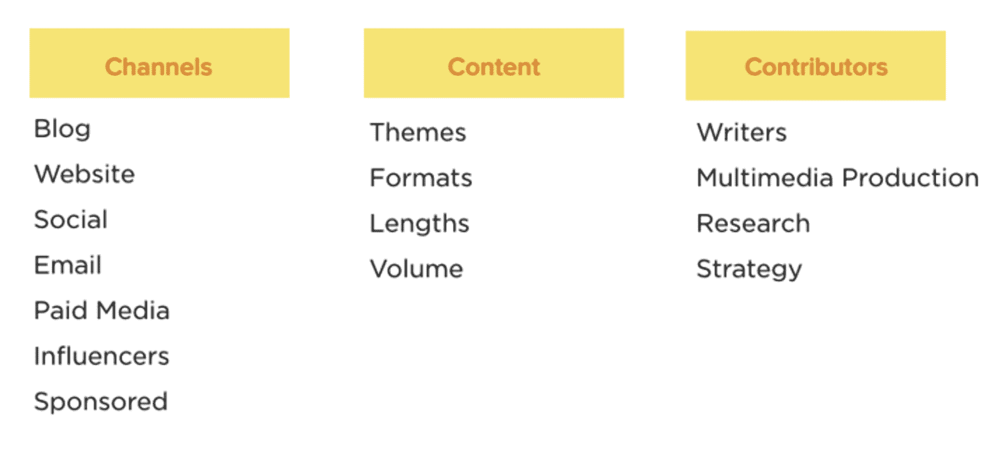

# 内容正在吞噬世界——Contently 首席执行官谈赢得营销新热点|首轮评论

> 原文：<http://firstround.com/review/content-is-eating-the-world-contentlys-ceo-on-winning-at-marketings-fastest-growing-trend/?utm_source=wanqu.co&utm_campaign=Wanqu+Daily&utm_medium=website>

当 **[心满意足地](http://www.contently.com "null")** 在 2010 年推出时，它是巨人中的侏儒。这家羽翼未丰的公司开始通过增加高质量的内容来帮助品牌更全面地讲述他们的故事——即听起来不像是基于关键词由机器人生成的博客帖子和文章。当时，他们的主要竞争对手是 goliath Demand Media，它正在这么做。当谷歌在 2011 年发布其熊猫算法[时，潮流发生了改变，有效地切断了垃圾、赞助内容在网络上的流量](http://searchengineland.com/google-panda-update-costly-112062 "null")。需求媒体随着内容丰富的发展而崩溃。

顺便说一句，这正是 Contently 今天建议其客户做的事情:**关注质量，赢得长期**。但是，尽管“内容营销”如今如此时髦和热门，Contently 的首席执行官 **[乔·科尔曼](https://www.linkedin.com/in/joe-coleman-4351b5b "null")** 说，他不断感到惊讶的是，许多不同规模的公司(包括财富 500 强)不知道写什么，跟踪什么，或他们的目标是什么，即使他们在内容制作上投入了数百万美元。

“我认为，我们现在实际上看到了内容营销的一种修正。品牌开始退后一步，问自己，“我们从内容中得到了什么？到底有没有用？科尔曼说。“这对那些自称为内容营销者的人来说是一个更大的挑战，但也以各种好的方式提高了门槛。”

简而言之，创建内容营销材料不再是因为你认为你应该这样做。科尔曼说:“太多的人纯粹将它视为一门艺术。现在，要想成功，你必须利用这门艺术，并对其应用更加科学、数据驱动的框架。”与此同时，他承认这仍然是一个年轻的领域，缺乏制度知识。因此，在这篇独家文章中，他提供了他一次又一次看到的内容营销的戒律，这样我们就可以一起开始积累这些知识。

# 第一条戒律:不要期望一夜之间变得神奇。种下种子，保持耐心。

科尔曼说:“如果你是一家公司的第一个内容营销人员，就要设定正确的期望值。”。“用内容建立流量可能是一个非常漫长、非常困难的过程。一旦你到了那里，回报是巨大的，但我们看到很多不耐烦。”

当 Contently 与客户合作时，它通过起草完整的内容计划来建立一致性，包括建议的初始发布时间表和有意义的里程碑。例如，在第二个月，里程碑可能不是你推动了成千上万的新转换。取而代之的是，你到目前为止制作的内容的参与度。“你可以看看时事通讯订阅、页面浏览量等等。**你只需要建立你知道你能达到的里程碑，这些里程碑在创造业务的道路上**。这将使人们不会惊慌失措。”

创始人和首席执行官总是希望立即获得成功，但内容营销人员应该放心，他们被请来是因为他们拥有丰富的知识和技能。只要他们积极进取，以公司发展为目标，他们就有足够的空间和许可来创造自己的智能里程碑。他们应该要求最少的资源来使事情运转起来。内容的成功不会发生在真空中。

围绕杠杆创造指标，而不是产出。把分数写在黑板上，看看会发生什么。

把制作一定数量的内容作为你的目标。为你希望看到的参与类型设定基准。例如，把增加你的博客的回头客的数量作为一个目标。如果没有，改变你正在做的事情，再试一次。**这是关于进步，而不是完美。**

大多数内容营销努力失败不是因为内容不好，而是因为没有明确的目标来确定它是否有效。最重要的是，数量惊人的品牌在失败的第一个迹象出现时就放弃了整个内容。

科尔曼说:“在他们的工作受到质疑之前，每个内容营销者应该有六个月的时间来做一些事情。**三个月的试用期并不奏效**。你必须记住你依赖于其他人，不断地实验，拉很多杠杆，等待动力自己建立起来。这样过了六个月，你应该有所表现了。”

# 第二条戒律:确保你有听众。然后尽你所能去了解他们。

识别你的受众并不像看着你的客户群的人口统计数据说:“这些人”那么简单有很多人还没有购买你的产品，他们从来没有听说过你，他们可能在发现你的公司之前就已经看到了你的内容。你的受众必须天生就有抱负，你必须量化这些抱负才能达到他们。

科尔曼说:“你需要有明确的衡量标准，来衡量你想要吸引的人的类型。”。“他们多大了？他们住在哪里？他们经常去什么样的网站？他们想接触什么样的内容呢？在做出购买决定之前，他们多久会看到一次广告或推文之类的东西？”你想通过数字来了解这些人——尽可能地亲密。

这就是你最初决定内容的方式。你能把注意力放在文字上吗？混合媒体？多久一次？所有这些答案都来自于你的目标受众。你的内容本身就是一种产品，你必须找到它在更广泛的人们需求生态系统中的位置。

好的内容营销需要重新找到产品-市场的契合点。

与现有客户交谈。他们整天最关心的问题是什么？他们经常面临的主要挑战或问题是什么？在构建内容时，科尔曼和他的团队会整天回答关于出版节奏、社交分享工具和搜索引擎优化的问题。这就是他们最终在内容属性上写的东西: **[内容战略家](https://contently.com/strategist/ "null")**——现在互联网上阅读量最大的营销博客之一。

"**写下你两次以上从顾客那里听到的任何问题。他说:“内容的时机已经成熟。“让您的销售团队参与进来。让他们不断分享他们得到的问题或他们遇到的挑战，并绘制热图。真正挖掘这些数据，找出你应该写些什么。”**

这个过程的一部分可能是发现你根本不需要内容，或者现在不是时候。因此，受众分析可能应该先于请人全职运营。如果你不太重视数字营销，或者你的大多数客户都不是通过这个渠道来的，那就省省你的钱吧。如果你是一家适合上市前产品的公司，就不要在内容上投资。这值得你全神贯注，如果你转向，你会浪费大量的工作。再好的内容也帮不了你。

科尔曼说:“在这个阶段，你必须对自己非常诚实。“不仅仅是你是否应该、是否能够生产内容。而是你能不能做到不半斤八两。否则，你会对你的品牌造成真正的损害。”

# 第三条戒律:保持一致。不，真的，我们说的是正常的鼓声。

涉足内容领域的公司很容易在学会走路之前就跑了。“他们认为，‘好吧...内容策略。我们需要一个博客，社交媒体，一个电子邮件列表，所有这些都同时需要。走吧！”他说当真正的第一个想法应该是**制定一个计划时，你可以 100%坚持**。那通常是一周一到两个帖子。"

一旦你开始看到可测量的流量——真的，考虑在这一点上任何可测量的流量——弄清楚它们是来自你的主要公司网站还是其他地方。如果是，它们来自哪里？这是你的首要任务。第二，马上开始收集电子邮件地址。

科尔曼说:“即使你有 10 个订户，电子邮件也是你尽早建立良好反馈回路的通行证。“你将开始看到谁会回到你的网站。你可以开始把人们赶回去，然后造一台机器。你可以在 20-25 分钟内创建一个电子邮件简讯，它会给你提供很多有用的数据。”

事实上，**电子邮件几乎总是比社交媒体**更有价值。他看到品牌将他们的精力和资源倾注在推特上，一天多次发布到脸书，而推动行动的最佳方式是让一些东西进入你的追随者的收件箱。这是私事。它正好挡在他们的路上。即使你不知道谁会真的打开营销邮件，数百万人会这样做。如果你经常发送电子邮件，你会看到你的列表逐渐有机地建立起来，因为流量会带来流量。

内容只有在你保持一致的情况下才有效——在频率、外观、风格和语气上保持一致。

他说:“规律的节奏对建立一个观众群非常重要。“把它想象成在一段关系中始终如一。你必须提醒人们你在那里，你在乎，你在增加价值——在你变得令人讨厌之前，尽你所能。人们会开始期待收到你的来信，他们会觉得自己了解你。”

作为一家公司或内容营销商，时间的一致性也让你更有能力测试和尝试许多不同的东西，如标题、格式、图像的使用、故事的类型。您希望将时间作为一个变量来控制，以找出这些其他属性是如何一次一个地产生共鸣的。例如，尝试一个长形式的作品，同时尽可能保持其他内容的一致性。表现如何？你只有像往常一样在同一天同一时间发表文章，才能得出结论。

在测试其他元素时使用类似的语气也很重要。而一旦找到适合自己的基调，就要坚持下去。科尔曼提到了 Contently 的一位自由职业者的评论:“如果你的品牌是晚宴上的一个人，他们会是谁？那个在 iPhone 6 上市前一周抢到它的小玩意狂？约会前你想咨询的诚实善良的朋友？”

如果你的观众认不出你，他们怎么能和你建立关系呢？

一旦你觉得自己找到了一种能引起目标受众共鸣并得到他们信任的声音，你就应该把它整理成书面的风格指南。将其归结为核心组件和指令，并给出许多例子。任何为你写作的人都应该得到一本风格指南，并经常使用。

# 第四诫:你必须与众不同。没有人想要更多同样的东西。

世界越来越嘈杂。不要让事情变得更糟。

科尔曼说:“坐下来说，‘好吧，我们是一家做 X 的公司，所以我们应该写 X，这很明显。’”如果你不做进一步的分析，或者不看看外面有什么竞争，你就完了。你需要找到**的空白**，在那里你可以做一些别人没有做的事情。一个你可以真正拥有的话题领域。”

为了确保你与众不同，他推荐了一个叫做 [BuzzSumo](http://buzzsumo.com/ "null") 的工具。它允许你搜索主题，并调用热门作品和给定主题领域的任何竞争对手，他们制作什么样的内容，等等。你必须批判性地思考还剩下什么没人碰过。

“进行一次头脑风暴，让房间里的一群人列出一个与你正在做的事情相关的话题清单，”他说。“一个一个地查找它们，并标出它们所覆盖的区域。这很耗时，但你会看到差距的出现。”

Buffer 就是一个极好的例子。科尔曼说:“他们很好地找到了自己的声音，并坚持了下来——这非常有对话性和共鸣性。“它的好处是，它不会适合每个品牌，但对他们有用。”[即使当他们分享重要或严肃的公司新闻时，他们仍然这样写](https://www.google.com/url?q=https://open.buffer.com/buffer-acquires-respondly/&sa=D&ust=1458836539398000&usg=AFQjCNGoMW772cLG0Gvt9rMgI0Id78gNhg "null")。这让它们变得容易辨认和记忆深刻。

**问问你自己:** **什么声音对我们来说是真实的，但对其他人来说却不适用？**

找到你的空白区域也不仅仅是关于主题。它深入到人们阅读你的作品的动机。在某种程度上，你必须对你的潜在读者进行心理分析。为人们阅读你的内容找一个独特的理由。如果他们的动机在你的领域里是独一无二的，你就有所收获了。

# 第五条戒律:让人们出现。不要在你自己创造的真空中发表文章。

太多的创业公司投入时间和金钱建立自己的内容平台，却没有任何读者。就像开派对却没人出现一样。这是非常痛苦的。

有两种方法可以避免这种情况。如果你愿意多花一点钱，你可以为流量付费，并用它来学习如何有机地留住读者。或者，如果你预算有限，你可以把一系列的技巧串在一起(在 Medium 和 LinkedIn 上发布，在那里你已经有了一些读者，主要是其中之一)，试着启动你的引擎。

科尔曼说:“花钱可能是获得内容营销成功的最快途径——但前提是你要用正确的方式去做。“付费获取读者(使用脸书、LinkedIn、Outbrain 等)是没问题的，只要你能最大化每一分钱的学习，并快速迭代你所学到的东西。这需要快速提出人们想要什么样内容的假设，这样你就可以每天验证并抛弃它们。”

如果你没有这种奢侈，你必须非常好斗。

从内容入手跟开公司没那么大区别。你必须努力让你的想法受到关注。

对你所拥有的工具做一个彻底的清点。例如，《心满意足》的联合创始人 **[谢恩·斯诺](https://www.linkedin.com/in/shanedsnow "null")** ，在 **Wired** 和 **Mashable** 刚起步的时候，他就在为它们写文章，他不仅能够提到，还能链接到几个故事中的内容策略师。这带来了一些初始流量。

“你真的要深入挖掘。也许你认识一群有影响力的人，他们有很多追随者。科尔曼说:“让他们在推特上发布关于你的消息。“给你的投资者发邮件，告诉他们分享你的内容。他们会对你有用的。你不能羞于要求这些东西。”

辛迪加是早期吸引读者的主要方式。在这种情况下，你创建了一份内容，然后将它推销给现有的具有良好流量的出版物——理想情况下是与你的品牌有很多共同点的出版物。也许你想推出一个由你的创始人或首席执行官撰写的定期专栏。也许这只是一篇与他们当前或最受欢迎的报道相吻合的一次性文章。不管怎样，它不能只关注你的公司，也不能被解读为过于宣传。它应该以一种独特或有趣的方式阐述一个相关或相邻的主题。

辛迪加的另一个关键是做你的研究。对于出版物是否会刊登你的内容，你要非常诚实。如果你的目标是《纽约时报》、《财富》或 TechCrunch，你可能会失望。当它开始时，心满意足地专注于营销技术网站上的联合文章，如 [MarTech Advisor](http://www.martechadvisor.com/ "null") 和[Digiday](http://digiday.com/ "null")——他们知道他们的理想客户会阅读博客。科尔曼说:“要相信，如果你从你所在行业的 C 级网站开始，你会有更高的点击率，你会接触到更多的核心客户，这种势头真的会形成。"如果你在那里做得好，你可以开始推销越来越大的网站."

当你在梳理潜在的联合目标时，制作一个电子表格，在其中捕捉与你要提供的内容相似的故事。你想找到其中最受欢迎的。这样，当你给投稿人或客座编辑发电子邮件时，你可以马上开始:“我看到关于话题 Z 的 X 和 Y 文章很受你的读者欢迎。我给您写信是因为我们制作的内容非常相似……”他们会知道你做了调查，你会考虑他们的兴趣。

辛迪加也可以引用你在外部网站上的内容，比如 [Medium](http://www.medium.com "null") 和 [LinkedIn](http://www.linkedin.com "null") 。因为这些网站吸引了你现有的追随者和社区，你知道你不会大喊大叫。这是一个明确的优点，但这些选择也有其缺点。

科尔曼说:“在你的网站之外发布应该纯粹是为了提高知名度。“如果你在 Medium 或 LinkedIn 上发表一整篇文章，很难让人们回到你的网站注册或购买。你想删节每一个片段，然后指向你的母舰。”这将帮助你无处不在。潜在客户会觉得他们会反复遇到你，这让他们把你放在第一位。

# 第六诫:你必须投入时间和精力在写作上。接受写好东西需要很长很长时间的事实。

如果你不痴迷于创造真正优质的内容，你就是在浪费时间。

无论你是在写作还是创作视觉内容，总会有一种想快速发布的冲动。你想要 SEO，你想要股份。你希望内容开始转化。但是如果你为了数量而牺牲质量，这一切都不会发生。很多人都这么说。很少有人将其内化。更少人执行它。

"**你可以关心 SEO，但不要把它当作首要目标。科尔曼说:“专注于它会导致你创建蹩脚的、关键字驱动的内容。“实际上，搜索引擎优化越来越多地是关于创造高质量的内容。自从谷歌的第一个熊猫更新以来，他们的目标一直是提供更相关、更有价值、人们真正想要阅读的内容。他们一直在做得越来越好，所以你想抓住这个机会。”**

对你的内容不加考虑实际上也会对你不利——而且对这样做的公司来说，情况越来越糟。科尔曼说，如果要在每月发表两篇研究充分、构思巧妙的文章和每周发表两篇博客文章之间做出选择，你应该总是选择前者。“最终，制作有帮助的、阅读起来有乐趣的内容，会让更多的人访问你的网站，阅读你的时事通讯，分享你的链接。”

这应该从一开始就是一个优先事项。你最不想做的事情就是积累“**内容质量债务**”，这让你回去重写东西，这样它们就不会伤害你的品牌。

科尔曼指出，数字学习平台[unculged](http://uncubed.com/ "null")是一个明显优先考虑质量的组织的主要例子。当你登陆他们的博客[韦克菲尔德](http://uncubed.com/wakefield/ "null")，很明显他们已经投资了高级设计和摄影。非常干净有光泽。他们的文章要么比预期的更深入地挖掘他们的主题，要么提供不明显的、独特的数据。很明显，每件作品的制作都花费了大量的时间和心思。

# 第七条戒律:一直跟踪你做得怎么样。但只有几件事很重要。

无论你在做什么，都应该跟踪某些指标:例如，如果你想推动增长，就不能忽视独立读者。但是就业率也同样重要。

如果你追踪的只是点击和印象，你会留下一大堆有用的数据。

**参与度是几个其他指标的组合:**例如，在页面上的时间(“停留时间”)。**滚动行为**——不管人们是走到你棋子的末尾还是接近它。重复读者——人们还会再回来看更多吗？**推荐力**——这条内容是否鼓励人们点击你网站的另一条或一部分，或者订阅你的电子邮件？如果可以的话，跟踪一下电子书或白皮书的下载情况——在这方面，转化事件尤其能说明问题。**你需要按照参与度对内容进行分类，将那些能让人们停留最久的内容放在最上面。**

科尔曼说:“通过真正挖掘这些数据，你可以了解哪些作品真正闪光，并尽最大努力建立你的观众群。”“然后你可以选择把付费投入放在后面，以真正加速你的引擎，或者开始制作更多像它们一样的内容，这样随着时间的推移你会变得更好。”

同样，如果你发现没人花时间在你的一些内容上，停止制作。

尽管如此，不要低估定性反馈的重要性。你也想密切跟踪它。

科尔曼说:“在早期，真正让你兴奋的事情是与一个潜在客户交谈，告诉他他们有多爱你的内容。”“当 Contently 刚刚起步时，我们与许多潜在客户交谈过，他们说他们已经知道内容策略器，并认为它很酷。它让谈话变得更有成效。作为一名首席执行官，这是我真正欣赏并认真对待的事情。这表明我们走上了正确的道路，从竞争中脱颖而出。”

**Contently 最终在 Salesforce 中实现了一个字段来捕获所有这些评论**，并让销售团队调查呼入销售线索，看他们是否阅读了内容策略师。不出所料，接触过该内容的人和有可能成为顾客的人之间有很强的相关性。

**他们还将电子邮件订阅列表与 Salesforce 进行交叉引用，以查看读者和已达成交易之间的重叠部分**。“这些都是证据，证明你的观众正在参与并采取你希望他们采取的行动。科尔曼说:“记下所有这些联系，并储存在某个地方。

另一方面，假设你没有销售吸引力，或者没有足够的时间来观察重要的参与度。另一种证明内容早期价值的方法是找到你产生的印象总数，并查看你在脸书广告上的花费。为了吸引眼球。这并不完美，也不是一个长期的解决方案，但是如果你是从零开始，特别是如果你是一个需要证明你的价值的内容经理，这是一个快速和肮脏的策略来显示影响。

科尔曼说:“这是可行的，但并不意味着最终的成功。”。“最终，你需要真正弄清楚这些人是谁，他们在你的网站上除了点击进出之外还做了什么。你要确保尽快将你的衡量策略从印象转变为参与。”

# 第八诫:用设计最大化影响。把它建得漂亮一点才会被重视。

跨渠道辛迪加有它的好处。但是，正如科尔曼所说:“**要让你的内容真正有效，你必须有一个自己的内容中心或资产，人们可以直接来接触你的品牌**。”这意味着建立一个博客，或者一个出版物，或者任何你想叫它的东西。有很多方法可以把事情搞砸。

它需要看起来很好，但是可用性总是更重要。“你网站的优化方式将对你的内容表现产生巨大的影响，”他说。“对布局、字体大小等的简单调整。可以获得比其他方式更多的内容阅读和分享。”他指出一些网站已经建立了永不停止的文章滚动。一旦你完成了一个，另一个就开始了。不需要点击。采用这种设置的网站实际上会看到更多的文章被阅读。同样，当你滚动社交媒体图标时，它们更有可能被点击。科尔曼补充道，Wordpress 是一个很好的选择，因为它有全套的插件和一个活跃的支持社区，以确保你打好基础。

他建议列出一份清单，列出所有可以用来最大化阅读和分享的策略。然后，你网站的其余部分应该保持简单干净，最重要的是，尽可能的宽敞。这真的很容易以你自己的方式，扰乱阅读体验，并在太多的 CTA 中烘焙。你希望人们阅读吗？分享？订阅？买？确保这些行动根据你给他们的不动产进行优先排序。如果你对人们要求太多，或者给他们太多，他们会反弹。

设计也是你创作内容的最佳武器，既独立又不会过度销售。许多网站，包括内容战略家，已经成功地设计了一个看似独立于品牌的属性，同时仍然(尽管很微妙地)链接回主页。**这给了你几个明显的优势:**它让你的内容摆脱“广告”的外衣，纯粹作为有趣的故事来消费；它显示了你对制作优秀内容的重视程度；这也鼓励他们像对待他们欣赏的任何其他出版物一样对待你——在推特上发布故事，将你添加到他们的 RSS 阅读器，通过电子邮件将文章发送给他们的朋友，等等。它引发了微妙的心理变化。

听起来不错，但不要走极端。**你希望这个网站的外观和感觉与你的核心品牌相呼应，但不要复制它**。例如，使用相同的颜色、视觉效果和字体。你需要在一个人刚刚阅读的内容和你的主要产品之间建立一种潜意识的联系。少用你的 logo，让它在你的网站和内容之间来回导航变得容易。如果一个读者依赖你成为一个有价值的资源，而他们最终感觉被定位了，你就失去了他们的信任。只需要一次负面的互动。

利用设计将你的公司和你的内容融合在一起，让人们可以发现一些真正酷的东西，而且知道它来自哪里。

最棘手的设计问题之一是行动号召。许多品牌都倾向于在文章或帖子的底部包含公开的 CTA 或销售。这个想法当然是，“如果有人在这个页面上，我们应该使用它！”但是一个不优雅的 CTA 甚至是最好的内容的致命弱点。“我一直觉得这种做法很俗气，”科尔曼说。"我明白人们为什么这么做，但还有更好的方法。"

在 Contently 和内容策略师如此出名之前，该团队取得了巨大的成功，在文章页面的最顶端有一个非常细的栏，上面写着:“内容策略师由 Contently 驱动，Contently 是一家做 X、Y 和 Z 的公司”——简洁地强调了他们的三个主要价值主张。它奏效了，因为它听起来或看起来都不像广告。客观陈述了公司的所作所为。它没有干扰阅读体验的任何部分。想要做类似事情的公司也可以利用侧边栏。只要简单，切中要害，不碍事，你的状态就很好。

科尔曼说:“以一种不令人讨厌的方式轻轻提及你的品牌。“那些目标高、好奇心强、有灵感与你一起工作的人，是那些愿意与你合作的人。”

# 第九诫:实验时，一只眼睛盯着未来。

一旦你的内容策略有了 1.0 版并开始运行，2.0 版会是什么样子呢？3.0?

建立一个庞大的、定期回访的观众群给了科尔曼和他的团队探索不同的、通常更小众的主题的空间，比如法律纠纷、不断增长的企业挑战、只与非常大或非常小的公司相关的故事。他们不再需要为一个读者写泛泛的文章。

把你受众的规模和性格作为一个里程碑。在某一点上，你有权利发展你所写的东西。

在你的战略中尽早标出这些里程碑是有帮助的。这样，你就不会忘记做出改变。你不会因为你一直在做的事情有效就坚持它的安全性。

科尔曼说，“对自己说，‘好吧，当我们有这么多读者时，我们会考虑做 X，”‘当我们有这么多读者时，我们会继续做 Y。“很容易陷入某一类内容，而你应该经常问，‘我们现在如何以更好的方式为这部分观众服务？"

你越能细分你的听众，越能紧密地调整你的内容，你就越能接触到那些对你要说的内容非常感兴趣的人。彻底和持续的测试会让你更快地找到这些细分市场和他们想要的东西。

他说:“A/B 测试是内容成功的最大推动力。“一旦你有了流量，你就想立刻开始测试头条。你想弄清楚你的读者每次回应的语言类型。然后测试故事类型，这需要更长的时间。他们喜欢有深度的作品吗？小测验？李斯蒂克斯？有意识地混合他们的最爱。”

*其他需要测试的内容包括:*

**不同的设计特点:**你不想一次测试太多的项目，以防你不知道是什么造成了不同，但 Contently 实际上已经多次超越了内容策略器，[而且做得相当频繁](https://contently.com/strategist/2015/03/10/why-we-redesigned-the-content-strategist/ "null")。即使事情进展顺利，保持假设如何变得更好也是好的。“不要武断，”科尔曼说。“尽可能以数据为导向，但永远不要觉得已经完成。”

**社交帖子和电子邮件的时间和频率:**每次 Contently 的内容团队开会时，他们都会回顾他们在该领域尝试过的数据，他们看到的数据，以及基于这些信息他们在未来一周将要尝试的不同内容。

**不同的贡献者:**一旦你有能力用自由职业者或多个作者来补充你的内容，按贡献者追踪成功就很重要了。在内部，Contently 有贡献者分析来帮助这一点。你可能会发现，有一位作家在撰写精辟的热点突发新闻时大放异彩，而另一位则擅长长篇特写。你想用这些数据来“圈钱”你的团队，并确保每个人都发挥自己的优势。

科尔曼说，从更广的层面来看，你应该在三个领域进行实验

然而，无论你选择哪种组合，你都不应该动摇你对质量的承诺。科尔曼说:“就内容而言，质量这个词是‘交付真正价值’的同义词。”。有什么是你的观众以前不知道的？一篇帖子是否改变了他们看待周围事物或世界的方式？它给了他们接受挑战或推倒路障的工具吗？它是否引发了某种积极的变化？他说，这就是“溢价”的真正含义。

“如今，你只会看到很多标题为‘内容战略的 7 个核心要素’的文章，这就像是‘第一:计划’呃。他说:“所有的事情都做过，做过，又做过。要摆脱这种循环，你必须回溯到最初你为什么要创作内容。说真的，为什么？“然后，当你回答这个问题时，选择意想不到的、冒险的、人迹罕至的路线到达你的目的地。