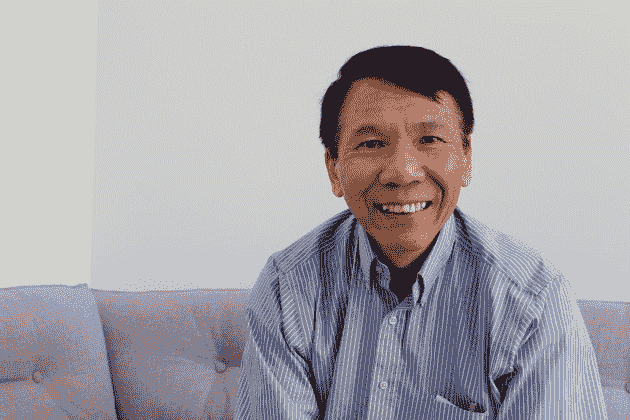
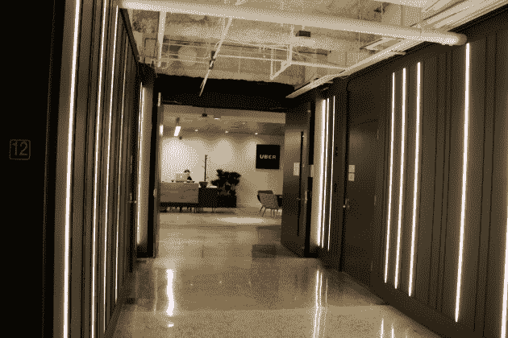
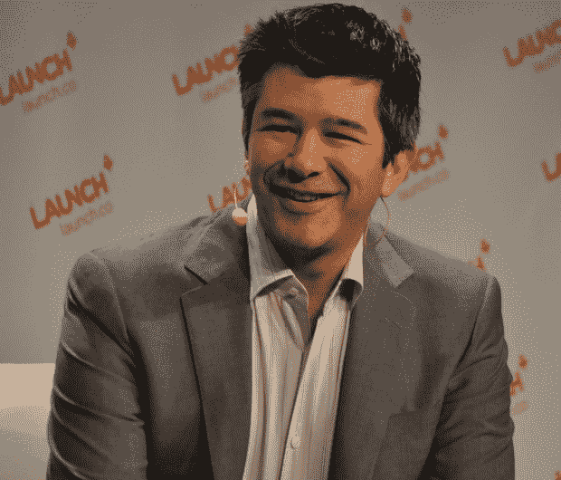
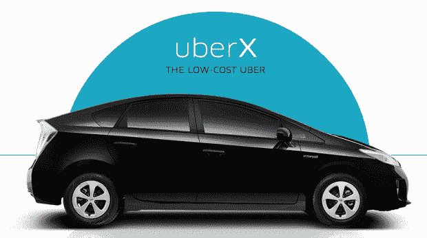
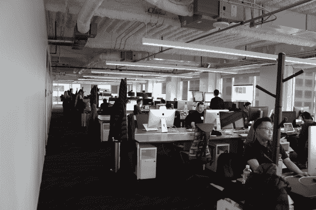
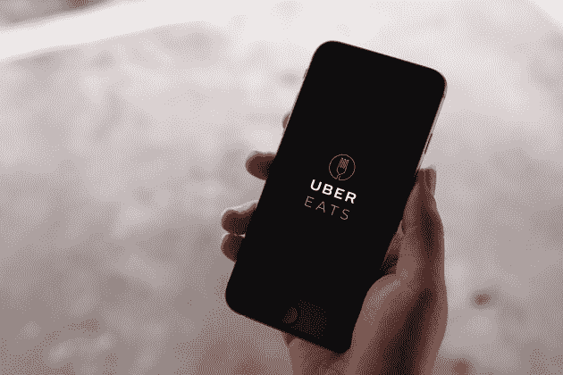
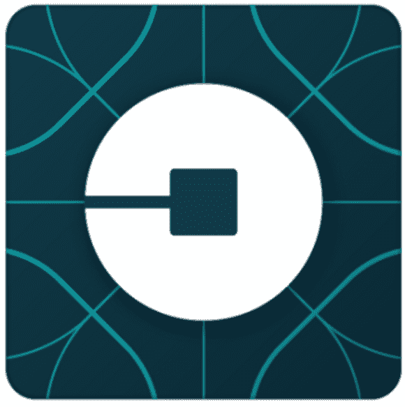

# 优步首席技术官透露特拉维斯·卡兰尼克是如何聘用他的，并为企业家提供建议

> 原文：<https://www.geekwire.com/2016/qa-uber-cto/?utm_source=wanqu.co&utm_campaign=Wanqu+Daily&utm_medium=website>

Uber CTO Thuan Pham.

Thuan Pham 告诉自己，是时候去度假了。他花了八年多的时间帮助建立 VMWare 的工程团队，见证了公司从 300 名员工发展到 15，000 名员工。在计划下一步职业发展之前，Pham 需要休息一下。

但是特拉维斯·卡兰尼克打电话来了。那是 2012 年末，这位优步的首席执行官需要一位经验丰富的工程大师，帮助这家世界上发展最快的公司之一管理底层技术。

“我计划休息一年，”范说。“但我没成功。”

GeekWire 最近在优步的西雅图工程办公室采访了 Pham，这家打车巨头在西雅图有 100 名员工，并计划在 2016 年将员工人数增加一倍。范有一个[鼓舞人心的个人故事](https://www.techinasia.com/refugee-from-vietnam-to-uber-cto-thuan-pham)，30 多年前，在开始美国生活之前，他乘坐一艘来自越南的难民船来到印度尼西亚

从麻省理工学院毕业后，Pham 曾在惠普实验室、Silicon Graphics、DoubleClick 和 VMWare 工作，并在 2004 年至 2012 年期间担任领导职务。他随后被优步董事会成员比尔·格利招募，比尔·格利帮助安排了与卡兰尼克的会面。

自 Pham 成为首席技术官以来，优步的估值已经飙升(现在超过 600 亿美元)，该公司现在在 68 个国家的 400 多个城市开展业务。就像任何成长中的公司一样，优步也有与工程相关的问题，但 Pham 帮助该公司建立了复杂的基础设施，以便在巨大的增长中平稳运行。

“这是我做过的最难的工作——但这也是为什么这是我做过的最有趣的工作，”范说。“每天我都在做新的事情，每天我都觉得自己在某些方面变得更好。这是因为我们必须解决棘手的问题。”

继续阅读我们与 Pham 的对话，其中详细介绍了他与 Kalanick 的采访过程，优步工程团队的内部工作方式，以及他对崭露头角的企业家的建议。为了简洁明了，采访经过了编辑。

Inside Uber’s Seattle engineering office.

感谢你抽出时间和我聊天，Thuan。你是怎么到达优步的？

**优步首席技术官 Thuan Pham** :“我在 VMWare 工作了八年。当我加入的时候，公司很小，大概只有 300 人。我离开的时候，有 15000 人。随着公司越来越大，我们经历了一个高速增长期，我尝到了那是什么滋味。我们看到了许多好的事情和坏的事情，我试图将错误和成功运用到我在优步的工作中。

过了一段时间，当 VMWare 在市场饱和方面停滞不前时，它变得令人厌烦。我非常反对因为你不再学习而变得无聊。你必须不断地让自己处于不舒服的境地，这样你才能不断地学习。在过去的两年里，我为我领导的团队呆在那里。我们团队有近 1000 人，而我是那艘船的船长，我不想离开。然后是首席执行官的交接，方向也在改变，所以这是离开的最佳时机。我计划在那之后休息一年，但是我没有做到。"

好的，优步是怎么进入你的视线的？

**Pham:** “当我们宣布我要离开的时候，一堆人让我看东西。优步董事会成员比尔·格利让我去看看优步，和(优步首席执行官)特拉维斯·卡兰尼克谈一个小时。如果我不喜欢，我可以拒绝。但是当然，谁会不喜欢特拉维斯呢？

Uber CEO Travis Kalanick.

我和他见了面，一个小时变成了两个小时。他取消了随后的会议，这似乎是一个好迹象。他邀请我回去做更多的演讲，最后在两周多的时间里，一对一地连续采访了我 30 个小时。也是在 Skype 上——当时他正在环游世界。特拉维斯就是这么做的。

他给我发了一张他想谈论的所有话题的照片。这是我们在他办公室第一次见面的结果。我们会选择每个主题，然后一直深入下去。一个话题可能是如何雇佣和解雇员工。另一个是关于项目管理和工程管理。任何与工程相关的话题都可以，我们会选择一个进行辩论。我有我的观点，他有他的观点，因为他也是一名训练有素的工程师，我们就像那样卡住了。

有趣的是，我们并不总是意见一致，但我们总是设法在最后达成一个双方都能接受的决定。后来我明白了，他并不是在寻找一个与他观点一致的人——他在寻找一个思想多样化的人，一个可以挑战他和他可以挑战的人。这就是我们如何得出最佳答案的。很酷。

在这 30 个小时里，我不在乎是否被录用。实际上我忘了这是一次采访。这就像两个同事之间的讨论。我开始了解他是如何思考的，他关心什么，他对什么充满热情，他讨厌什么，等等。最后，在一个周日上午的会议上，他停下来——我们还没有完成所有的话题——说，“我已经受够了。让我们谈谈报价吧。"

但是你应该休息一年。

法:我还没准备好。当然，优步和崔维斯以优步的速度前进。他说，‘我们必须这么做。’我告诉他我需要 30 分钟。我上网，做了些调查，往脑子里塞了些东西，然后给他回了电话。然后他中断了一个小时，然后回来，我们达成了协议。在优步，一切都发展得非常快。一旦我们决定做某件事，我们就向前一步。然后魔法开始了。"

Photo via Uber.

GeekWire:你可以去任何地方。为什么是优步？

Pham: “在我的旅程中，我发现了三件让我可以在任何地方工作的事情。一，有没有大任务？我的职业生涯没有多少年了，我想让每一年都有意义。我看到优步有潜力产生巨大的影响。第二，我喜欢团队吗？你们在工作中相处的时间比我们自己的家庭还多。我真的很喜欢优步的团队——聪明、积极、热情的人。第三，我得喜欢我的老板。和特拉维斯在一起，我能感觉到他是一个什么样的世界级人物。

我想，如果我不给自己这个和他一起工作的机会——不管结果是好是坏——我可能会后悔。所以，我说我的一年假期可以等等。而且还在等。"

**GeekWire:那是 2013 年。让我们快进到三年后的今天。事情和你预期的有多大变化？**

**Pham:** “当时，Travis 和我自己都没有意识到这能有多大。因为它发展得如此之快，我们唯一能做的就是展望未来六个月到一年，并找出我们需要做些什么来让它增长。

当我们推出 uberX 时，它爆炸了。然后我们进入了更多的城市，我们必须提高效率。在工程方面，我们必须构建一个可扩展的系统，并以足够快的速度完成，这样当业务在我们之上增长时它才是可靠的。令人喘不过气来。我们触摸的一切都变成了金子，但这需要巨大的努力和个人牺牲。到目前为止，我所设想的任何事情，都已经远远超过了这一点。没有一家公司发展得如此之快。"

Inside Uber’s Seattle engineering office.

让我们来谈谈西雅图。[为了支持这种疯狂的增长，你们去年在这里](https://www.geekwire.com/2015/uber-opening-seattle-engineering-office-led-by-isilon-vet-tim-prouty/)开设了一个工程中心。

Pham: “在我们找到一个令人敬畏的、强有力的当地领导人之前，我们不想开始。我们终于找到了蒂姆·普劳蒂，看看一年后发生了什么。我们有 100 名世界级的员工。我们认为我们可能会有 50 个，所以这超出了我们的预期。这就是公司运作的方式。

西雅图当然很重要。这个市场上有很多好东西。硅谷是谷歌和脸书的圣地，但西雅图是亚马逊和微软的下一个目标。但即使在大公司之外，也有许多真正的创新创业公司和令人敬畏的华盛顿大学系统。有许多伟大的系统人员、操作系统人员和伟大的计算机科学家。这里的人才基础非常非常适合建立一个世界级的工程组织。"

优步的应用看起来很容易使用。但是这款应用背后的工程是复杂的。工程学对优步有多重要？

Pham: “很明显，如果没有技术和工程，这个东西根本就不会工作。但这只是等式的一半。另一半是运营，男人和女人管理实体市场，应对政治环境和其他一切。公司的两大涡轮是工程和运营，我们为这架飞机提供动力。就任务背后的团结而言，我们合作得非常紧密，但同时我们又足够独立，每个人都可以超快地行动，而不是一直完全相互勾结。我们只是构建功能，推出它，运营部门基本上利用它来创造奇迹。这是一种共生关系，非常令人惊讶。”

GeekWire:这家公司的发展速度似乎真的很快。

Pham: “我们比其他公司行动更快。这是一项残酷的艰苦工作，我们必须解决一个棘手的问题，但不知何故，我们完成了它，然后我们回头想想，'我们到底是怎么做到的？'正是在这些时刻，我们超越了自己的红线，回头看，我们意识到我们的范围实际上比三个月或六个月前更大，我们对自己的能力更有信心。我们不断突破自己的个人界限，完成我们认为不可能的事情。

<aside class="pullquote"> Saying Uber is just an app is like saying Facebook is just a Timeline. There’s so many systems underneath that it’s like an iceberg — most of it is underwater that you don’t see.</aside>

如果人们出于错误的原因加入我们的公司，比如因为这是一次“IPO 之旅”或者因为这是一家热门公司，他们充其量只会感到痛苦，因为他们没有以正确的心态加入。它移动得超级快。当我们发布某个东西时，我们正在马上构建下一个迭代。你可能有一周的时间喘口气，然后再回到跑步机上。我现在看看我在 VMWare 或脸书或谷歌的朋友，与我们相比，每个人似乎都进展缓慢。

优步实际上是一家类似于脸书和谷歌的公司。你会听到很多人说优步“只是一个应用程序”，但实际上它 95%是系统。应用程序只是一层皮。有服务器、调度、动态定价、供应商定位、地图、路由数据——所有这些基础设施。说优步只是一个应用程序就像说脸书只是一条时间线。它下面有如此多的系统，就像一座冰山——大部分在水下，你看不见。这非常具有挑战性，也很有趣。"

Photo via UberEATS.

GeekWire:你们现在有 1200 多名工程师。公司如何完成工作？

**Pham:** “尽管我们在三年内从 40 名工程师增加到 1200 名，但我们没有大公司的官僚作风。我们把自己组织成小型的、以任务为导向的团队——这就像一个巨大的创业公司中的一个创业公司。我们有 50 或 60 个面向功能的团队，每个团队都有不重叠的任务。一个将解决安全问题，一个将解决客户支持，一个将解决司机和骑手的应用体验，一个将解决地图和路线-你能想到的。这些事情中的每一件都有非常明确的任务，并且有各种各样的工程师、数据科学家、产品经理、设计师等。他们只是运行它，并有自己的路线图，自己的执行计划，他们只是运送它。他们不会真的和任何人纠缠在一起。然后我们有十几个基础架构团队—存储、计算、可靠性等。它们通过共享公共架构和服务，使每个团队都能够超快速地前进。

神奇的是管理这种结构。这就像一个矩阵结构——责任在哪里？当你管理的人实际上在做其他项目时，你如何确保你让他们负责任？我们已经成功破解了那个密码。作为管理者，我们必须做额外的工作，意识到人们的贡献，以便有一个好的方法来评估影响。但是那些以任务为导向的团队是产品交付发生的地方。"

**geek wire:****你有很多在高速增长的公司工作的经验。你对创业者有什么建议吗？**

Pham: “我在优步学到的东西，实际上让我成为了一名非常非常优秀的专业人士，那就是敢于冒险和不怕失败的精神。听着，当我们发展得这么快时，我们永远不可能每一步都做得完美。我们跌倒，我们跌倒；我们会做出非常大的决定和非常小的决定，有些决定不会成功。我做出的重大决定完全失败了，我们必须恢复。但对于一家发展如此迅速的公司来说，不做任何决定可能是更大的失败。所以你必须无所畏惧地向前冲，保持警觉，但也要脚踏实地，明白什么问题需要优先解决。你必须有解决问题的勇气，即使你没有所有的信息或所有的答案。你只需要利用你所有的经验、知识和战争的创伤来尽可能做出最好的决定。如果你真的很优秀，大多数决定都是正确的。他们中的一些人总是会失败，不会成功，会非常痛苦。但你必须勇往直前去做。

关键是，当你失败的时候，你是不是很快就起来了？你学习和失败的速度快吗？你从学习中马上变得更好了吗？当你再次向前冲时，你是作为一个更好的人和一个更好的团队向前冲，这个团队更有见识，更有能力面对下一个挑战。我们经历过停机和各种各样的失误，但所有这些都让我们公司变得更加聪明。你失败得越快，你学到的就越多，如果你能够生存和成长，你就会变得越好。"

**GeekWire:贵公司正在推出传统打车平台之外的新服务和产品。优步的未来是什么？**

**Pham:** “我们无法预测，但我们有愿景。今天，我们每天为个位数的数百万人提供服务。但是地球上有 70 亿人。脸书已经有超过 10 亿的每日活跃用户，甚至不在中国。这告诉我们，他们已经有 10 亿人使用智能手机上网和其他一切。想象一下，如果我们吃进去，开始为那些人服务，在世界各地的城市里运送他们和东西——想象一下我们会有多大。

这只是旅程的第一天，第一个月。我们希望将这种体验带给世界各地的人们，并改善城市。你能想象如果我们每天可以在世界各地移动 1 亿或 5 亿人吗？我们能让多少辆车离开公路？我们可以减少或消除多少拥堵？我们的所作所为将彻底改变世界。我们坚信这一点。

但是，说实话，三年前我们没有这个雄心。我们试图让一天 30，000 次旅行发挥作用。但是当你进入这个领域，我们开始看到人们的生活已经发生了巨大的变化，特别是在司机方面。人们现在将我们作为按需工作的平台，让他们成为自己的老板，一个流动的办公室。在骑手方面，我们带来了这种惊人的，流畅的，无缝的，美丽的体验，同时也是经济的。

当你可以移动食物、午餐、人——任何东西——我们就成了数字世界和物理世界之间的操作系统。作为一家公司，我们的使命是在任何地方为每个人提供像自来水一样可靠的交通工具。"