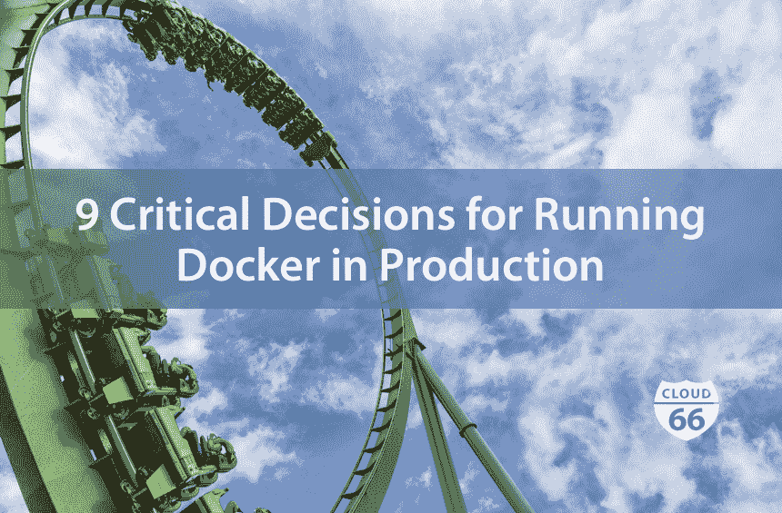

# 在生产中运行 Docker 的 9 个关键决策

> 原文：<http://blog.cloud66.com/9-crtitical-decisions-needed-to-run-docker-in-production/?utm_source=wanqu.co&utm_campaign=Wanqu+Daily&utm_medium=website>

您已经构建了基于 Rails 或 Rack 的 Ruby 应用程序。它甚至可以在你的笔记本电脑上的 Docker 中运行，你团队中的其他开发人员也可以运行它。一切看起来都很好，是时候出货了。

等等！没那么快！过渡到 Docker 生产环境并不像听起来那么容易。这不仅仅是将本地构建的容器映像发布到生产环境中。

让我们来看看在将 Dockerized Rails 和 Rack-based Ruby 应用安全地部署到生产环境之前，您将面临的 9 个最重要的决策:

# 关键决策#1:映像管理

虽然在您的开发环境中为构建映像设置一个`Dockerfile`和`docker-compose.yml`相当简单，但是您应该创建一个一致的过程来构建 Docker 映像文件。这将消除对本地环境的任何担忧，同时避免依赖开发笔记本电脑作为构建新映像的唯一手段。它还将使您能够创建一个从代码提交到 Docker 映像的连续部署管道，而无需开发团队的手动干预。

除非您计划向全世界发布您的 Docker 图像，否则您还需要一个私有的 Docker 图像库。虽然 Docker [提供了一个私有的映像库，允许您部署和管理自己](https://docs.docker.com/registry/deploying/)，但是您可能不希望这样做，因为故障可能会中断您的部署管道。您需要选择一个选项来保护您的私有 Docker 映像，同时仍然使它们能够被您的构建和部署过程访问。

# 关键决策#2:选择云提供商

一旦有了 Docker 映像，就需要将它部署到 Docker 主机上。许多云提供商现在支持 Docker 容器的部署。因为大多数对使用的资源而不是容器实例收费，所以检查定价细节以避免价格冲击是很重要的。

请注意，不同的云提供商的容器部署流程各不相同，这使得将来更换提供商变得更加困难。如果您希望使用多个云提供商或防止锁定，您需要内置对多个云提供商的支持(或找到一个解决方案)。

# 关键决策#3:网络访问和安全修补

在本地开发环境中运行容器不会产生严重的安全风险。所有进程都在一台主机上运行，与网络入侵风险和生产服务器常见的各种攻击媒介隔离开来。

开发设置非常开放，允许在开发过程中进行故障排除。在生产环境中，网络设置需要更多的考虑。公共流量不应访问某些容器，这些容器只能由专用网络中的其他容器访问。必须识别并适当处理网络流量监控、暴力登录尝试和其他攻击媒介。

您还需要跟踪发布的安全补丁，然后确定您的主机和容器是否都是安全的，或者是否需要安装补丁。

将您的容器转移到生产环境需要考虑网络访问，并保持您的容器和 Docker 主机打补丁。不要忽视您的生产环境的这一关键步骤。

# 关键决策#4:跨容器和主机的负载平衡

一旦我们从单个容器服务转移到跨一个或多个主机的多个容器，我们将需要负载平衡器来分发传入的请求。使用诸如 [nginx](https://www.nginx.com) 或 [HAProxy](http://www.haproxy.org/) 这样的工具是一种常见的方法。困难在于，当容器被创建和销毁时，以及当新的 Docker 主机被添加到您的环境中以获得额外的容量时，要保持它们的配置更新。通过工具或脚本解决这一需求的时间因素。

请注意，除非您计划在升级时将当前部署脱机，否则您需要同时支持多个运行版本。您的负载平衡策略需要考虑这一点，以防止断开连接或将流量路由到错误的版本。

关于选择负载平衡策略的更多信息，请阅读我们关于服务器扩展技术的文章。

# 关键决策#5:部署过程

许多开发人员认为他们在开发环境中使用的工具将在生产环境中工作。事实并非如此。从开发到生产，Docker 编写器配置会有很大不同。从卷绑定到端口绑定和网络配置，连接容器将会改变。随着您转向多主机环境，复杂性将会增加。您还将拥有开发中不常见的其他容器，如日志聚合器、外部数据库和 HA 消息代理(仅举几例)。

协调环境设置的差异需要大量的脚本工作。这不会像在开发环境中那样容易。从一个简单的单容器应用程序到一组复杂的容器映像，每个容器映像都有多个实例需要连接到负载平衡器以分配工作负载，在这一过程中，要计划足够的时间来解决这些细节问题。随着应用程序的成熟和流量的增加，需要使用滚动升级或蓝绿色部署策略来防止站点中断。

不熟悉有效的部署策略？查看[云原生应用的部署策略](http://realscale.cloud66.com/deployment-strategies-for-cloud-native-applications/)了解更多信息。

# 关键决策#6:服务发现

随着容器数量的增长，注册容器供应用程序使用的管理开销也会增加。有各种各样的工具来管理这个过程，大多数需要集成和配置到您的 Docker 生产环境中。Cloud 66 已经找到了一种简单的方法来管理服务注册中心，方法是使用一个内部 DNS 服务器。

无论您选择什么，请确保您的服务注册与您的容器实例保持同步，并在容器分布在多个 Docker 主机上时考虑负载平衡策略。这样做将确保您的应用程序可以编码为一个通用服务名(例如 myservice.mycluster.local ),该服务名可用于路由到特定的容器实例以服务该请求。

# 关键决策#7:日志管理

在开发中使用 Docker Compose 使得查看日志变得简单，并且能够快速排除故障。当在任意数量的主机上处理多个容器实例时，跟踪问题变得更加困难。

[分布式日志记录](http://realscale.cloud66.com/cloud-server-logging-strategies/)使服务器能够收集和聚合一个或多个日志服务器上的日志条目。您的生产基础设施将需要支持跨容器的日志聚合。您还需要考虑如何查看和搜索这些日志来支持故障排除。

# 关键决策#8:集装箱监控

监控生产过程中的容器至关重要。从 Docker 主机到容器，您需要了解每个服务和整个系统的健康状况。选择正确的工具和监控策略将确保您最大限度地减少停机的影响，最大限度地利用您的主机资源，从而让客户更加满意。

不确定您可能需要什么样的监控策略？我们有一个[监控策略指南](http://realscale.cloud66.com/full-stack-cloud-native-monitoring-strategies/)可以帮助你。

# 关键决策 9:数据库管理

在开发环境中，数据库可以托管在容器中，而不用担心 I/O 性能。生产环境不能容忍糟糕的性能，尤其是如果我们想要提供出色的客户体验。根据需求扩展数据库以处理增加的 I/O，以及高可用性和可靠的备份/恢复策略是运行现代 web 应用程序或移动 API 的关键。您为生产环境选择的策略将对您的客户产生积极或消极的影响。

阅读我们关于[扩展生产数据库](http://realscale.cloud66.com/database-server-scaling-strategies/)的文章，了解更多信息。

# 我真的需要立即做出这些决定吗？

是的，很有可能。除非您正在部署一个流量很小的应用程序或 API，否则这些决策对产品的成功都是至关重要的。似乎是相当多的责任，不是吗？

开发者需要记住，Docker 是一个工具，而不是一个成熟的云原生架构解决方案。它提供了一些惊人的功能，我很高兴 Docker 成为我的架构的一部分。但是它需要和其他基于云的解决方案一样的努力来维护一个生产 Docker 部署(甚至更多)。

使用 Cloud 66 来管理我的生产容器消除了对这些考虑的无休止的说教的需要。通过[定制一些配置文件](http://help.cloud66.com/building-your-stack/building-your-docker-service)，我可以将我的环境从开发转移到生产，并获得他们平台的优势:内置日志记录、安全网络访问管理、监控、持续交付、补丁管理，以及在我需要时使用他们的数据库即服务。[亲自尝试一下](https://help.cloud66.com/maestro/quickstarts/getting-started.html)，看看部署和管理您的 Docker 生产环境会变得多么容易。

* * *

> 也可以看看我们关于[‘在生产中运行容器所需的 8 个组件’](/8-components-you-need-to-run-containers-in-production/)的博客。

