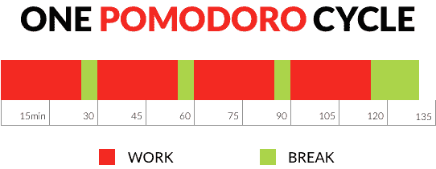

# 以下是你工作休息的确切时间——克里斯·贝利

> 原文：<http://alifeofproductivity.com/exactly-how-long-your-work-breaks-should-be/?utm_source=wanqu.co&utm_campaign=Wanqu+Daily&utm_medium=website>

**Takeaway:** As a general rule, you should take more breaks than you already are. Studies show that in the morning, we can work for (at most) 90 minutes at a time before we begin to lose focus. Throughout the day, we should break for about 15 minutes for every hour we work.

**预计阅读时间:** 3 分 18s。

我最喜欢的提高效率的方法之一是违反直觉的:多休息。

当你频繁地从工作中抽身，你可能会感觉效率低下，因为你在那段时间没有工作。但是休息可以让你完成更多的事情，因为它们让你补充能量储备，重新充电，从工作中抽身出来建立创造性的联系，重新评估你的目标或者你最初是如何对待工作的。正如能源项目、[的首席执行官托尼·施瓦茨所说的](http://theenergyproject.com)，“没有任何休息时间来更新和充电，我们的效率更低，犯更多的错误，对我们正在做的事情更不投入。”

在我们深入这篇文章之前，我先简要说明一下内疚感。负罪感通常是促使我们不顾疲劳继续工作的动力——当我们更忙的时候，我们会感觉更有效率，更少负罪感。**但是说到底，生产力不在于我们*做了多少*，而在于我们完成了多少。休息有助于你更聪明地工作，完成更多任务。**

这使得休息变得至关重要。如果你以知识工作为生，你的工作会受益于你所能投入的所有精力和注意力。这意味着你花在休息上的时间将会增加你的注意力和精力——假设你一天中的大部分时间都没有逃学。

休息的最佳时间是多少？谢天谢地，科学能够告诉我们。

### 早上:每 90 分钟休息一次

一整天，我们的能量像波浪一样上下波动，就像我们睡觉时一样。当我们睡觉时，我们以 90 分钟为一个周期；每个周期在浅睡眠、深睡眠和快速眼动睡眠之间交替。我们在白天也有相似的节奏；早上，我们的身体会在 90 分钟的清醒期和一小段时间的困倦(20-30 分钟)之间交替。 [1](#fn1-8561 "Source: <a href="https://www.researchgate.net/publication/235129211_Ultradian_Rhythms_in_Prolonged_Human_Performance">https://www.researchgate.net/publication/235129211_Ultradian_Rhythms_in_Prolonged_Human_Performance</a>")

我们可以利用这种自然节奏，在早上工作 90 分钟，然后休息至少 20 分钟——这时我们自然会再次感到昏昏沉沉。

**下午:使用番茄工作法**

到了下午和晚上，我们的生物节律开始稳定——尽管当我们休息得不够频繁时，我们的能量储备仍会耗尽。**正因为如此，番茄工作法在下午效果最好**。

技巧很简单:你花 25 分钟做一件事，然后休息 5 分钟。重复这三次以上。当第四次来临时，休息 25 分钟(或更长时间)。这种方法效果很好，因为它迫使你专注于一件事，它把休息时间安排到你的日常工作中，这样你就可以一路充电。

### **一般情况下:每 52 分钟休息 17 分钟**

DeskTime 是一家开发跟踪人们电脑使用情况的应用程序的公司，最近发现了一些奇怪的事情:当他们观察生产率最高的 10%的员工时，他们发现这些员工在工作 52 分钟后平均休息 17 分钟。 [2](#fn2-8561 "Source: <a href="https://www.themuse.com/advice/the-rule-of-52-and-17-its-random-but-it-ups-your-productivity">https://www.themuse.com/advice/the-rule-of-52-and-17-its-random-but-it-ups-your-productivity</a>")

因为每个人都有不同的神经，每工作 52 分钟后休息 17 分钟可能不适合你，但它确实是一个很好的指导，告诉你应该多长时间离开工作。虽然这个数字非常具体，但我认为每小时休息 15 分钟是一个很好的开始——值得尝试，然后观察你在这个仪式上完成了多少。

有趣的是，每 52 分钟休息 17 分钟和你用番茄工作法休息的时间比例大致相同。在番茄周期中，当你平均休息超过 52 分钟时，大约是 21 分钟，而在这项研究中是 17 分钟。相当接近。

这两种观点都表明了一些重要的东西:为了变得更有效率，你应该更频繁地放下工作来充电。