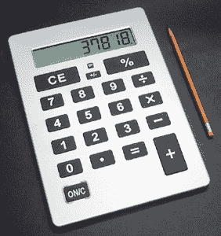
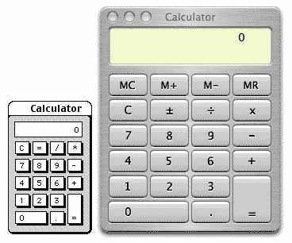

# 我的巨型计算器

> 原文：<http://blog.codinghorror.com/my-giant-calculator/?utm_source=wanqu.co&utm_campaign=Wanqu+Daily&utm_medium=website>

你有没有注意到有多少人在他们的电脑旁边放着一个物理计算器？讽刺几乎显而易见。我最喜欢的是[计算器鼠标垫](http://www.google.com/search?q=calculator+mousepad)。

杰夫·拉斯金在《人性化界面》中为在你的电脑旁边放一个袖珍计算器的做法辩护:

> 是真的。我们许多人在电脑旁边放了一个计算器。当你面前有一整台电脑时，你为什么需要这个简单的设备？你需要它，因为为了用计算机做简单的算术，你必须经历相当于马戏团杂耍的扭曲。当你想做除法的时候，你可以在文字处理器上敲敲键盘:375 包 Phumuxx 售价 248.93 美元；一个包裹的价格是多少？在我的电脑上，我必须打开一个计算器窗口。为此，我将手从键盘移到鼠标上，用鼠标点击并拖动来打开计算器。我把双手放回键盘，输入我需要的数字，或者从我的文档中单调乏味地剪切粘贴。然后我必须再按几个键，最后将结果复制到我的文档中。有时，日历窗口正好在我需要的数字上面打开，这只是雪上加霜。在这种情况下，我必须在继续之前用鼠标将计算器窗口移开。拿一个袖珍计算器要快得多。

那么，善良的老 calc.exe 有什么不好呢？拉斯金做了一个小实验:

> 我使用一位经验丰富的计算机和计算器操作员作为我的测试对象，在他面前打开他的文字处理程序，我测量了他拿起计算器、打开计算器、做一个简单的加法，然后将手放回键盘继续打字所用的总时间。大约花了 7 秒钟。然后我测量了他使用内置计算器的时间。他必须将光标移到屏幕顶部的菜单栏，找到计算器程序，打开计算器，输入总和，然后在字处理程序中单击后退，这样他就可以继续打字了。**这花了大约 16 秒。**

我不知道为什么拉斯金如此执着于使用鼠标来启动计算器。

即使在 Mac 上(我假设测试是在那里进行的)，也必须有键盘快捷键。在 Windows 上，我们需要以下按键来计算 13 和 14 的和，并将结果粘贴到我们的文字处理器中:

*   `` + `R`显示运行对话框

*   键入`calc`，然后按`Enter`启动计算器

*   键入`14` `+` `13` `=`来执行计算

*   `ctrl` + `c`复制结果

*   `alt` + `f4`或`alt` + `tab`切换回来

*   `ctrl` + `v`粘贴结果

手不离开键盘进行计算当然是可能的。现在许多键盘都有计算器按钮，可以进一步减少按键次数。我保证我可以打破物理计算器 7 秒的记录。但也不完全是*简单的*，对吧？

拉斯金提出了一个更简单的“在任何地方都可以做”的工具，而不是键盘杂技。内置于操作系统中的一些东西，消除了为这些类型的助手函数生成单独窗口的需要:

> 这里有另一个应该普遍可用的工具:在任何可以输入数字的地方，您应该能够输入一个计算该数字的算术表达式。命令，例如..
> 
> *   检查当前选择的拼写
> *   将当前选择视为算术表达式并对其求值
> *   将当前选择作为电子邮件传输
> *   将当前选择作为传真传输
> *   让我们看看这个网址上有什么
> *   作为 Java(或其他)程序执行当前选择
> 
> ..应该随时可用。这显然是可行的。

我同意操作系统应该提供这种非模态(非窗口，甚至)功能。运行菜单是这个的[(非常)有限的形式，而](http://www.codinghorror.com/blog/archives/000378.html) [SlickRun](http://www.bayden.com/SlickRun/) 和 [ActiveWords](http://www.activewords.com/) 则更进一步。

拥有计算器鼠标垫的用户可不是闹着玩的。每当我看到这样的用户，我就会想起，当简单的数字相加如此复杂时，我们在 GUI 设计上还有多远。

