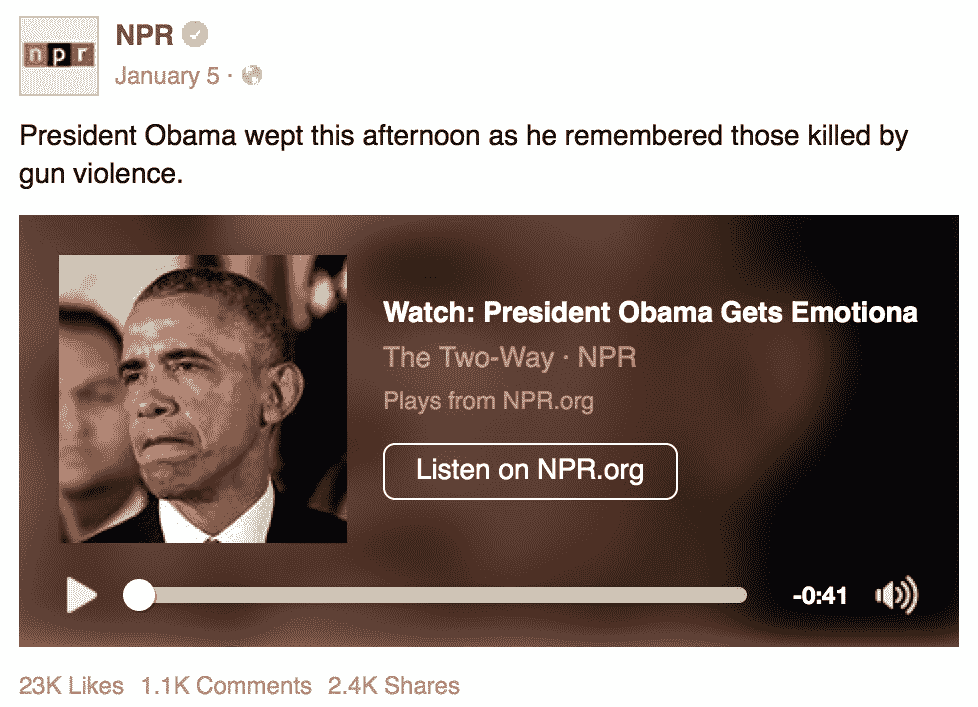
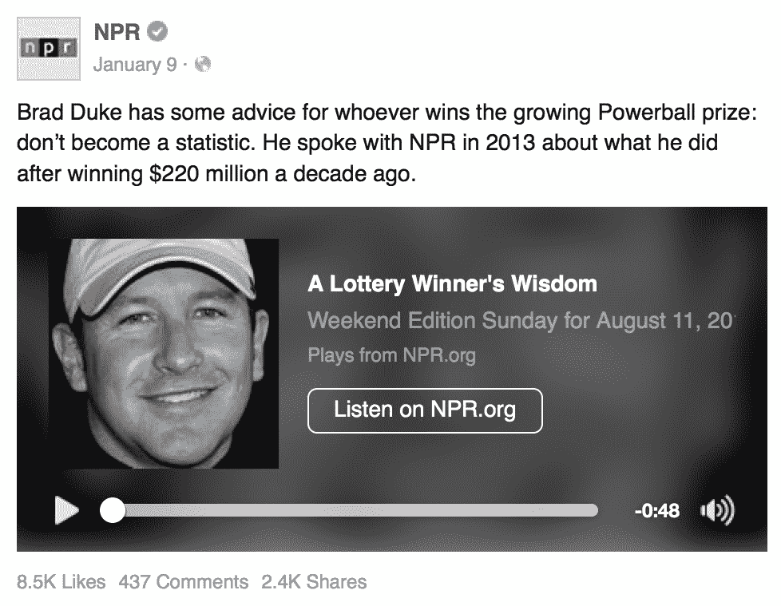
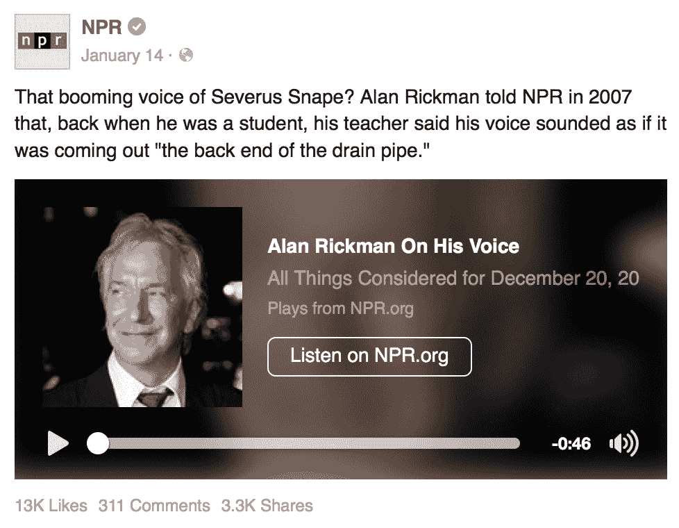
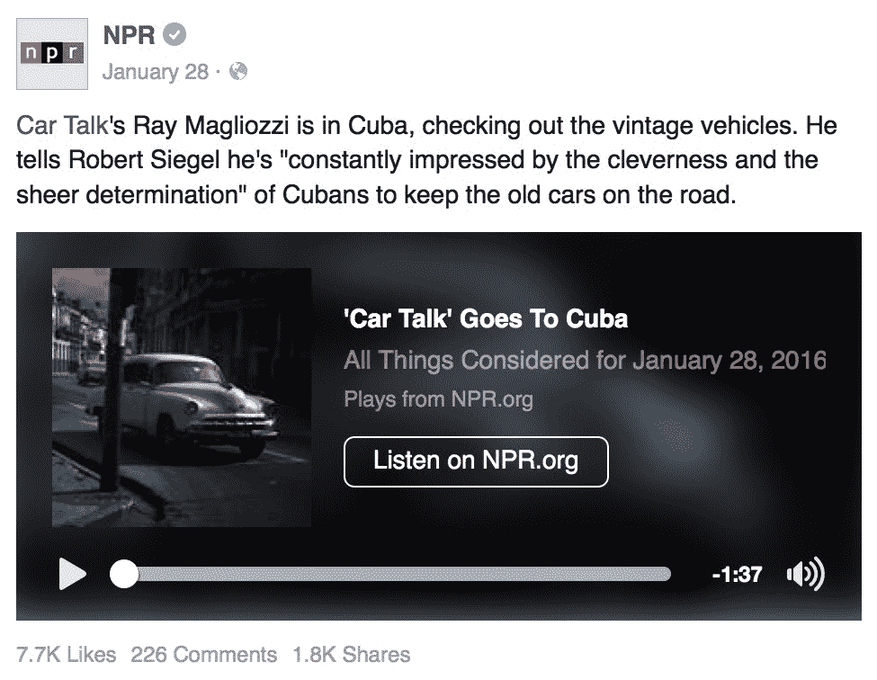

# 音频能在脸书传播开来吗？以下是 NPR 进行了一个月的实验后发生的事情

> 原文：<http://www.niemanlab.org/2016/04/can-audio-go-viral-on-facebook-heres-what-happened-when-npr-ran-an-experiment-for-a-month/?utm_source=wanqu.co&utm_campaign=Wanqu+Daily&utm_medium=website>

在社交媒体上分享音频很难做到。

[Stan Alcorn](https://twitter.com/stan_alcorn)

记录了两年前在一份被广泛引用的

[Digg story](http://digg.com/originals/why-audio-never-goes-viral)

—还有

[not a whole lot has changed](http://www.niemanlab.org/2015/11/hot-pod-revisiting-the-question-why-doesnt-audio-go-viral/)

从那以后。根本性的挑战依然存在:当你在浏览其他东西时，很难用语音进行多任务处理。我们仍然没有一个真正的“音频 BuzzFeed”来提升具有病毒潜力的剪辑。现在，脸书和 Twitter 上的无声自动播放视频正在训练用户期待一种完全不同的参与体验。

但社交音频对于音频创作者和播客来说有着巨大的潜力，他们每天制作数小时的精彩内容，但仍在努力发现和接触新的观众。在 NPR，我们最近用测试版脸书音频播放器尝试了一种不同的方法。剧透:我们没有找到让音频病毒式传播的成功公式，但我们确实学到了一些在这样一个空间中工作良好的剪辑和包装类型。

### 实验

脸书新的嵌入式音频播放器最初是为 Spotify 和 Apple Music 等音乐服务设计的。经过几处调整，脸书在今年早些时候进行了一个月的试播，将这款播放器改编为 NPR 和连环漫画的编辑使用。

我负责 NPR 实验的编辑工作，在此期间，我的全职工作是从我们的大型新闻节目和播客中寻找最佳音频剪辑。整个新闻编辑室都被邀请参加，并通过提出建议来提供帮助。(这对我非常有帮助——一开始我一想到每周要独自收听 30 多个小时的广播就感到恐慌。)

借鉴以下经验教训

[previous NPR experiments with social audio](http://www.niemanlab.org/2015/01/from-explainers-to-sounds-that-make-you-go-whoa-the-4-types-of-audio-that-people-share/)

我力求多样化，试图收集几秒到五分钟的剪辑，从新闻杂志和播客，从采访和特写到突发新闻和档案内容。在我选择了一个剪辑之后，工作流程变得相当复杂，包括我们的音频编辑器、内容管理系统和

[Facebook’s debugger](https://developers.facebook.com/tools/debug/og/object/)

。

在你发推特向我询问深入的成功指标之前，请记住这是一个样本量有限的实验(总共 52 个片段)。我们有关于接触和参与度的标准脸书数据，但无法获得播放次数和收听时长的数据。下面的结论不是基于深入的科学分析，但它们仍然很有启发性。

### 轶事

尽管有复杂的工作流程和其他挑战(下面会详细介绍)，我确实了解了很多脸书用户想要接触的音频内容的类型。

#### 爆炸性新闻

在某些情况下，我们在快速周转的内容上运气很好。

在奥巴马总统一月份关于枪支控制的演讲中，他变得情绪激动并开始哭泣。他们是在网上看到的眼泪。演讲结束后不久，我们分离出那个强有力的时刻，并把它变成了一个[音频帖子](https://www.facebook.com/NPR/posts/10154070479211756),带有一个非常短的预告片来设置它。这个片段本身链接到了一个[双向博客帖子](http://www.npr.org/sections/thetwo-way/2016/01/05/462033317/watch-president-obama-gets-emotional-talking-about-gun-control)，让我们在同样的事情在*播出前几个小时分享它。它吸引了 200 多万脸书用户，是我们实验中第二受欢迎的视频。*

#### 一些你不得不听的事情

这似乎是显而易见的，但通过聆听获得最佳体验的剪辑是音频帖子的明确选择。这一类别中表现最好的是喜剧演员[乔恩·班杰明](https://en.wikipedia.org/wiki/H._Jon_Benjamin)的搞笑采访[中的一段摘录，他谈到录制一张爵士专辑，尽管他对爵士一无所知(不幸的是脸书的那段剪辑已经不再管用了)。](http://www.npr.org/2016/01/19/463589100/comedian-jon-benjamins-jazz-album-is-full-of-real-untapped-un-talent)

#### 档案馆和时代精神交汇的地方

NPR 巨大的档案库是其最大的资产之一——下面的片段证明了这一点，这些片段都是我们在实验中最受欢迎的帖子。没错，它们是引人注目的音频片段，但更重要的是，它们是当下的时代精神话题。

我们发布了这个片段，来自对一位彩票中奖者的档案采访，当时强力球热正如火如荼。它被广泛分享，并带动超过 25 万人点击 NPR.org 的完整故事，使它成为我们测试的最受欢迎的剪辑。

也许没有比这个更完美的赞美艾伦·瑞克曼的片段了，这个片段来自 2007 年的一次全面采访，他在采访中谈到了他标志性的声音(以及他早期因此受到的批评)。该音频帖子被广泛分享；我们用《新鲜空气》中的大卫·鲍依的[片段取得了类似的成功。讣告总是提供一个利用我们庞大档案的机会，这个实验清楚地表明，脸书的音频剪辑特别适合这种材料。](https://www.facebook.com/NPR/posts/10154083996446756)

#### 否则我们不会推广的东西

尽管从指标上看，脸书音频帖子的表现普遍不如我们正常的故事帖子，但它们实际上为一些我们不会在社交媒体上推广的页面提供了新的机会。

例如，如果你曾经看过[早间版概要](http://www.npr.org/programs/morning-edition/)，你会注意到许多故事只是摘要，只有最少的文字，没有图像。我们不经常在社交网站上分享这些页面，因为它们有点丑，谁真的想看文字记录呢？脸书的音频帖子使得仍然很棒的音频内容更容易呈现出来。

这个[汽车对话的例子](https://www.facebook.com/NPR/posts/10154123386146756)是一个完美的案例研究。这是可爱的雷·马格里奥兹和罗伯特·西格尔之间的有趣时刻，很少有数字用户会发现。

### 我们学到的其他重要事情

除了内容类型，还有其他一些经验:

*   我们仍然不知道最理想的长度是多少，部分原因是我们没有关于播放点击和收听时长的数据。我们的前 10 个帖子从 46 秒到 2:44 不等。
*   视觉效果仍然很重要。我们的普通宣传画帖子表现不佳，[，即使剪辑很棒](https://www.facebook.com/NPR/posts/10154073284611756)。
*   **“反向宣布”效果非常好**，听众被告知:“点击‘收听 NPR . org’按钮收听更多。”在某些情况下，这导致推荐回到我们的网站，收听率为 79%。(总体而言，最高的“音频转换率”是那些“你必须听到它”的故事之一，在[旧时代的音效](https://www.facebook.com/NPR/posts/10154116434416756)——92%点击进入 NPR.org 的人在网站上播放过一次完整的故事音频。相比之下，我们有声故事的平均收听率是 8%)。
*   背景很重要。需要注意的是，对于每个脸书用户来说，视频剪辑的效果并不相同。它们只在 iOS 应用程序和桌面上可见。这意味着我不能指导人们在设置剪辑时“听下面的”，因为例如 Android 用户甚至看不到音频播放器。我们也不知道这个限制如何影响音频帖子在脸书算法中的受欢迎程度。

### 社交音频挑战，放大

除了为未来的社交音频项目提供一些关于内容类型和方法的线索，这个实验还明确了尝试共享音频的一些已知挑战。

首先，如果你在阅读或浏览其他东西，口语音频很难进行多任务处理。用户也可能没有心情或位置去听(在工作，没有耳机等)。由于带字幕的无声自动播放视频的激增，他们甚至可能没有养成倾听的习惯。虽然我们在评论和私人信息中看到一些轶事证据，表明一些用户欣赏这款播放器，但很明显，许多人都在采取经典的“听/读/看之前先评论”的做法。

从一个音频制作人的角度来看，当你要求某人点击“冷”时，很难隔离一个伟大的时刻，并用贪婪的上下文来设置它这与另一个挑战有关——一般来说，在文字/视觉市场(即互联网)中销售听觉体验很困难:“相信我，这真的真的很棒，即使你不知道谁在说话，也没有什么可看的，我要求你集中注意力 40 秒！”

脸书工具也没有试图解决分享音频的其他重大技术问题。听众很难从广播或播客中剪辑并分享他们自己最喜欢的音频时刻，尤其是当大部分收听是在离散的播客应用程序中进行时。虽然 SoundCloud 可能是我们所拥有的最接近“音频 YouTube”的东西，但没有任何工具被所有社交平台普遍采用。

### 下一步是什么？

我们不知道脸书对这款播放器的更大计划是什么，但这个实验可能会告诉他们如何看待未来的编辑音频。展望未来，当我们有一个真正适合这种形式的剪辑，并且能够证明出版它所涉及的复杂工作流程的合理性时，我们会谨慎地使用它。

在 NPR，我们将继续探索这个实验之外的社交音频挑战。我们最近为 NPR.org 推出了一款新播放器[，为 NPR 一号](http://www.npr.org/sections/thisisnpr/2016/03/29/472129006/new-audio-player-arrives-on-npr-org)推出了一款网络应用[。我们也对社交音频领域的所有其他项目感到兴奋，包括](http://one.npr.org/) [WNYC 的“听力图”](http://www.niemanlab.org/2016/03/hoping-to-make-audio-more-shareable-wnyc-introduces-audiograms-for-social-media/)