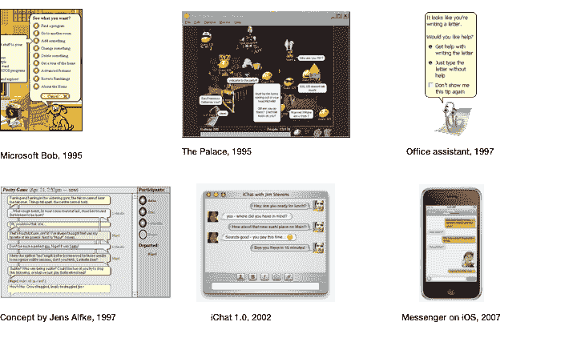
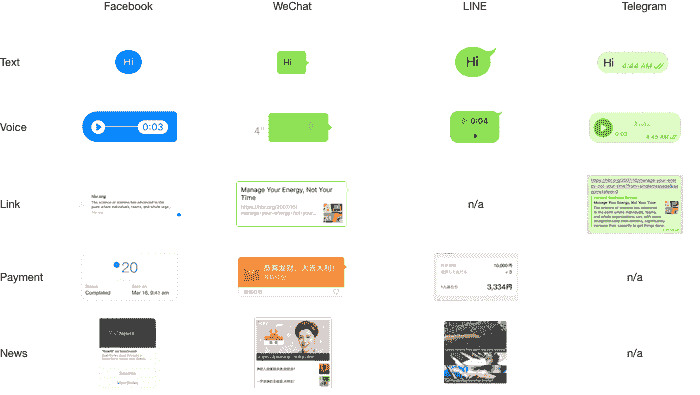
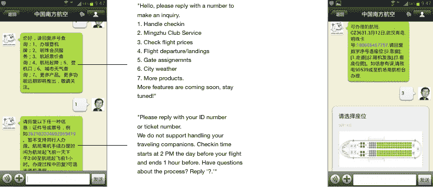
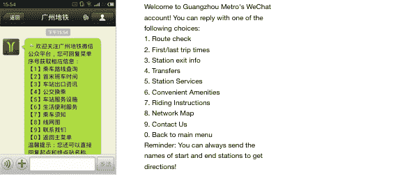
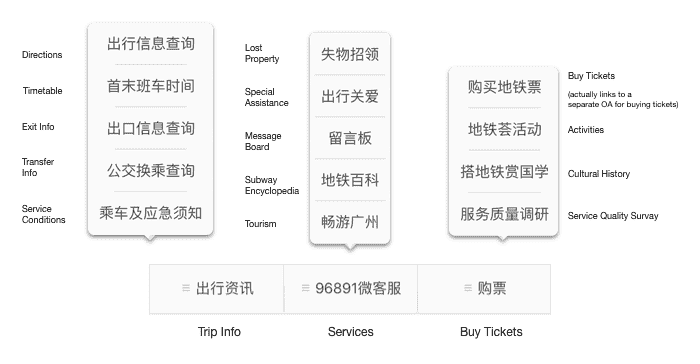
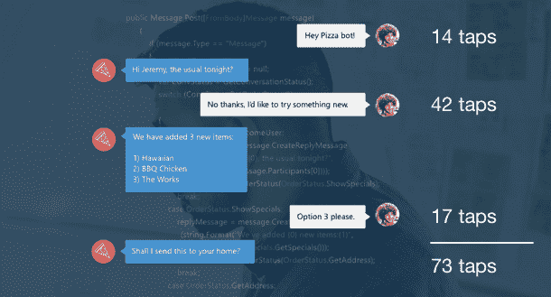
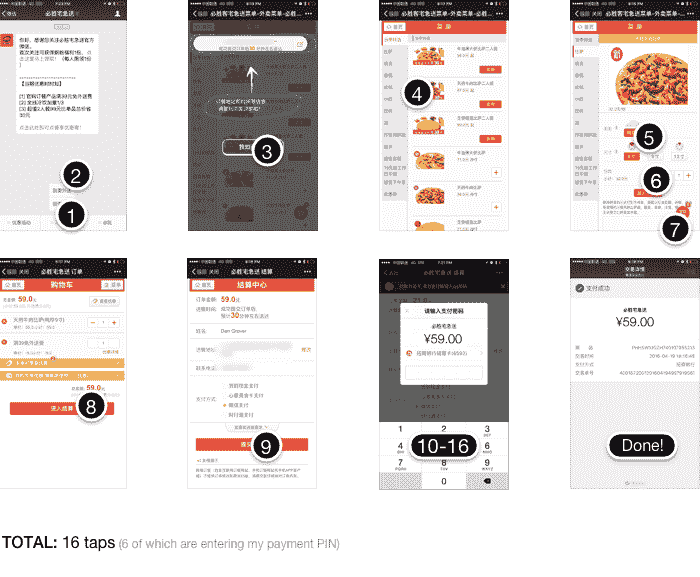
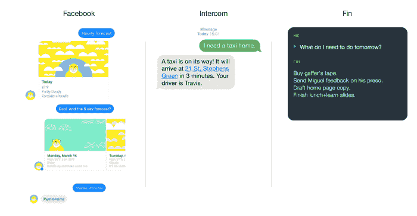

# Dan Grover |机器人不会取代应用程序。更好的应用会取代应用。

> 原文：<http://dangrover.com/blog/2016/04/20/bots-wont-replace-apps.html?utm_source=wanqu.co&utm_campaign=Wanqu+Daily&utm_medium=website>

最近，每个人都在谈论“对话式用户界面”这是下一件大事。但是关于这个话题的文章越看越烦。我花了这么长时间才想明白为什么！

对话,[写道,](http://www.wired.com/2013/03/conversational-user-interface/)可以做传统图形用户界面做不到的事情。马特·哈特曼将文本驱动应用的激增视为[一种“隐藏的主屏幕”](https://medium.com/@MattHartman/the-hidden-homescreen-70c794ff9ada#.spot6iech)。TechCrunch 称[“忘记应用程序，现在机器人接管了”](http://techcrunch.com/2015/09/29/forget-apps-now-the-bots-take-over/)。Fin [的创造者认为这是一个新的范例，所有的应用都将迁移到](https://www.fin.ventures/letters/on-bots-conversational-apps-and-fin)。Dharmesh Shah 怀疑对话式用户界面的兴起是否会导致设计师的衰落。[说，埃米特·康诺利在对讲机](https://blog.intercom.io/design-is-a-conversation/)中说*是*的一段对话。

本尼迪克特·埃文斯预言说，新的领域是“所有的信息都在扩展，直到它包括软件。”

Facebook Messenger 的负责人[大卫·马库斯说:“人们不希望你与之互动的每一个业务都有应用程序，……只是在一个精心设计的气泡中有一条消息……【那是】比应用程序更好的体验。”在他的负责下，Facebook Messenger 已经测试了这种方法，与高调的合作伙伴建立了集成，并开放了一个机器人 API。](http://uk.businessinsider.com/mark-zuckerberg-virtual-reality-big-regret-oculus-rift-messenger-2015-11)

我们甚至看到了将这一想法发挥到极致的前卫尝试，比如以对话形式呈现新闻的 [Quartz 最新应用](http://qz.com/613700/its-here-quartzs-first-news-app-for-iphone/)，或者游戏 [Lifeline](https://itunes.apple.com/us/app/lifeline.../id982354972?mt=8) 。像 [Mailtime](https://mailtime.com/) 这样的应用程序甚至承诺将我们的电子邮件转化为聊天，从而拯救我们。

*嗯！*

我想我可能要为此负部分责任，有几篇文章[引用了我 2014 年的一篇文章](http://www.dangrover.com/blog/2014/12/01/chinese-mobile-app-ui-trends.html#chatasui)中的一个部分，我的标题是“作为通用 UI 的聊天”

最近的“机器人热”是两种不同趋势的汇合。一个是人工智能正在稳步改善，Siri 和 Alexa 已经成为人们实际使用的东西，而不是噱头。另一个原因是，美国不知何故仍然没有一个占主导地位的消息应用程序，硅谷正试图向亚洲信使应用程序的成功学习。这涉及到对这些应用程序，尤其是微信，如何整合各种看似与信息无关的功能的特殊关注。他们离开时会惊讶地发现，这个看似奇怪的洞里竟然有这么多不同形状的钉子。因此，主题是，如果第三方服务呈现在对话式用户界面中，而不是单独的本地应用程序中，用户将更频繁、更深入、更有效地参与其中。

在过去几年致力于消息传递的这一部分，似乎是对消息传递应用的工作原理及其最擅长解决的问题的主要误解。

正如我将解释的那样，messenger 应用程序在完成如此令人惊讶的一系列任务方面的明显成功并不*归功于“对话式用户界面”的胜利**他们所取得的成就可以更有启发性地描述为对硅谷手机操作系统制造商越来越不能充分满足用户需求的巧妙利用，尤其是在世界其他地区。**聊天应用已经进化成了“元平台”他们用来填补操作系统漏洞的许多类似平台的方面实际上与核心聊天功能没有什么关系。“对话式用户界面”不仅仅是一个转移注意力的话题，而且当我们更仔细地观察时，我们甚至会发现对话式用户界面已经突破了它的极限，出现了问题。*

但首先，让我们追溯一下这种情况最初是如何发生的。

<small>**注:**此处表达的观点纯属我个人观点，并不代表我雇主的观点。</small>

##### 聊天泡沫的简史

我们将从仔细观察“对话式 UI”的表面原子单位——消息气泡开始。为了做到这一点，我们要回到过去一点。让我们回到 2003 年左右。

在那个年代，发送一个快速文本意味着处理一个看起来像这样的 UI:

在许多手机的用户界面中，短信被视为迷你电子邮件，通常包括收件箱、发件箱和草稿。好挑剔！

后来，在过去十年的某个时候，[也许是由于延斯·阿尔夫克](http://jens.mooseyard.com/2008/03/18/The-Origin-Of-The-iChat-UI/)的原型，我们的即时消息开始以卡通对话泡泡的形式出现。当智能手机后来起飞时，它自然适合第一版 iOS 和 Android 上的系统短信应用程序。

智能手机推出后不久，这些默认短信应用立即被欧洲和亚洲出现的第三方消息应用所取代(在美国，我们不知何故仍然坚持使用短信)。它们最初是系统短信应用的直接克隆——唯一的区别是短信是根据一个人的数据配额计算的，而不是运营商给出的吝啬而随意的短信配额。

这些最初用来取代短信的应用程序已经用各种可以想象的方式设计了消息气泡:圆形和方形，扁平和膨胀，绿色和蓝色。摆脱了 20 年前协议的束缚，这些应用不断发展，呈现出更多的功能。这些应用程序中显示的气泡为阅读回执、群聊中的姓名等新功能开发了许多启示。出现了新类型的气泡来容纳这些应用支持的新类型的内容:

T3】

我一直在做的这个应用程序真的是小菜一碟。微信有用于文本、语音信息、大视频、l ' il“Sight”视频的气泡，用于新闻标题的英雄照片的全宽卡片，用于支付、文件、链接、位置和联系人卡片的气泡。有一次整理代码时，我看到了近 100 种受支持消息的定义，大多数我从未在实际使用中见过。

除了支持这么多不同类型的消息，微信的另一个进步是意识到一个消息应用程序也需要不同类型的账户。他们看到品牌和名人注册个人账户，进行一系列大型群聊，邀请他们的粉丝加入。一定有更好的方法！官方账户就这样诞生了。

以下是首批客户之一中国南方航空公司在 2012 年推出该功能时的情况:

是的…这个机器人不完全是 HAL 9000。

下面是我所在城市地铁系统的账户的样子:

T2】

为什么要求用户输入数字，就像在 IVR 系统上一样？这些账户的创建者对新媒体的可能性如此缺乏想象力，以至于复制了他们的老派热线吗？

其实不是！事实上，可以定义关键字，甚至可以通过第三方服务器路由消息，使用任何它喜欢的方法来制定响应。然而在这种情况下，用中文输入关键词或更复杂的查询(或者上帝禁止，形成一个完整的句子)将会更糟糕。当时，考虑到限制条件，输入数字*确实是最好的用户界面选择*。

至关重要的是，这些体验仍然比下载单独的数据套餐应用程序或不稳定的 WiFi 连接更好，或者不得不拨打某人的客户服务热线并等待。官方账户平台取得了令人振奋的成功；如今，这类账户超过 800 万个。随着它的起飞，提供给第三方来构建他们的帐户的 API 被扩展以适应不断增长的用例与需求。

其中一些新的 API 在这些交互的“对话”本质中深化并实现了新的可能性。语音信息在被发送到 OA 的服务器之前通过语音识别被转录。物体可以在图片中被识别。[高级自然语言处理](http://mp.weixin.qq.com/wiki/static/assets/f48efdb46b4bca35caed4f01ca92e7da.zip)甚至可以从用户发送的文本中提取命名实体和特定类型的查询。用户可以接入服务中心的代理，就像与应用程序中的朋友一样进行对话。甚至有一个特殊的集成，我可以在聊天中选择一条消息，然后*将它转发*到 Evernote 的官方账户(就像我对朋友一样)保存到一个笔记中。很可爱，对吧？

另一方面，与对话式用户界面的理念背道而驰或正交的增强要大得多，也更成功。

一个立即添加的启示是三标签固定菜单。现在，帐户可以快速访问所有功能，而无需发送提示或依赖状态信息。以下是今天广州地铁官方主页上的菜单:

T2】

这些标签不仅可以发送关键词，还可以打开网页。以这种方式调用的 Web 应用程序可以识别用户(使用 OAuth)。他们甚至有一个广泛的 JavaScript API 来整合应用中其他地方的所有功能，甚至对蓝牙信标做出反应。

办公自动化系统获得了发送和接收资金的能力。账户可以有二维码——既可以是账户本身的二维码，也可以是可以发送额外数据的参数码(比如我在商店里买了什么产品，或者我坐在哪个桌子旁)。他们获得了在他们主人的 WiFi 热点上验证我的能力(毫无疑问，这一发展来自于商家，他们在为他们的商店制作的 OA 中写下欢迎信息，告诉顾客他们路由器的 WiFi 密码)。官方账户不仅可以向用户发送头条新闻，如果他们愿意，还可以在微信上发布链接文章，让用户通过该应用添加评论，甚至发送现金提示。这些东西和聊天一点关系都没有，但是它们真的很棒！

当这种疯狂在这里飞来飞去的时候，西海岸的那些颠覆者开始为我们未来的机器人霸主构想什么样的愿景呢？让我们从微软最近推出的机器人框架的主页[来思考这个例子。以下是他们对我们未来订购披萨的看法:](https://dev.botframework.com/)

好肉汁，那是**过 73 拍** 告诉披萨机器人我要什么。这时候他已经知道我的名字了！我讨厌看到他对某人示好。

伙计，数着那些水龙头，我真的饿了！我们这里没有比萨饼，但有比萨饼屋，几乎一样。让我打开他们的官方账号……

T3】

我已经点了 16 次披萨。其中包括 1 次选择“中”，1 次取消教练标记，6 次输入我的 PIN。出于某种原因，它没有设置为使用我的 TouchID。事后，必胜客的账户甚至给我发了一条特别的交易信息，里面有一个链接让我跟踪:

T2】

嗯，这肯定不是雷的，但这是披萨。而且我不用离开我的聊天应用程序就能得到它。

微信在上述交互中的关键胜利(与原生应用相比)很大程度上来自于精简应用安装、登录、支付和通知，优化与其 UI 中的对话隐喻无关。这些是在任何移动体验中产生最多摩擦的步骤——不管是不是原生应用。

那么，不需要任何详细的分析，就可以指出最近这些由引领潮流的公司提供的机器人和对话式用户界面的例子是多么的愚蠢:

机器人处理上述任务的概念是一种奇怪的 skeumorphism。就像联系簿应用程序(在平面用户界面时尚开始之前)可能会将联系人呈现为带有阴影和环孔的小卡片，以暗示一个名片夹一样，对话式用户界面也将模拟隐喻应用于数字任务，并带来了细节，在这种形式下，不再有任何用途。像上面交流中的“请”和“谢谢”这样的小客套话，到依次和分别询问各种与披萨相关的选择(而不是一次)。这些人类对话的痕迹不再提供效用(如果有的话，它们阻碍了任务)。我不是真的在和 T2 交谈，就像我的通讯录应用程序*真的是一个名片夹一样。最后，将对某个订购接口进行一次调用。*

围绕一个纯粹的对话隐喻为一个给定的任务设计 UI，使我们放弃了在 UI 中表示任务的每个方面以及它们如何在空间和时间上安排的全部选择。考虑一下必胜客的账目:我可以准确地看到一个中号有多少片，有多少玉米莫名其妙地撒在一个“天府牛肉”披萨上，它认为它要送到什么地址，以及它的确切价格。

所以让我们把过去几年在中国的经历看作是“伟大的对话式用户界面实验”在这里，你有一个在用户*和*业务中实现完全饱和的消息平台(在某种程度上，脸书、Kik 和 Telegram 都愿意为之而死)。它大胆而认真地尽可能地传递着“让每一次互动都成为对话”的火炬。它给它的 API 增加了无数的功能——然而那些真正成功给用户带来价值的功能是*剥离了*传统的“对话式”用户界面。最具启发性的是，这些成功是通过观察用户和品牌*实际上如何使用该应用并寻求优化这些案例而得到证实的。*

你可以从脸书和其他人对机器人的早期尝试中看到，他们已经开始有同样的预感。Telegram 采用的是 IRC 风格的斜杠命令的灵感。

公平地说，能够被塞进聊天式用户界面的应用和服务的范围仍然令人惊讶。毫无疑问，它可以用大 AI 和小 UI 来扩展。

当然，在聊天中执行某些任务会带来一些有益的附带好处。与应用程序相比，它可以是一种低带宽、快速且一致的完成任务的方式。我甚至留下了一份方便的、有时间戳的、可离线查看的记录，记录了发生的所有事情。我可以搜索它，并快速跳转到媒体和链接。我可以把它的一部分剪辑下来，转发给应用程序中的朋友，或者保存到档案中。

通过消息应用程序而不是独立应用程序与某些服务进行交互，当发生可能值得我关注的事情时，线程会在我的收件箱中出现，而不是消息在推送通知和电子邮件的海洋中丢失。

尽管很明显，纯粹的“对话式用户界面”最终是一个失败的构想，但最后一块可能比它初看起来更重要…

##### 收件箱是新的主屏幕

收件箱是它真正所在的地方。当然，我对*很有偏见，但我觉得微信是班上最好的。我甚至可以说这是应用程序中被忽视的天才之处。一些关键改进(与我们习惯的电子邮件和短信应用中的收件箱相比)包括:*

*   可粘贴性:如果我想停留在收件箱中某个特定线程的顶部(无论它是代表一个人、一个组、一个官方账户还是这里展示的另一个特性)，我可以将该线程“粘贴”到收件箱的顶部。

*   我可以屏蔽来自任何线程的通知，但它仍然会像任何线程一样在收件箱中弹出，只是带有一个不确定的红色标记，而不是一个有编号的标记。

*   **killability**:如果我不想再收到来自某个东西的消息，那就轻击两下杀死它。

*   **层级**:新闻和推广可以通过官方账号推送给我，但是到了之后只是让“订阅”类别弹出，给我看最新的头条，不干扰其他消息。当一个服务有真正的理由给我个人发送一条消息时，它会弹出并出现在主收件箱中。我发现这种方法优于 Gmail 将邮件“搁置”在单独的收件箱中。

*   **状态项**:持续的流程/状态可以显示在顶部的特殊单元格中。这包括登录 web/桌面客户端、使用微信在 wifi 上进行身份验证、播放歌曲或在手机之间迁移数据等。

*   **可搜索性**:主屏幕上的搜索栏不仅可以搜索我的联系人，还可以搜索我的群组、聊天记录、收藏内容、网络文章、我的新闻源以及应用程序中的功能名称。

很明显，在所有的本地化版本中，应用程序的第一个标签的名字是*而不是*“聊天”或“收件箱”(和其他的信使一样)，而仅仅是应用程序的名字。

事实上，整个体验的基石实际上是一个通用的、半层次的消息、通知和新闻流，并有一组一致的控制来处理它们。不难看出，微信及其同类不是短信的替代品，而是移动操作系统的新生愿景，其用户界面范式不是严格以应用为中心，而是以线程为中心(严格来说，*不是以对话为中心)。*

当你这样想的时候，我收件箱里列出的事情不一定是对话本身。但是，最抽象地说，那里的一切都可以向我发送更新和通知，当它这样做时会改变位置，保持已读/未读状态，最重要的是，允许我，即用户，进行上述控制模式。

如果我们真的将这个想法发挥到极致，**当我点击收件箱中的一个单元格时，实际上可能会出现什么并不重要**——我可以看到一段对话、一首歌或一段视频、新闻标题、一张显示我的路线的地图、一个计时器或其他类似线索的子组。任何事，真的。不过我想最好是至少是动态的或者基于服务的(我当然不希望以这种方式访问我的计算器或相机)。

##### 玉米片应用的崛起

这个术语——“应用程序”相当古老，但只是随着智能手机的普及才进入日常用语。这不是巧合。大约在 2007 年，智能手机操作系统上引入的应用程序模式是对我们在桌面上的应用程序的彻底改进。第一次，软件很容易安装，甚至更容易删除，并保证不会完全破坏您的系统(由于沙箱/权限模型)。

当时，智能手机应用被视为桌面应用的小兄弟。在 iOS 上，Mail 和 Calendar 之类的应用被设计成 Mac 版本。苹果推出了 Pages、GarageBand 和 iMovie 等应用程序的口袋版。在最初的几年里，安装一部 iPhone 甚至需要把它插到桌面上，并与那个被称为 iTunes 的庞然大物同步。

虽然有些应用程序确实是迷你桌面应用程序，充分利用了我口袋里的超级计算机，但超过一半的应用程序属于另一类。这些应用程序只是一个稳定的新闻、通知、消息和其他及时信息的容器，最终驻留在某个后端服务中。他们自己并不怎么做事。这很像玉米片的主要价值不在于它作为一种芯片的吸引力，而在于它作为一种奶酪和辣椒的输送机制。

我们使用的智能手机操作系统仍然在很大程度上基于我的手机是一个迷你桌面的假设，而不是，嗯，一个信息玉米片，如果你愿意的话。因此，如果你正在开发这样的应用，你的应用必须每天给我一些新的东西，否则它就没有存在的理由。它的信息可以通过我经常查看的另一个应用程序更好地展示给我，比如社交新闻或消息应用程序。操作系统为这些应用程序提供的避免这种命运的唯一手段是相当生硬的推送通知工具(以及像 Today widgets 或 Android 主屏幕小工具这样的东西)。

##### 智能手机 OSES 让我们失望的其他方面

在中国开始依赖微信后，它似乎有点像自己的独立环境。毕竟，里面不仅有我的聊天记录，还有我的社交新闻订阅、我的新闻和博客订阅(许多只能通过应用程序获得)、我的数字钱包、我的阅读列表。它甚至可以直接从我和朋友们使用的各种蓝牙设备中读取我的步数。它可以扫描二维码，这是我的操作系统应该做的，但没有做到(稍后会详细介绍)。它可以从照片中识别正在播放的歌曲，甚至书籍和其他物体。你可以很容易地将所有类型的数据以你期望的方式放在应用程序的不同区域之间。

有时这让我想起了 90 年代早期那些尴尬的过渡时期，人们可能会从 DOS 启动 Windows 或其他 shell 环境，然后偶尔会退出去做其他事情。这就是从微信切换到我的主屏幕，再切换到其他应用的缓慢趋势。

T2】

因此，我说我感觉我的操作系统最近并没有为我做太多事情，这并不奇怪。这是怎么回事？如今，智能手机操作系统的工作，除了我们认为理所当然的低级苦差事(管理内存和线程池等)，就是提供一些应用程序可以依赖的公共基础设施和高级服务。这样应用程序就可以专注于做他们最擅长的事情。在这方面，操作系统似乎没有发挥出它们的潜力。

下面的每一项看起来都是琐碎的、无关紧要的烦恼——甚至写下它的时候，我都觉得自己像是某种奇怪的、古怪的、千年版的安迪·鲁尼——但它们很快就会累积起来！

T3】

***通知***——当我瞥一眼我的主屏幕时，到处都是飞溅的红点。我的目光首先投向几个我能理解的人。微信，自然，然后邮件。我的收件箱里有 8108 封未读邮件，但如果变成 8109 封，我肯定会注意到。

我的“社交”文件夹有 4 个，一个来自脸书，我会检查，三个来自其他显示“1”的应用程序。我不确定这些应用程序在告诉我什么，或者在打开应用程序后我需要做什么来清除圆点。我想其中一个可能是几周前我朋友在回旧金山的旅途中在一个酒吧的 Foursquare 上为我登记的，我知道这个事实，因为当他这样做的时候我就站在他旁边，因为通知已经出现在我的手机上了。另一个可能是 Instagram，它只是在感到孤独时不时地抛出一个红色徽章。但我主要知道，如果我的“社交”文件夹显示的是 3，可能没什么可看的，而 4 或 5 可能值得检查。

我仍保留在主屏幕上的系统信息应用程序显示了 39 条未读信息，大多是一次性密码、银行交易通知和垃圾邮件。对这里的大多数人来说，信息没有其他用途。我的“新闻”文件夹显示了一些试图告诉我一些事情的应用程序的总和。Airpocalypse 在其徽章上显示当前广州的空气质量指数为 93。

星巴克有个‘1’。那是什么？我有免费咖啡积分可以兑换吗？可能是烤饼？让我们看看。不，这是应用程序自带收件箱中的一条未读信息，上面写着“欢迎使用星巴克应用程序！”从 43 天前开始。拄着拐杖的基督。

比那些从我的主屏幕上渴望地盯着我的通知更糟糕的是那些打断我的通知。当我安装一个新的应用程序时，通常会立即提示我启用通知功能。我这样做是在冒险，因为我不知道它们会多久被发送一次，或者是为了什么。当我被 iPhone(或者更糟糕的是，Apple Watch)上的一个多余的通知打断时，没有什么快速的方法告诉它“闭嘴，不要再用这种事情来烦我。”我必须搜索设置，找到应用程序，并在那里进行调整。完全删除应用程序通常更容易。MIUI 和一些其他版本的 Android 至少允许我在看到某个应用程序的通知后马上将其静音。许多应用程序提供设置来指定什么样的事情值得通知，但它们通常位于不同的地方，不值得麻烦。

在 iOS 上，如果我错过了锁屏上的一个关键通知，因为我实际上想解锁我的手机来打电话或查找一些东西，直到最近，还没有办法快速返回并找到它是什么。和安卓一样，iOS 9 的通知抽屉现在默认按时间倒序排列通知，而不是按应用程序分组——这是一个五年的进步。

最后，跨多个设备的东西变得更加笨拙。当我下班回家打开我的个人笔记本电脑时，我第二次收到了我在过去几天收到的所有脸书消息的通知，我已经看到的所有 LinkedIn 邀请(因为他们给我发了一封电子邮件*和*另一次推我的手机)，以及我所有朋友的生日。

***二维码*** —我离开美国的时候，[二维码是个笑话](http://dangrover.com/blog/2014/12/01/chinese-mobile-app-ui-trends.html#input-qr)。把它们印在东西上是告诉人们你是个笨蛋的一种方式，就像使用大量的标签或者戴上蓝牙耳机。他们曾经在中国也是这样，直到微信加倍打击他们。现在，它们被用于人、群聊、品牌、支付、登录等等。它们也出现在许多其他应用程序中。在一个每个人都采用它们并知道如何扫描它们的地方，它们已经成为连接离线和在线世界的一种奇妙、快速的方式，节省了无数的时间。但是它们也有一些缺点。一是它们看起来像呕吐机器人。另一个是，至少在这里，如果你在错误的应用程序中扫描代码，你会得到一个网页，告诉你去安装正确的应用程序，如果不是完全不可思议的话。一些曾经被定义为开放标准的东西现在是不可操作的。我预测脸书和 Snapchat 对二维码的去丑化会带来很大的好处。尽管如此，我希望我的手机操作系统能够扫描任何这样的代码(或在照片中检测到它们)并做正确的事情，但似乎机会之窗已经过去了。

***应用分发***——除了明显的抱怨——应用商店糟糕的发现机制和不一致的审批流程——我在我的上一篇文章中写了一段关于[iOS 的应用商店在中国的失误](http://dangrover.com/blog/2016/01/31/more-chinese-mobile-ui-trends.html#the-ios-app-store-continues-missing-the-puck)。简而言之就是狗慢，不支持二维码(这里每个 app 广告都会出现二维码)。

***应用程序太大***——更不用说，现在的应用程序实在太大了。Twitter，一个显示 140 个字符信息的应用程序，重 72 MB。较大的应用不太可能通过数据套餐下载，甚至在 wifi 连接不好的情况下。并且更有可能被删除，迫使用户每次重新安装时都要重新经历设置过程。苹果试图通过[应用精简](https://developer.apple.com/library/tvos/documentation/IDEs/Conceptual/AppDistributionGuide/AppThinning/AppThinning.html)和[按需资源](https://developer.apple.com/library/ios/documentation/FileManagement/Conceptual/On_Demand_Resources_Guide/)来解决这个问题，但似乎还没有什么成效。大卫·史密斯在他的帖子[“16GB 是一种糟糕的体验”](https://david-smith.org/blog/2015/09/10/16gb-is-a-bad-user-experience/)中敏锐地总结了这个问题，我要补充的是，这种体验在发展中国家的移动用户中不成比例地存在。

***联系人&社交图***——联系人应用程序背后的想法(不仅仅是给我一种用名字标记电话号码的方法)是充当一个中央存储库，在这里一个人的*单个*条目可以链接到我知道的他们的每一种电话号码、地址或 ID。iOS 的版本源于 OS X 的地址簿和 NeXTStep。理论上，我应该能够在应用程序中调用它来存储或检索手头任务的个人信息，而不是在一堆单独的应用程序特定的数据库中维护相同的联系人。实际上，事实并非如此。在脸书或微信上存在的人的概念与他们在其他地方的个人资料相当脱节。

不仅如此，添加人员可能会好得多。当我第一次遇到一个可爱的女孩，她要求扫描我的二维码(而不是输入我的电话号码或在脸书上搜索我)时，我的脑海中出现了一些想法。一旦我养成了通过二维码(或蓝牙)添加刚认识的朋友和同事的习惯，我就再也不想通过其他方式添加别人了。为什么我不能拿出手机，在锁屏上轻轻一划，将我刚认识的人添加到我手机的联系人列表中，无论他们选择向我显示什么电话号码、网站或消息应用程序用户名？

***连接***——我之前写过关于[这里的应用如何绕过人们不愿意使用他们的数据计划](http://dangrover.com/blog/2016/01/31/more-chinese-mobile-ui-trends.html#data-usage-bean-counting--wifi-authentication-gets-easier)。我提到了微信、支付宝和小米试图让依赖 WiFi 的用户的生活更轻松。这在中国和许多其他发展中国家一样是一个大问题。这是一个操作系统可以更直接解决的问题，无论是改善公共热点的认证过程，还是给我更好的方法来监控我的使用情况。

*——当我第一次打开大多数应用程序时，它们要么让我用我的电子邮件注册一个新账户，使用脸书或其他第三方服务登录，要么越来越常见的是，用我的电话号码给我发送一次性密码。这些超级笨重。我第一次打开应用程序时，它们应该已经登录了。应该有一些灵活的身份概念，操作系统无需询问就可以立即提供给应用程序，然后，在允许的情况下，补充更多的细节。如果用户必须转换身份，也许可以采用类似 T4 的 Mozilla Persona T5 系统。任何事情都比现在应用程序登录的混乱要好。*

 ****数据互操作*** —我的应用程序在共享数据方面很糟糕。许多朋友给我发文章、聊天、推文甚至其他应用程序的截图，作为分享潜在信息的一种方式。当压缩工件使文本难以辨认，或者我想去阅读文章的其余部分，或者以某种方式参与截图中的事情时，这尤其令人恼火。如果我在脸书打开一个页面，并想在 Twitter 上分享，我必须选择“在 Safari 中打开”，重新加载页面，并从那里开始(尽管脸书清楚地知道他们在这种情况下做什么。)我希望我的应用程序中的数据更加原子化，可以自由共享，离线保存，以一致的方式搜索。但是自从 [OpenDoc](https://en.wikipedia.org/wiki/OpenDoc) 和 [OLE](https://en.wikipedia.org/wiki/Object_Linking_and_Embedding) 以来，这种事情一直是白日梦，所以也许这只是[你永远不应该做的事情之一](https://www.youtube.com/watch?v=9mTlnrXFAXE)。

***离线存储&存储管理***——由于人们如此不愿意使用他们的数据计划，这里的应用程序在离线存储上很大。所有的音乐和电影应用都是如此，新闻应用和这里流行的第三方浏览器也是如此。有些给用户详细的界面来管理他们的存储，甚至显示小饼图。我喜欢这种级别的控制，我希望我所有的应用程序都有它。我不喜欢考虑存储，但如果我必须清除数据，我宁愿从一个中央用户界面完成，而不是进入每个单独的应用程序来管理它保存的东西(或出于沮丧删除应用程序)。

***支付***——我在[之前写过中国的在线支付有多棒](http://dangrover.com/blog/2014/12/01/chinese-mobile-app-ui-trends.html#buying)。任何一个拿我钱的网站或者 app，都差不多用支付宝或者微信钱包。在美国，我必须为我安装的每个新应用程序输入并更新信用卡和地址信息。我们在 Apple Pay 和 Android Pay 中有操作系统提供的解决方案，但这些似乎在少数地方被接受，并且严格基于 NFC，限制了潜在的网络影响。这些解决方案的好处在于它们涵盖了多少种场景和硬件的组合，无论是只需要我拿起手机的昂贵 POS 设备，还是扫描商家印在乙烯垫子上的预生成二维码，还是网络支付、第三方应用支付，以及未联网的普通用户之间的点对点支付。无论你是一家应用初创公司还是一家夫妻店，你都没有理由*或*接受这些解决方案中的一个。作为一个用户，没有什么地方比这里更能让你放心花钱了。什么时候在美国的应用程序中挥霍我辛辛苦苦挣来的钱会这么容易？

所以元平台——微信、脸书、LINE 等——已经出现，并解决了上述许多痛点。他们提供的解决方案无论是开放网络还是封闭应用商店模式背后的解决方案都不够协调，不够周到，或者没有足够的激励来产生。

最初，锁定设备和应用商店给我们的承诺是，在“[围墙花园](https://en.wikipedia.org/wiki/Closed_platform)里的东西要好得多但是随着时间的推移，那里长出了如此多的杂草，其他人来建造了另一堵墙，里面有另一个花园，还有另一个看门人要处理。

在 20 世纪 90 年代，操作系统制造商对网络浏览器的前景感到震惊，但不知何故，又过了 10 多年，下一个挑战者以通讯应用的特殊形式出现了。尽管它们离完全取代操作系统提供给用户和应用开发者的高级功能还很远，但我们可以清楚地看到这种侵蚀的开始。

所以我们在这里。我们该怎么办？

##### 少说话，多行动

我不知道你怎么想，但这是我希望看到的事情。

我希望我的操作系统主屏幕的第一个标签是一个中央收件箱，有我聊天应用收件箱的一半好。它希望它能整合我所有的信使、电子邮件、新闻订阅和通知，并给我很大程度的管理控制权。不再到处都是红点，不再需要向上滑动来查看错过的通知。让它们更丰富，更好地与原始应用程序集成。让它们过期，并在我的设备之间进行适当的同步。就在我面前扇出这一切，给我几个简单的方法驯服它们。我一天的大部分时间都在那个页面上，当我需要启动计算器或 Infinity Blade 时，我会扫过去。给我一份美味的玉米煎饼作为我的主菜，而不是一系列的玉米片。

下次我回到美国，我希望我的手机支持类似 Chrome 应用程序的东西，但保留一些有用的应用程序属性，而不是只是链接到网站的大而怪异的图标。我想在 T.G.I Friday's 坐下来，在我的餐厅餐桌上扫描二维码，并能够连接到他们的 WiFi，点餐和支付。而不用下载[一个大 app 超过我的数据计划](https://itunes.apple.com/us/app/tgi-fridays/id506485378?mt=8)，设置一个账号，安装好就链接一张卡。想象一下，如果我也能以这种方式在医院或车管所登记。或者买张电影票。或者办理登机手续。

作为用户，我希望我的应用——无论是本地应用还是基于网络的伪应用——在身份、支付、离线存储和数据共享方面有一些一致的概念。我希望能够快速地将某人本人或从其网站添加到我的联系人中。下次我创业的时候，我想花时间专门为我的用户解决一个特定的问题，而不是让他们克服上面的一般障碍。

我实际上并不关心这是如何发生的。也许操作系统制造商会升级他们的游戏。也许脸书、Telegram 或 Snapchat 可以通过将解决方案捆绑到他们的消息产品中来为我解决这些问题。见鬼，也许 Chrome 或者 UC 浏览器会做到。或者也许它会以某种神奇的、区块链发行的、GNU 许可的、戴着项链的解决方案的形式出现，让大众突然顿悟，后悔莫及。

但最重要的是，我希望科技行业专注于解决这些主要的烦恼，并处理一些我描述的我的手机现在应该做得更好的常见用例，而不是与机器人鬼混。

##### 请参见

如果这是你读过的第一篇让你接触到中国软件古怪而精彩的世界的文章，你可能会喜欢[我 2014 年关于这个主题的总结](http://dangrover.com/blog/2014/12/01/chinese-mobile-app-ui-trends.html)和[它 2016 年的后续](http://dangrover.com/blog/2016/01/31/more-chinese-mobile-ui-trends.html)。

##### 承认

感谢 Kevin Shimota、Jeff Dlouhy、Andrew Badr、Jon Russel、Muzzammil Zaveri、Sonya Mann、Stephen Wang、Hank Horkoff、、Michael Belfrage 和 Jake Rozin 审阅本文草稿。* 