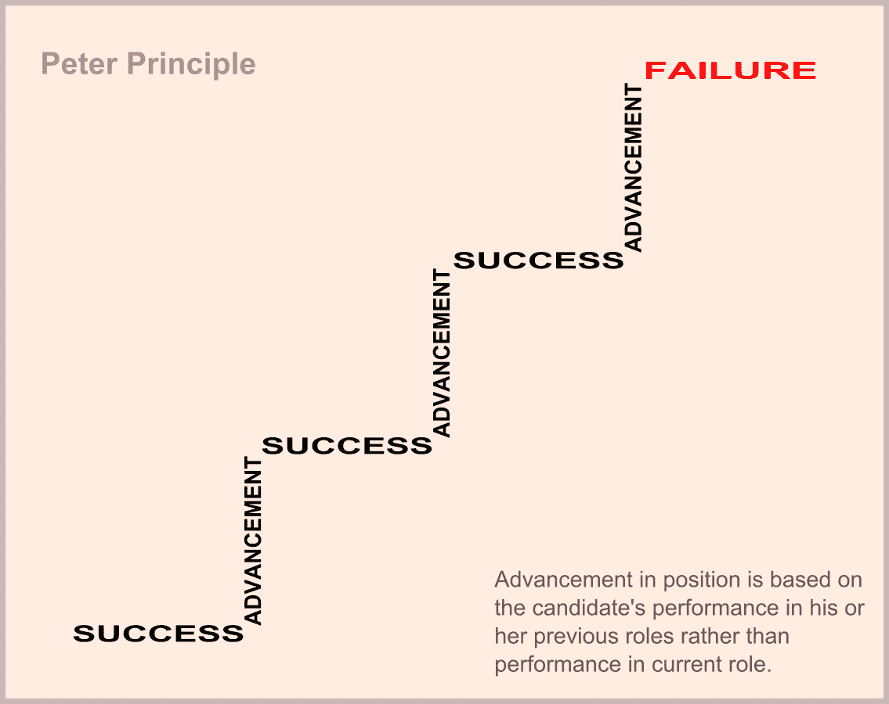

# 软件开发的 15 条基本法则

> 原文：<http://www.exceptionnotfound.net/fundamental-laws-of-software-development/?utm_source=wanqu.co&utm_campaign=Wanqu+Daily&utm_medium=website>

(也就是如何在下一次团队会议上显得聪明)

### 奥卡姆剃刀

这句广为人知的格言可以追溯到 14 世纪一位名叫奥卡姆的威廉的哲学家和修士。[奥卡姆剃刀](https://en.wikipedia.org/wiki/Occam%27s_razor)通常被表述为:

> "在相互竞争的假设中，应该选择假设最少的一个."

毫不奇怪，我们之所以能想起 600 多年前的一句格言，完全是因为它非常管用。奥卡姆剃刀是如此的基本，如此的根本，以至于当我们在两个相互竞争的理论之间做出决定时，它应该是我们首先想到的。我甚至认为在绝大多数情况下，越简单越好。

### 汉隆剃刀

有时候我觉得用户是在故意激怒我。他们按下了他们不该按的按钮，发现了他们不该看到的缺陷(因为他们对我来说不是)，通常会让我的生活变得更加艰难。

然而，我试图记住，人们所做的绝大多数看似恶意的行为并不是故意的。相反，这是因为他们不知道任何更好的。这是一句被称为[汉隆剃刀](https://en.wikipedia.org/wiki/Hanlon%27s_razor)的格言的核心，它说:

> "永远不要把可以用愚蠢来充分解释的事情归咎于恶意."

不要假设人们是恶意的；假设他们无知，然后[帮助他们克服无知](https://www.exceptionnotfound.net/we-dont-have-enough-teachers-of-technology/)。大多数人想学习，而不是为了好玩而变得刻薄。

### 帕累托原则

软件开发的最后一个基本法则是帕累托法则。罗马尼亚裔美国工程师约瑟夫·M·巨然用意大利经济学家和思想家 T2·维尔弗雷多·帕累托提出的一个想法命名了这句格言。[帕累托原则](https://en.wikipedia.org/wiki/Pareto_principle)通常被表述为:

> " 80%的结果源于 20%的原因."

你有没有遇到过这样的情况，你的应用程序目前有数百个错误，但是当你追踪其中一个问题时，大量的错误就出现并消失了？如果你经历过(你很可能经历过)，那么你已经体验到了帕累托原则的作用。我们看到的许多问题，无论是编码、与客户打交道，还是只是过我们的生活，都有一小部分共同的根本问题，如果得到解决或缓解，可以导致我们看到的大多数或所有问题消失。

简而言之，一次解决许多问题的最快方法是找到并修复它们的共同根源。

### 邓宁-克鲁格效应

研究人员大卫·邓宁和贾斯汀·克鲁格在 1999 年进行了一项实验，观察到一种被称为[邓宁-克鲁格效应](https://en.wikipedia.org/wiki/Dunning%E2%80%93Kruger_effect)的现象:

> "没有技能的人往往会错误地评估自己的能力，认为自己比实际能力强得多。"

由此而来的是[一种偏见](https://en.wikipedia.org/wiki/Illusory_superiority)，在这种偏见中，不擅长自己工作的人认为他们*擅长这份工作*，但却没有足够的技能认识到他们*不是*。在这个列表中的所有定律中，邓宁-克鲁格效应可能是最强大的，如果没有其他原因，只因为它已经被一个现实生活中的研究小组在正式场合积极研究过。

### 莱纳斯定律

作者兼开发者埃里克·s·雷蒙德(Eric S. Raymond)开发了这条定律，并以 T2 的名字莱纳斯·托沃兹(Linus Torvalds)命名。莱纳斯定律指出:

> “给足眼球，所有的 bug 都是浅的。”

换句话说，找不到问题，就找别人帮忙。这就是为什么像[结对编程](https://www.exceptionnotfound.net/how-my-5-year-old-taught-me-the-value-of-pair-programming/)这样的概念在某些情况下工作得很好；毕竟，[的 bug 更多时候是在*你的*代码](https://www.exceptionnotfound.net/the-bug-is-in-your-code/)里。

### 稳健原则(又名波斯特定律)

软件开发中的一个基本思想，特别是像 API 设计这样的领域，可以用[健壮性原则](https://en.wikipedia.org/wiki/Robustness_principle)来简明地表达:

> "做自己的事要保守，接受别人的东西要开明。"

这个原则也被称为波斯特定律，是互联网先驱乔恩·波斯特(Jon Postel)写的，他最初把它作为 T2 RFC 760(T3)的一部分写了下来。值得记住的是，如果没有别的原因，仅仅是一个温和的提醒，通常[最好的代码就是根本没有代码](https://www.exceptionnotfound.net/the-best-code-i-have-ever-written/)。

### 伊格尔森定律

曾经离开一个项目很长时间，然后回到项目中，想知道“哪个白痴写了这些垃圾？”却发现那个白痴是你。

伊格尔森定律非常准确地描述了这种情况:

> “任何你自己的代码，如果你已经有六个月或者更长时间没有看了，那也可能是别人写的。”

记住，下次当你重新加入一个你已经离开数月的项目时。代码[不再是你的代码](https://www.exceptionnotfound.net/you-are-not-your-code/)；你现在要改进的是别人的。

### 彼得原则

加拿大教育家[劳伦斯·J·彼得](https://en.wikipedia.org/wiki/Laurence_J._Peter)提出的[彼得原则](https://en.wikipedia.org/wiki/Peter_principle)是适用于管理者(任何领域，不仅仅是软件)的基本法则之一:

> “对职位候选人的选择是基于候选人在当前角色中的表现，而不是与预期角色相关的能力。”

彼得原则经常被讽刺地简化为“管理者上升到他们无能的水平。”这个原理的思想看起来是这样的:

彼得原则揭示的问题是，员工倾向于根据他们目前的表现得到评估，他们的上司认为这些员工也会擅长不同的角色，即使他们目前的角色和他们想要扮演的角色可能不一样，甚至不相似。最终，这种提升会让不合格的候选人身居高位，在特别糟糕的情况下，你可能会在一个组织层级的每一级都遇到[头发尖尖的老板](https://en.wikipedia.org/wiki/Pointy-haired_Boss)。

### 呆伯特原理

说到头发尖尖的老板，漫画家斯科特·亚当斯(他出版了漫画《T2》和《呆伯特》(T3)，提出了彼得原理的一个负面变体，他将其命名为[呆伯特原理](https://en.wikipedia.org/wiki/Dilbert_principle)。彼得原理假设被提升的员工事实上能够胜任他们目前的职位；这也是他们当初被提拔的原因。相比之下，呆伯特原则认为最没有能力的人会得到最快的提升。呆伯特原理通常是这样表述的:

> “不称职的工人将被提升到比称职的工人更高的管理职位，从而使他们脱离实际工作，并将他们所能造成的损害降至最低。”

这可以用另一种方式表达:“公司不愿解雇员工，但也不想让他们伤害自己的业务，所以公司提拔不称职的员工到他们伤害最小的地方:管理层。”

### 霍夫施塔特定律

有没有注意到做一件事总是比你想象的要花更长的时间？道格拉斯·霍夫施塔特(Douglas Hofstadter)也是如此，他写了一本关于认知科学和自我参照的开创性著作，名为《T2·哥德尔、埃舍尔、巴赫:永恒的金色辫子》(T3)。在那本书里，他提出了霍夫施塔特定律:

> "它总是比你想象的要长，即使你考虑到霍夫施塔特定律."

*永远*是关键词:没有什么事情会按计划进行，所以你最好在你的估计中投入额外的时间来弥补一些*会*出错的事情，因为它总是会出错。

### 90-90 法则

因为总会出错，也因为众所周知人们不善于估计自己的技能水平，20 世纪 80 年代贝尔实验室的工程师汤姆·卡吉尔提出了一些最终被称为 90-90 法则的东西:

> “前 90%的代码占用了前 90%的开发时间。剩下的 10%代码占用了另外 90%的开发时间。”

也许这解释了为什么如此多的软件项目最终超出预算并且缺少功能。

### 帕金森定律

英国海军历史学家 C. N .帕金森提出了可能是应用于评估艺术的最敏锐的观察。他开玩笑地提出了一句格言，叫做[帕金森定律](https://en.wikipedia.org/wiki/Parkinson%27s_law)，最初理解为:

> "工作不断扩大，以填补完成工作的时间."

下次你做估算时要记住这一点。

### 塞尔定律

经济学家兼教授 Charles Issawi 提出了一个被称为 T2 塞尔定律的想法，该定律以哥伦比亚大学的一位教授命名。伊萨维对这条定律的表述是这样的:

> "在任何争论中，感情的强烈程度与利害攸关的问题的价值成反比。"

简而言之，事情越不重要，人们就越会激烈地争论。

### 琐碎的帕金森定律(又名自行车脱落)

塞尔定律直接延伸到另一个适用于会议的定律，在这里我们再次遇到 C.N .帕金森的观点。帕金森[琐碎定律](https://en.wikipedia.org/wiki/Law_of_triviality)指出:

> "花在任何议程项目上的时间将与所涉及的金额成反比。"

帕金森想象了一种情况，一个委员会的人被指派设计一个核反应堆。所述委员会然后花费不成比例的时间来设计反应堆的自行车棚，因为任何普通人都将有足够的生活经验来理解自行车棚应该是什么样子。显然，反应堆的“核心”功能更为重要，但它们是如此复杂，以至于没有一个普通人能完全理解它们。因此，时间(和观点)花在每个人都能理解的想法上，但这些想法显然更琐碎。

### 议论文理解规律

最后一条定律是我完全虚构的，我用它来简化塞尔定律和琐碎的帕金森定律。我称之为议论文理解法则:

> “人们对某件事了解得越多，就越愿意争论，而且争论得越起劲。”

### 摘要

你会注意到上面的许多定律并不直接适用于软件，这是有意的。事实仍然是，软件是为人们使用和交互而构建的，所以这些法律中的许多都与处理*人*而不是代码有关。

没有一句精辟的名言可以取代你每天通过写代码、与用户互动而获得的经验，一般来说[每天都会变得更好](https://www.exceptionnotfound.net/i-dont-care-if-i-suck-as-long-as-im-learning/)。尽管如此，记住这 15 条软件开发法则，你可能会成为一名更好的开发人员。或者至少是一个更有知识的人，真的，这不是一回事吗？

我是否错过了你认为对创建软件过程至关重要的任何法律，或者围绕所述过程进行的任何活动(例如评估、会议等)。)?分享在评论里！

编码快乐！