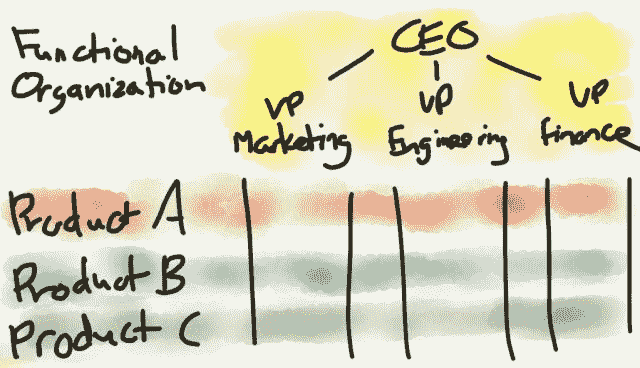

# 苹果的组织十字路口——本·汤普森的战略

> 原文：<https://stratechery.com/2016/apples-organizational-crossroads/?utm_source=wanqu.co&utm_campaign=Wanqu+Daily&utm_medium=website>

苹果是独一无二的，我的意思是客观的。

暂时忘记产品，理性的人可能不同意这一点。抛开财务结果不谈，这肯定是史无前例的。忽略你非常熟悉的人:像乔尼·伊夫、杰夫·威廉姆斯或菲尔·席勒这样的人，以及他们下面的许多才华横溢的员工。更确切地说，苹果公司的组织结构——所有员工齐心协力创造出能带来非凡成果的产品的方式——与几乎所有其他大公司截然不同。

#### 单一的组织形式

苹果采用的是众所周知的“单一组织形式”——简称 U 型——也就是众所周知的“职能组织”。大体而言，U 型组织是围绕专业知识而非产品组织的:在苹果公司，这意味着设计是一个团队(在 Ive 领导下)，产品营销是另一个团队(在 Schiller 领导下)，运营是第三个团队(在 Williams 领导下，他也是首席运营官)。苹果高管团队成员代表的其他专业领域包括软件工程(克雷格·费德瑞吉)、硬件工程(丹·里乔)和硬件技术(张诗钟·斯鲁吉)。

这份名单最引人注目的地方在于它包含了*而非*的词汇:T2、iPhone、T4、iPad、Mac、或手表。相反，苹果的产品以一种加强不同团队之间协调的方式贯穿整个组织:

[T2】](https://stratechery.com/2013/why-microsofts-reorganization-is-a-bad-idea/)

在这一点上，这种方法的好处是众所周知的，并且体现在名称本身中:“单一”是“集成”的同义词。首席执行官蒂姆·库克一再称赞苹果创造集成产品的能力，这些产品提供了卓越的用户体验，前首席执行官史蒂夫·乔布斯在 T2 的最后一个主题演讲中明确表示，要做到这一点，需要的不仅仅是一厢情愿:

> [ipad]是后 PC 时代的设备，需要比 PC 更直观、更易用，软件、硬件和应用程序需要以比 PC 更无缝的方式交织在一起。我们认为，我们不仅在芯片方面拥有合适的架构，**而且在我们的组织中，**也拥有合适的架构来构建这类产品。

这就是为什么乔布斯回到苹果后做的第一件事，甚至在他著名的削减产品线之前，就是从功能上重组公司；然而，也许这种区别是没有意义的——一个功能性的组织和一个简化的产品线是相辅相成的。

#### 为什么发明了多分部形式

早在 2013 年，当史蒂夫·鲍尔默(Steve Ballmer)重组微软，使其更具功能性时，我在一篇名为[为什么微软的重组是个坏主意](https://stratechery.com/2013/why-microsofts-reorganization-is-a-bad-idea/)的文章中批评了这一举动； [1](#fn1-2112 "If you’re interested in this topic you can also read the followup: <a href="https://stratechery.com/2013/the-uncanny-valley-of-a-functional-organization/">The Uncanny Valley of a Functional Organization</a> ") 作为介绍，我描述了“多部门形式”——M 形式，或部门组织——是如何产生的:

> 著名的化学公司杜邦实际上是建立在火药基础上的。杜邦公司成立于 19 世纪初，直到 20 世纪初，皮埃尔·杜邦对公司进行了现代化改造，围绕销售和制造两大职能组建了公司。这种结构为杜邦公司提供了很好的服务，尤其是在第一次世界大战期间，当时为了应对巨大的需求，杜邦公司垂直整合了其供应链，并成长为世界上最大的公司之一。
> 
> 战后，杜邦公司需要多元化经营，涂料是他们选择关注的领域，涂料涉及一种类似火药的化合物。然而，尽管杜邦可能是美国经营最专业的公司，亏损却在飙升。最终，销售和制造之间的脱节被确定为根本原因，解决办法是围绕两个独立的火药和涂料部门建立一个新的组织。

杜邦公司更深层次的细节非常有趣，值得一探究竟:简而言之，杜邦公司开始制造涂料的全部原因是制造过程与火药非常相似；问题是火药是按吨位卖给大买家(比如军队)，而颜料是卖给商店里的个人客户。产品可能非常相似，但商业模式却完全不同。最终结果是，杜邦公司使用的销售和营销组织是围绕销售给大客户，让他们的油漆进入零售商店，这是非常低效的；杜邦卖出的油漆越多，他们损失的钱就越多。

正如摘录中所指出的，解决方案是围绕火药和涂料组织的部门，每个部门都有自己的销售和营销团队，自己的制造主管，以及自己的准首席执行官，他们有自己的盈亏责任。正如你可能会怀疑的那样，这是一个巨大的成功，几乎每个大型组织都在复制它。

当然，苹果除外。

#### 苹果服务公司

今年 1 月，在 Q1 举行的 2016 年收益电话会议上，苹果首席执行官蒂姆·库克和首席财务官卢卡·马埃斯特里事先准备好的言论出现了令人惊讶的转变:他们花了大量时间来证明苹果是一家服务公司。库克表示:

> 特别是在经济不确定的时期，我们认为重要的是要认识到苹果收入的很大一部分会随着时间的推移而重现…我们收入中越来越大的一部分是由我们现有的安装基础直接驱动的。因为我们的客户非常满意和投入，他们在设备上花费大量时间，购买应用程序、内容和其他服务。

马埃斯特里说得更中肯——这是他说的第一句话:

> 每个季度，我们都会报告我们服务类别的结果，包括来自 iTunes、App Store、AppleCare、iCloud、Apple Pay、许可和其他一些项目的收入。今天，我们将重点介绍这一类别增长的主要驱动因素，我们已在补充材料的第三页进行了总结。

补充材料在这里是，事实上它的存在强调了苹果对这个故事的重视程度。坦率地说，他们有理由这样做:虽然 iPhone 在[仍然处于非常强势的地位](https://stratechery.com/2015/stop-doubting-the-iphone-the-macintosh-company-2/)，我[相信它将在下一财年](https://stratechery.com/2016/twitter-follow-up-apples-good-earnings-apple-is-not-a-services-company/)恢复增长，但这种增长将比迄今为止更加不温不火:所有“容易摘到的果实”——新市场、新运营商、新屏幕尺寸——都已经消失了，苹果的真正竞争对手是他们的客户已经拥有的仍然非常好的 iPhone。为此，从这些现有客户身上赚取越来越多的钱是苹果增长的自然下一步。

苹果的问题是，虽然 iPhones 可能是火药——增长肯定是爆炸性的！—服务是油漆。而且，正如杜邦公司认识到拥有相似的制造流程并不能带来相似的商业模式一样，在我看来，证据非常清楚，拥有 iPhone 客户并不意味着苹果公司一定能够为这些客户提供令人信服的服务。至少现在还没有。

#### 设备和服务的区别

我在这篇文章的开头建议，要客观地声称苹果是独一无二的，你需要超越产品来思考，但事实上，我确实相信苹果的产品——无论如何是它们的设备——是卓越的，特别是如果你重视工业设计的细节、构建质量以及看起来很简单但很难做好的小 UI 细节，比如滚动和响应能力。 [2](#fn2-2112 "If you disagree, that’s ok! I also believe that if you value things like flexibility and integration with services — which I’m getting to — that Android phones (which I own and use regularly) are better; furthermore, I am well aware of and have written extensively about what I and many others perceive as Apple’s declining software quality. Please bear with me here.") 坦率地说，苹果擅长这种东西并不奇怪，原因如上所述:该公司的一切都是为了生产集成设备，不会为了模块化而牺牲完美。

问题是，创造这些珠宝般设备的一切都与擅长服务背道而驰:

*   You only get one shot to get a device right, so all of Apple’s internal rhythms and processes are organized around delivering as perfect a product as possible at a specific moment in time.

    另一方面，服务受制于从带宽到设备能力到黑客攻击企图到数据完整性到停电等实际上无限多的变量，这种情况不胜枚举，永远不可能完美；理想的走向市场是发布一个最小可行的产品，该产品被设计用于弹性，然后一周更新多次，如果不是一天更新多次的话。节奏和过程与建造一个伟大的设备所需要的完全相反。

*   正如苹果很高兴告诉你的，设备上的卓越体验来自于集成:软件可以根据硬件量身定制，一直到组件级别；这也是苹果与 iOS 携手设计自己的片上系统的原因。然而，这种程度的集成只有在有一个静态端点时才是可能的:面向公众销售的设备。

    然而，对于有机地、迭代地开发的服务来说，集成的方法是行不通的:你不能一天多次从头开始构建一切。相反，一套有效的服务是极端模块化的:不同的功能像乐高积木一样组合在一起，以提供不同类型的体验，并且这些功能中的每一项都可以在不中断最终产品的情况下进行迭代。

*   智能手机是人们生活中如此重要的一部分，再加上实物可以带来额外的消费者利益，如地位，这使得苹果能够以巨大的利润销售每部 iPhone。然而，并不是每个人都那么看重智能手机，或者有支付意愿，这意味着苹果不得不接受不服务整个市场；毕竟，生产一部 iPhone 需要花费一些钱，这些钱必须在购买价格中得到补偿。

    然而，服务业有着非常不同的商业模式。首先，几乎没有证据表明消费者愿意为服务支付超过名义金额的费用(如果是这样的话！)，这意味着最赚钱的服务通过量来赚钱。第二，服务在边际基础上实际上是免费的；实际成本是固定的，这意味着服务行业有一个强大的经济使命去接触尽可能多的人。

这些差异触及了苹果在服务方面举步维艰的最根本原因:不是该公司不称职，而是该公司很聪明——在制造设备方面很聪明，这需要完全不同的业务结构和激励机制。

#### 苹果的服务问题

上周晚些时候[有消息称](http://www.bloomberg.com/news/articles/2016-04-14/apple-said-to-pursue-new-search-features-for-crowded-app-store)苹果正在考虑在应用商店中添加[搜索广告](https://stratechery.com/2016/app-store-search-ads-amazon-splits-up-prime-the-kindle-oasis/)。我昨天详细解释了为什么我认为[这对于行业来说没有支持者或反对者认为的那么重要](https://stratechery.com/2016/app-store-search-ads-amazon-splits-up-prime-the-kindle-oasis/) *，但是我确实认为这对于苹果公司来说是一件非常重要的事情:也就是说，该公司对于发展其服务业务是认真的。*

然而，问题是有多严重；App Store 搜索广告将是一件相对容易实现的事情，正如 App Store 本身在许多方面是 iPhone 的一个明显但仍具有革命性的补充。然而，值得注意的是，App Store 的运营状况普遍很差:据我估计，苹果并没有从 App Store 中获得应有的战略价值。iPhone 和 iPad 应该是越来越复杂和专有的高性能应用的家园，这使得选择另一个平台的想法变得不可思议，但可悲的是，由于应用商店政策，这种应用没有商业模式[。](https://stratechery.com/2015/from-products-to-platforms/)

苹果音乐的情况更糟:该产品的成功很大程度上是因为它与苹果硬件的搭配；然而，如果这项服务保持与上述硬件相同的易用性、装修和盈利标准，库比蒂诺将会出现恐慌。

与此同时，云服务仍然不如苹果的竞争对手可靠，集成也是苹果的强项！——从安全角度来看，苹果的软件往好里说是令人恼火的根源，往坏里说是非常令人担忧的:像不断被提示输入密码这样的小事不仅令人讨厌，而且还具有腐蚀性[对于分享你生活的钥匙，什么是健康的怀疑态度](https://stratechery.com/2015/from-products-to-platforms/)。

所有这些案例中的问题是，苹果根本没有在这些领域建立卓越的组织:

*   苹果重视集成和完美，这导致了太多的服务被过度构建，从而更难在其他地方重复使用
*   服务版本(和软件)不是迭代的，而是与硬件版本相关联的
*   苹果对保密的关注意味着许多团队最终会从头开始构建新的服务，而不是重用组件

所有这些案例中的根本问题是缺乏问责:只要 iPhone 保持资金流动和被俘虏的顾客到来，苹果的服务是否尽善尽美就真的无关紧要。人们仍然会使用 App Store、Apple Music 和 iCloud，只是因为 iPhone 太好了。

然而，他们不会使用 Apple Pay:苹果单一愿景的延伸(也是我对 App Store 的批评背后的问题的另一种表现)是有效合作的斗争，特别是在由激励而非幕后交易驱动的巨大生态系统中。Apple Pay 可能是巨大价值的基础，但[苹果并没有做让它起步的繁重工作](https://stratechery.com/2015/chase-pay-and-the-payments-stack-apple-pay-and-opportunity-cost-apply-aggregation-theory/)(iMessage 也适用于此)。

你可以在 HomeKit 或 Siri 上看到同样的模式:亚马逊 Echo 正在通过一个简单的 API 悄悄接管家庭自动化市场，该 API 易于集成且易于理解；与此同时，苹果公司尚未宣布 Siri API，尽管它正在努力提供自然语言交互，而这根本不是该公司所擅长的。

当你考虑 Apple Watch 时，这两个例子都更加令人担忧:当手表成为与你的环境互动的关键时，它将真正实现其价值[；然而，要实现这一点，就意味着要找到好的而非完美的服务、合作伙伴和 API。](https://stratechery.com/2015/apple-make-wearable-market/)

#### 苹果如何在服务方面表现出色

所有这些问题的解决方案——也是苹果实际实现其服务愿景的关键——是从问责制问题开始，并逆向工作:苹果的服务需要从公司的核心设备中分离出来，这些服务的经理需要通过金钱和美分承担责任。

最后一点对苹果来说肯定是一个诅咒:众所周知，该公司只有一个 P&L[4](#fn4-2112 "Profit and loss, the metric on which divisional managers are measured")——它向华尔街提供的数字——我绝对同意这是苹果成功的基础。取消 iPod 的高级副总裁职位，使得苹果更容易淘汰 iPhone 的、 [5](#fn5-2112 "Tony Fadell left (with, reportedly, not much effort to keep him) after losing out to Scott Forstall’s vision of the iPhone, and it is telling that Apple has not had a product-centric executive member since") 以及苹果没有高级副总裁的事实，使得苹果推出 iPad 更容易。苹果展现了非凡的目标一致性，这只有在统一的组织中才有可能，这也是为什么恢复这种结构是乔布斯回归后的第一步。

但同样，乔布斯的下一步是削减产品线，这不仅仅是出于专注和客户困惑的原因:事实是，单一的组织无法适应不同的商业模式，如果苹果真的认真对待服务——相对便宜但功能齐全的 iPhone SE 的存在表明他们是认真的——他们需要以杜邦为榜样。

苹果不会修复现有的服务，也不会兑现其硬件可能实现的服务承诺，除非围绕这些服务建立一种新的组织，这种组织具有与苹果设备团队完全不同的结构、不同的激励和不同的节奏。你做伟大的产品不是因为你想做伟大的产品；你通过创造生产伟大产品的条件来制造伟大的产品。

#### 苹果的杜邦时刻

老实说，我不确定苹果是否有这种能力。事实上，杜邦几乎没有。听听理查德·泰德洛的《否认》一书中的这些段落，看看它们是否耳熟:

> 艾琳·渡厄·庞特不喜欢这个提议(按部门组织公司)，尽管事实上这个提议来自他的高层——都是经验丰富的高管。它违反了“专业化原则”，而这一原则对杜邦来说非常有用。Irénée 仍然坚持功能而非产品专业化的理念…
> 
> 中层管理人员——最接近问题并寻求实际解决方案的人——也有同样的感受。高层管理人员——他们创造了现代的杜邦公司，并目睹这一创造发展到难以想象的财富和规模——感受到了另一种…

四年前，库克在高盛的投资会议上说:

> 它们不是我们分开经营(利润和损失)的东西，因为我们不这样做——我们不相信这一点。我们在最高层管理公司，只有一个(盈亏)，不要担心 iCloud 团队赚钱，Siri 团队赚钱。我们希望拥有出色的客户体验，我们认为在这种水平上衡量所有这些事情永远不会实现这样的事情…
> 
> 苹果是一家独一无二的公司，独一无二的文化，你无法复制。我不会目睹或允许它慢慢消失，因为我对它深信不疑。多年来，史蒂夫一直在拷问我们，公司应该围绕伟大的产品，我们应该专注于少数几件事情。而不是试图做太多，以至于我们什么都没做好。

与许多人不同，我并不介意苹果销售多种版本的 iPhone、iPads 等。适应变化仅仅是一个金钱和经验的问题，这是苹果绝对拥有的。然而，服务是一个完全不同的问题，需要完全不同的组织。如果苹果对服务是认真的，那么库克关于苹果将保持“极度专注”的承诺就是一句空话，对单一类型组织结构的坚持从提高苹果的质量转变为积极贬低。 [6](#fn6-2112 "One important thing to note: Apple’s Retail division <em>is</em> a separate division with its own organizational structure and own P&L; Ron Johnson knew that was necessary to make the division work")

泰德洛总结道:

> 在一家大公司里实现变革是非常困难的。据说，领导力包括用最小的问题创造最大的积极变化。按照这个标准，杜邦做得很好，但它本可以做得更好。只有当该公司处于灾难的边缘，处于其历史上最糟糕的一年所产生的危机之中时，它才能够接受这样一个事实，即昨天的结构是对明天战略的障碍，而不是一条通向明天战略的道路。

有些东西必须放弃:要么是什么让苹果成为苹果，要么是苹果新发现的野心；衡量库克领导力的标准将是他需要多长时间才能不再骑墙观望。

### *相关*