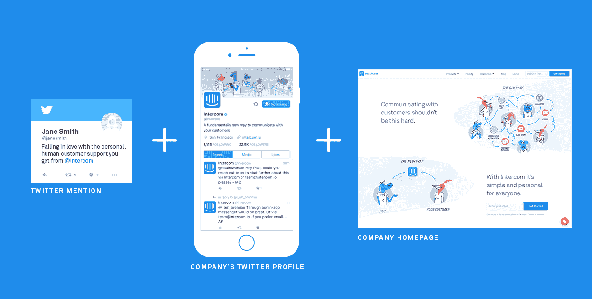
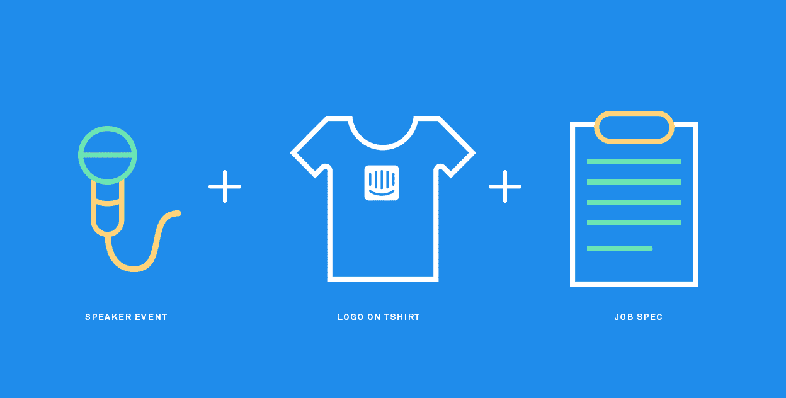
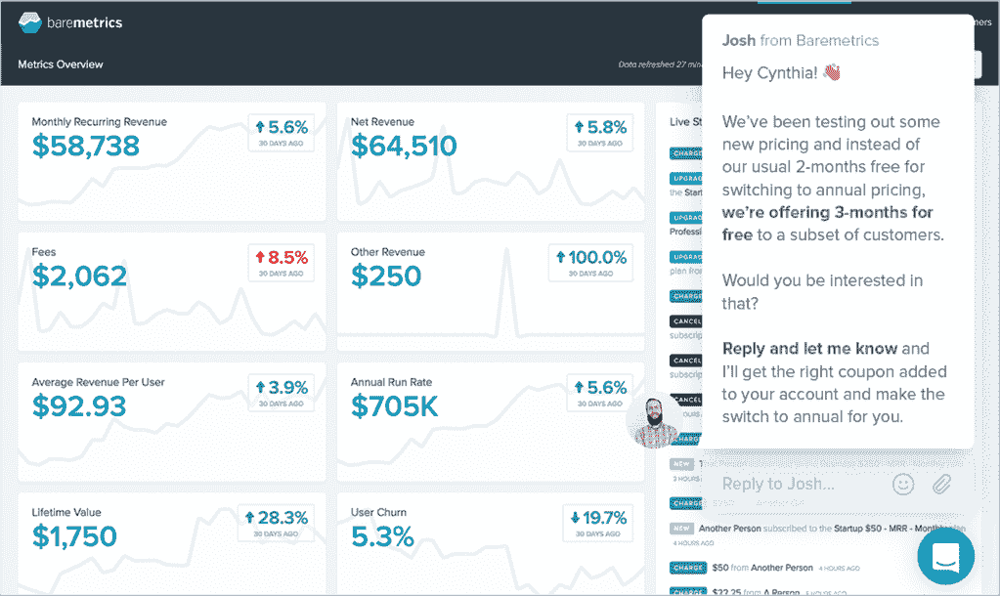
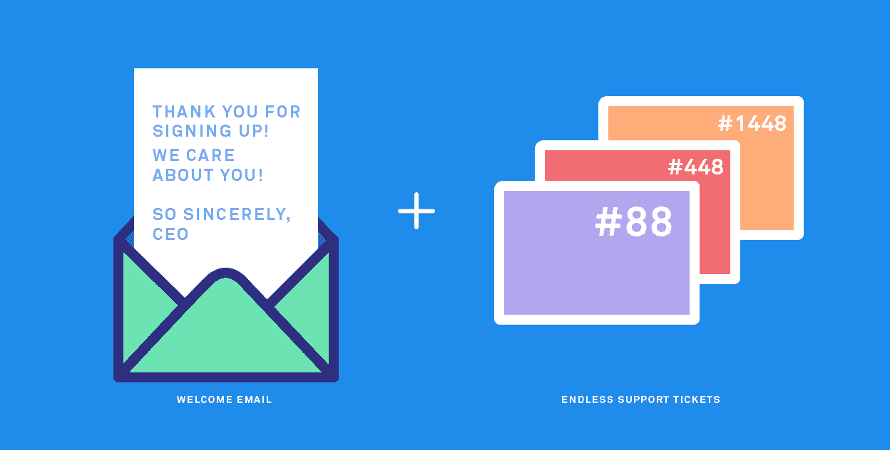

# 你的品牌是一种体验，而不是一个标识-内部对讲机

> 原文：<https://blog.intercom.io/brand-not-logo/?utm_source=wanqu.co&utm_campaign=Wanqu+Daily&utm_medium=website>

太多时候，一个新的标志被视为解决公司实际问题的解药，如流失或停滞。

标识很重要，但是在我们这个超级互联的世界里，一个标识对消费者行为的影响充其量也只是表面的。那么，为什么我们仍然会遇到这么多“新的和改进的标志”的博客帖子呢？

考虑一下你最近见过的所有公司——这些公司有没有真正改变你对这家公司的看法？

优步的“原子和比特”标志应该反映优步的国际扩张和运输“人、食物、货物，以及更多潜在的东西”的愿景这就是你对优步的看法吗？这就是你不选择 Lyft 的原因吗？

谷歌的彩色图标应该代表众多设备和人们与谷歌联系的方式。这就是谷歌对你的意义吗？

Airbnb 的标志应该包含归属感的价值观。这是你想到“Airbnb”时想到的第一个词吗？

毫无疑问，标识很重要。它们几乎可以印在任何东西上，通常是你公司最受认可的元素。这是首席执行官在你的博客上描绘公司价值观和使命宣言的机会。然而，他们的所有品质都可能在首席执行官的性别歧视推特上消失，这种推特会像病毒一样传播，或者让医生困惑，让客户陷入死胡同。相反，一个好的支持体验通常可以原谅一个弱的，执行不好的徽标。

在[《品牌差距》](http://www.amazon.com/The-Brand-Gap-Distance-Business/dp/0321348109/ref=pd_bxgy_14_2?ie=UTF8&refRID=1SZRZSW940TJ4DGTMRX3)中，马蒂·纽梅尔写道，一个品牌“不是你所说的那样，而是他们所说的那样。”换句话说，你的品牌只取决于个人对它的看法。这完全取决于一个人与你的公司独特的经验组合。

一个人的经历可能是这样的:

有时候是这样的:

对于对讲机，它甚至可能是客户应用中的我们的应用:

但希望不是这个！

关键是，你的品牌永远不是你所说的那样，而是其他人所说的那样。他们说的话千差万别，因为这完全取决于他们独特的经验组合，或与你公司的接触点。很少，这个品牌定义包括一个标志。

一个强大的品牌能让你度过好时光和坏时光。要创建一个品牌，你需要超越你的标识和视觉形象，将你的品牌重新定义为人们可以与你的公司互动的每一个地方。

我将以对讲机为例。我们始终努力在我们的声音和语气、我们的产品以及我们的行为中反映我们使互联网业务个性化的使命。例如，我们在我们的产品路线图中反映了这一点，有时我们[构建无人问津的功能](https://www.intercom.com/blog/created-video-chat/)，如果我们坚信它们将帮助我们的客户以更个性化的方式交流。

我们的支持和销售团队在与人交谈时会倾听务实、有益的声音，我们会尽量让我们的支持/销售产品无摩擦。当我们大规模经营时，我们试图保持这种个性化的方式；无论是考虑营销电子邮件和[演示](https://www.intercom.com/blog/give-your-customers-best-practices-not-just-faqs/)的[频率，还是我们为第一次](https://www.intercom.com/blog/before-you-send-your-first-message/)[内部交流之旅](https://www.intercom.com/blog/announcing-our-inside-intercom-world-tour/)选择独特的场地。或者我们在产品中使用的[语法](https://www.intercom.com/blog/how-words-build-a-product/)。还是我们宣布[筹款](https://www.intercom.com/press/intercom-raises-50-million)的亲密方式。

随着互联网变得越来越嘈杂，充斥着争夺你的注意力和金钱的公司，真正形成消费者忠诚度的是真实的个人品牌。如果你成功了，其他公司可能会复制你的主页设计，窃取你的代码，撕掉你的产品界面，窃取你的标志，甚至更糟，但是他们永远不会复制你的使命，你的价值观，你的动力，以及由此衍生的一切。