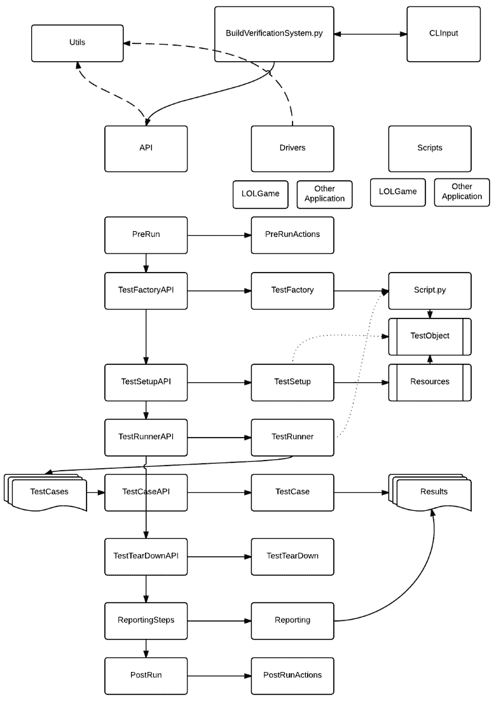

# 英雄联盟| Riot Games 技术的自动化测试

> 原文：<https://engineering.riotgames.com/news/automated-testing-league-legends?utm_source=wanqu.co&utm_campaign=Wanqu+Daily&utm_medium=website>

大家好，我是吉姆·阿诺多因·梅里尔，我为《英雄联盟》的测试自动化工作，特别关注游戏中的体验。我目前是构建验证系统开发(BVS 开发)团队的技术队长。在很大程度上，我们的团队为自动化测试构建工具，并帮助团队编写更好的测试。

在过去的几年里，我们一直致力于让我们的测试系统和基础设施达到标准，以提高开发人员的效率，减少我们发布的 bug 数量。我们现在每天运行大约 100，000 个测试案例，这个数量的自动化测试有助于更快地向玩家提供内容，并且减少错误。我想分享一点我们所做的事情，并希望开始一场关于游戏领域自动化测试的对话。

我们为什么关心？

*联盟*变化真的*，真的*快。平均来说，我们每天都会看到超过 100 个代码和内容变更被签入到源代码控制中，并且为所有这些变更提供足够的覆盖率是一个挑战。对于每两周一次的新补丁，我们快速检测缺陷是至关重要的。在发布过程后期发现的错误会导致延迟，导致重新部署，或者需要临时禁用 champ 对玩家来说都是糟糕的经历。自动化解放了我们的质量分析师，让他们专注于更有创造性的测试和上游缺陷预防，在这方面他们可以提供更多的价值。

自动化也为测试结果提供了更快的周转。对于人类来说，对每一个新的代码或内容提交进行全面的测试是不可行的，即使可行，也需要一大群测试人员足够快地返回结果。

我们的测试系统在[<u>【CI】</u>](https://en.wikipedia.org/wiki/Continuous_integration)上运行，并在报到后一个小时内返回报告。这意味着开发人员在合理的时间框架内收到结果，这有助于减少上下文切换；事实上，在自动化中发现的错误得到解决的速度是一般错误的八倍。更好的是，如果我们需要增加测试的吞吐量，我们可以简单地向我们的测试场添加一些执行器。

**构建验证系统**

富有想象力的构建验证系统(BVS)是我们的游戏客户端和服务器的测试框架。它负责获取要测试的工件，将它们部署到测试机器上，启动和管理测试中的系统，执行测试，并报告它们的结果。测试和工具是用 Python 编写的，我们编写了大部分 BVS 代码，将测试编写人员与收集所需资源的复杂性隔离开来。因此，测试类中的一些参数可以指定运行什么地图，包括多少客户端，以及游戏中应该有哪些冠军。

测试利用暴露在客户端和服务器上的远程过程调用(RPC)端点来发布命令和监控游戏状态。在很大程度上，测试由一组相当线性的指令和查询组成——现有的测试涵盖了从冠军能力到视觉规则到杀死一个小兵的预期奖励的一切。我们早期的一些测试明显不那么线性，但是这使得不太懂技术的开发人员使用系统更加困难。

因为配置测试工作区的所有工作都是单独完成的，所以无论是在本地工作区还是在我们的测试场中运行，测试本身看起来都应该是一样的。这使得在对游戏进行修改时，在本地运行测试变得很容易。

例如，我们对狗毛的新 W 造成的伤害的测试是这样的:

```
"""
Name: BioArcaneBarrage_DamageDealt
Description: Verifies the damage modifications from Bio-Arcane Barrage
Verifies:
    - KogMaw deals less damage to non-lane minions
    - KogMaw deals percentile magic damage
    - KogMaw deals normal damage to lane minions
"""

from KogMawAbilityTest import KogMawAbilityTest
from Drivers.LOLGame.LOLGameUtils import Enumerations
import KogMawStats

class BioArcaneBarrage_DamageDealt(KogMawAbilityTest):
    def __init__(self, championAbilities):
        super(BioArcaneBarrage_DamageDealt, self).__init__(championAbilities)
        self.ability = 'Bio-Arcane Barrage'
        self.slot = KogMawStats.W_SLOT
        self.details = 'Kog\'Maw deals reduced base-damage to non-minions with additional percentile damage'

        self.playerLocation = Enumerations.SRULocations.MID_LANE
        self.enemyAnnieLocation = Enumerations.SRULocations.MID_LANE.angularOffsetDegrees(45, 200)
        self.enemyMinionLocation = Enumerations.SRULocations.MID_LANE.angularOffsetDegrees(45, 400)

    def setup(self):
        super(BioArcaneBarrage_DamageDealt, self).setup()
        self.enemyAnnie = self.spawnEnemyAnnie(self.enemyAnnieLocation)
        self.enemyMinion = self.spawnEnemyMinion(self.enemyMinionLocation)
        self.teleport(self.player, self.playerLocation)
        self.issueStopCommand(self.player)

    def execute(self):
        self.takeSnapshot('preCast')

        self.castSpellOnTarget(self.player, self.slot, self.player)
        self.champAttackOnce(self.player, self.enemyAnnie)
        self.takeRecentDeathRecapSnap(self.enemyAnnie, "annieRecap")

        self.resetCooldowns(self.player)
        self.castSpellOnTarget(self.player, self.slot, self.player)
        self.champAttackOnce(self.player, self.enemyMinion)
        self.takeSnapshot('minionRecap')

        self.teleport(self.player, Enumerations.SRULocations.ORDER_FOUNTAIN)

    def verify(self):
        # Verify that enemy Annie is taking the correct amount of damage.
        annieAutoDamageEvents = self.getDeathRecapEvents(self.player, "Attack", "annieRecap")
        annieAutoDamage = 0
        for event in annieAutoDamageEvents:
            annieAutoDamage += event.PhysicalDamage

        annieSpellDamageEvents = self.getDeathRecapEvents(self.player, "Spell", "annieRecap", scriptName=KogMawStats.W_MAGIC_DAMAGE_SCRIPT_NAME)

        annieSpellDamage = 0
        for event in annieSpellDamageEvents:
            annieSpellDamage = event.MagicDamage

        AD = self.getStat(self.player, "AttackDamageItem")
        expectedPercentile = (KogMawStats.W_AD_DAMAGE_RATIO * AD)/100
        annieTotalHealth = self.getStat(self.enemyAnnie, "MaxHealth")
        expectedPercentileDamage = self.asPostResistDamage(self.enemyAnnie, expectedPercentile * annieTotalHealth, 'MagicResist', snapshot='preCast')

        self.assertInRange(annieSpellDamage, expectedPercentileDamage, expectedPercentileDamage * .1, "{} magic damage dealt. Expected ~{}".format(annieSpellDamage, expectedPercentileDamage))

        expectedPhysicalDamage = self.asPostResistDamage(self.enemyAnnie, KogMawStats.W_NON_MINION_DAMAGE_RATIO * AD, 'Armor', snapshot='preCast')

        self.assertInRange(annieAutoDamage, expectedPhysicalDamage, expectedPhysicalDamage * .1, "{} physical damage dealt. Expected ~{}".format(annieAutoDamage, expectedPhysicalDamage))

        # Verify that enemy minion is taking the correct amount of damage.
        AD = self.getStat(self.player, "AttackDamageItem")
        minionExpectedPhysicalDamage = self.asPostResistDamage(self.enemyMinion, AD, 'Armor', snapshot='preCast')

        expectedPercentile = (KogMawStats.W_AD_DAMAGE_RATIO * AD)/100
        minionTotalHealth = self.getStat(self.enemyMinion, "MaxHealth")
        minionExpectedMagicDamage = self.asPostResistDamage(self.enemyMinion, expectedPercentile * minionTotalHealth, 'MagicResist', snapshot='preCast')

        expectedDamage = minionExpectedMagicDamage + minionExpectedPhysicalDamage
        actualDamage = self.getDamageTaken(self.enemyMinion, 'preCast', 'minionRecap')

        self.assertInRange(actualDamage, expectedDamage, 1, "{} total physical and magic damage dealt. Expected ~{}".format(annieAutoDamage, expectedDamage))

    def teardown(self):
        self.destroy(self.enemyAnnie)
        self.destroy(self.enemyMinion)
```

科格莫测试套件的第一部分，包括奥术弹幕伤害测试，看起来像这样:

<video controls="controls" id="video201612916496" poster="/sites/default/files/bvs_kogtest.m4v"><source src="/sites/default/files/bvs_kogtest.m4v" type="video/mp4">Your browser doesn't support video.
Please download the file: [video/mp4](/sites/default/files/bvs_kogtest.m4v)</video>

当测试完成一次运行时，它将结果提供给一个单独的报告服务，该服务存储大约六个月前的运行数据。根据给定测试数据的来源，该服务采取不同的操作。测试的本地运行会在执行机器上打开一个详细描述通过和失败情况的网页。然而，在测试场中的运行将为任何发现的问题创建新的 bug 标签，根据结果标记工件，并且如果有任何失败的案例，将向提交者发送电子邮件。测试数据也通过报告服务被聚集和跟踪，允许我们看到测试失败发生的时间，发生的频率，以及从构建通过到现在有多长时间了。

在 Wood 5 中，我们不使用结界，所以我认为这个致命的失败没有问题

为了防止古怪或不可靠的测试，每个人都必须通过一个标准的过程才能被信任。在一个测试已经被代码审查和提交之后，它进入一组被称为 BVSStaging 的测试。在那里，测试必须证明至少一周的稳定性才能被提升。如果试运行中的测试失败了，为了防止混乱，只有测试开发人员会得到通知。

一旦一个测试证明了它的可靠性，它就被提升为两组中的一组。第一组，BVSBlocker，包含指示构建是否值得进一步测试的测试。Blocker 失败的构建不会部署到测试环境中，因为要么游戏无法启动，要么有多个严重的崩溃错误影响游戏。它的对应物 BVSCore 是我们的核心功能测试集，包括对每个冠军能力的测试。

**框架深潜**

BVS 分三层实现:执行器、驱动程序和脚本。执行器实现一个通用的 API 进行功能测试，而驱动程序实现配置和执行测试的具体步骤。最后，脚本实现了测试用例的特定逻辑。目前，我们只有一个正在使用的驱动程序(LOLGame)，但执行器-驱动程序分离意味着未来的项目可以通过实现自己的驱动程序和使用编写 LOLGame 驱动程序时编写的共享实用程序来使用 BVS。



出于某种原因，我不经常被要求提供流程图...

单个组件将它们的必需和可选参数注册为声明的一部分。当在命令行提供参数时，它们被存储为一个字典，组件在初始化过程中使用该字典。早期版本的 BVS 使用了 Python 的标准 argparse 库，但是我们选择放弃 argparse 有两个原因:首先，潜在参数输入的数量变得越来越大，因此很难在系统中进行跟踪；第二，驱动程序需要有特定于驱动程序的参数，这意味着在启动时声明一个解析器是不可行的。

```
class TestFactory(API.TestFactoryAPI):
    requiredArgs = [ArgsObject('driver', 'Driver you wish to use'),
                    ArgsObject('name', 'Name of the test to run')]
    optionalArgs = [ArgsObject('overrideConfig', 'Use a non-standard game.cfg', None),
                    ArgsObject('gameMetadataConfiguration', 'A string identifying which game metadata to use', None),
                    ArgsObject('listener', 'Log listener to use', None),
                    ArgsObject('mutator', 'A string name for mutator to apply to test object', None),
                    ArgsObject('testInfoID', 'Test and metadata this test run is related to', None),
                    ArgsObject('testSubsetNumber', 'The number out of total if test is subsectable', None),
                    ArgsObject('totalSubsetNumber', 'The total numbers of subsets test is split into', None)]
```

驱动程序对象的示例参数

相关的粒度有三个层次:测试集、测试和测试用例。

*   测试集是一组一起运行的测试。例如，前面提到的 BVSBlocker 测试集是一组在 CI 上运行的冒烟测试。测试集目前是通过 JSON 文件向 BVS 描述的，这些文件可以在 VCS 创建，也可以在运行中创建。

*   **测试**是实现一组使用相同基本游戏配置的相似测试用例的独立类。例如，LoadChampsAndSkins 测试运行测试用例，包括加载每个 champion 和皮肤的资产，并确认加载正确发生。

*   测试用例是测试中预期功能的单一单元。例如，LoadChampsAndSkins 测试中的函数 loadChampionAndSkin 是一个测试用例，它被执行数百次以覆盖 champion 和 Skin 的每个组合。上面的整个 Kog'Maw 测试用例是由一个更高层次的测试执行的，这允许更复杂的测试用例比函数有更多的结构。

BVS 中的并行化通常在测试集级别完成，但也可能发生在测试级别。因为 BVS 以 JSON 的形式存储和读取测试集，所以我们在 JSON 中创建子列表，这些子列表既可以由单个执行器串行执行，也可以由我们的测试场并行执行。在 BVS 的早期，这允许我们手动平衡，这比小测试列表的自动并行化更有效。随着正在使用的主要测试集的增长，我们已经切换到一个自动负载平衡器，它生成相同的 JSON 文件，但是现在使用每个测试组件在最近 10 次运行中的平均运行时间。

BVS 的大多数用户实际上只与测试本身进行交互，因为我们尽力确保他们不必考虑驱动程序处理的任何细节。同样，我们公开了一个相当大的标准库，包装了用于与游戏对话的 RPC 端点。我们这样做的部分原因只是为了确保测试不会与 RPC 接口紧密耦合，但我们这样做的主要原因是提供一组标准的行为，以防止草率的测试编写，并确保测试之间的一致性。

特别是，我们在 BVS 的标准测试库中没有暴露任何形式的纯睡眠。早期的测试编写人员大量使用睡眠，这导致了许多脆弱的测试，这些测试基于它们运行的硬件而表现不同。标准库中的所有等待都是有条件的等待，定期轮询游戏，等待满足某个条件。

```
@annotate("Wait until a unit drops the specified buff.",
              arguments=[argument("unitNameOrID", "Unit name (or unique integer unit ID).", (str, int)),
                         argument("buff", "Buff you want to drop.", str),
                         argument("timeout", "How long to wait.", float, default=STANDARD_TIMEOUT),
                         argument("interval", "How often to check for a change.", float, default=SERVER_TICK),
                         argument('speedUp', 'Whether to speed the game up.', bool, default=False)],
              tags=["wait", "buff", "change"])
    def waitForBuffLost(self, unitNameOrID, buff, timeout=STANDARD_TIMEOUT, interval=SERVER_TICK, speedUp=False):
        conditionFunction = lambda: not self.hasBuff(unitNameOrID, buff)
        return self.__waitForCondition(conditionFunction, timeout=timeout, interval=interval, speedUp=speedUp)
```

示例条件等待

自早期以来，我们对 BVS 做的另一个主要修改是分离出除了运行测试之外的所有事情的逻辑。在过去，BVS 做的工作是找出它应该使用哪些工件，标记构建为通过或失败，并撰写它自己的测试报告。为了保持明确的职责分离，我们有一个独立的服务，它完成所有与直接运行测试无关的工作。该服务是一个 [<u>Django</u>](https://www.djangoproject.com/) 应用程序，使用 [<u>Django REST 框架</u>](http://www.django-rest-framework.org/) 来提供一个 API，该 API 是 BVS 和其他服务为当前的 BVS 状态所使用的。

运行和运行后流程(点击放大)

**整体表现**

总的来说，BVS 在大约 18 分钟内为英雄联盟的每个新版本运行大约 5500 个测试用例。总的来说，每天大约有 100，000 个测试案例。对于 BVS，从缺陷提交到首次故障报告的平均时间在 1 到 2 小时之间。50%的严重或拦截级别的错误是由 BVS 发现的，其余的是在内部 QA 或 PBE 中发现的。BVS 没有捕捉到的问题通常会被忽略，这是因为缺乏测试覆盖率，而不是糟糕的测试。

虽然我们发现的大多数错误都属于游戏崩溃或功能缺失的范畴，但偶尔我们会率先发现一些真正优秀的错误。我个人最喜欢的是一个缺陷，游戏中所有的塔慢慢滑入地图的右上角，导致紫方基地出现史诗般的塔交通堵塞。我们的发现还包括非自动化测试不一定会发现的事情，比如如果冠军在近距离准确击中敌人，技能射击会穿过敌人的问题。

总的来说，自动化测试没有必要取代手工测试，但是它帮助加速了开发反馈循环，并且解放了我们更多的手工测试人员来关注破坏性测试。随着更多的内容被添加到*英雄联盟*中，我们继续添加更多的覆盖范围，这应该会增加我们对缺陷的命中率，并提高我们对构建健康的信心。

感谢您花时间阅读本文。如果你有任何问题，欢迎在下面留言。在我们关于自动化的下一篇文章中，我们将解决测试吞吐量和返回速度的问题。