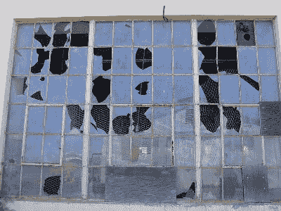

# 破窗理论

> 原文：<http://blog.codinghorror.com/the-broken-window-theory/?utm_source=wanqu.co&utm_campaign=Wanqu+Daily&utm_medium=website>

在之前的一篇文章中，我提到了破窗理论。你可能熟悉[务实的程序员对这个](http://www.artima.com/intv/fixit.html)的看法:

> Don't leave "broken windows" (bad designs, wrong decisions, or poor code) unrepaired. Fix each one as soon as it is discovered. If there is insufficient time to fix it properly, then board it up. Perhaps you can comment out the offending code, or display a "Not Implemented" message, or substitute dummy data instead. Take some action to prevent further damage and to show that you're on top of the situation.
> 
> 我们已经看到，一旦窗户开始破裂，干净、功能正常的系统就会迅速恶化。还有其他因素会导致软件腐烂，我们会在其他地方谈到其中的一些，但是忽视会比其他任何因素加速腐烂。

这对程序员来说是极好的建议，但这还不是全部。

破窗理论基于 1982 年出版的《大西洋月刊》的一篇文章。值得阅读这篇文章，以更深入地了解推动该理论的人为因素:

> Second, at the community level, disorder and crime are usually inextricably linked, in a kind of developmental sequence. Social psychologists and police officers tend to agree that if a window in a building is broken and is left unrepaired, all the rest of the windows will soon be broken. This is as true in nice neighborhoods as in rundown ones. Window-breaking does not necessarily occur on a large scale because some areas are inhabited by determined window-breakers whereas others are populated by window-lovers; rather, one unrepaired broken window is a signal that no one cares, and so breaking more windows costs nothing. (It has always been fun.)
> 
> 斯坦福大学的心理学家菲利普·津巴多在 1969 年报道了一些测试破窗理论的实验。他安排了一辆没有牌照的汽车停在布朗克斯区的街道上，另一辆类似的汽车停在加州帕洛阿尔托的街道上。布朗克斯区的汽车在“弃车”后不到十分钟就遭到了“破坏者”的袭击。最先到达的是一个家庭——父亲、母亲和年幼的儿子——他们拆除了散热器和电池。在 24 小时内，几乎所有值钱的东西都被拿走了。然后，随机破坏开始了——窗户被打碎，零件被撕掉，室内装潢被撕破。孩子们开始把汽车当作游乐场。大多数成年“破坏分子”都是衣着光鲜的白人。**帕洛阿尔托的汽车一个多星期没动过。然后津巴多用大锤砸了一部分。很快，路人也加入进来。几个小时内，汽车被翻了个底朝天，彻底毁坏了。“汪达尔人”似乎主要是受人尊敬的白人。**
> 
> 无人照管的财产成了人们外出游玩或掠夺的猎物，甚至成了那些通常做梦也不会想到做这些事情的人以及那些可能认为自己是守法的人的猎物。由于布朗克斯区社区生活的性质——匿名性，汽车被遗弃和东西被盗或损坏的频率，以及过去“没人关心”的经历——故意破坏行为的发生比古板的帕洛阿尔托要快得多，在帕洛阿尔托，人们已经开始相信私人财产受到保护，恶作剧行为代价高昂。但是，一旦社区障碍——相互尊重感和文明义务——被似乎表明“没人在乎”的行为降低，破坏行为就可能在任何地方发生。

甚至有一本关于这个主题的书。令我着迷的是，仅仅是对无序的*感知*——**甚至是看似不相关的小犯罪，如涂鸦或轻微的破坏行为**——就促成了一个负反馈循环，可能导致完全的无序:

> We suggest that "untended" behavior also leads to the breakdown of community controls. A stable neighborhood of families who care for their homes, mind each other's children, and confidently frown on unwanted intruders can change, in a few years or even a few months, to an inhospitable and frightening jungle. A piece of property is abandoned, weeds grow up, a window is smashed. Adults stop scolding rowdy children; the children, emboldened, become more rowdy. Families move out, unattached adults move in. Teenagers gather in front of the corner store. The merchant asks them to move; they refuse. Fights occur. Litter accumulates. People start drinking in front of the grocery; in time, an inebriate slumps to the sidewalk and is allowed to sleep it off. Pedestrians are approached by panhandlers.
> 
> 此时，严重犯罪猖獗或对陌生人的暴力袭击并非不可避免。但许多居民会认为犯罪，尤其是暴力犯罪在上升，他们会相应地修正自己的行为。他们将较少使用街道，并且当在街道上时，将远离他们的同伴，以避开的目光、沉默的嘴唇和匆忙的脚步移动。“不要掺和进来。”对于一些居民来说，这种不断增长的原子化无关紧要，因为附近地区不是他们的“家”，而是“他们生活的地方”。他们的兴趣在别处；他们是世界主义者。但这对其他人来说很重要，他们的生活从当地的依恋而不是世俗的参与中获得意义和满足；对他们来说，除了他们安排见面的几个可靠的朋友，这个社区将不复存在。

编程非常注重细节，也许这就是为什么:如果你不了解细节，感觉事情失去了控制，你的项目失去控制只是时间问题。也许我们应该努力解决一些小问题。

