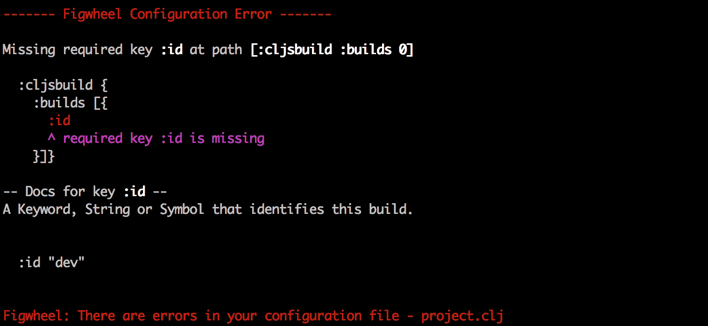
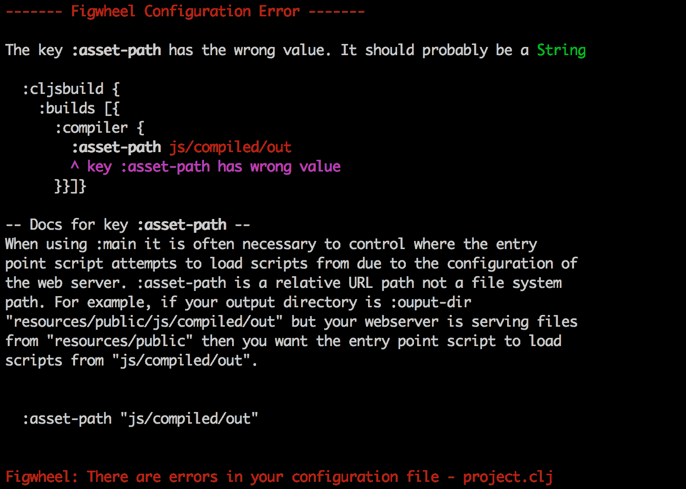
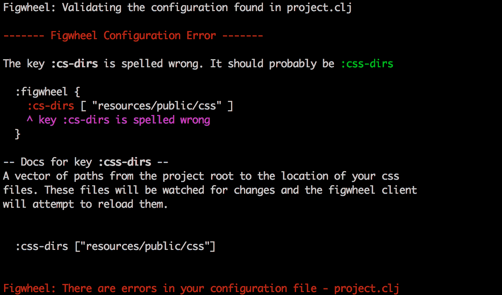
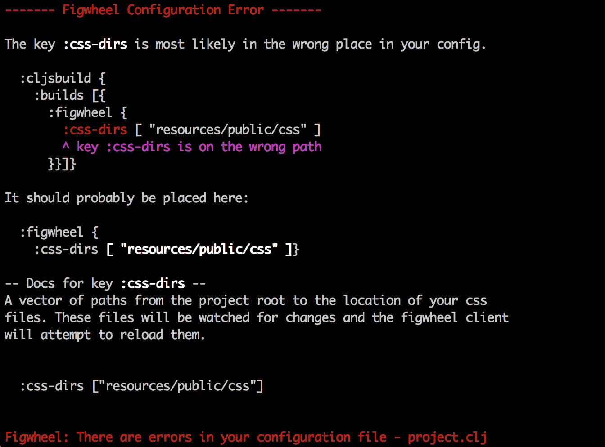

# 良好的配置反馈至关重要

> 原文：<http://rigsomelight.com/2016/05/17/good-configuration-feedback-is-essential.html?utm_source=wanqu.co&utm_campaign=Wanqu+Daily&utm_medium=website>

> 配置:你的梦想在哪里死去。

作为程序员，我们目前被要求利用越来越多的工具和服务，这些工具和服务需要…呃… **配置**。配置的过程伴随着漫长而痛苦的反复试验。不可否认，不断重新部署、重新启动或重新运行服务或工具来验证密钥和值的神秘组合的正确性的过程非常糟糕。

这是一个负担，因为我们使用了大量的工具，其中每个工具的配置都有自己的一组文件、键和值。每个工具本质上都定义了自己的领域特定语言来帮助我们满足需求。不幸的是，这要求我们掌握足够多的**每一个**工具的特定配置词汇来满足这些需求。

除了每个工具都有自己的配置“语言”的组合复杂性之外，这些配置方言通常是不完整的、不规则的，并且当它们被错误配置时提供绝对蹩脚的反馈。

### 糟糕的反馈示例

这里我将使用 NPM，但我也可以选择几乎任何有配置文件或 api 的开发工具。

让我们为一个项目创建一个`package.json`文件:

```
{  "name":  "trytry",  "version":  "1.0.0",  "description":  "tries npm",  "main":  "index.js",  "repository":  "http://github.com/bhauman/trytry",  "dependncies":  {  "express":  "4.2.x"  },  "license":  "ISC"  } 
```

现在我们已经配置了项目，我们运行`npm install`来安装我们的依赖项:

```
bash$> npm install
bash$> 
```

就这样。什么也没有安装，什么也没有发生，也没有反馈。原来是我拼错了`dependencies`。

你一定想知道对`npm-install`来说，当你要求安装东西时，你没有`dependencies`密钥……或者报告在配置文件中有一个不可识别的密钥`dependncies`有多难。

对于这个工具来说，检测并报告`dependncies`拼写错误简直是**超越了**的疯狂。

有人可能会说这没什么大不了的，但是…

> 当你考虑到我们花费在配置工具上的总时间，这些工具给了我们蹩脚的配置验证和反馈，它描绘了一幅极其对立的环境的画面。

再说一次，我不是在指责 NPM，这种行为是普遍存在的。

## 文化盲点

上面的 NPM 例子非常容易找到。我只是尝试了想到的第一件事，我知道这很可能会提供糟糕的反馈。如果 NPM 给出一个像样的反馈信息，我会感到非常惊讶。

这是一个盲点。虽然配置是痛苦的，但我们接受这种情况是正常的。我们相信事情就是这样。

很容易看出我们是如何走到这一步的。从工具作者的角度来看，配置选项集并没有那么好，也没有复杂到值得验证的程度。尤其是当这种努力似乎并没有提高工具的“底线”功能时。

不幸的是，工具用户的观点是相反的。对于用户来说，配置验证是工具的 UX 和功能的一个组成部分。这是因为除了一套不断增长的其他工具之外，工具用户还需要密切了解这个工具**的配置。对于所有的意图和目的来说，对于一个开发人员来说，在当今快速的工具创建和变化的环境中，要跟上所有的配置选项几乎是不可能的。工具作者需要充分认识到这一点，并做一些事情来帮助。**

## 帮助程序员

我认为作为程序员和工具创建者，我们应该正面面对配置问题，并创建优秀的配置反馈机制，原因有二:

1.  总体而言，这些配置方言的数量代表了日常程序员的巨大且不断增长的负担

2.  这些单个工具的配置“语言”的范围和大小通常很小，因此创建优秀反馈的问题是非常容易处理的，只要我们注意它

我真的认为修复配置反馈是一个被忽视的机会，可以利用少量的工具开发时间来极大地改善程序员的体验和生产力。

> 代表工具作者在配置错误反馈上的适度投资无疑会为工具用户节省无数小时的苦工。

伙计们，这是唾手可得的果实。

## 简单与出色的配置反馈

简单的配置反馈类似于语言中的模式验证或类型检查。它提供关于未知和缺失的配置密钥的信息，并验证配置值的类型。

简单的配置验证比没有配置验证要好得多。如果你是一个工具作者，并且你没有提供一个简单的基于模式的配置反馈，看在上帝的份上，请尽快实现它。这样做花费很少。

然而，因为许多配置语言的范围如此之小，我建议我们甚至可以通过适度的编程做得更好。

## 出色的配置反馈

我将给出来自 [Figwheel](https://github.com/bhauman/lein-figwheel) 的配置反馈的例子，这是一个我在处理热插拔 ClojureScript 代码时编写的工具。

> 声明:Figwheel 的配置验证直到最近才与其他工具相提并论。太糟糕了。

最近，我决定修复这种情况，并尝试在检测到配置错误时提供示例性的反馈。

那么，优秀的配置反馈是什么样子的呢？

让您的用户知道缺少一个重要的配置密钥是一回事。更好的做法是**告诉**它是从哪里丢失的，并为丢失的钥匙提供**文档**。



在以下示例中，您可以再次看到这种行为，在该示例中，用户为配置值提供了错误的类型:



我认为上面的例子展示了良好的配置反馈。这些错误消息直接减轻了我们备受困扰的工具用户的负担。

实现上述错误消息的技术难度对于许多工具来说都是合理的。

然而，我们是程序员，这是一个有趣的挑战。

拼写错误怎么办？



现在我们有所进展，这个工具正在为用户提供额外的帮助，有效地减少配置的认知负荷，并为下一个任务节省宝贵的周期。

我们可以更进一步，检测配置的结构位移:



上面的内容实现起来更具挑战性，但是比仅仅声明发现了一个未知的密钥更有帮助。

## 不性感，但是给好的配置反馈一个机会

这并不性感，而且人们可能不会因为你实现了良好的配置验证而对你大加赞赏。然而，我们完全有能力提供能够将我们从配置泥潭中解救出来的验证和反馈。