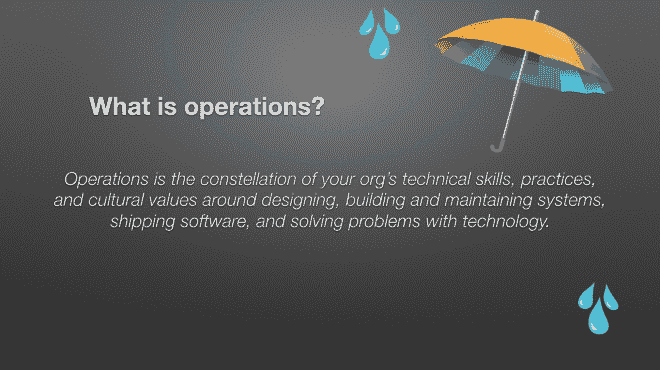
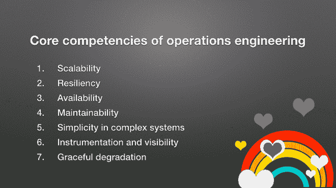

# WTF 是运营？#无服务器–charity . wtf

> 原文：<https://charity.wtf/2016/05/31/wtf-is-operations-serverless/?utm_source=wanqu.co&utm_campaign=Wanqu+Daily&utm_medium=website>

我刚从纽约的第一个 [@serverlessconf](http://serverlessconf.io/) 回来。我对精心策划的单轨会议情有独钟，组织者做了令人难以置信的工作。感谢 [@iamstan](http://twitter.com/iamstan) 和团队召集了如此高水平的与会者和演讲者。

他们邀请我发言，我感到非常荣幸。我在演讲中获得了很多乐趣！但是说实话，我拒绝了几次——然后同意了，然后又反悔，最后一刻又同意了。我只是有种感觉，好像与会者不会想听我要说的话，或者好像我们不会说同一种语言。

<noscript></noscript>

这……结果证明是不真实的。值得称赞的是，当我向组织者表达这种担忧时，他们极力争辩说，他们希望我演讲，因为他们希望在所有关于魔法和成功的虚幻童话中加入大量真实的内容。

### 所以#无服务器是新的云还是什么

你好，我很不高兴，我从事运营、数据和后端工作。我花了 3.5 年时间帮助 Parse 从几个应用程序发展到超过一百万个。在 TYVM 变得很酷之前，实际上是在构建无服务器。

所以当我看到孩子们说“未来是没有服务器的！”和“#NoOps！”我说好吧，真可爱。我经历过这个童话的另一面。我见过当应用程序开发人员认为他们不必关心与操作工程相关的技能时会发生什么。当他们忘记了**无论抽象多么漂亮，你仍然在处理陈旧的概念**比如“持久状态”和“查询”和“不可用”等等，或者当他们真的认为他们可以在服务上砸钱让它运行得更快，因为这完全是服务的工作方式。

我将把这篇文章分成两篇。我一会儿会写一份我演讲的摘要，但首先让我们弄清楚一些事情。比如文字。比如运营。

### 运营是什么？

假设在 2016 年有一个相当高效的工程环境，让我们来谈谈“运营”实际上意味着什么。

<noscript>T3】</noscript>

从宏观层面来看，卓越运营不是一个角色，而是一种自然属性。这是你完成任务的方式。

运营是贵公司围绕运输和维护质量系统和软件的实践而建立起来的所有技能、知识和价值观的总和。  这是你的隐性价值观，也是你的显性价值观，习惯，部落知识，奖励制度。  从技术支持到产品人员再到首席执行官，每个人都参与到你的运营成果中，尽管有些角色显然比其他角色更专业。

说你有一个专门负责可靠性的运营团队就像说“HR 定义并拥有我们的公司文化”一样愚蠢不会。经理和人力资源专业人士可能有特定的技能和职责，但文化是一种新兴的财产，每个人都有贡献(只需要几个坏演员就能破坏蒲式耳)。

**从“其他团队负责的事情”的角度来考虑运营质量通常不会带来好的结果**。这导致软件工程师不太精通或不太关心他们的成果，运营团队筋疲力尽，交付给客户的软件和服务的整体质量较低。

这些是我与真正优秀的运营工程师联系在一起的专业技能。你觉得这些是可选的吗？

<noscript>T3】</noscript>

这取决于你的任务，但通常这些不是特别可选的。如果你有客户，你需要关心这些事情。不管你有没有专门的运营团队。你还需要关心它对你的人类造成的负担，尤其是当它涉及到复杂系统的认知开销时。

所以这是我对操作的定义。不一定是你的定义。但是我认为它是一个有价值的框架，可以帮助我们思考交付高质量的软件和健康的团队。尤其是考虑到运营工作的无形性，当它做得非常好的时候。比起“东西没坏”来说，注意和奖励发布闪亮的功能要容易得多。

### 不光彩的过去

不要误解我——我理解为什么“操作”在很多人群中已经失宠。我明白为什么谷歌想出了“SRE”来在他们需要的东西和 10 多年前普通“系统管理员”在做的事情之间划一条线。

Ops 文化有许多众所周知的和有据可查的病态:英雄/烈士情结、风险厌恶、倦怠等。我明白为什么这是令人不快的，我们需要解决它。

此外，从历史上看，ops 吸引了更大比例的非传统怪人，他们只喜欢调试和构建东西——较少的斯坦福 CS 博士，更多的修补匠和文科专业学生以及大学辍学生(嗨)。因此，他们得到的报酬更少，工程纪律更差，做太多的临时工作，把自己累垮了。

<noscript>T3】</noscript>

但是——这不再是我们压倒一切的现实，也肯定不是我们正在奔向的现实。多亏了 SRE 运动，以及并行的、甚至更强大和多样化的开源 DevOps 运动，运营工程师成了……工程师。专门研究基础设施的人。移情和流动技能组合比以往任何时候都更有价值，工程师们能够在学科之间流动，在专业之间翻译。这就是“全栈开发人员”这个术语的来源。这很烦人，但反映了对多面手技能的渴望。

对 BOFH 的刻板印象已经消失了。**技术领域中一些最具创造性的文化和技术变革正由最熟悉运营和开发工具的团队推动**。我所知道的最好的软件工程师是那些一贯重视他们发布的代码的影响和生命周期，重视部署、工具和可观察性的人。换句话说，他们在运营方面很出色。

### 辉煌的未来

因此，我认为是时候让“运营”重新成为一个值得骄傲的术语了。作为被重视和奖励的东西。组织中的每个人都认为这是成功的关键。每个组织都有独特的运营需求，弄清它们是什么并满足它们需要文化和技术方面的大量创造力和独创性。

毫无疑问,“行动”是有包袱的。但是我不认为距离和否认是让事情变得更好的有效方法，更不用说垃圾话和贬低你提供优质服务所需的技能了。

将团队重新命名为“DevOps”或“SRE”或其他什么，你不会神奇地让运营结果变得更好。你可以通过给它起名字和宣称它是什么来让它变得更好，并帮助每个人理解他们的角色如何与你的运营目标相关联。

现在我已经写了这篇博客，我可以停止与那些想谈论“DevOps 工程师”和“#NoOps”是否是一件事的人争论，也许我甚至可以停止向他们重提新生的“#NoDevs”运动。(哈哈开个玩笑，那个太好玩了。)

[第二部分:无服务器世界的运营](http://charity.wtf/2016/05/31/operational-best-practices-serverless/)

### 像这样:

像 装...