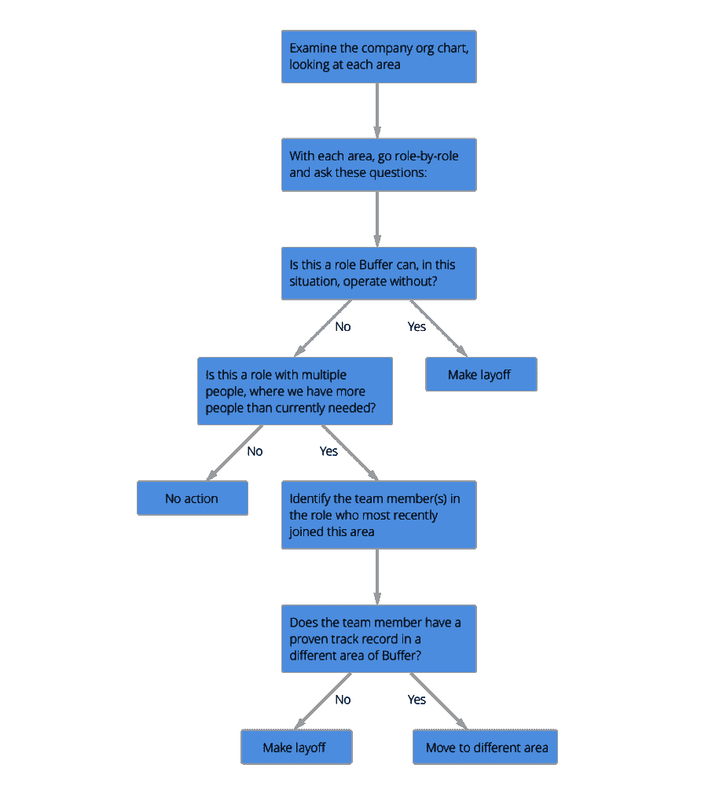
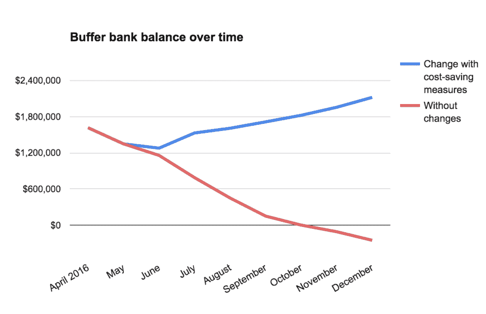
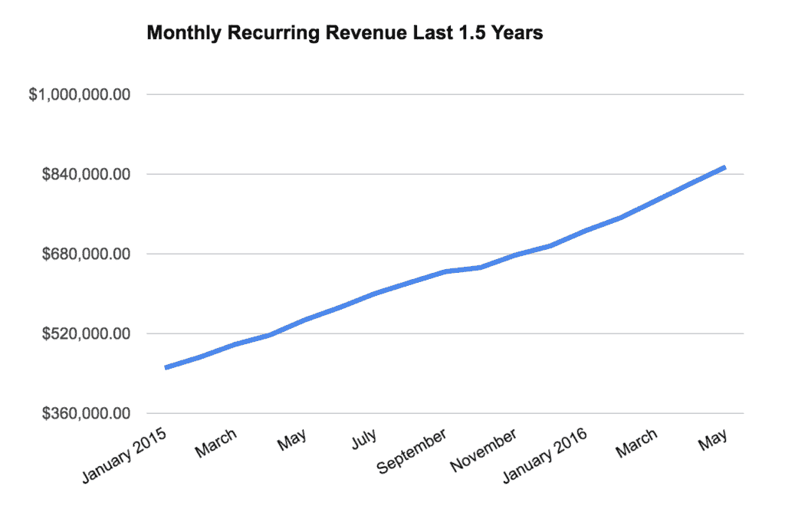

# 坏消息:我们已经裁员 10 人。我们是如何走到这一步的，财务细节以及我们将如何前进

> 原文：<https://open.buffer.com/layoffs-and-moving-forward/?utm_source=wanqu.co&utm_campaign=Wanqu+Daily&utm_medium=website>

过去的三周对 Buffer 的每个人来说都充满了挑战和情绪。我们做出了一个艰难的决定，解雇了 10 名团队成员，占整个团队的 11%。我想分享我们如何走到这一步的全部细节，以及我们选择处理这种情况的方式，以使 Buffer 处于更健康的状态。

我相信大多数创业者天生乐观。我们想要解决问题，我们相信从无到有。大多数成功创始人的态度是，以前未被证实的事情可以变成现实。我们大多数人都经历过疑惑和怀疑，并克服了它们。

乐观主义让我们在 Buffer 经历了许多错误，比如我们花了几个月时间开发的无数新功能和产品，结果发现我们需要放弃它们。[内容建议](https://buffer.com/resources/retiring-suggestions/)和我们日常的 iOS app 只是一对情侣。

但是在一家公司的某一点之后，我们犯的错误不仅仅影响产品特性。它们影响着人们的生活。

再乐观也无法为上周一做好缓冲，那时我们不得不告诉 10 名天才队友，他们与我们的旅程结束了。

这是我迄今为止职业生涯中犯下的最大错误的结果。更糟糕的是，这不是市场变化的结果——这完全是自己造成的。

## 我们搬进了我们负担不起的房子

简而言之，这都是因为我们把团队发展得太大、太快。我们原以为我们会注意平衡招聘速度和收入增长。我们没有。

我们的一位顾问给了我们一个恰当的比喻:我们搬进了一所我们每月工资都买不起的房子。

过去，我们通过更快地增加收入摆脱了这种局面。作为联合创始人，我们很乐观，我们相信缓冲。其中一次是在 2013 年，当时我们的增长略有放缓，我们开始烧钱，而不是实现正现金流。当时我们迅速推出了 Buffer for Business，扭转了局面。

我们知道我们有许多未开发的增长机会。然而，这一次，我们根本无法以足够快的速度刺激增长。我们逐渐意识到，我们必须采取一些切实可行的、立竿见影的措施来解决这场危机。

事实是，我创造的挑战已经不可逆转地改变了人们的生活。我把公司置于这种境地。我的判断力很差，在许多不同的领域采取了错误的行动。

特别是在这个时候，我想努力实践我们的透明价值观，分享我们犯下的重大错误、我们决定做出的艰难改变，以及我们将何去何从。

## 回顾过去的一年

在过去的一年中，Buffer 从 34 人增加到 94 人。

我们刚刚从自我管理的长期试验中走出来，我们完全接受了类似于 Holacracy 的概念，在 Holacracy 中，公司是在没有经理的情况下运行的。最终，我们认为我们没能让它成功。在此期间，我们的团队规模没有变化，而我们的客户群却在不断增长。当我们出现时，Leo 和我进行了一次长时间的汇报，并决定拥抱我们对公司的雄心，并大幅增长以服务客户。

现在回想起来，我看到很多自我和骄傲反映在团队规模的数字上。

虽然我理性地知道团队的规模不是值得庆祝的事情，但我觉得在过去的一年里，我陷入了这种有害的心态。不是每个人都熟悉每月经常性收入等增长指标，但团队规模很容易理解。有时候，当我告诉人们这家公司有多大时，他们会印象深刻，我很自豪地分享这一点。

通过这次经历，我学会了重新关注真正重要的事情。我们的价值观和使命比团队的规模更有价值。现在我意识到，朝着我们的愿景努力并为客户创造良好的体验才是最重要的，我们应该努力尽可能高效地做到这一点。

过了好一会儿，我们才意识到我们把钟摆向相反的方向摆得太远了。我们倾向于在缓冲区采取行动，并认为快速行动和大胆行动很重要。

去年的大部分时间里，利奥和我也明白了如何才能真正做好成长期公司的联合创始人，而不是初创公司。我们相互理解的过程中经历了许多艰难的时刻、艰难的对话和健康的冲突。

自从我们超越了一个小团队(大约 20 人)，利奥和我通过拆分公司，将自己安排为首席执行官和首席运营官，专注于我们认为最强的领域。这感觉很自然，也是许多联合创始人选择经营他们公司的原因。在我们各自的领域，我们都试图“做好一切”，我们都是编辑(专注于愿景、原因和细节)和操作员(专注于设定目标、创造结果和快速行动)。

以前拆分公司的结构不允许我们深入挖掘，以发现我们面前的问题。

我们花了一些时间才意识到，我的强项是做编辑，而 Leo 的强项是做运营。我们现在都在整个公司工作，运用我们的优势来推动行动和关注细节。

我们以前也犯过这样的错误——事实上，很多次。但是在早期，我们主要是在开发一个产品。现在在建公司，打的电话涉及到人的生活。

## 我们犯的主要错误

事后看来，我们在招聘和成本方面犯了一些关键错误。总的主题是，我们在做每一个决定时，都没有充分注意运用财务视角。

更详细地说，以下是导致我们达到这一点的一些因素:

*   **过于激进的增长选择**:在 2014 年第四季度和 2015 年上半年，我们的增长速度开始有所放缓。这是达到更高收入水平的一个很自然的方面——很难以以前的速度保持更大的增长。我们的财务状况良好，因此决定加大油门。事后看来，Leo 和我对这种变化过于激进，如果我们逐步加快步伐，而不是采取如此激烈的增长措施，就会让 Buffer 处于更有利的位置。
*   **缺乏责任心:**在一个 10 人的公司里，每个人都身兼数职。在一个 500 人的公司里，几乎每个人都很专业，决策者也很明确。通常不被提及的是从多面手到专家的转变。在 Buffer，这种转变是混乱的。尤其是在我们不太了解的领域，比如财务和人力资源，我们没有尽快引进专家。结果，一些事情被遗漏了，我们犯了很多错误。
*   **信任我们的财务模型:**我们最近对预测模型做了几处修改，显示出一些薄弱环节。我们现在意识到我们的模型很不完善。我们还有很多工作要做，才能真正相信我们拥有做出正确决策所需的所有正确信息。
*   **明确的风险偏好:**我们以前从未确定什么是“健康的银行存款余额”，也没有确定缓冲必须是盈利的还是可以消耗一点现金。一旦我们决定恢复盈利，我们就开始了解我们的处境有多艰难。
*   过度热情的招聘:在许多领域，我们扩大了团队，超过了当时真正需要的规模，超过了明确认可的规模。我们雇佣了一个完整的客户成功团队，期望能走上更高端的市场，但从产品的角度来看，我们的进展不够快。
*   团队重组:我们重组了我们的产品团队，选择让产品经理深入产品领域，如技术、用户体验和数据分析。这种回归拥抱更一般化的转变意味着我们不需要那么多专家。

这些错误和对我们财务状况的全面了解的结果是，尽管我们在银行有 130 万美元的存款，但我们在 5 个月内迅速趋向于零现金。

## 我们为恢复所做的改变

随着我们的支出超过收入，我们知道我们现在需要做出一些改变，以避免未来出现更大的问题。

我们探索了许多前进的方案。最后，我们决定采取以下节约成本的措施来实现恢复:

*   为了恢复更健康的财务状况，我们裁员 10 人。**储蓄:****【585，000 美元**
*   利奥和我都接受了 40%的减薪，至少到今年年底。节省:94000 美元。
*   Leo 和我承诺以尽可能低的利率向每个人提供 10 万美元的贷款，只有当 Buffer 达到健康的财务状况时才会偿还。储蓄:20 万美元。
*   我们调整了[工资公式](https://buffer.com/resources/transparent-salaries/)中的忠诚度部分。每个队友之前在 Buffer 的周年纪念日都会获得 5%的加薪。现在是 3%，适用于所有在公司工作超过一年的人。**节余:74000 美元。**
*   我们已经停止了两项津贴(如果可能的话，希望在 2017 年恢复):
    *   每位队友每月最高 100 美元的健康补助。节省:49000 美元。
    *   每位队友 1000 美元的年度休假奖金，每位家属 500 美元。节省:52 000 美元。
*   我们取消了即将到来的去柏林的团队静修。**储蓄:40 万美元。**
*   我们在年底削减了赞助预算。节省:75000 美元。

## 最艰难的改变:我们裁员了，告别了 10 个队友

我想分享更多关于为了恢复更健康的财务状况而裁员 10 人的艰难决定。

连续几天，我和 Leo 每天都要与我们管理团队的其他成员 Carolyn 和 Sunil 进行 5 小时的会议讨论，我们召集顾问和法律顾问来帮助我们了解做出这些艰难选择的最佳方式。

无论我们如何深思熟虑，如何思考，我们逐渐可怕地意识到，这归根结底是人的问题。

工资占我们支出的 80%以上，我们必须影响团队成员回到正轨。

通过裁员，我们在年底节省了 585，000 美元，或者说每个月在银行里多存了 100，000 美元。这是帮助我们避免进一步财政困难的关键数额。

这 10 个人都为 Buffer 做了出色的工作。在我们的文化中，我们把整个自我带到工作中，把团队视为一家人，拥有共同的价值观，这个过程特别困难。许多团队成员是我们上周告别的那些人的密友。

这些不是基于绩效的变化。相反，我们找到了一些我们觉得可以完全去掉的角色，以及一些我们可以用更少的人来操作的角色。

我们采用了以“后进先出”为中心的特定方法，以避免在选择个别队友时出现任何偏见。

我们计划尽我们所能帮助这些了不起的人踏上下一步的旅程，包括基于在 Buffer 工作时间的 3-6 周遣散费，3 个月的全面医疗保险，以及推荐和介绍其他公司。

## 我们目前的财务状况和未来目标

总的来说，这些变化使我们到年底总共节省了 150 万美元。

随着我们的削减，我们对 2016 年 6 月至 12 月银行余额的预测发生了巨大变化，使我们处于完全复苏的状态。

我们对恢复盈利感到兴奋，我对我们现在的道路充满信心。我们的银行存款余额目前为 130 万美元，这将帮助我们在 2017 年 1 月前将其增加到 210 万美元。

尽管这些变化很艰难，但这并不是减速。这是一个执行错误，与市场变化或收入流损失无关。

我们的收入持续增长，在撰写本文时，我们的月经常性收入已超过 87.5 万美元:年经常性收入 1050 万美元。

我认为，修复我们犯下的错误将使我们变得更精简、更强大，并专注于未来的正确领域。

我们在这里学到的知识和得到的建议，部分是围绕着一家公司发展到新阶段时，健康的银行存款余额是什么样子的。我们观察到的总体共识是，一家公司在银行有 5-6 个月的支出是健康的。Jason Lemkin 与我分享的另一个方法是将银行年经常性收入的 50%作为目标:

有了这次经历，我们现在正致力于朝着这个理想前进。对于我们目前的情况来说，这意味着银行存款将达到 400 万到 500 万美元。我们的目标是恢复盈利，并努力在 2017 年年中实现这一目标。我们可以将风险债务视为一种在保持盈利的同时帮助增加银行余额的方式。

## 为什么我们选择最少的筹资和盈利，而不是传统的硅谷道路

在很多方面，我们选择了这条道路，并把自己放在这个位置上。这完全是我们的决定，主要基于现金流和盈利能力，而不是筹资。

我们知道其他公司也有和我们类似的现金流情况，但是已经筹集了 2000 万到 3000 万美元的资金。这些公司在硅谷走的是更正常的道路，它们选择了一种高烧钱率的运营方式，导致每次融资之间的“跑道”有限。一般来说，创业公司的目标是在一轮融资后的 12-18 个月内完成。

传统的筹款方式故意不是我们选择的运作方式，因此在这种情况下，我们选择不使用筹款来解决挑战。我们[以不同的方式看待融资](https://buffer.com/resources/raising-3-5m-funding-valuation-term-sheet/)，更多的是一个推动者，而不是我们想要完全依赖的东西。

这对我们预期的真实增长率有一些影响，但它也给我们带来了巨大的好处，因为我们可以自由地进行产品创新和工作方式的试验。

这种运营方式是我们愿景和文化的一部分，但也是我们陷入这场危机的原因。

我们选择不筹集资金来解决这个其他公司可能会有的问题。我们预计未来会有进一步的融资，但从财务角度来看，我们希望公司完全健康，这样我们就可以按照我们完全满意的条款筹集资金，如果我们认为这样做对缓冲更好，我们也可以随时退出。

尽管这是一个艰难的处境，但从许多方面来看，这仍然是一个积极的修正。我们宁愿尽早发现这些现金流问题，现在就解决它们。银行里的几千万本来可以掩盖这个问题。

## 这对团队有什么改变？

在分享这个艰难的消息时，我已经可以确定很多我会以不同方式做的事情。

现在我们的团队变得更大了，当他们不能采取任何行动来改变事情时，我们努力思考该给他们增加多少负担。我觉得我们没有完全实现我们的透明价值观，特别是为了避免以后的大揭露而提前分享。

因此，我们的团队对我们所做的改变感到惊讶是可以理解的，尤其是失去了队友和朋友。

围绕内疚、悲伤和恐惧的感觉，有很多问题和健康的讨论。我们希望每个人都能根据需要不断反思和交流。

在我们恢复和复原期间，我们希望专注于恢复财务健康状况，并使 Buffer 成为一项长期可持续的业务。这意味着对我们所做的一切都要有更严密的财务视角。此外，我们希望挑战自我，在以下特定领域取得进步:

*   **加入我们的财务/会计团队:**我们计划增加一名资深人员来壮大我们的财务团队，他可以帮助我们了解我们所不知道的一切，并让我们有一个坚实的财务基础。
*   **整理内务:**我们要做一些内部审计，以确保我们的流程与团队一起成长，还有很多法律/会计工作要做。
*   **对团队成员的更多财务监督:**到目前为止，在我们的旅程中，我们一直试图在内部流程方面保持精益，并依靠[建议流程](https://buffer.com/resources/decision-maker-no-managers-experiment/)进行决策。在我们目前更大的规模下，可能是时候通过提供更明确的监督来消除队友的金钱负担了。例如，在花费超过 500 美元之前与财务核对。
*   【2017 年初的下一次静修:静修是我们分散团队的一个重要元素，不得不取消我们即将到来的相聚机会令人失望。然而，我们仍在计划 2017 年初的团队静修。这在我们的恢复计划中已经做了充分的预算。与此同时，我们正在探索调整我们的静修方法，减少全公司静修的频率，并辅之以更小的团队和区域静修。我们正从严格的金融角度来看待这些变化。

在 Buffer 的这段艰难时期，我真的被初创企业社区的支持程度震惊了。

我们在 Buffer 的许多顾问和朋友的建议和帮助下解决了这个问题。我非常感谢合作基金的 Kanyi 和 Craig、Hubspot 的 Dharmesh、Square 的 Gokul、A16Z 的 Steven、KISSMetrics 的 Hiten、Product Hunt 的 Ryan 和 Mattermark 的 Danielle。

在整个过程中，他们的建议对我们来说是无价的，并再次提醒我，我们有一个强大的社区来寻求帮助是多么幸运。

当我们分享我们的旅程时，从我们的顾问、朋友和社区那里学习每一步是我们的荣幸——高潮和低谷。现在，我比以往任何时候都渴望继续分享和学习。

我希望你能给我们一个高标准，问我们一些困难的问题，让我们有责任不断改进和分享。

## Buffer 的下一步是什么

我真的很抱歉我造成的失望和焦虑，以及给车队造成的这种困难局面。我个人觉得这是我作为 CEO 犯的一个大错误，我负全责。

我相信，我们正在采取必要的措施，尽快从这场危机中恢复过来，回到财务健康的状态。

我们的目标是在未来 12-18 个月内实现 2000 万美元的年度经常性收入，我们正在尽一切努力与合适的团队一起持续实现这一目标。

在我们进行内部变革的同时，我们正在努力改进 Buffer 平台，包括为 Instagram 推出 Buffer 和更多新功能。

随着 Buffer 的付费用户数量超过 50，000 人，我比以往任何时候都更加相信，Buffer 在实现我们希望在世界上看到的变化方面发挥着明显的作用:让企业和个人为他们正在做的好事发出更大的声音，同时围绕公司文化进行创新，并努力激励他人拥有快乐的工作场所。

我将长期从事这项工作，我很高兴将这个错误转化为一个重要的学习时刻，以帮助我们继续我们的旅程。

我知道在这则新闻之后可能会有很多问题和想法，我对此表示敬意。请分享你的感受——我们在倾听。请在评论中给我们留言，我或团队中的其他人会很快回复您。

