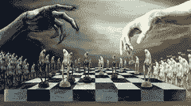

# 苹果照片背后的技术以及深度学习和隐私的未来——高可扩展性——

> 原文：<http://highscalability.com/blog/2016/6/20/the-technology-behind-apple-photos-and-the-future-of-deep-le.html?utm_source=wanqu.co&utm_campaign=Wanqu+Daily&utm_medium=website>

关于无处不在的人工智能辅助的未来将如何呈现，两种愿景之间存在一场战争:在 *云* 或在 *设备* 上。就像任何一部伟大的戏剧一样，如果我们有两个原型对手，这将有助于故事的发展。在云方面，我们有谷歌。在设备方面，我们有苹果。谁会赢？两者都有？都不是？还是我们都赢了？

如果你一周前问我，我会说云会赢。绝对的。如果你在谷歌 读到一篇类似 [杰夫·迪恩关于大规模深度学习的文章，你会不禁对谷歌正在取得的成就感到惊讶。令人印象深刻。范围很广。聪明。系统化。主导。](http://highscalability.com/blog/2016/3/16/jeff-dean-on-large-scale-deep-learning-at-google.html)

苹果在很大程度上缺席了在他们的产品上洒深度学习仙尘的趋势。这并不令人惊讶。苹果按照自己的步伐前进。苹果不会主动接触早期用户，当一项技术对大众消费者市场有利时，他们就会发布这项技术。

有一种想法是因为苹果是如此神秘，他们可能隐藏了大量我们甚至还不知道的深度学习印章。当然，我们无从知晓。

可能证明更真实的是，苹果正在以不同的方式进行深度学习:+强大的设备处理器+离线训练与 [可下载模型](https://research.googleblog.com/2015/07/how-google-translate-squeezes-deep.html) +承诺真的真的不了解你的任何个人信息+深度学习相当于 [完美的前向保密](https://en.wikipedia.org/wiki/Forward_secrecy) 。

## 照片 vs 照片

在 [WWDC 2016 主题演讲](https://developer.apple.com/videos/play/wwdc2016/101/) 中，苹果介绍了他们新的照片应用，宣布将使用深度学习来帮助搜索图像，将相关照片分组到相册中，并将照片、视频和位置收集到迷你快照中。

如果这听起来很像 [Google 相册](https://photos.google.com/) 的话，应该是。Google Photos 团队实现了无需标记即可搜索照片的功能。你可以找到雕像、尤达、图画、水等的图片，而不用给这些图片贴标签。

不同的是他们如何从事各自的工作。

苹果采取的是什么方法？从最近在 WWDC 2016 举办的 [脱口秀节目中，我们对苹果的做法有了一些了解，该节目由约翰·格鲁伯主持，苹果的活力二人组菲尔·席勒和克雷格·费德里基担任嘉宾。](http://daringfireball.net/thetalkshow/2016/06/17/ep-158)

## 深度学习什么时候发生？

Gruber 问的正是我想知道的问题:**深度学习什么时候发生？**

这个问题有几个答案:

*   **深度学习发生在苹果的数据中心**。

*   **拍照时将模型应用到设备上**。

    *   照片进入照片库时，分析会立即进行。

    *   用“那是一匹马”或“那是一座山”这样的标签对一张照片进行分类需要大约 110 亿次运算

    *   如今 iOS 设备上的 GPU 真的会做饭，所以整个过程本质上是瞬间的。显然，在摊销的基础上，功率消耗没什么可担心的。

*   **您现有的所有照片都在后台进行分析**。因为有相当多的计算量，当设备接入交流电源时，分析要在夜间进行。

*   **分析结果不会在您的所有设备之间共享**。

    *   每个设备都经历相同的过程，每个设备都做自己的处理。

    *   将来这可能会改变，结果可能会被分享。显然，开发一个安全的系统来共享这种数据是一项艰巨的任务，所以可以理解为什么它会来得晚。

## 隐私是区别所在

虽然苹果没有谈论训练是如何进行的，但这很可能是谷歌在深度学习方面开创的某种变体。

真正不同的是如何处理隐私。谷歌将你所有的数据存储到云中，并根据你和其他人的数据训练他们的模型。谷歌很清楚你是谁。事实上，我经常有这种反乌托邦式的想象，谷歌创建了一个模拟我大脑的神经网络，不断探测它，看看我会对候选广告制度做出什么反应。*颤抖*

苹果采取了一种完全不同的方法。苹果从来不知道发生在你手机上的分析。苹果从来没有真正看到你的数据。这是采访中多次提到的。苹果真的想让你知道你的数据是私人的，苹果是局外人。

克雷格·费德里吉:

> 是的。要明确的是，照片本身是，架构集是在云中加密的，元数据——你创建的或我们通过深度学习分类创建的关于照片的任何元数据都是以苹果不会读取的方式加密的。

如果苹果不上传你的数据，不了解你的一切，他们怎么能竞争呢？通过一个小小的数学魔法叫做(DP)。我以前也没听说过，所以我们都在玩追赶。

Matthew Green 在他的文章 [中对 DP 做了精彩的介绍什么是差分隐私？](http://blog.cryptographyengineering.com/2016/06/what-is-differential-privacy.html) 从本质上来说，DP 是一种大数据游戏，它使用统计数据来隐藏用户身份，从数学上证明它不可能逆转匿名。

有用吗？ [马修绿色](http://blog.cryptographyengineering.com/2016/06/what-is-differential-privacy.html) :

> 但是也许这一切都太“棒球内部”了。归根结底，看起来苹果确实在努力改善用户隐私，考虑到其他选择，这可能比什么都重要。

Craig Federighi 浏览了一个 DP 示例(略加编辑):

> 这个想法是，如果我们想知道哪个单词，你知道，一个每个人都知道的新单词，很多人都在输入，但我们不知道，这样我们就不会把它标记为拼写错误。或者我们甚至可以在键盘上建议它。
> 
> 是的，就像现在一样，它很流行，很热门，我们希望我们所有的顾客都能知道这个词，但我们不想知道你和 Phil 正在输入这个词。我们不希望有任何了解。
> 
> 你可以想象一下，如果我们实际上是在组装一张由小块数据组成的图片，你知道，是关于森林的，但我们得到的只是一小块。当我们得到那一小块时，甚至每个设备在统计上，很多时候，甚至会对它的小块撒谎。对吗？
> 
> 但是这些谎言将会随着足够的数据而被抵消，随着足够的数据点，这幅图像将会突然分解，将会自己分解。因此，实际上，如果我们试图学习一个单词，我们会发送一个比特——我们会发送一个位置和一个——我们会对单词进行哈希运算，我们会从哈希运算中发送一个比特，我们会说在位置 23 处，Phil 看到了一个 1。但菲尔的手机会抛硬币，实际上说，“实际上，我要撒谎。即使我看到一个 1，我也要说 0。”
> 
> 这就是苹果公司的数据。苹果公司有了足够的数据，可以构建一个合成图，并说，“天哪，我们这里有一个单词。这大概是很多人看到的。”这通常是你想知道的。你想知道发生了什么，但我们不想知道具体是什么，具体是谁在做什么。

苹果公司正在利用他们有 10 亿部手机的优势。

Gruber 提出的一个关键点是 DP 如何保证[前向保密](https://en.wikipedia.org/wiki/Forward_secrecy)。因为数据没有被天真地去匿名化，所以在以后的某个时间，不可能弄清楚谁属于什么数据。即使一些法院命令苹果将数据与一个人匹配，苹果也不能这样做。就算后来苹果的某个管理团队改变方向，想用美元换隐私，也是做不到的。

谷歌还开发了功能强大的机型，这些机型小到可以在智能手机上运行。一个 [的例子](http://highscalability.com/blog/2016/3/16/jeff-dean-on-large-scale-deep-learning-at-google.html) 是一个组合的视觉加翻译应用程序，它使用计算机视觉来识别取景器中的文本。然后 [翻译](https://research.googleblog.com/2015/07/how-google-translate-squeezes-deep.html) 文本，然后将翻译后的文本叠加在图像本身上。这些模型足够小，可以在设备上运行。谷歌知道，要让技术消失，智能必须转移到边缘。它不能依赖于连接到远程云大脑的网络脐带。由于 TensorFlow 模型可以在手机上运行，我们可以预计混合方法将成为规则，将云训练与设备模型相结合，尽管谷歌似乎不太可能采用差分隐私。

## 苹果在差分隐私方面失去了哪些能力？

看起来苹果正在放弃深入了解你个人的能力，尽管我很确定我还没有完全理解这些东西。

以谷歌的 [智能回复](http://googleresearch.blogspot.com/2015/11/computer-respond-to-this-email.html) 功能为例。在手机上，你希望能够快速回复电子邮件，打字是一件痛苦的事情。因此谷歌开发了一个系统来预测一条信息可能的回复。

第一步是训练一个小模型来预测一条消息是否是那种会有简短回复的消息。如果是这样的话，一个更大的计算更昂贵的模型被激活，该模型将消息作为一个序列，并试图预测响应字的序列。

例如，对于一封询问感恩节邀请的电子邮件，三个预测的回复是:算我们一个；我们会去的。抱歉我们不能按时到达。

这似乎是苹果可能创造的东西。

让我们更进一步，创建一个模型来预测我可能的反应。我应该如何回复信息？我不认为苹果能做到这种个性化。苹果在云中没有我的身份，它只有所有数据的聚合视图。当谈到个性化时，苹果将自己限制在只能在设备上进行的培训，只有设备上提供的数据。

因此，这是一个数据贫乏的问题。设备上是否有足够的可访问数据来了解真实的我？苹果会不会只从 iMessage 或者 Siri 认识我？还是苹果劫持了对 Twitter、电子邮件、脸书、谷歌搜索等的访问？

然后还有一个计算问题。听杰夫·迪恩说，我的印象是，这些神经网络是由数亿个参数组成的，不是可以在设备上运行的东西。

然后就是多重人格问题。例如，Siri 在我看来就有多重人格。我与手机、iPad 和台式机的交互方式不同，因此如果培训是针对每台设备的，我会在每台设备上看到不同的 Siri。苹果将不得不开发某种元培训层，所有设备在其中合作，形成对其用户的单一统一视图。这听起来比把所有东西都运回云端更具挑战性。

缺乏个性化是一个杀手吗？这将是谷歌。谷歌最近举行了他们自己令人印象深刻的开发者大会， [谷歌 I/O 2016](https://events.google.com/io2016/) ，他们在会上双倍下注于一项机器学习无处不在的战略。一个例子是 [谷歌助手](https://techcrunch.com/2016/05/18/google-unveils-google-assistant-a-big-upgrade-to-google-now/) ，一个新的个人 AI，看起来它要抹杀罗伯特·斯考伯臭名昭著的 [招招线](http://thenextweb.com/video/2012/04/28/robert-scoble-on-the-startups-that-cross-the-freaky-line-at-tnw2012-video) 。

苹果在乎吗？谷歌似乎有兴趣探索深度学习的全面开花，以此作为自己的目的。苹果似乎更关注深度学习如何制造更好的产品，这是一个非常不同的目标，一个非常实用的目标。只要苹果至少在概念上与谷歌不相上下，谷歌就必须远远超越苹果，并提供一个更具吸引力的生态系统来赢得用户。我们会看到的。

每个团队都必须决定他们希望如何构建和部署未来的深度学习系统。这既是一个技术问题，也是一个伦理问题。到目前为止，我们只有一个如何建立深度学习系统的例子。苹果提供了一种不同的模式。

不幸的是，无论苹果的隐私模式有多好，它都很难传播。苹果很可能会对他们的技术保密。另一方面，谷歌正忙于用他们的深度学习愿景改造世界。这对于苹果来说无疑是好的，因为它将他们锁定为首选的隐私平台，但对于我们其他人来说，这有点糟糕。