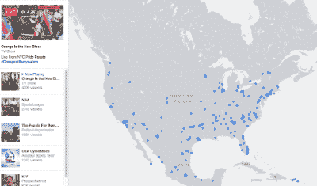

# 脸书直播如何向 800，000 名观众同步直播-高可扩展性-

> 原文：<http://highscalability.com/blog/2016/6/27/how-facebook-live-streams-to-800000-simultaneous-viewers.html?utm_source=wanqu.co&utm_campaign=Wanqu+Daily&utm_medium=website>

比拥有核武器的国家还要少的公司知道如何建立跨越全球的分布式服务。脸书就是这些公司之一，脸书的、脸书的 [新的](https://live.fb.com/about/) 视频直播产品，就是这些服务之一。

脸书首席执行官马克·扎克伯格:

> 我们做出的重大决定是将我们的大量视频工作转移到直播上，因为这是一种新兴的新形式；不是那种过去五年或十年一直在网上的视频...我们正在进入这个新的视频黄金时代。如果让时间快进五年，人们在脸书看到的、每天分享的大部分内容都是视频，我不会感到惊讶。

如果你从事广告业务，还有什么比永无止境、不断扩展、自由生成的现成广告内容更好的呢？谷歌 [利用](http://www.wsj.com/articles/SB108319881076696889) 开始在呈指数增长的网络上打广告，这是同样的经济学道理。

脸书流媒体技术的一个例子是一个 45 分钟的视频，两个人用橡皮筋 [炸掉一个西瓜](https://www.buzzfeed.com/brendanklinkenberg/this-exploding-watermelon-was-facebook-lives-biggest-hit-to) 。它达到了 800，000 多人同时观看的高峰，也积累了超过 300，000 条评论。这是一个拥有 15 亿用户的社交网络所能产生的病毒规模。

作为对比，2015 年的超级碗有 1.14 亿观众观看，平均有 236 万观众在直播中观看。Twitch 上曾出现过 2015 年 E3[84 万](http://www.geekwire.com/2015/amazons-twitch-attracts-monster-audience-at-e3-with-21m-viewers-tuning-in-online/) 观众的高峰。9 月 16 日的共和党辩论在 [达到顶峰，92.1 万人](http://www.politicususa.com/2015/10/14/debate-watched-democratic-debate.html) 同步直播。

因此，脸书是最先进的。请记住，脸书也会有大量的其他数据流同时运行。

一连线文章 [语录](http://www.wired.com/2016/04/facebook-really-really-wants-broadcast-watch-live-video/) 克里斯·考克斯，脸书首席产品官，人称脸书:

*   有超过 100 人在现场工作。(它[从大约 12 人开始](https://www.buzzfeed.com/mathonan/why-facebook-and-mark-zuckerberg-went-all-in-on-live-video)，现在有超过 150 名工程师在这个项目上)

*   需要能够在不崩溃的情况下同时提供**数百万个流**。

*   需要能够在一个流上同时支持**数百万观众，以及跨越全球不同设备和服务提供商的无缝流。**

Cox 说“事实证明这是一个非常棘手的基础设施问题。”

如果我们能了解基础设施问题是如何解决的，那不是很有趣吗？我们真不幸。但是等等，我们有！

[脸书 Traffic 团队的费德里科·拉伦贝](https://www.linkedin.com/in/federicolarumbe) 做了一个精彩的演讲: [缩放脸书 Live](https://code.facebook.com/posts/1036362693099725/networking-scale-may-2016-recap/) ，他分享了 Live 如何工作的一些细节。

这是我对这次演讲的评论。令人印象深刻。

## 起源故事

*   脸书是一项新功能，允许人们实时分享视频。(注意这对脸书来说只是另一个特征)。

*   【2015 年 4 月推出的 Live 只能由名人通过 [提及 app](https://www.facebook.com/about/mentions/) 作为与粉丝互动的媒介。

*   这开始了一年的产品改进和协议迭代。

    *   他们从 [HLS](https://en.wikipedia.org/wiki/HTTP_Live_Streaming) 开始，HTTP 直播流媒体。它受 iPhone 支持，允许他们使用现有的 CDN 架构。

    *   同时开始调查[【RTMP】](https://en.wikipedia.org/wiki/Real_Time_Messaging_Protocol)(实时消息协议) ，一种基于 TCP 的协议。有一个视频流和一个音频流从手机发送到直播服务器。

        *   优势:RTMP 在广播公司和观众之间的端到端延迟更低。这真的很重要，在互动广播中，人们可以相互交流。那么，降低延迟和减少几秒钟的延迟会使体验完全不同。

        *   缺点:需要一个完整的 now 架构，因为它不是基于 HTTP 的。需要开发一个新的 RTMP 代理来扩展它。

    *   也在调查[MPEG-DASH](https://en.wikipedia.org/wiki/Dynamic_Adaptive_Streaming_over_HTTP)(HTTP 上的动态自适应流)。

    *   [Pied Piper 中出压缩解决方案](https://www.crunchbase.com/organization/pied-piper#/entity):(开个玩笑)

*   【2015 年 12 月在数十个国家推出。

## 直播视频与众不同，这就带来了问题

*   前面提到的西瓜视频的流量格局:

    *   最初的上升非常陡峭，几分钟内就达到了每秒 100 多个请求，并持续增加，直到视频结束。

    *   然后交通流量像石头一样下降。

    *   换句话说:交通流量很大。

*   直播视频不同于普通视频:它导致**尖峰** **交通模式**。

    *   直播视频更吸引人，因此观看人数比普通视频多 3 倍。

    *   直播视频出现在新闻提要的顶部，因此被观看的可能性更高。

    *   通知被发送给每个页面的所有粉丝，所以这是可能观看视频的另一群人。

*   峰值流量会导致缓存系统和负载平衡系统出现问题。

*   **缓存问题**

    *   许多人可能想同时观看直播视频。这就是你的经典 [雷群问题](https://en.wikipedia.org/wiki/Thundering_herd_problem) 。

    *   高峰流量模式给缓存系统带来了压力。

    *   视频被分割成一秒钟的文件。当流量激增时，缓存这些数据段的服务器可能会过载。

*   **全局负载均衡问题**

## 大图架构

这就是直播如何从一家广播公司传播到数百万观众手中。

*   一名广播员在他们的手机上开始直播视频。

*   手机向直播服务器发送 RTMP 流。

*   直播服务器对视频进行解码，转码成多种比特率。

*   对于每个比特率，连续产生一组一秒钟的 MPEG-DASH 段。

*   数据段存储在数据中心缓存中。

*   数据中心缓存段被发送到位于存在点的缓存(PoP 缓存)。

*   在观看端，观众接收到一个实况报道。

*   他们设备上的播放器开始以每秒一个的速度从 PoP 缓存中获取片段。

## 它是如何扩展的？

*   在数据中心缓存和**多个 PoP 缓存**之间有一个**倍增点**。用户访问 PoP 缓存，而不是数据中心，并且有许多 PoP 缓存分布在世界各地。

*   另一个倍增因子是每个 PoP 中的**。**

    *   在 PoP 中有两层:HTTP 代理层和缓存层。

    *   观众从 HTTP 代理请求该片段。代理检查该段是否在缓存中。如果它在缓存中，则返回该段。如果它不在缓存中，则对该段的请求将被发送到数据中心。

    *   不同的**段存储在不同的缓存**中，这有助于不同缓存主机之间的负载平衡。

## 保护数据中心免受雷兽攻击

*   当所有观众同时请求同一片段时会发生什么？

*   如果该片段不在缓存中，将向每个观众的数据中心发送一个请求。

*   **请求聚结** 。通过向 PoP 缓存添加请求合并，减少了请求的数量。只有第一个请求被发送到数据中心。其他请求将被挂起，直到第一个响应到达，数据将被发送给所有查看器。

*   新的缓存层被添加到代理中，以避免**热服务器问题**。

    *   所有的观看者被发送到一个缓存主机来等待该片段，这可能会使主机过载。

    *   代理**增加一个缓存层**。只有对代理的第一个请求实际上向缓存发出请求。所有下列请求都直接由代理提供服务。

## 持久性有机污染物仍处于危险之中——全球负载平衡拯救世界

*   因此，数据中心受到保护，免受雷雨群问题的影响，但持久性有机污染物仍面临风险。【Live 的问题是峰值如此之大，以至于在 PoP 的负载度量到达负载平衡器之前，PoP 可能会过载。

*   每个 PoP 都有数量有限的服务器和连接。如何防止尖峰信号使 PoP 过载？

*   一个叫做制图者的系统将互联网子网映射到 pop。它测量每个子网和每个 PoP 之间的延迟。这是延迟测量。

*   测量每个 PoP 的负载，并将每个用户发送到具有足够容量的最近的 PoP。代理中有计数器来测量它们正在接收多少负载。这些计数器是聚合的，因此我们知道每个 PoP 的负载。

*   现在有一个考虑容量限制和最小化延迟的优化问题。

*   对于控制系统来说，测量和反应都有延迟。

*   他们把负荷测量窗口从 1.5 分钟改为 3 秒钟，但仍然有 3 秒钟的窗口。

*   解决方法是 **在负载实际发生之前预测** 。

*   实施了**容量估计器**，其将每个 PoP 的先前负载和当前负载外推至未来负载。

    *   如果负载当前正在增加，预测器如何预测负载将会减少？

    *   **三次样条**用于 [插值](https://en.wikipedia.org/wiki/Spline_interpolation) 功能。

    *   取一阶和二阶导数。如果速度为正，则负载增加。如果加速度为负，这意味着速度在下降，最终将为零并开始下降。

    *   与线性插值相比，三次样条可以预测更复杂的交通模式。

    *   **避免振荡** 。这个插值函数也解决了振荡问题。

    *   衡量和反应的延迟意味着决策是基于陈旧的数据做出的。插值减少了误差，预测更准确，并减少了振荡。因此负载可以更接近容量目标

    *   目前预测是基于 最后三个间隔 ，每个间隔 30 秒。几乎瞬间加载。

## 测试

*   你需要能够过载一个 PoP。

*   构建了一个负载测试服务，该服务在 pop 中全球分布，模拟实时流量。

*   能够模拟 10 倍的生产负载。

*   可以模拟观众一次请求一个片段。

*   该系统有助于揭示和修复容量估算器中的问题，调整参数，并验证缓存层是否解决了雷兽问题。

## 上传可靠性

*   实时上传视频极具挑战性。

*   举个例子，上传的可用带宽在 100 到 300 Kbps 之间。

*   音频需要 64 Kbps 的吞吐量。

*   标准清晰度视频需要 500 Kbps 的吞吐量。

*   手机上的自适应编码用于调整视频+音频的吞吐量不足。基于可用的网络带宽来调整视频的编码比特率。

*   上传比特率的决定是在手机中通过测量 RTMP 连接上传的字节来完成的，它对最后的间隔进行加权平均。

## 未来方向

## 相关文章